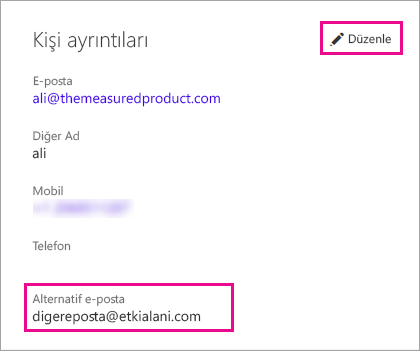

# <a name="using-an-alternate-email-address"></a>Alternatif e-posta adresi kullanma
Varsayılan olarak Power BI'daki etkinliğinizle ilgili güncelleştirmeler, Power BI'a kaydolurken kullandığınız e-posta adresine gönderilir.  Örneğin size gönderilen paylaşım davetiyeleri bu adrese yönlendirilir.

Bazen bu e-postaların Power BI'a kaydolurken kullandığınız e-posta adresinin yerine alternatif bir e-posta adresine teslim edilmesini isteyebilirsiniz.

## <a name="updating-through-office-365-personal-info-page"></a>Office 365 kişisel bilgiler sayfasından güncelleştirme
1. [Office 365 kişisel bilgiler sayfanıza](https://portal.office.com/account/#personalinfo) gidin.  Gerekirse Power BI için kullandığınız e-posta adresini ve parolayı kullanarak oturum açın.
2. Kişi ayrıntıları bölümündeki düzenle bağlantısına tıklayın.  
   
   > [!NOTE]
   > Düzenle bağlantısının görünmemesi e-posta adresinizin Office 365 yöneticiniz tarafından yönetildiği anlamına gelir. Bu durumda e-posta adresinizi güncelleştirmek için yöneticinizle irtibata geçmeniz gerekir.
   > 
   > 
   
   
3. Alternatif e-posta alanına Power BI güncelleştirmelerinin gönderilmesini istediğiniz e-posta adresini gidin.

> [!NOTE]
> Bu ayarı değiştirdiğinizde hizmet güncelleştirmeleri, bültenler ve diğer tanıtım amaçlı gönderiler için kullanılan e-posta adresi değişmez.  Bunlar her zaman Power BI'a kaydolurken kullandığınız e-posta adresine gönderilir.
> 
> 

## <a name="updating-through-azure-active-directory"></a>Azure Active Directory aracılığıyla güncelleştirme
Power BI için bir Azure Active Directory (AAD) ekleme belirtecini yakalarken üç farklı e-posta türü kullanabilirsiniz. Bu üç farklı tür aşağıda verilmiştir:

* bir kullanıcının AAD hesabıyla ilişkili ana e-posta adresi
* UserPrincipalName (UPN) e-posta adresi
* “diğer” e-posta adresi dizisi özniteliği

Power BI, kullanılacak e-posta adresini şu ölçütlere göre seçer:
1.  AAD kiracısının kullanıcı nesnesindeki posta özniteliği mevcutsa Power BI, e-posta adresi için söz konusu posta özniteliğini kullanır
2.  UPN e-postası bir **\*.onmicrosoft.com** etki alanı e-posta adresi (“\@” simgesinden sonra gelen bilgiler) *değilse* Power BI, e-posta adresi için bu posta özniteliğini kullanır
3.  AAD kullanıcı nesnesinde "diğer" e-posta dizisi özniteliği mevcutsa söz konusu listedeki ilk e-posta adresi (bu öznitelikte e-postalardan oluşan bir liste olabileceği için) kullanılır
4. Yukarıdaki koşulların hiçbiri mevcut değilse UPN adresi kullanılır

## <a name="updating-with-powershell"></a>PowerShell ile güncelleştirme
Alternatif e-posta adresini Azure Active Directory için PowerShell aracılığıyla da güncelleştirebilirsiniz. Bunun için [Set-AzureADUser](https://docs.microsoft.com/powershell/module/azuread/set-azureaduser) komutunu kullanmanız gerekir.

```
Set-AzureADUser -ObjectId john@contoso.com -OtherMails "otheremail@somedomain.com"
```

Daha fazla bilgi için bkz. [Azure Active Directory PowerShell Sürüm 2](https://docs.microsoft.com/powershell/azure/active-directory/install-adv2).

Başka bir sorunuz mu var? [Power BI Topluluğu'na başvurun](http://community.powerbi.com/)

