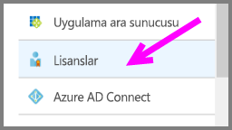
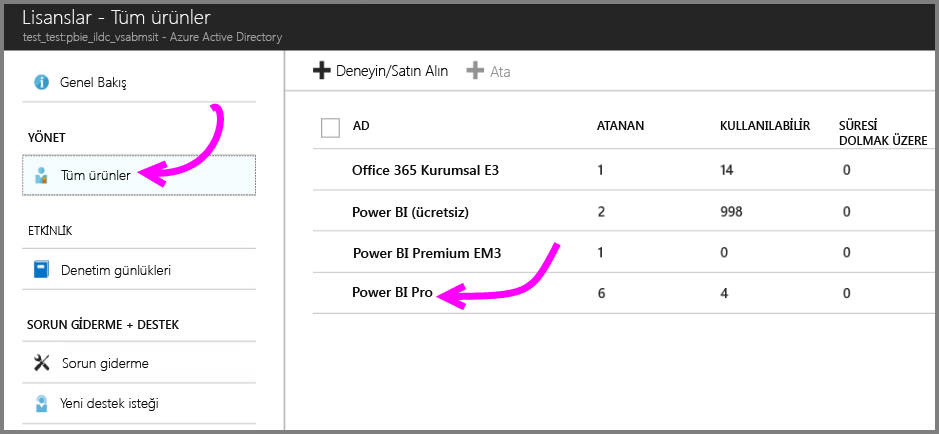
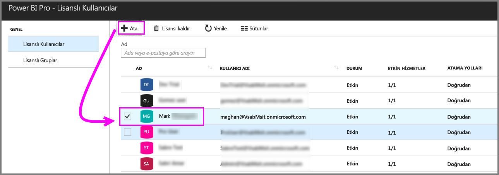

# Hızlı Başlangıç: Azure’da Power BI Pro lisansları atama

Power BI Pro, Power BI hizmetinin içerik paylaşma ve diğer Pro kullanıcılarıyla işbirliği yapma dahil tüm içerik ve özelliklerine erişim izni veren bireysel bir lisanstır. Uygulama çalışma alanlarına içerik yayımlama ve uygulama çalışma alanlarından içerik kullanma, panoları paylaşma ve pano ile raporlara abone olma işlemlerini yalnızca Pro kullanıcıları yapabilir. Bu makalede, Azure'da Power BI Pro lisansları atama işlemi açıklanmaktadır. Ayrıca [Office 365'te lisans atayabilirsiniz](service-admin-assigning-power-bi-pro-licenses.md).

## Önkoşullar

Active Directory aramaları için Power BI kullanan Azure aboneliğinin sahibi olmanız gerekir.

Başlamadan önce [en az bir lisans satın almanız](service-admin-purchasing-power-bi-pro.md) gerekir.

## Bireysel kullanıcı hesaplarına lisans atama

Bireysel kullanıcı hesaplarına Power BI Pro lisansları atamak için şu adımları izleyin:

1. [Azure portalını](https://ms.portal.azure.com/#@microsoft.onmicrosoft.com/dashboard/private/39bc3cf7-31a4-43f6-954c-f2d69ca2f0) açın. 

2. Sol gezinti çubuğunda **Azure Active Directory**'yi seçin.

    

3. **Azure Active Directory** altında **Lisanslar**’ı seçin.

    

4. **Lisanslar** altında **Tüm ürünler**’i, ardından **Power BI Pro**’yu seçerek lisanslı kullanıcıların listesini görüntüleyin.

    

5. Ek bir kullanıcı hesabına Power BI Pro lisansı eklemek için **Ata**’yı seçin.

    

## Sonraki adımlar

Lisansları atadıktan sonra Power BI Pro hakkında daha fazla bilgi edinebilirsiniz.

[Kuruluşunuzda Power BI Pro](service-admin-power-bi-pro-in-your-organization.md)

[Oturum açmış Power BI kullanıcılarını bulma](service-admin-access-usage.md)

Başka bir sorunuz mu var? [Power BI Topluluğu'na sorun](https://community.powerbi.com/)