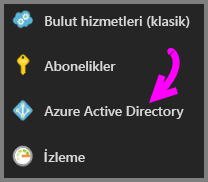
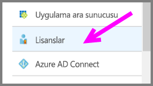
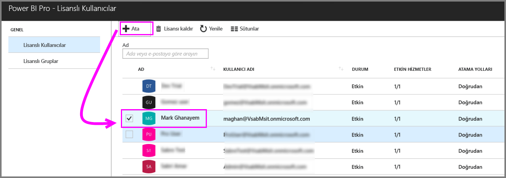
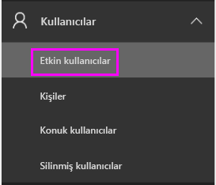
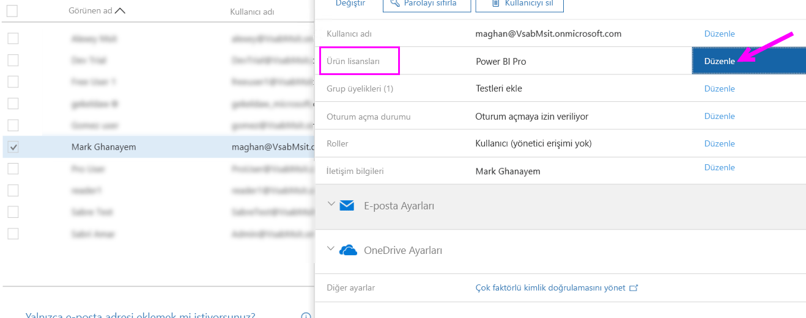
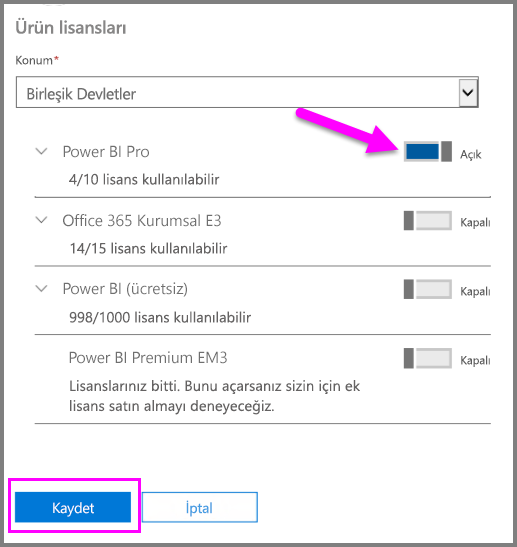
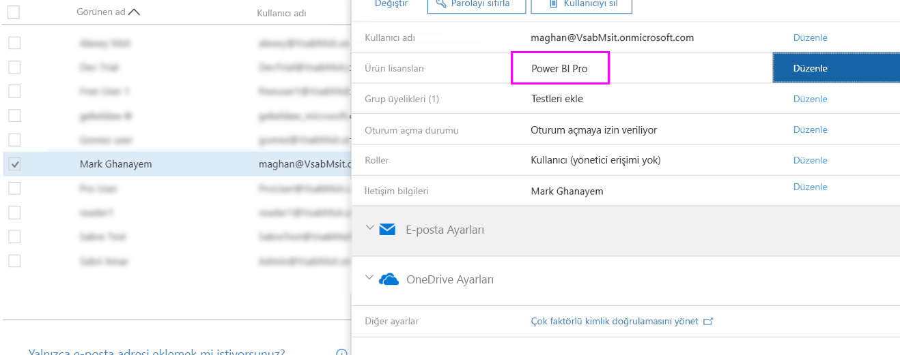

# Power BI Pro lisansları atama

Yöneticiler, kullanıcılara Power BI Pro lisansları atamak için çeşitli yönetim portalları ve PowerShell cmdlet'leri arasından seçim yapabilir. Power BI lisans yönetimi, Azure Active Directory (Azure AD) tarafından desteklenir.

* Azure abonelik sahipleri, [Azure Portal](https://ms.portal.azure.com/#@microsoft.onmicrosoft.com/dashboard/private/39bc3cf7-31a4-43f6-954c-f2d69ca2f0)’daki Azure Active Directory dikey penceresini kullanabilir. 

* Genel yöneticiler ve Kullanıcı Hesabı yöneticileri, [Office 365 yönetim merkezini](https://portal.office.com/AdminPortal/Home#/homepage) kullanabilir.

## Azure Portal'da Power BI Pro lisanslarını yönetme

Power BI, temel hizmet olarak Azure AD’yi kullanır. Azure AD, satın alınan ürünlerle ilgili bilgiler gibi diğer ayarları depolarken, kullanıcı hesaplarını ve gruplarını depolar.

### Tek tek kullanıcı hesaplarına lisanslar atama

Azure aboneliğine sahipseniz, tek tek kullanıcı hesaplarına Pro lisansları atamak için şu adımları izleyin:

1. [Azure Portal](https://ms.portal.azure.com/#@microsoft.onmicrosoft.com/dashboard/private/39bc3cf7-31a4-43f6-954c-f2d69ca2f0)’a gidin. 

2. Sol gezinti çubuğunda Azure Active Directory'ye tıklayın.

    

3. Azure Active Directory dikey penceresinde Lisanslar’a tıklayın.

    

4. Lisanslar dikey penceresinde Tüm ürünler’e, ardından Power BI Pro’ya tıklayarak lisanslı kullanıcılar listesini görüntüleyin.

    

5. Ek bir kullanıcı hesabına Power BI Pro lisansı eklemek için Ata seçeneğine tıklayın.

    

> [!NOTE]
> Azure Portal'da çoğu lisanslama unsurları yönetilebilir, ancak Power BI Pro lisansları satın alınamaz. Power BI Pro aboneliği satın almak için Office 365 yönetim merkezini kullanın. Daha fazla bilgi için bkz. [Power BI Pro'yu satın alma](https://docs.microsoft.com/en-us/power-bi/service-admin-purchasing-power-bi-pro).
>

## Office 365 yönetim merkezinde Power BI Pro lisanslarını yönetme

Genel yöneticiyseniz, Office 365 yönetim merkezinden Power BI Pro aboneliği satın alabilir ve kuruluş için ilişkili lisansları yönetebilirsiniz.

Office 365 yöneticisiyseniz, tek tek kullanıcı hesaplarına Pro lisansları atamak için şu adımları izleyin:

1. Office 365 yönetim merkezine gidin.

2. Sol gezinti bölmesinde Kullanıcılar’ı genişletin ve sonra Etkin kullanıcılar’a tıklayın.

    

3. Bir veya birden fazla kullanıcı seçin ve Ürün lisanslarını düzenle’ye tıklayın.

    

4. Power BI Pro bölümünde ayarı Açık olarak ayarlayın ve Kaydet’e tıklayın.

    

5. Seçilen hesaplar için Durum bölümünde Power BI Pro lisansının başarıyla atandığını doğrulayın.

    

> [!NOTE]
> Aboneliğinizde lisans kalmadıysa, sol gezinti bölmesindeki Faturalama’yı genişleterek daha fazla lisans ekleyin. Abonelikler sayfasından Power BI Pro aboneliğini seçin ve sonra Lisans Ekle/Kaldır seçeneğine tıklayın.
>

## Sonraki adımlar
[Kuruluşunuzda Power BI Pro](service-admin-power-bi-pro-in-your-organization.md)
 
[Uzatılmış Pro Deneme Sürümünü etkinleştirme](service-extended-pro-trial.md)
 
[Bireysel kullanıcılar için Power BI Hizmet sözleşmesi](https://powerbi.microsoft.com/terms-of-service/)
 
[Power BI Premium announcement (Power BI Premium duyurusu)](https://aka.ms/pbipremium-announcement)
 
[Oturum açmış Power BI kullanıcılarını bulma](service-admin-access-usage.md)

Başka bir sorunuz mu var? [Power BI Topluluğu'na sorun](https://community.powerbi.com/)