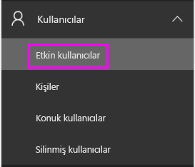
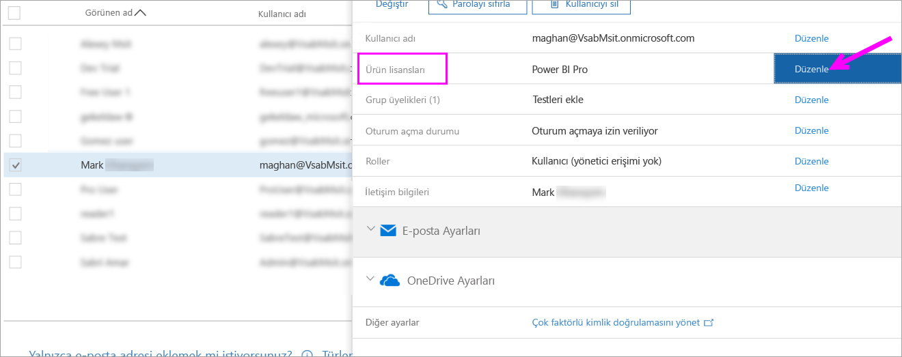
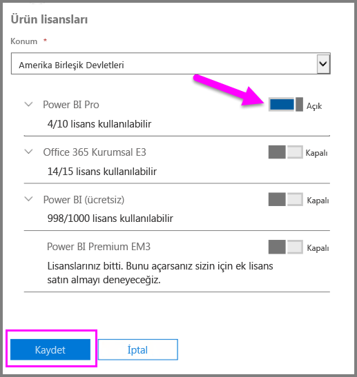
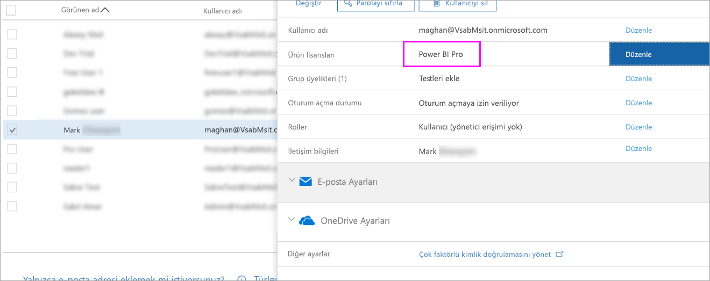

# Hızlı Başlangıç: Office 365’te Power BI Pro lisansları atama

Power BI Pro, Power BI hizmetinin içerik paylaşma ve diğer Pro kullanıcılarıyla işbirliği yapma dahil tüm içerik ve özelliklerine erişim izni veren bireysel bir lisanstır. Uygulama çalışma alanlarına içerik yayımlama ve uygulama çalışma alanlarından içerik kullanma, panoları paylaşma ve pano ile raporlara abone olma işlemlerini yalnızca Pro kullanıcıları yapabilir. Bu makalede, Office 365'te Power BI Pro lisansları atama işlemi açıklanmaktadır. Ayrıca [Azure’da lisans atayabilirsiniz](service-admin-assigning-power-bi-pro-licenses-azure.md).

## Önkoşullar

Office 365’te [**Genel yönetici** veya **Kullanıcı hesabı yöneticisi**](https://support.office.com/article/about-office-365-admin-roles-da585eea-f576-4f55-a1e0-87090b6aaa9d?ui=en-US&rs=en-US&ad=US) rolünün üyesi olmanız gerekir.

Başlamadan önce [en az bir lisans satın almanız](service-admin-purchasing-power-bi-pro.md) gerekir.

## Bireysel kullanıcı hesaplarına lisans atama

Bireysel kullanıcı hesaplarına Power BI Pro lisansları atamak için şu adımları izleyin:

1. [Office 365 yönetim merkezini](https://portal.office.com/adminportal/home#/homepage) açın.

2. Sol gezinti bölmesinde **Kullanıcılar**’ı genişletin ve sonra **Etkin kullanıcılar**’ı seçin.

    

3. Bir kullanıcı seçin, ardından **Ürün lisansları** altında **Düzenle**’yi seçin.

    

4. **Power BI Pro** altında ayarı **Açık** duruma getirin, ardından **Kaydet**’i seçin.

    

5. Seçilen hesabın **Durum** bölümünde Power BI Pro lisansının başarıyla atandığını doğrulayın.

    

## Sonraki adımlar

Lisansları atadıktan sonra Power BI Pro hakkında daha fazla bilgi edinebilirsiniz.

[Kuruluşunuzda Power BI Pro](service-admin-power-bi-pro-in-your-organization.md)

[Oturum açmış Power BI kullanıcılarını bulma](service-admin-access-usage.md)

Başka bir sorunuz mu var? [Power BI Topluluğu'na sorun](https://community.powerbi.com/)