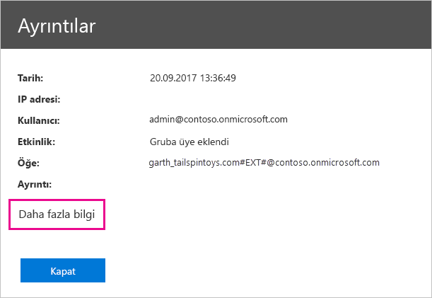

# <a name="using-auditing-within-your-organization"></a>Kuruluşunuzda denetim özelliğini kullanma

Power BI kiracınızdaki öğeler üzerinde gerçekleştirilen eylemleri ve bunları kimin yaptığını bilmek kuruluşunuzun mevzuata uygunluk ve kayıt yönetimi gibi gereksinimleri karşılamasına yardımcı olması konusunda kritik öneme sahip olabilir. Kullanıcılar tarafından gerçekleştirilen "Raporu Görüntüleme" ve "Panoyu Görüntüleme" gibi eylemleri denetlemek için Power BI denetim özelliğini kullanın. Denetimi izinleri denetlemek için kullanamazsınız.

Denetim görevlerini Office 365 Güvenlik ve Uyumluluk Merkezi'nden gerçekleştirebilir veya bunun için PowerShell'i kullanabilirsiniz. Bu makalede iki seçenek de anlatılmaktadır. Denetim verilerini tarih aralığına, kullanıcıya, panoya, rapora, veri kümesine ve etkinlik türüne göre filtreleyebilirsiniz. İsterseniz etkinlikleri csv (virgülle ayrılmış değer) dosyası halinde indirerek çevrimdışı analiz gerçekleştirebilirsiniz.

## <a name="requirements"></a>Gereksinimler

Denetim günlüklerine erişmek için şu gereksinimleri karşılamanız gerekir:

- Office 365 Güvenlik ve Uyumluluk Merkezi'nin denetim bölümüne erişmek için Exchange Online lisansına (Office 365 Enterprise E3 ve E5 aboneliklerine dahildir) sahip olmanız gerekir.

- Genel yönetici veya denetim günlüğüne erişim sağlayan bir Exchange yöneticisi rolüne sahip olmanız gerekir. Exchange yöneticisi rolleri, Exchange yönetim merkezinden denetlenir. Daha fazla bilgi için bkz. [Permissions in Exchange Online (Exchange Online'da izinler)](/exchange/permissions-exo/permissions-exo/).

- Denetim günlüğüne erişiminiz varsa ancak genel yönetici veya Power BI hizmeti yöneticisi değilseniz Power BI Yönetim portalına erişemezsiniz. Bu durumda doğrudan [Office 365 Güvenlik ve Uyumluluk Merkezi](https://sip.protection.office.com/#/unifiedauditlog) bağlantısına sahip olmanız gerekir.

- Kiracınızda Power BI denetim günlüklerini görüntülemek için en az bir Exchange posta kutusu lisansına ihtiyacınız vardır.

## <a name="accessing-your-audit-logs"></a>Denetim günlüklerinize erişme

Günlüklere erişmek için öncelikle Power BI'da günlüğe kaydetme özelliğinin etkinleştirilmiş olduğundan emin olun. Daha fazla bilgi için yönetici portalı belgelerinin [Denetim günlükleri](service-admin-portal.md#audit-logs) bölümüne bakın. Denetimin etkinleştirilmesi ile denetim verilerinin görüntülenebilmesi arasında 48 saate kadar gecikme olabilir. Verileri hemen göremiyorsanız denetim günlüklerini daha sonra denetleyin. Denetim günlüklerini görüntüleme izni alma ile günlüklere erişebilme arasında da benzer bir gecikme olabilir.

Power BI denetim günlüklerine doğrudan [Office 365 Güvenlik ve Uyumluluk Merkezi](https://sip.protection.office.com/#/unifiedauditlog)'nden erişebilirsiniz. Power BI yönetici portalında doğrudan bir bağlantı da mevcuttur:

1. Power BI'da sağ üst köşedeki **dişli simgesini** ve ardından **Yönetici portalı**'nı seçin.

   

1. **Denetim günlükleri**'ni seçin.

1. **O365 Yönetim Merkezi'ne git** seçeneğini belirleyin.

   

Yönetici olmayan hesapların denetim günlüğüne erişmesini sağlamak için Exchange Online Yönetim Merkezi'nden izin atamanız gerekir. Örneğin, bir kullanıcıyı Kuruluş Yönetimi gibi mevcut bir rol grubuna atayabilir veya Denetim Günlükleri rolüne sahip yeni bir rol grubu oluşturabilirsiniz. Daha fazla bilgi için bkz. [Permissions in Exchange Online (Exchange Online'da izinler)](/exchange/permissions-exo/permissions-exo/).

## <a name="search-only-power-bi-activities"></a>Yalnızca Power BI etkinliklerinde arama yapma

Aşağıdaki adımları izleyerek sonuçları yalnızca Power BI etkinlikleriyle sınırlayabilirsiniz. Etkinlik listesi için bu makalenin [Power BI tarafından denetlenen etkinliklerin listesi](#list-of-activities-audited-by-power-bi) bölümüne bakın.

1. **Denetim günlüğü arama** sayfasının **Ara** bölümünde **Etkinlikler** açılan menüsünü seçin.

2. **Power BI etkinlikleri**'ni seçin.

   

3. Dışındaki herhangi bir alanı seçerek seçim kutusunu kapatın.

Aramalarınız artık yalnızca Power BI etkinliklerini kapsayacak şekilde filtrelenir.

## <a name="search-the-audit-logs-by-date"></a>Denetim günlüklerinde tarihe göre arama yapma

**Başlangıç tarihi** ve **Bitiş tarihi** alanlarını kullanarak günlüklerde tarihe göre arama yapabilirsiniz. Varsayılan olarak son yedi gün seçilmiştir. Tarih ve saat Eşgüdümlü Evrensel Saat (UTC) biçiminde görüntülenir. Belirtebileceğiniz maksimum tarih aralığı 90 gündür. 

Seçilen tarih aralığı 90 günden fazlaysa hata görüntülenir. 90 gün olan maksimum tarih aralığını kullanıyorsanız **Başlangıç tarihi** için içinde bulunduğunuz saati seçin. Bunu yapmamanız halinde başlangıç tarihinin bitiş tarihinden daha erken olduğunu belirten bir hata alırsınız. Denetimi son 90 gün içinde etkinleştirdiyseniz tarih aralığının başlangıç tarihi, denetimin etkinleştirildiği tarihten önceki bir gün olamaz.


## <a name="search-the-audit-logs-by-users"></a>Denetim günlüklerinde kullanıcılara göre arama yapma

Denetim günlüğü girişlerinde, gerçekleştirilen etkinlikler için belirli kullanıcılara göre arama yapabilirsiniz. Bunun için **Kullanıcılar** alanına bir veya daha fazla kullanıcı adı girin. Kullanıcı adını e-posta adresi biçiminde girmeniz gerekir. Bu adres, kullanıcıların Power BI'da oturum açmak için kullandıkları hesaptır. Kuruluşunuzdaki tüm kullanıcılara (ve hizmet hesaplarına) ait girişleri döndürmek için bu kutuyu boş bırakın.


## <a name="view-search-results"></a>Arama sonuçlarını görüntüleme

**Ara** düğmesini seçtiğinizde arama sonuçları yüklenir ve kısa bir süre sonra **Sonuçlar** bölümünde görüntülenir. Arama tamamlandığında bulunan sonuç sayısı görüntülenir. En fazla 1000 olay görüntülenir. Arama ölçütleriyle eşleşen olay sayısı 1000'in üzerindeyse en son gerçekleştirilen 1000 olay görüntülenir.

### <a name="view-the-main-results"></a>Ana sonuçları görüntüleme

**Sonuçlar** alanı bu arama sonucunda döndürülen olaylar hakkında bilgiler içerir. Sonuçları sıralamak için **Sonuçlar** bölümündeki sütun başlıklarından birini seçin.

| **Sütun** | **Tanım** |
| --- | --- |
| Tarih |Olayın gerçekleştiği tarih ve saat (UTC biçiminde). |
| IP adresi |Etkinlik günlüğe kaydedildiğinde kullanılan cihazın IP adresi. IP adresi IPv4 veya IPv6 adresi biçiminde görüntülenir. |
| Kullanıcı |Olayı tetikleyen eylemi gerçekleştiren kullanıcı (veya hizmet hesabı). |
| Etkinlik |Kullanıcı tarafından gerçekleştirilen etkinlik. Bu değer, **Etkinlikler** açılan listesinde seçtiğiniz etkinliklere karşılık gelir. Exchange yönetimi denetim günlüğünden bir olay için bu sütundaki değer Exchange cmdlet olur. |
| Öğe |İlgili etkinlik sonucunda oluşturulmuş veya değiştirilmiş olan nesne. Bu, görüntülenen veya değiştirilen dosya ya da güncelleştirilen kullanıcı hesabı olabilir. Etkinliklerin hepsi için bu sütunda değer görüntülenmez. |
| Ayrıntı |Bir etkinlikle ilgili ayrıntılı bilgiler. Bu sütunda da tüm etkinlikler için değer görüntülenmez. |

### <a name="view-the-details-for-an-event"></a>Olay ayrıntılarını görüntüleme

Bir olay hakkında daha fazla ayrıntı görüntülemek için arama sonuçlarında ilgili olay kaydına tıklayabilirsiniz. Olay kaydının ayrıntılı özelliklerini içeren **Ayrıntılar** sayfası görüntülenir. Görüntülenen özellikler olayın gerçekleştiği Office 365 hizmetine göre değişiklik gösterir. 

Bu bilgileri görüntülemek için **Daha fazla bilgi**'yi seçin. Tüm Power BI girişlerinin RecordType özelliği 20 değerine sahiptir. Diğer özellikler hakkında bilgi için bkz. [Denetim günlüğündeki ayrıntılı özellikler](/office365/securitycompliance/detailed-properties-in-the-office-365-audit-log/).

   

## <a name="export-search-results"></a>Arama sonuçlarını dışarı aktarma

Power BI denetim günlüğünü csv dosyası biçiminde dışarı aktarmak için aşağıdaki adımları izleyin.

1. **Sonuçları dışarı aktar**'ı seçin.

1. **Yüklenen sonuçları kaydet**'i veya **Tüm sonuçları indir**'i seçin.

    

## <a name="use-powershell-to-search-audit-logs"></a>Denetim günlüklerinde arama yapmak için PowerShell'i kullanma

Oturum açma bilgilerinize göre denetim günlüklerine erişmek için PowerShell'i de kullanabilirsiniz. Aşağıdaki örnekte Power BI denetim günlüğü girişlerini çekmek için [Search-UnifiedAuditLog](/powershell/module/exchange/policy-and-compliance-audit/search-unifiedauditlog?view=exchange-ps/) komutunun nasıl kullanılacağı gösterilmiştir.

[New-PSSession](/powershell/module/microsoft.powershell.core/new-pssession/) komutunu kullanabilmek için hesabınıza atanmış bir Exchange Online lisansı olması ve kiracınızın denetim günlüğüne erişmeniz gerekir. Exchange Online'a bağlanma hakkında daha fazla bilgi için bkz. [Connect to Exchange Online PowerShell (Exchange Online PowerShell'e bağlanma)](/powershell/exchange/exchange-online/connect-to-exchange-online-powershell/connect-to-exchange-online-powershell/).

```powershell
Set-ExecutionPolicy RemoteSigned

$UserCredential = Get-Credential

$Session = New-PSSession -ConfigurationName Microsoft.Exchange -ConnectionUri https://outlook.office365.com/powershell-liveid/ -Credential $UserCredential -Authentication Basic -AllowRedirection

Import-PSSession $Session
Search-UnifiedAuditLog -StartDate 9/11/2018 -EndDate 9/15/2018 -RecordType PowerBI -ResultSize 1000 | Format-Table | More
```

Denetim günlükleriyle PowerShell kullanımı üzerine başka bir örnek için bkz. [Power BI Pro lisanslarını atamak için Power BI denetim günlüğünü ve PowerShell'i kullanma](https://powerbi.microsoft.com/blog/using-power-bi-audit-log-and-powershell-to-assign-power-bi-pro-licenses/).

## <a name="activities-audited-by-power-bi"></a>Power BI tarafından denetlenen etkinlikler

Power BI tarafından denetlenen etkinlikler aşağıda listelenmiştir.

| Kolay ad                                     | İşlem adı                              | Notlar                                  |
|---------------------------------------------------|---------------------------------------------|------------------------------------------|
| Power BI ağ geçidine veri kaynağı eklendi             | AddDatasourceToGateway                      |                                          |
| Power BI klasörüne erişim eklendi                      | AddFolderAccess                             | Şu anda kullanılmıyor                       |
| Power BI grup üyeleri eklendi                      | AddGroupMembers                             |                                          |
| Yönetici, veri akışı depolama hesabını kiracıya ekledi | AdminAttachedDataflowStorageAccountToTenant | Şu anda kullanılmıyor                       |
| Power BI veri kümesi çözümleme                         | AnalyzedByExternalApplication               |                                          |
| Power BI raporu analiz edildi                          | AnalyzeInExcel                              |                                          |
| Ağ geçidine bağlanmış Power BI veri kümesi                | BindToGateway                               |                                          |
| Kapasite durumu değiştirildi                            | ChangeCapacityState                         |                                          |
| Kapasite kullanıcı ataması değiştirildi                  | UpdateCapacityUsersAssignment               |                                          |
| Power BI veri kümesi bağlantıları değiştirildi              | SetAllConnections                           |                                          |
| Power BI ağ geçidi yöneticilerinin değiştirilmesi                   | ChangeGatewayAdministrators                 |                                          |
| Değiştirilen Power BI ağ geçidi veri kaynağı kullanıcıları        | ChangeGatewayDatasourceUsers                |                                          |
| Kurumsal Power BI içerik paketi oluşturuldu      | CreateOrgApp                                |                                          |
| Power BI uygulaması oluşturuldu                              | CreateApp                                   |                                          |
| Power BI panosu oluşturuldu                        | CreateDashboard                             |                                          |
| Power BI veri akışı oluşturuldu                         | CreateDataflow                              |                                          |
| Power BI veri kümesi oluşturuldu                          | CreateDataset                               |                                          |
| Power BI e-posta aboneliği oluşturuldu               | CreateEmailSubscription                     |                                          |
| Power BI klasörü oluşturuldu                           | CreateFolder                                |                                          |
| Power BI ağ geçidi oluşturma                          | CreateGateway                               |                                          |
| Power BI grubu oluşturuldu                            | CreateGroup                                 |                                          |
| Power BI raporu oluşturuldu                           | CreateReport                                |                                          |
| Veri akışı dış depolama hesabına geçirildi     | DataflowMigratedToExternalStorageAccount    | Şu anda kullanılmıyor                       |
| Veri akışı izinleri eklendi                        | DataflowPermissionsAdded                    | Şu anda kullanılmıyor                       |
| Veri akışı izinleri kaldırıldı                      | DataflowPermissionsRemoved                  | Şu anda kullanılmıyor                       |
| Kurumsal Power BI içerik paketi silindi      | DeleteOrgApp                                |                                          |
| Power BI açıklaması silindi                          | DeleteComment                               |                                          |
| Power BI panosu silindi                        | DeleteDashboard                             | Şu anda kullanılmıyor                       |
| Power BI veri akışı silindi                         | DeleteDataflow                              | Şu anda kullanılmıyor                       |
| Power BI veri kümesi silindi                          | DeleteDataset                               |                                          |
| Power BI e-posta aboneliği silindi               | DeleteEmailSubscription                     |                                          |
| Power BI klasörü silindi                           | DeleteFolder                                |                                          |
| Power BI klasörüne erişim silindi                    | DeleteFolderAccess                          | Şu anda kullanılmıyor                       |
| Power BI ağ geçidi silme                          | DeleteGateway                               |                                          |
| Power BI grubu silindi                            | DeleteGroup                                 |                                          |
| Power BI raporu silindi                           | DeleteReport                                |                                          |
| Power BI veri kümesi veri kaynakları keşfedildi          | GetDatasources                              |                                          |
| Power BI raporu indirme                        | DownloadReport                              |                                          |
| Power BI sertifika izni düzenlendi          | EditCertificationPermission                 | Şu anda kullanılmıyor                       |
| Power BI panosu düzenlendi                         | EditDashboard                               | Şu anda kullanılmıyor                       |
| Power BI veri kümesi düzenlendi                           | EditDataset                                 |                                          |
| Power BI veri kümesi özellikleri düzenlendi                | EditDatasetProperties                       | Şu anda kullanılmıyor                       |
| Power BI raporu düzenlendi                            | EditReport                                  |                                          |
| Power BI veri akışı dışarı aktarıldı                        | ExportDataflow                              |                                          |
| Power BI raporu görsel verileri dışarı aktarıldı              | ExportReport                                |                                          |
| Power BI kutucuk verileri dışarı aktarıldı                       | ExportTile                                  |                                          |
| Veri akışı izinleri eklenemedi                | FailedToAddDataflowPermissions              | Şu anda kullanılmıyor                       |
| Veri akışı izinleri kaldırılamadı             | FailedToRemoveDataflowPermissions           | Şu anda kullanılmıyor                       |
| Power BI veri akışı SAS belirteci oluşturuldu             | GenerateDataflowSasToken                    |                                          |
| Power BI Ekleme Belirteci oluşturuldu                    | GenerateEmbedToken                          |                                          |
| Dosya Power BI'a aktarıldı                         | İçeri Aktar                                      |                                          |
| Power BI uygulaması yüklendi                            | InstallApp                                  |                                          |
| Çalışma alanı bir kapasiteye geçirildi                  | MigrateWorkspaceIntoCapacity                |                                          |
| Power BI açıklaması gönderildi                           | PostComment                                 |                                          |
| Power BI panosu yazdırıldı                        | PrintDashboard                              |                                          |
| Power BI rapor sayfası yazdırıldı                      | PrintReport                                 |                                          |
| Power BI raporu web'de yayımlandı                  | PublishToWebReport                          |                                          |
| Key Vault'tan Power BI veri akışı gizli dizisi alındı  | ReceiveDataflowSecretFromKeyVault           | Şu anda kullanılmıyor                       |
| Veri kaynağını Power BI ağ geçidinden kaldırma         | RemoveDatasourceFromGateway                 |                                          |
| Power BI grup üyeleri kaldırıldı                    | DeleteGroupMembers                          |                                          |
| Çalışma alanı kapasiteden kaldırıldı                 | RemoveWorkspacesFromCapacity                |                                          |
| Power BI panosu yeniden adlandırıldı                        | RenameDashboard                             |                                          |
| Power BI veri akışı yenileme isteği gönderildi               | RequestDataflowRefresh                      | Şu anda kullanılmıyor                       |
| Power BI veri kümesi yenileme isteği gönderildi                | RefreshDataset                              |                                          |
| Power BI çalışma alanları alındı                     | GetWorkspaces                               |                                          |
| Power BI veri akışı üzerinde zamanlanmış yenileme ayarlandı        | SetScheduledRefreshOnDataflow               |                                          |
| Power BI veri kümesi üzerinde zamanlanmış yenileme ayarlandı         | SetScheduledRefresh                         |                                          |
| Power BI panosu paylaşıldı                         | ShareDashboard                              |                                          |
| Power BI raporu paylaşıldı                            | ShareReport                                 |                                          |
| Power BI uzatılmış deneme sürümünü başlatma                   | OptInForExtendedProTrial                    | Şu anda kullanılmıyor                       |
| Power BI deneme sürümü başlatıldı                            | OptInForProTrial                            |                                          |
| Power BI veri kaynağı devralındı                   | TakeOverDatasource                          |                                          |
| Power BI veri kümesi devralındı                        | TakeOverDataset                             |                                          |
| Power BI uygulaması yayımdan kaldırıldı                          | UnpublishApp                                |                                          |
| Kapasite kaynağı idare ayarları güncelleştirildi      | UpdateCapacityResourceGovernanceSettings    | Şu anda Office 365 yönetim portalında mevcut değil |
| Kapasite yöneticisi güncelleştirildi                            | UpdateCapacityAdmins                        |                                          |
| Kapasitenin görünen adı güncelleştirildi                     | UpdateCapacityDisplayName                   |                                          |
| Kuruluşun Power BI ayarları güncelleştirildi          | UpdatedAdminFeatureSwitch                   |                                          |
| Power BI uygulaması güncelleştirildi                              | UpdateApp                                   |                                          |
| Power BI veri akışı güncelleştirildi                         | UpdateDataflow                              |                                          |
| Power BI veri kümesi veri kaynakları güncelleştirildi             | UpdateDatasources                           |                                          |
| Power BI veri kümesi parametreleri güncelleştirildi               | UpdateDatasetParameters                     |                                          |
| Power BI e-posta aboneliği güncelleştirildi               | UpdateEmailSubscription                     |                                          |
| Power BI klasörü güncelleştirildi                           | UpdateFolder                                |                                          |
| Power BI klasörüne erişim güncelleştirildi                    | UpdateFolderAccess                          |                                          |
| Power BI ağ geçidi veri kaynağı kimlik bilgileri güncelleştirildi  | UpdateDatasourceCredentials                 |                                          |
| Power BI panosu görüntülendi                         | ViewDashboard                               |                                          |
| Power BI veri akışı görüntülendi                          | ViewDataflow                                |                                          |
| Power BI raporu görüntülendi                            | ViewReport                                  |                                          |
| Power BI kutucuğu görüntülendi                              | ViewTile                                    |                                          |
| Power BI kullanım ölçümleri görüntülendi                     | ViewUsageMetrics                            |                                          |
|                                                   |                                             |                                          |

## <a name="next-steps"></a>Sonraki adımlar

[Power BI yönetimi nedir?](service-admin-administering-power-bi-in-your-organization.md)  

[Power BI Yönetici Portalı](service-admin-portal.md)  

Başka bir sorunuz mu var? [Power BI Topluluğu'na sorun](http://community.powerbi.com/)
