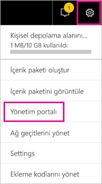
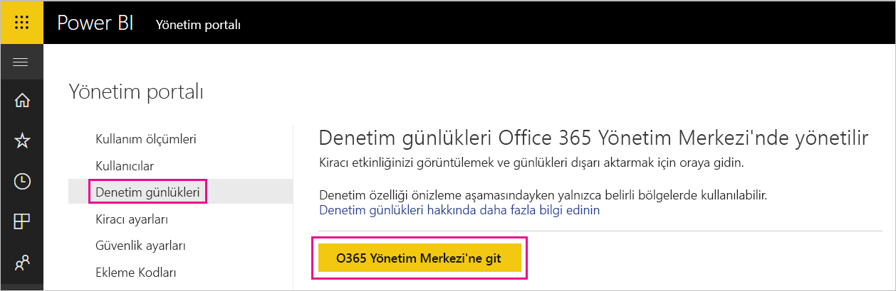
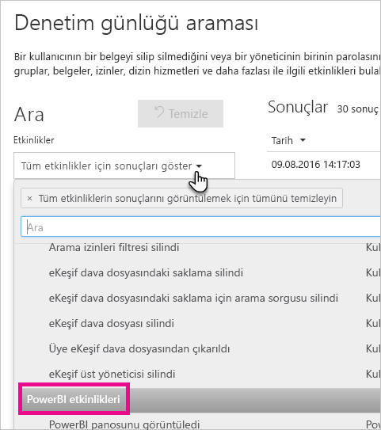
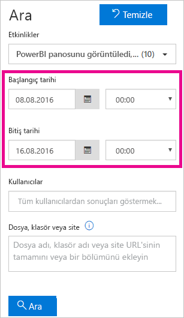
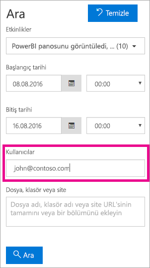
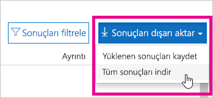

# <a name="using-auditing-within-your-organization"></a>Kuruluşunuzda denetim özelliğini kullanma

Gerçekleştirilen eylemleri izlemek ve araştırmak için Power BI ile birlikte denetim özelliklerini nasıl kullanabileceğinizi öğrenin. Güvenlik ve Uyumluluk Merkezi'ni veya PowerShell'i kullanabilirsiniz.

Power BI kiracınızdaki öğeler üzerinde gerçekleştirilen eylemleri ve bunları kimin yaptığını bilmek kuruluşunuzun mevzuata uygunluk ve kayıt yönetimi gibi gereksinimleri karşılamasına yardımcı olması konusunda kritik öneme sahip olabilir.

Denetim verilerini tarih aralığına, kullanıcıya, panoya, rapora, veri kümesine ve etkinlik türüne göre filtreleyebilirsiniz. İsterseniz etkinlikleri csv (virgülle ayrılmış değer) dosyası halinde indirerek çevrimdışı analiz gerçekleştirebilirsiniz.

## <a name="requirements"></a>Gereksinimler
Denetim günlüklerine erişmek için şu gereksinimleri karşılamanız gerekir:

- Office 365 Güvenlik ve Uyumluluk Merkezi'nin denetim bölümüne erişmek için Exchange Online lisansına (Office 365 Enterprise E3 ve E5 aboneliklerine dahildir) sahip olmanız gerekir.
- Genel yönetici veya denetim günlüğüne erişim sağlayan bir Exchange yöneticisi rolüne sahip olmanız gerekir. 

  Exchange yöneticisi rolleri, Exchange yönetim merkezinden denetlenir. Daha fazla bilgi için bkz. [Permissions in Exchange Online (Exchange Online'da izinler)](https://technet.microsoft.com/library/jj200692(v=exchg.150).aspx).

- Denetim günlüğüne erişiminiz varsa ancak genel yönetici veya Power BI hizmeti yöneticisi değilseniz Power BI Yönetim portalına erişemezsiniz. Bu durumda doğrudan Office 365 Güvenlik ve Uyumluluk Merkezi bağlantısına sahip olmanız gerekir.

> [!NOTE]
> Kiracınızda Power BI denetim günlüklerini görüntülemek için en az bir Exchange posta kutusu lisansına ihtiyacınız vardır.

## <a name="accessing-your-audit-logs"></a>Denetim günlüklerinize erişme

Power BI günlüklerinizi denetlemek için O365 Güvenlik ve Uyumluluk Merkezi'ni ziyaret etmeniz gerekir.

1. Sağ üst köşedeki **dişli simgesini** seçin.

2. **Yönetici portalı**'nı seçin.
   
   

3. **Denetim günlükleri**'ni seçin.
 
4. **O365 Yönetim Merkezi'ne git** seçeneğini belirleyin.
   
   

Alternatif olarak [Office 365 | Güvenlik ve Uyumluluk](https://protection.office.com/#/unifiedauditlog) sayfasına da göz atabilirsiniz.

> [!NOTE]
> Yönetici olmayan hesapların denetim günlüğüne erişmesini sağlamak için Exchange Online Yönetim Merkezi'nden izin atamanız gerekir. Örneğin, bir kullanıcıyı Kuruluş Yönetimi gibi mevcut bir rol grubuna atayabilir veya Denetim Günlükleri rolüne sahip yeni bir rol grubu oluşturabilirsiniz. Daha fazla bilgi için bkz. [Permissions in Exchange Online (Exchange Online'da izinler)](https://technet.microsoft.com/library/jj200692\(v=exchg.150\).aspx).

## <a name="search-only-power-bi-activities"></a>Yalnızca Power BI etkinliklerinde arama yapma

Aşağıdaki işlemleri gerçekleştirerek sonuçları yalnızca Power BI etkinlikleriyle sınırlayabilirsiniz.

1. **Denetim günlüğü arama** sayfasında **Ara** bölümünün altında **Etkinlikler**'i seçin.

2. **PowerBI etkinlikleri**'ni seçin.
   
   

3. Dışındaki herhangi bir alanı seçerek seçim kutusunu kapatın.

Aramalarınız artık yalnızca Power BI etkinliklerini kapsayacak şekilde filtrelenir.

## <a name="search-the-audit-logs-by-date"></a>Denetim günlüklerinde tarihe göre arama yapma

"Başlangıç tarihi" ve "Bitiş tarihi" alanlarını kullanarak günlüklerde tarihe göre arama yapabilirsiniz. Varsayılan olarak son yedi gün seçilmiştir. Tarih ve saat Eşgüdümlü Evrensel Saat (UTC) biçiminde görüntülenir. Belirtebileceğiniz maksimum tarih aralığı 90 gündür. Seçilen tarih aralığı 90 günden fazlaysa hata görüntülenir.

> [!NOTE]
> 90 gün olan maksimum tarih aralığını kullanıyorsanız Başlangıç tarihi için içinde bulunduğunuz saati seçin. Bunu yapmamanız halinde başlangıç tarihinin bitiş tarihinden daha erken olduğunu belirten bir hata alırsınız. Denetimi son 90 gün içinde etkinleştirdiyseniz maksimum tarih aralığının başlangıç tarihi, denetimin etkinleştirildiği tarihten önceki bir gün olamaz.



## <a name="search-the-audit-logs-by-users"></a>Denetim günlüklerinde kullanıcılara göre arama yapma

Denetim günlüğü girişlerinde, gerçekleştirilen etkinlikler için belirli kullanıcılara göre arama yapabilirsiniz. Bunun için "Kullanıcılar" alanına bir veya daha fazla kullanıcı adı girin.  Girdiğiniz kullanıcı adının Power BI oturumu açarken kullanılanla aynı olması gerekir. Bu ad bir e-posta adresine benzer.
Kuruluşunuzdaki tüm kullanıcılara (ve hizmet hesaplarına) ait girişleri döndürmek için bu kutuyu boş bırakın.



## <a name="viewing-search-results"></a>Arama sonuçlarını görüntüleme

Ara düğmesine bastığınızda arama sonuçları yüklenir ve kısa bir süre sonra Sonuçlar bölümünde görüntülenir. Arama tamamlandığında bulunan sonuç sayısı görüntülenir. 

> [!NOTE]
> En fazla 1000 olay görüntülenir. Arama ölçütleriyle eşleşen olay sayısı 1000'in üzerindeyse en son gerçekleştirilen 1000 olay görüntülenir.

Sonuçlar bu arama sonucunda döndürülen olaylar hakkında bilgiler içerir.

| **Sütun** | **Tanım** |
| --- | --- |
| Tarih |Olayın gerçekleştiği tarih ve saat (UTC biçiminde). |
| IP adresi |Etkinlik günlüğe kaydedildiğinde kullanılan cihazın IP adresi. IP adresi IPv4 veya IPv6 adresi biçiminde görüntülenir. |
| Kullanıcı |Olayı tetikleyen eylemi gerçekleştiren kullanıcı (veya hizmet hesabı). |
| Etkinlik |Kullanıcı tarafından gerçekleştirilen etkinlik. Bu değer, Etkinlikler açılan listesinde seçtiğiniz etkinliklere karşılık gelir. Exchange yönetimi denetim günlüğünden bir olay için bu sütundaki değer Exchange cmdlet olur. |
| Öğe |İlgili etkinlik sonucunda oluşturulmuş veya değiştirilmiş olan nesne. Bu, görüntülenen veya değiştirilen dosya ya da güncelleştirilen kullanıcı hesabı olabilir. Etkinliklerin hepsi için bu sütunda değer görüntülenmez. |
| Ayrıntı |Bir etkinlikle ilgili ayrıntılı bilgiler. Bu sütunda da tüm etkinlikler için değer görüntülenmez. |

> [!NOTE]
> Sonuçları sıralamak için Sonuçlar bölümündeki sütun başlıklarından birini seçin. Sonuçları A'dan Z'ye veya Z'den A'ya sıralayabilirsiniz. Sonuçları en eskiden en yeniye veya en yeniden en eskiye sıralamak için Tarih başlığına tıklayın.

## <a name="view-the-details-for-an-event"></a>Olay ayrıntılarını görüntüleme

Bir olay hakkında daha fazla ayrıntı görüntülemek için arama sonuçlarında ilgili olay kaydını seçebilirsiniz. Olay kaydının ayrıntılı özelliklerini içeren ayrıntılar sayfası görüntülenir. Görüntülenen özellikler olayın gerçekleştiği Office 365 hizmetine göre değişiklik gösterir. Ek bilgileri görüntülemek için **Daha fazla bilgi**'yi seçin.

Aşağıdaki tabloda görüntülenebilecek ayrıntılar hakkında daha fazla bilgi verilmiştir.

| **Parametre veya Olay** | **Açıklama** | **Ek Bilgiler** |
| --- | --- | --- |
| Power BI raporu indirme |Bu etkinlik bir rapor indirildiğinde günlüğe kaydedilir |Rapor Adı, Veri Kümesi Adı |
| Rapor oluşturma |Bu etkinlik yeni bir rapor oluşturulduğunda günlüğe kaydedilir. |Rapor Adı, Veri Kümesi Adı |
| Rapor düzenleme |Bu etkinlik bir rapor düzenlendiğinde günlüğe kaydedilir. |Rapor Adı, Veri Kümesi Adı |
| Veri kümesi oluşturma |Bu etkinlik bir veri kümesi oluşturulduğunda günlüğe kaydedilir. |Veri Kümesi Adı, DataConnectivityMode |
| Veri kümesi silme |Bu etkinlik bir veri kümesi silindiğinde günlüğe kaydedilir. |Veri Kümesi Adı, DataConnectivityMode |
| Power BI uygulaması oluşturma |Bu etkinlik bir Power BI uygulaması oluşturulduğunda günlüğe kaydedilir |Uygulama adı, İzinler, Çalışma Alanı Adı |
| Power BI uygulamasını yükleme |Bu etkinlik bir Power BI uygulaması yüklendiğinde günlüğe kaydedilir |Uygulama adı |
| Power BI uygulaması güncelleştirme |Bu etkinlik bir Power BI uygulaması güncelleştirildiğinde günlüğe kaydedilir |Uygulama adı, İzinler, Çalışma Alanı Adı |
| Power BI uzatılmış deneme sürümünü başlatma |Bu etkinlik bir kullanıcı 31 Mayıs 2018'e kadar devam edecek olan uzatılmış Pro deneme sürümünü kabul ettiğinde günlüğe kaydedilir | |
| Power BI veri kümesi çözümleme |Bu etkinlik Excel'de Power BI veri kümesi çözümlendiğinde günlüğe kaydedilir. | |
| Power BI ağ geçidi oluşturma |Bu etkinlik yeni bir ağ geçidi oluşturulduğunda günlüğe kaydedilir. |Ağ Geçidi Adı, Ağ Geçidi Türü |
| Power BI ağ geçidi silme |Bu etkinlik bir ağ geçidi silindiğinde günlüğe kaydedilir. |Ağ Geçidi Adı, Ağ Geçidi Türü |
| Power BI ağ geçidine veri kaynağı ekleme |Bu etkinlik, ağ geçidine bir veri kaynağı eklendiğinde günlüğe kaydedilir |Ağ Geçidi Adı, Ağ Geçidi Türü, Veri Kaynağı Adı, Veri Kaynağı Türü |
| Veri kaynağını Power BI ağ geçidinden kaldırma |Bu etkinlik, ağ geçidinden bir veri kaynağı kaldırıldığında günlüğe kaydedilir |Ağ Geçidi Adı, Ağ Geçidi Türü, Veri Kaynağı Adı, Veri Kaynağı Türü |
| Power BI ağ geçidi yöneticilerinin değiştirilmesi |Bu etkinlik bir ağ geçidinin yöneticileri değiştirildiğinde (ekleme/kaldırma işlemi yapıldığında) günlüğe kaydedilir |Ağ Geçidi Adı, Eklenen Kullanıcılar, Kaldırılan Kullanıcılar |
| Power BI ağ geçidi veri kaynağı kullanıcılarının değiştirilmesi |Bu etkinlik bir ağ geçidinin kullanıcıları değiştirildiğinde (ekleme/kaldırma işlemi yapıldığında) günlüğe kaydedilir |Ağ Geçidi Adı, Eklenen Kullanıcılar, Kaldırılan Kullanıcılar |
| SetScheduledRefresh |Bu etkinlik bir veri kümesi için yeni bir yenileme zamanlandığında günlüğe kaydedilir |Veri Kümesi Adı, Yenileme Sıklığı (dakika cinsinden) |

## <a name="using-powershell-to-search"></a>Arama yapmak için PowerShell kullanma

Oturum açma bilgilerinize göre denetim günlüklerine erişmek için PowerShell'i kullanabilirsiniz. Bunun için Exchange Online'a erişmeniz gerekir. Power BI denetim günlüğü girişlerini çekmek için kullanabileceğiniz örnek bir komut aşağıda verilmiştir.

> [!NOTE]
> New-PSSession komutunu kullanabilmek için hesabınıza atanmış bir Exchange Online lisansı olması ve kiracınızın denetim günlüğüne erişmeniz gerekir.

```
Set-ExecutionPolicy RemoteSigned

$UserCredential = Get-Credential

$Session = New-PSSession -ConfigurationName Microsoft.Exchange -ConnectionUri https://outlook.office365.com/powershell-liveid/ -Credential $UserCredential -Authentication Basic -AllowRedirection

Import-PSSession $Session
Search-UnifiedAuditLog -StartDate 9/11/2016 -EndDate 9/15/2016 -RecordType PowerBI -ResultSize 1000 | Format-Table | More
```

Exchange Online'a bağlanma hakkında daha fazla bilgi için bkz. [Connect to Exchange Online PowerShell (Exchange Online PowerShell'e bağlanma)](https://technet.microsoft.com/library/jj984289\(v=exchg.160\).aspx).

Search-UnifiedAuditLog komutunun parametreleri ve kullanımı hakkında daha fazla bilgi için bkz. [Search-UnifiedAuditLog](https://technet.microsoft.com/library/mt238501\(v=exchg.160\).aspx).

Denetim günlüğünde arama yapma ve girişlere göre Power BI Pro lisansı atama amacıyla PowerShell'i kullanmaya yönelik bir örnek için bkz. [Using Power BI audit log and PowerShell to assign Power BI Pro licenses (Power BI Pro lisanslarını atamak için Power BI denetim günlüğünü ve PowerShell'i kullanma)](https://powerbi.microsoft.com/blog/using-power-bi-audit-log-and-powershell-to-assign-power-bi-pro-licenses/).

## <a name="export-the-power-bi-audit-log"></a>Power BI denetim günlüğünü dışarı aktarma

Power BI denetim günlüğünü csv dosyası biçiminde dışarı aktarabilirsiniz.

1. **Sonuçları dışarı aktar**'ı seçin.

2. **Yüklenen sonuçları kaydet**'i veya **Tüm sonuçları indir**'i seçin.
   
   

## <a name="record-and-user-types"></a>Kayıt ve kullanıcı türleri

Denetim günlüğü girişlerinin ayrıntılar bölümünde RecordType ve UserType değerleri bulunur. Tüm Power BI girişlerinin RecordType değeri 20'dir.

Tam liste için bkz. [Detailed properties in the Office 365 audit log (Office 365 denetim günlüğündeki ayrıntılı özellikler)](https://support.office.com/article/Detailed-properties-in-the-Office-365-audit-log-ce004100-9e7f-443e-942b-9b04098fcfc3)

## <a name="list-of-activities-audited-by-power-bi"></a>Power BI tarafından denetlenen etkinliklerin listesi

| Etkinlik | Açıklama | Ek bilgiler |
| --- | --- | --- |
| CreateDashboard |Bu etkinlik yeni bir pano oluşturulduğunda günlüğe kaydedilir. |- Pano adı. |
| EditDashboard |Bu etkinlik bir pano yeniden adlandırıldığında günlüğe kaydedilir. |- Pano adı. |
| DeleteDashboard |Bu etkinlik bir pano silindiğinde günlüğe kaydedilir. |- Pano adı. |
| PrintDashboard |Bu olay bir pano yazdırıldığında günlüğe kaydedilir. |- Pano adı.<br/>- Veri kümesi adı |
| ShareDashboard |Bu etkinlik bir pano paylaşıldığında günlüğe kaydedilir. |- Pano adı.<br/>- Alıcı e-posta adresi.<br/>- Veri kümesi adı.<br>- Yeniden paylaşma izinleri. |
| ViewDashboard |Bu etkinlik bir pano görüntülendiğinde günlüğe kaydedilir. |- Pano adı. |
| ExportTile |Bu olay bir pano kutucuğundaki veriler dışarı aktarıldığında günlüğe kaydedilir. |- Kutucuğun adı.<br/>- Veri kümesi adı. |
| DeleteReport |Bu etkinlik bir rapor silindiğinde günlüğe kaydedilir. |- Rapor adı. |
| ExportReport |Bu olay bir rapor kutucuğundaki veriler dışarı aktarıldığında günlüğe kaydedilir. |- Rapor adı.<br/>- Veri kümesi adı. |
| PrintReport |Bu olay bir rapor yazdırıldığında günlüğe kaydedilir. |- Rapor adı.<br/>- Veri kümesi adı. |
| PublishToWebReport |Bu olay bir rapor Web'de Yayımlandığında günlüğe kaydedilir. |- Raporun adı.<br/>- Veri kümesi adı. |
| ViewReport |Bu etkinlik bir rapor görüntülendiğinde günlüğe kaydedilir. |- Rapor adı. |
| ExploreDataset |Bu olay bir veri kümesini seçerek araştırdığınızda günlüğe kaydedilir. |- Veri kümesi adı |
| DeleteDataset |Bu olay bir veri kümesi silindiğinde günlüğe kaydedilir. |- Veri kümesi adı. |
| CreateOrgApp |Bu etkinlik bir kurumsal içerik paketi oluşturulduğunda günlüğe kaydedilir. |- Kurumsal İçerik Paketi adı.<br/>- Pano adları.<br/>- Rapor adları.<br/>- Veri kümesi adları. |
| CreateGroup |Bu etkinlik bir grup oluşturulduğunda etkinleştirilir. |- Grubun adı. |
| AddGroupMembers |Bu etkinlik bir Power BI grup çalışma alanına yeni üye eklendiğinde günlüğe kaydedilir. |- Grup adı.<br/>- E-posta adresleri. |
| UpdatedAdminFeatureSwitch |Bu olay bir yönetici özellik anahtarı değiştirildiğinde günlüğe kaydedilir. |- Anahtar adı.<br/>- Yeni anahtar durumu. |
| OptInForProTrial |Bu olay kullanıcı, hizmet içinde Power BI Pro sürümünü denemeyi seçtiğinde günlüğe kaydedilir. |- E-posta adresi |

## <a name="next-steps"></a>Sonraki adımlar

[Power BI Yönetici Portalı](service-admin-portal.md)  
[Power BI Premium nedir?](service-premium.md)  
[Power BI Pro'yu satın alma](service-admin-purchasing-power-bi-pro.md)  
[Permissions in Exchange Online (Exchange Online'da izinler)](https://technet.microsoft.com/library/jj200692\(v=exchg.150\).aspx)  
[Connect to Exchange Online PowerShell (Exchange Online PowerShell'e bağlanma)](https://technet.microsoft.com/library/jj984289\(v=exchg.160\).aspx)  
[Search-UnifiedAuditLog](https://technet.microsoft.com/library/mt238501\(v=exchg.160\).aspx)  
[Detailed properties in the Office 365 audit log (Office 365 denetim günlüğündeki ayrıntılı özellikler)](https://support.office.com/article/Detailed-properties-in-the-Office-365-audit-log-ce004100-9e7f-443e-942b-9b04098fcfc3)  

Başka bir sorunuz mu var? [Power BI Topluluğu'na sorun](http://community.powerbi.com/)