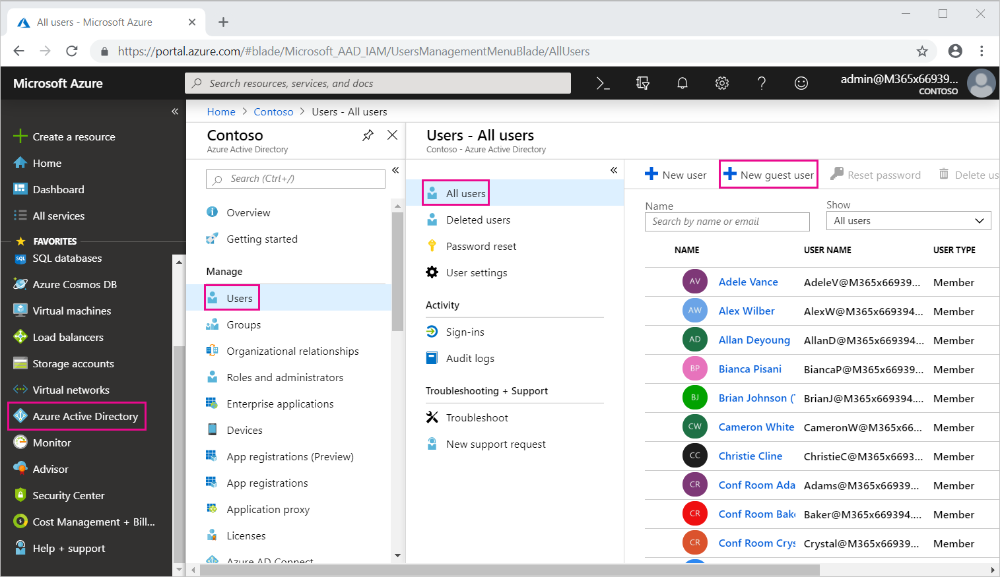
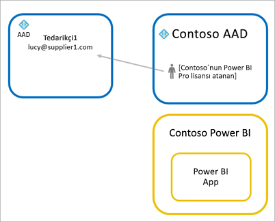
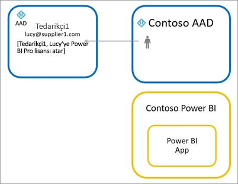

# Azure AD B2B ile Power BI içeriklerini dış konuk kullanıcılara dağıtma

Power BI, işletmeler arası Azure Active Directory (Azure AD B2B) ile tümleşerek Power BI içeriklerinin kuruluşunuz dışındaki kullanıcılara güvenli bir şekilde dağıtılmasına olanak sağlar ve bu sırada iç verilerin de denetimini elinde bulundurur.  

Ayrıca, kuruluşunuzun dışından konuk kullanıcılara kuruluşta bulunan içeriği düzenleme ve yönetme izni verebilirsiniz.

## Erişimi etkinleştirme

Etkinleştirdiğinizden emin olun [dış kullanıcılarla içerik paylaşma](service-admin-portal.md#export-and-sharing-settings) Konuk kullanıcıları davet önce Power BI Yönetici portalı'nda özelliği.

Ayrıca [düzenlemek ve yönetmek dış konuk kullanıcılara kuruluştaki içerik izin](service-admin-portal.md#allow-external-guest-users-to-edit-and-manage-content-in-the-organization) özelliği. Bu sayede hangi Konuk kullanıcı görebilir ve göz atma, kuruluşunuzun Power BI dahil olmak üzere çalışma alanlarında içerik oluşturma seçin.

## Kimleri davet edebilirsiniz?

Gmail.com, outlook.com ve hotmail.com gibi kişisel hesaplarınız dahil herhangi bir e-posta adresine sahip Konuk kullanıcılar davet edebilirsiniz. Azure AD B2B çağıran bu adresleri *sosyal kimlikleri*.

## Konuk kullanıcı davet etme

Konuk kullanıcıları davet kuruluşuna davet ilk kez yalnızca gerektirir. Davet iki yolu vardır: Planlanmış davetler ve geçici davetler.

### Planlanmış davetler

Hangi kullanıcıları davet edeceğinizi biliyorsanız planlı davetleri kullanın. Daveti Azure portal veya PowerShell aracılığıyla gönderebilirsiniz. Kişileri davet edebilmek için kiracı yöneticisi olmanız gerekir.

Azure portalda davet göndermek için aşağıdaki adımları izleyin.

1. [Azure portalda](https://portal.azure.com) **Azure Active Directory**'yi seçin.

1. Altında **Yönet**seçin **kullanıcılar** > **tüm kullanıcılar** > **yeni Konuk kullanıcı**.

    

1. **E-posta adresini** girin ve **kişisel ileti** ekleyin.

    

1. **Davet et** seçeneğini belirleyin.

Birden fazla konuk davet etmek için PowerShell'i kullanın. Daha fazla bilgi için bkz. [Azure AD B2B işbirliği kodu ve PowerShell örnekleri](/azure/active-directory/b2b/code-samples/).

Kullanıcının, aldığı e-posta davetindeki **Get Started** (Başlayın) seçeneğini belirlemesi gerekir. Konuk kullanıcı, bu işlemden sonra kiracıya eklenir.

### Geçici davetler

Herhangi bir zamanda bir dış kullanıcıyı davet etmek için onlara panonuzun veya raporunuzun paylaşım kullanıcı Arabirimi aracılığıyla ya da erişim sayfası aracılığıyla uygulamanıza ekleyin. Bir uygulamayı kullanması için bir dış kullanıcıyı davet ederken ne yapılacağına ilişkin bir örnek burada verilmiştir.

Konuk kullanıcı, uygulamayı kendileriyle paylaşılan olduğunu belirten bir e-posta alırsınız.

Konuk kullanıcının, kuruluşuna ait e-posta adresi ile oturum açması gerekir. Kullanıcılar oturum açtıktan sonra daveti kabul etmek için bir istem alırsınız. Oturum açma işleminden sonra Konuk kullanıcı için uygulama açılır. Uygulamaya dönmek için bağlantıya yer işareti ekleyebilir veya e-postayı kaydedebilir.

## Lisanslama

Konuk kullanıcı, uygun paylaşılan içeriği görüntülemek için lisansa sahip olmalıdır. Kullanıcının uygun bir lisans olduğundan emin olmak için üç yolu vardır: Power BI Premium, Power BI Pro lisansı atama veya konuğun Power BI Pro lisansı kullanın.

[Harici konuk kullanıcıların kuruluş içeriklerini düzenlemelerine ve yönetmelerine izin ver](service-admin-portal.md#allow-external-guest-users-to-edit-and-manage-content-in-the-organization) özelliğini kullanırken, çalışma alanlarına içerik katkısında bulunan veya başkalarıyla içerik paylaşan konuk kullanıcıların Power BI Pro lisansı olmalıdır.

### Power BI Premium kullanma

Uygulama çalışma alanına atama [Power BI Premium kapasitesi](service-premium-what-is.md) Konuk kullanıcının uygulamayı bir Power BI Pro lisansına ihtiyaç duymadan kullanın olanak sağlar. Power BI Premium, artırılmış yenileme sıklığı, ayrılmış kapasite ve büyük model boyutları gibi diğer özelliklerinden yararlanan uygulamalar da olanak tanır.

### Konuk kullanıcıya Power BI Pro lisansı atama

Konuk kullanıcıya kiracınızdaki bir Power BI Pro lisansı atanması, Konuk kullanıcının içeriği görüntüleyebilir Kiracı olanak tanır.

### Konuk kullanıcının kendi Power BI Pro lisansına sahip olması

Konuk kullanıcı zaten kendi kiracısında atanmış bir Power BI Pro lisansına sahiptir.

## İçeriği düzenleyebilen ve yönetebilen konuk kullanıcılar 

Kullanırken [düzenlemek ve yönetmek dış konuk kullanıcılara kuruluştaki içerik izin](service-admin-portal.md#allow-external-guest-users-to-edit-and-manage-content-in-the-organization) özelliği, belirtilen Konuk kullanıcılar, kuruluşunuzun Power BI erişim elde. İznine sahip oldukları herhangi bir içerik görebilir. Bunlar giriş erişim, çalışma alanları bulun, uygulamaları yüklemek, erişim listesini nerede bakın ve çalışma alanı içeriğine katkıda bulunmak. Yeni çalışma alanı deneyiminin kullanıldığı çalışma alanları oluşturabilir ve bu çalışma alanlarının Yöneticisi olabilir. Bazı sınırlamalar uygulanır. Önemli noktalar ve sınırlamalar bölümü bu kısıtlamaları listeleyin.
 
Power BI'da oturum bu kullanıcılara yardımcı olmak için bunları ile Kiracı URL'si sağlayın. Kiracı URL'sini bulmak için şu adımları izleyin.

1. Power BI hizmetinde üst taraftaki menüden yardım simgesini ( **?** ) ve ardından **Power BI Hakkında**'yı seçin.

2. **Kiracı URL'si** öğesinin yanındaki değere bakın. Değer, Konuk Kullanıcılarınızla paylaşabilirsiniz Kiracı URL'dir.

    

## Önemli Noktalar ve Sınırlamalar

* Varsayılan olarak, dış Azure AD B2B Konukları, yalnızca içeriğin tüketimini sınırlandırır. Dış Azure AD B2B Konukları uygulamaları, panoları, raporları görüntüleyebilir verileri dışarı aktarma ve panolar ve raporlar için e-posta abonelikleri oluşturabilir. Çalışma alanlarına erişemez veya kendi içeriklerini yayımlayamazlar. Ancak, bu kısıtlamalar aracılığıyla erişim Konuk kullanıcılar için geçerli değildir [düzenlemek ve yönetmek dış konuk kullanıcılara kuruluştaki içerik izin](service-admin-portal.md#allow-external-guest-users-to-edit-and-manage-content-in-the-organization) özelliği.

* Konuk kullanıcıların aracılığıyla etkinleştirilen [düzenlemek ve yönetmek dış konuk kullanıcılara kuruluştaki içerik izin](service-admin-portal.md#allow-external-guest-users-to-edit-and-manage-content-in-the-organization) özelliği, bazı deneyimleri bunları kullanıma sunulmaz. Raporları güncelleştirmek veya yayımlamak için, Power BI Desktop dosyalarını karşıya yüklerken Veri Al'ı kullanmak da dahil olmak üzere Power BI hizmeti web kullanıcı arabirimini kullanmaları gerekir.  Aşağıdaki deneyimleri desteklenmez:
    * Power BI Desktop'tan Power BI hizmetine doğrudan yayımlama
    * Konuk kullanıcılar Power BI hizmetindeki hizmeti veri kümelerine bağlanmak için Power BI desktop kullanamaz
    * Office 365 Gruplarına bağlanan klasik çalışma alanları:
        * Konuk kullanıcı oluşturabilir veya bu çalışma alanlarının Yöneticiler
        * Konuk kullanıcıları üyeleri olabilir
    * Geçici davetler gönderme çalışma alanına erişim listeleri için desteklenmiyor
    * Excel için Power BI Publisher Konuk kullanıcılar için desteklenmiyor
    * Konuk kullanıcılar Power BI Gateway yükleme ve kuruluşunuza bağlanma
    * Konuk kullanıcıları yükleyemiyor kuruluş genelinde yayımlama
    * Konuk kullanıcılar olamaz kullanmak, oluşturmak, güncelleştirmek veya Kurumsal içerik paketleri yükleme
    * Konuk kullanıcılar, Excel'de Çözümle kullanamaz
    * Konuk kullanıcılar olamaz @mentioned yorum içinde
    * Konuk kullanıcı aboneliklerini kullanamazsınız.
    * Bu özelliği kullanan konuk kullanıcıların iş veya okul hesabı olmalıdır. Kişisel hesapları kullanan Konuk kullanıcılar kısıtlamaları imzalamak için daha fazla sınırlamaları nedeniyle karşılaşırsınız.

* Bu özellik şu anda Power BI SharePoint Online'da rapor web bölümüyle kullanılamaz.

* Dış konuk kullanıcılara genel kuruluşunuzda yapabileceklerinizi sınırlayabilirsiniz Active Directory ayarları vardır. Bu, Power BI ortamınız için de geçerlidir. Aşağıdaki belgelerde bu ayarlar açıklanır:
    * [Dış İşbirliği Ayarlarını Yönetme](https://docs.microsoft.com/azure/active-directory/b2b/delegate-invitations#control-who-can-invite)
    * [Belirli kuruluşlardan B2B kullanıcılarına gönderilen davetlere izin verme veya engelleme](https://docs.microsoft.com/azure/active-directory/b2b/allow-deny-list)  

## Sonraki adımlar

Satır düzeyi güvenlik çalıştığı dahil olmak üzere daha ayrıntılı bilgi için teknik incelemeyi denetleyin: [Azure AD B2B kullanarak Power BI içeriklerini dış konuk kullanıcılara dağıtma](https://aka.ms/powerbi-b2b-whitepaper).

Azure AD B2B hakkında daha fazla bilgi için bkz: [Azure AD B2B işbirliği nedir?](/azure/active-directory/active-directory-b2b-what-is-azure-ad-b2b/).
