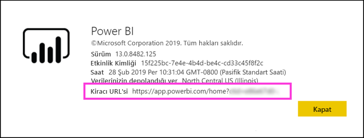

# Azure AD B2B ile Power BI içeriklerini dış konuk kullanıcılara dağıtma

Power BI, işletmeler arası Azure Active Directory (Azure AD B2B) ile tümleşerek Power BI içeriklerinin kuruluşunuz dışındaki kullanıcılara güvenli bir şekilde dağıtılmasına olanak sağlar ve bu sırada iç verilerin de denetimini elinde bulundurur.  

Ayrıca, kuruluşunuzun dışından konuk kullanıcılara kuruluşta bulunan içeriği düzenleme ve yönetme izni verebilirsiniz.

## Erişimi etkinleştirme

Konuk kullanıcıları davet etmeden önce Power BI yönetici portalında [Dış kullanıcılarla içerik paylaşma](service-admin-portal.md#export-and-sharing-settings) özelliğini etkinleştirdiğinizden emin olun.

Ayrıca, [Harici konuk kullanıcıların kuruluş içeriklerini düzenlemelerine ve yönetmelerine izin ver](service-admin-portal.md#export-and-sharing-settings) özelliği hangi konuk kullanıcının çalışma alanlarındaki içeriği görebileceğini ve oluşturabileceğini seçmenize olanak tanır ve kuruluşunuzun Power BI'ına göz atmak da buna dahildir.

## Kimleri davet edebilirsiniz?

Gmail.com, outlook.com ve hotmail.com gibi kişisel hesaplar da dahil olmak üzere herhangi bir e-posta adresini kullanan konuk kullanıcılar davet edebilirsiniz. Azure AD B2B'de bu adresler *sosyal kimlik* olarak adlandırılır.

## Konuk kullanıcı davet etme

Davetler, yalnızca bir dış konuk kullanıcının kuruluşunuza ilk kez davet edilmesi sırasında gereklidir. Kullanıcıları davet etmek için faydalanabileceğiniz iki yöntem vardır: planlı davetler ve geçici davetler.

### Planlanmış davetler

Hangi kullanıcıları davet edeceğinizi biliyorsanız planlı davetleri kullanın. Daveti Azure portal veya PowerShell aracılığıyla gönderebilirsiniz. Kişileri davet edebilmek için kiracı yöneticisi olmanız gerekir.

Azure portalda davet göndermek için aşağıdaki adımları izleyin.

1. [Azure portalda](https://portal.azure.com) **Azure Active Directory**'yi seçin.

1. **Yönet** bölümünde **Kullanıcılar** > **Tüm kullanıcılar** > **Yeni konuk kullanıcı** yolunu izleyin.

    

1. **E-posta adresini** girin ve **kişisel ileti** ekleyin.

    

1. **Davet et** seçeneğini belirleyin.

Birden fazla konuk davet etmek için PowerShell'i kullanın. Daha fazla bilgi için bkz. [Azure AD B2B işbirliği kodu ve PowerShell örnekleri](/azure/active-directory/b2b/code-samples/).

Kullanıcının, aldığı e-posta davetindeki **Get Started** (Başlayın) seçeneğini belirlemesi gerekir. Konuk kullanıcı, bu işlemden sonra kiracıya eklenir.

### Geçici davetler

Dilediğiniz zaman davet gerçekleştirmek için dış kullanıcıyı, paylaşım kullanıcı arabirimi aracılığıyla panonuza veya raporunuza ya da erişim sayfası aracılığıyla uygulamanıza ekleyin. Bir uygulamayı kullanması için bir dış kullanıcıyı davet ederken ne yapılacağına ilişkin bir örnek burada verilmiştir.

Konuk kullanıcı, uygulamanın kendisiyle paylaşıldığını belirten bir e-posta alır.

Konuk kullanıcının, kuruluşuna ait e-posta adresi ile oturum açması gerekir. Konuk kullanıcı, oturum açtıktan sonra, daveti kabul etmesine yönelik bir istemle karşılaşır. Oturum açma işleminden sonra konuk kullanıcı, uygulama içeriğine yönlendirilir. Uygulamaya dönmek için bağlantıya yer işareti ekleyebilir veya e-postayı kaydedebilir.

## Lisanslama

Konuk kullanıcının paylaşılan içeriği görüntüleyebilmesi için doğru lisansa sahip olması gerekir. Bunu gerçekleştirmeye yönelik üç seçenek vardır: Power BI Premium'u kullanma, bir Power BI Pro lisansı atama veya konuğun Power BI Pro lisansını kullanma.

[Harici konuk kullanıcıların kuruluş içeriklerini düzenlemelerine ve yönetmelerine izin ver](service-admin-portal.md#export-and-sharing-settings) özelliğini kullanırken, çalışma alanlarına içerik katkısında bulunan veya başkalarıyla içerik paylaşan konuk kullanıcıların Power BI Pro lisansı olmalıdır.

### Power BI Premium kullanma

Uygulama çalışma alanının [Power BI Premium kapasitesine](service-premium.md) atanması, konuk kullanıcının uygulamayı bir Power BI Pro lisansına ihtiyaç duymadan kullanabilmesine olanak sağlar. Power BI Premium, uygulamaların, artırılmış yenileme sıklığı, ayrılmış kapasite ve büyük model boyutları gibi başka özelliklerden de yararlanmasına izin verir.

### Konuk kullanıcıya Power BI Pro lisansı atama

Konuk kullanıcıya kiracınızdaki bir Power BI Pro lisansının atanması, konuk kullanıcının kiracıdaki içeriği görüntülemesine olanak sağlar.

### Konuk kullanıcının kendi Power BI Pro lisansına sahip olması

Konuk kullanıcı zaten kendi kiracısında atanmış bir Power BI Pro lisansına sahiptir.

## İçeriği düzenleyebilen ve yönetebilen konuk kullanıcılar 

[Harici konuk kullanıcıların kuruluş içeriklerini düzenlemelerine ve yönetmelerine izin ver](service-admin-portal.md#export-and-sharing-settings) özelliğini kullanırken, belirtilen konuk kullanıcılar kuruluşunuzun Power BI'ına erişim elde eder ve izinleri olan tüm içeriği görebilir. Giriş'e erişebilir, çalışma alanlarına göz atabilir, erişim listesinde bulundukları yerlerde uygulamaları yükleyebilir ve çalışma alanları içeriğine katkıda bulunabilir. Yeni çalışma alanı deneyiminin kullanıldığı çalışma alanları oluşturabilir ve bu çalışma alanlarının Yöneticisi olabilir. Bazı sınırlamalar geçerlidir ve bunlar Önemli Noktalar ve Sınırlamalar bölümünde listelenir.

Bu kullanıcıların Power BI'da oturum açmalarına yardımcı olmak için onlara Kiracı URL'sini sağlayın. Kiracı URL'sini bulmak için şu adımları izleyin.

1. Power BI hizmetinde üst taraftaki menüden yardım simgesini (**?**) ve ardından **Power BI Hakkında**'yı seçin.

2. **Kiracı URL'si** öğesinin yanındaki değere bakın. Bu, konuk kullanıcılarınızla paylaşabileceğiniz kiracı URL'sidir.

## Önemli Noktalar ve Sınırlamalar

* Varsayılan olarak Dış B2B konukları yalnızca içeriğin kullanımıyla sınırlandırılır. Dış B2B konukları uygulamaları, panoları ve raporları görüntüleyebilmenin yanı sıra panolar ile raporlara yönelik olarak verileri dışarı aktarabilir ve e-posta abonelikleri oluşturabilir. Çalışma alanlarına erişemez veya kendi içeriklerini yayımlayamazlar. Öte yandan, bu kısıtlamalar [Harici konuk kullanıcıların kuruluş içeriklerini düzenlemelerine ve yönetmelerine izin ver](service-admin-portal.md#export-and-sharing-settings) kiracı ayarıyla izin verilen konuk kullanıcılar için geçerli değildir.

* [Harici konuk kullanıcıların kuruluş içeriklerini düzenlemelerine ve yönetmelerine izin ver](service-admin-portal.md#export-and-sharing-settings) kiracı ayarıyla etkinleştirilen konuk kullanıcılara bazı deneyimler sağlanmaz. Raporları güncelleştirmek veya yayımlamak için, Power BI Desktop dosyalarını karşıya yüklerken Veri Al'ı kullanmak da dahil olmak üzere Power BI hizmeti web kullanıcı arabirimini kullanmaları gerekir.  Aşağıdaki deneyimler desteklenmez:
    * Power BI Desktop'tan Power BI hizmetine doğrudan yayımlama
    * Konuk kullanıcılar Power BI hizmetindeki hizmet veri kümelerine bağlanmak için Power BI Desktop kullanamaz
    * Office 365 Gruplarına bağlanan klasik çalışma alanları: Konuk kullanıcılar bu çalışma alanlarını oluşturamaz ve bunların Yöneticisi olamaz. Bunlara üye olabilirler.
    * Çalışma alanı erişim listeleri için geçici davet gönderme desteklenmez
    * Konuk kullanıcılarda Excel için Power BI Publisher desteklenmez
    * Konuk kullanıcılar Power BI Gateway yükleyemez ve bunu kuruluşunuza bağlayamaz
    * Konuk kullanıcılar kuruluşun tamamına yayımlayan uygulamalar yükleyemez
    * Konuk kullanıcılar kurumsal içerik paketlerini kullanamaz, oluşturamaz, güncelleştiremez veya yükleyemez
    * Konuk kullanıcılar Excel'de Çözümle özelliğini kullanamaz
    * Konuk kullanıcılar yorum eklerken @mentioned olamaz
    * Konuk kullanıcılar abonelikleri kullanamaz
    * Bu özelliği kullanan konuk kullanıcıların iş veya okul hesabı olmalıdır. Kişisel hesaplarını kullanan konuk kullanıcılar oturum açma kısıtlamalarından kaynaklanan daha fazla sınırlamayla karşılaşır.

* Bu özellik şu anda Power BI SharePoint Online raporu web bölümüyle kullanılamaz.

* Dış konuk kullanıcıların kuruluşunuz genelinde yapabileceklerini sınırlayabilen Active Directory Ayarları vardır ve bunlar Power BI ortamınıza da uygulanır. Aşağıdaki belgelerde bu ayarlar açıklanır:
    * [Dış İşbirliği Ayarlarını Yönetme](https://docs.microsoft.com/azure/active-directory/b2b/delegate-invitations#control-who-can-invite)
    * [Belirli kuruluşlardan B2B kullanıcılarına gönderilen davetlere izin verme veya engelleme](https://docs.microsoft.com/azure/active-directory/b2b/allow-deny-list)  

## Sonraki adımlar

Satır düzeyi güvenliğin nasıl çalıştığını öğrenmek ve daha ayrıntılı bilgi edinmek için teknik incelemeye göz atın: [Azure AD B2B kullanarak Power BI içeriklerini dış konuk kullanıcılara dağıtma](https://aka.ms/powerbi-b2b-whitepaper).

Azure AD B2B ile ilgili daha fazla bilgi için bkz. [Azure AD B2B işbirliği nedir?](/azure/active-directory/active-directory-b2b-what-is-azure-ad-b2b/).
