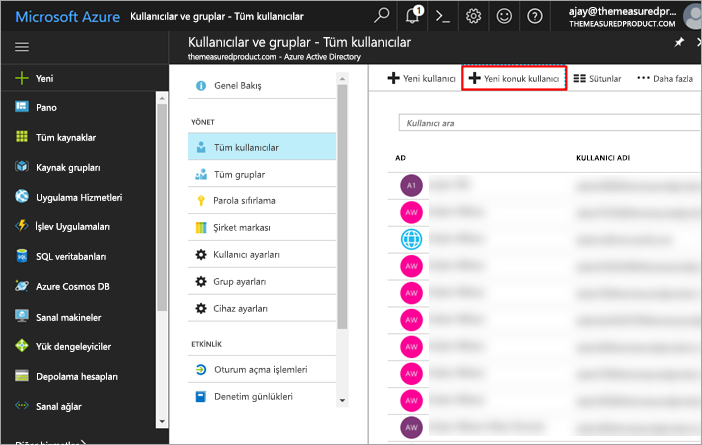
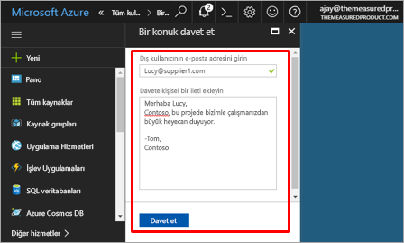
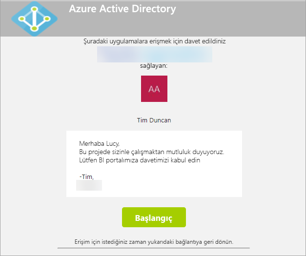
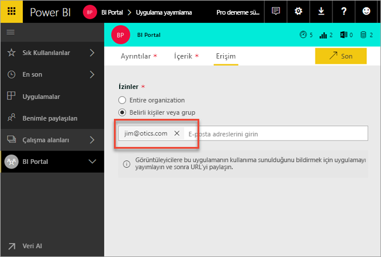
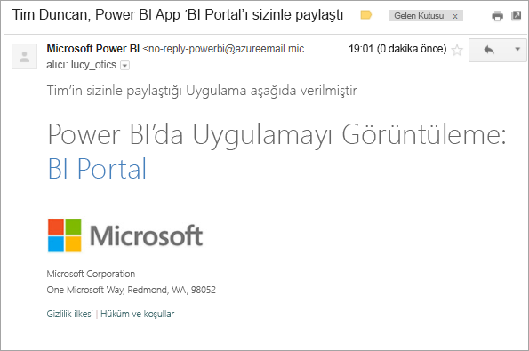
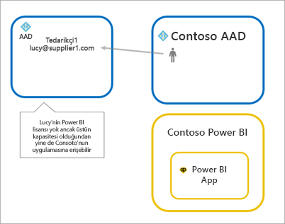

# Azure AD B2B ile Power BI içeriklerini dış konuk kullanıcılara dağıtma

Power BI, İşletmeler Arası Azure Active Directory (Azure AD B2B ) ile tümleşerek Power BI içeriklerinin kuruluş dışındaki kullanıcılara güvenli bir şekilde dağıtılmasına olanak sağlar ve bu sırada iç verilerin de denetimini elinde bulundurur.

> [!VIDEO https://www.youtube.com/embed/xxQWEQ1NnlY]

> [!NOTE]
> Konuk kullanıcıları davet etmeden önce Power BI yönetici portalı Kiracı ayarlarında [Dışarı aktarma ve paylaşım ayarları](service-admin-portal.md#export-and-sharing-settings) özelliğini **Etkinleştirmeniz** gerekir.

> [!NOTE]
> Bu özellik şu anda Power BI mobil uygulamalarıyla kullanılamaz. Mobil cihazlardaki tarayıcılarda, Azure AD B2B kullanılarak paylaşılan Power BI içeriklerini görüntüleyebilirsiniz. 

## Kimleri davet edebilirsiniz?

Gmail.com, outlook.com veya hotmail.com gibi kişisel hesaplar da dahil olmak üzere herhangi bir e-posta adresini kullanan konuk kullanıcılar davet edebilirsiniz. Azure B2B’de bunlar “Sosyal Kimlikler” olarak adlandırılır. Daha fazla bilgi için lütfen [Azure B2B](https://docs.microsoft.com/en-us/azure/active-directory/active-directory-b2b-what-is-azure-ad-b2b) başlıklı makaleye başvurun.

## Konuk kullanıcı davet etme

Power BI kiracınıza konuk kullanıcı davet etme işlemi iki şekilde gerçekleştirilebilir: planlanmış davetler veya geçici davetler. Davetler, yalnızca bir dış kullanıcının kuruluşunuza ilk kez davet edilmesi sırasında gereklidir.

### Planlanmış davetler

Planlanmış davetler Microsoft Azure Portal'daki Azure AD'ye gidilerek veya PowerShell kullanılarak gerçekleştirilir. Hangi kullanıcıların davet edilmesi gerektiğini bildiğiniz durumlarda bu seçeneği kullanırsınız. 

**Azure AD portalında konuk kullanıcılar oluşturmak için bir kiracı yöneticisi olmanız gerekir.**

1. [Azure Portal](https://portal.azure.com)'a gidin ve **Azure Active Directory**'yi seçin.

2. **Kullanıcılar ve gruplar** > **Tüm kullanıcılar** > **Yeni konuk kullanıcı** seçeneğine gidin.

    

3. **E-posta adresini** ve **kişisel mesajı** girin.

    

4. **Davet et** seçeneğini belirleyin.

Birden fazla konuk davet etmek için PowerShell'i kullanın. Daha fazla bilgi için bkz. [Azure Active Directory B2B collaboration code and PowerShell samples (Azure Active Directory B2B işbirliği kodu ve PowerShell örnekleri)](https://docs.microsoft.com/azure/active-directory/b2b/code-samples).

Kullanıcının, aldığı e-posta davetindeki **Get Started** (Başlayın) seçeneğini belirlemesi gerekir. Konuk kullanıcı, bu işlemden sonra kiracıya eklenir.

### Geçici davetler

Dilediğiniz zaman davet gerçekleştirmek için dış kullanıcıyı, paylaşım kullanıcı arabirimi aracılığıyla panonuza veya raporunuza ya da erişim sayfası aracılığıyla uygulamanıza ekleyin.

Bir uygulamayı kullanması için bir dış kullanıcıyı davet ederken ne yapılacağına ilişkin bir örnek burada verilmiştir.

Konuk kullanıcı, uygulamanın kendisiyle paylaşıldığını belirten bir e-posta alır.

Konuk kullanıcının, kuruluşuna ait e-posta adresi ile oturum açması gerekir. Konuk kullanıcı, oturum açtıktan sonra, daveti kabul etmesine yönelik bir istemle karşılaşır. Oturum açma işleminden sonra konuk kullanıcı, uygulama içeriğine yönlendirilir. Uygulamaya dönmek için bağlantıya yer işareti ekleyin veya e-postayı kaydedin.

## Lisanslama

Konuk kullanıcının paylaşılan uygulamayı görüntüleyebilmesi için doğru lisansa sahip olması gerekir. Bunu gerçekleştirmeye yönelik üç seçenek vardır.

### Power BI Premium kullanma

Uygulama çalışma alanının Power BI Premium kapasitesine atanması, konuk kullanıcının uygulamayı bir Power BI Pro lisansına ihtiyaç duymadan kullanabilmesine olanak sağlar. Power BI Premium, uygulamaların, artırılmış yenileme sıklığı, ayrılmış kapasite ve büyük model boyutları gibi başka özelliklerden de yararlanmasına izin verir.

### Konuk kullanıcıya Power BI Pro lisansı atama

Konuk kullanıcıya kiracınızdaki bir Power BI Pro lisansının atanması, konuk kullanıcının içeriği görüntülemesine olanak sağlar.

> [!NOTE]
> Kiracınızdaki Power BI Pro lisansları, yalnızca kiracınızdaki içeriklere erişimi olan konuk kullanıcılar için geçerlidir.

### Konuk kullanıcının kendi Power BI Pro lisansına sahip olması

Konuk kullanıcı zaten kendi kiracısında atanmış bir Power BI Pro lisansına sahiptir.

## Önemli Noktalar ve Sınırlamalar

* gmail.com, outlook.com veya hotmail.com gibi kişisel e-posta hesapları kullanan konuk kullanıcıları davet ederken, bir kullanıcının nasıl kaydolacağının örneğini gösteren bu [eklenmiş videoyu](https://docs.microsoft.com/en-us/azure/active-directory/active-directory-b2b-redemption-experience) izleyebilirsiniz.
* Dış B2B konukları, yalnızca içeriğin kullanımıyla sınırlandırılır. Dış B2B konukları uygulamaları, panoları ve raporları görüntüleyebilmenin yanı sıra panolar ile raporlara yönelik olarak verileri dışarı aktarabilir ve e-posta abonelikleri oluşturabilir. Çalışma alanlarına erişemez veya kendi içeriklerini yayımlayamazlar.
* Bu özellik şu anda Power BI mobil uygulamalarıyla kullanılamaz. Mobil cihazlardaki tarayıcılarda, Azure AD B2B kullanılarak paylaşılan Power BI içeriklerini görüntüleyebilirsiniz.
* Bu özellik şu anda Power BI SharePoint Online raporu web bölümüyle kullanılamaz.

## Sonraki adımlar

Satır düzeyi güvenliğin çalışma şeklini de içeren daha fazla bilgi için [teknik incelemeye](https://aka.ms/powerbi-b2b-whitepaper) göz atın.

Azure Active Directory B2B ile ilgili daha fazla bilgi için bkz. [What is Azure AD B2B collaboration? (Azure AD B2B işbirliği nedir?)](https://docs.microsoft.com/azure/active-directory/active-directory-b2b-what-is-azure-ad-b2b)
