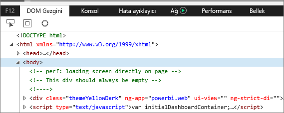
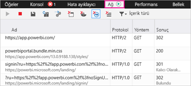
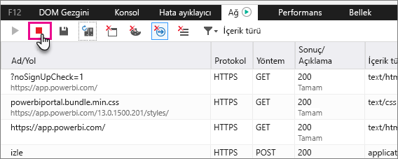

# Ek tanılama bilgilerini yakalama
## Power BI için Ek Tanılama Bilgilerini Yakalama
Bu yönergelerde, Power BI web istemcisinden el ile ek tanılama bilgisi toplamak için kullanabileceğiniz iki seçenek sunulmaktadır.  Bu seçeneklerden yalnızca birinin kullanılması gerekir.

## Ağ Yakalama - Edge ve Internet Explorer
1. Edge veya Internet Explorer kullanarak [Power BI](https://app.powerbi.com)'a gidin.
2. F12'ye basarak Edge geliştirici araçlarını açın.
3. Geliştirici Araçları penceresi açılır: 
   
   
4. Ağ sekmesine gidin. Önceden yakalanmış olan trafik listelenir. 
   
   
5. Pencereye göz atabilir ve karşılaştığınız sorunu tekrarlayabilirsiniz. Oturum sırasında dilediğiniz zaman F12'ye basarak geliştirici araçları penceresini gizleyebilir ve gösterebilirsiniz.
6. Yakalamayı durdurmak için geliştirici araçları bölümünün ağ sekmesindeki kırmızı kareyi seçebilirsiniz.
   
   
7. Disket simgesini seçip **HAR olarak dışarı aktar**'a tıklayın
   
   
8. Bir dosya adı girin ve HAR dosyasını kaydedin.
   
    HAR dosyası, tarayıcı penceresi ile Power BI arasındaki tüm ağ istekleri hakkındaki bilgileri içerir.  Bunlar arasında her bir isteğin etkinlik kimliği, tam zaman damgası ve istemciye döndürülen hata bilgileri bulunur.  Bu izlemede, ekranda gösterilen görselleri doldurmak için kullanılan veriler de yer alır.
9. İnceleme konusunda destek olması için HAR dosyasını iletebilirsiniz.

Başka bir sorunuz mu var? [Power BI Topluluğu'na sorun](http://community.powerbi.com/)

