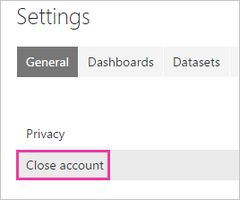
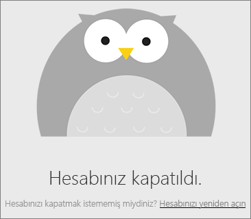

# Power BI hesabınızı kapatma

Power BI'ı artık kullanmak istemiyorsanız Power BI hesabınızı kapatabilirsiniz.  Hesabınızı kapattıktan sonra Power BI'da oturum olamaz. Ayrıca, Power BI hüküm hizmet kalitesi, veri saklama ilkesini durumları gibi Power BI karşıya veya oluşturulan tüm müşteri verilerini siler. Bunu korunmaz.

## Bireysel Power BI kullanıcıları

Power BI'a bireysel olarak kaydolduysanız **Ayarlar** ekranından hesabınızı kapatabilirsiniz.

1. Power BI'da sağ üst köşedeki dişli simgesini ve ardından **Ayarlar**'ı seçin.

    

1. **Genel** sekmesinde **Hesabı Kapat**'ı seçin.

    

1. Hesabınızı kapatma nedeninizi seçin (1). Dilerseniz daha fazla bilgi sağlayabilirsiniz (2). Ardından **Hesabı kapat** seçeneğini belirleyin.

    

1. Hesabınızı kapatmak istediğinizi onaylayın.

    

    Power BI hesabınız kapatıldı bir doğrulama görmeniz gerekir. Gerekirse buradan hesabınızı yeniden açabilirsiniz.

    

## Yönetilen kiracı kullanıcıları

Power BI kaydınız kuruluşunuz tarafından oluşturulduysa kiracınızın yöneticisiyle iletişim geçin. Yöneticiden hesabınızdaki lisansı kaldırmasını isteyin.

Başka bir sorunuz mu var? [Power BI Topluluğu'na sorun](http://community.powerbi.com/)