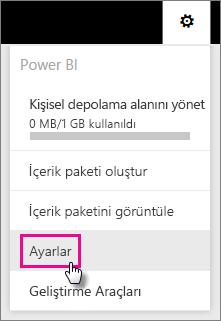
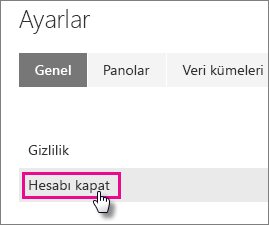
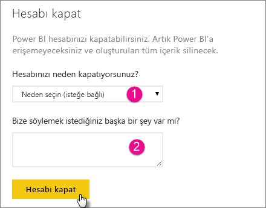
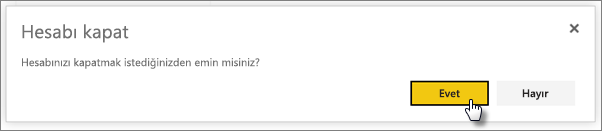
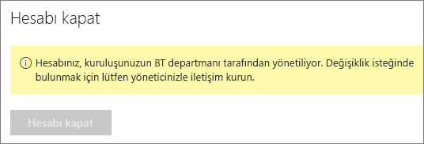

# Power BI hesabınızı kapatma
Power BI'ı artık kullanmak istemiyorsanız bizden Power BI hesabınızı kapatmamızı isteyebilirsiniz.  Hesabınız kapatıldıktan sonra Power BI'da oturum açamazsınız.  Ayrıca, Power BI'a yüklediğiniz veya burada oluşturduğunuz tüm müşteri verileri, Power BI Hizmet Kullanım Koşulları'ndaki veri saklama ilkesine göre silinir.

## Bireysel Power BI kullanıcıları
Hesabınızı ayarlar ekranından kapatabilirsiniz.

1. Sağ üstteki dişli  simgesini seçin.
2. **Ayarlar** seçeneğini belirleyin.
   
    
3. **Genel** > **Hesabı Kapat**
   
    
4. **Hesabınızı neden kapatıyorsunuz?** (1) açılan menüsünden bir neden seçin.  İsteğe bağlı olarak daha fazla bilgi sağlayabilirsiniz (2). Ardından **Hesabı kapat** seçeneğini belirleyin.
   
    
5. Hesabınızı kapatmak istediğinizi onaylayın.
   
    
6. Hesabınızın kapatıldığına ilişkin bir onay göreceksiniz. Ayrıca, hesabınızı yeniden açmak için kullanabileceğiniz bir bağlantı da verilecektir.
   
    

## Yönetilen kiracı kullanıcıları
Kiracı yöneticinizle iletişime geçerek hesabınızdaki lisansın atamasını kaldırmasını istemeniz gerekir.

Başka bir sorunuz mu var? [Power BI Topluluğu'na sorun](http://community.powerbi.com/)

