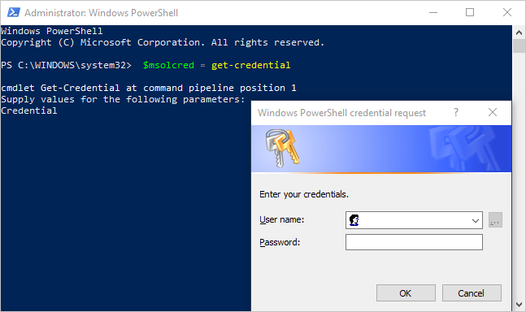

# <a name="administering-power-bi---frequently-asked-questions-faq"></a>Power BI yönetimi - sık sorulan sorular (SSS)

Bu makalede, Power BI yönetimi için sık sorulan sorular ele alınmıştır. Power BI yönetimine genel bakış için bkz. [Power BI yönetimi nedir?](service-admin-administering-power-bi-in-your-organization.md).

## <a name="whats-in-this-article"></a>Bu makalenin içindekiler

### <a name="sign-up-for-power-bi-section"></a>Power BI'a kaydolma bölümü

* [PowerShell'i kullanma](#using-powershell)
* [Kullanıcılar Power BI'a nasıl kaydolur?](#how-do-users-sign-up-for-power-bi)
* [Kuruluşumdaki bireysel kullanıcılar nasıl kaydolur?](#how-do-individual-users-in-my-organization-sign-up)
* [Kullanıcıların, var olan Office 365 kiracıma katılmalarını nasıl önleyebilirim?](#how-can-i-prevent-users-from-joining-my-existing-office-365-tenant)
* [Kullanıcıların, var olan Office 365 kiracıma katılmalarına nasıl izin verebilirim?](#how-can-i-allow-users-to-join-my-existing-office-365-tenant)
* [Ben kiracıda engelin etkin nasıl kontrol edebilirim?](#how-do-i-check-if-i-have-the-block-on-in-the-tenant)
* [Mevcut kullanıcılarımın Power BI'ı kullanmaya başlamasını nasıl önleyebilirim?](#how-can-i-prevent-my-existing-users-from-starting-to-use-power-bi)
* [Mevcut kullanıcılarımın Power BI'a kaydolmasına nasıl izin veririm?](#how-can-i-allow-my-existing-users-to-sign-up-for-power-bi)

### <a name="administration-of-power-bi-section"></a>Power BI Yönetimi bölümü

* [Bu, şu anda kuruluşumdaki kullanıcıların kimliklerini yönetme biçimimi nasıl değiştirecek?](#how-will-this-change-the-way-i-manage-identities-for-users-in-my-organization-today)
* [Power BI nasıl yönetilir?](#how-do-we-manage-power-bi)
* [Kullanıcılarım için Microsoft tarafından oluşturulan bir kiracıyı yönetme süreci nasıldır?](#what-is-the-process-to-manage-a-tenant-created-by-microsoft-for-my-users)
* [Ben birden çok etki alanım olması halinde, miyim kullanıcılar için eklenin Office 365 kiracısını denetleyebilir miyim?](#if-i-have-multiple-domains-can-i-control-the-office-365-tenant-that-users-get-added-to)
* [Kayıtlı kullanıcıların Power BI lisansını nasıl kaldırabilirim?](#how-do-i-remove-power-bi-for-users-that-already-signed-up)
* [Kiracıma yeni kullanıcıların katıldığını nasıl anlarım?](#how-do-i-know-when-new-users-have-joined-my-tenant)
* [İçin hazırlama başka şeyler var mı?](#are-there-any-additional-things-i-should-prepare-for)
* [Power BI kiracım nerede bulunur?](#where-is-my-power-bi-tenant-located)
* [Power BI SLA'sı (Hizmet Düzeyi Sözleşmesi) nedir?](#what-is-the-power-bi-sla)
* [Power BI yüksek kullanılabilirliği ve yük devretmeyi nasıl işler?](#how-does-power-bi-handle-high-availability-and-failover)

### <a name="security-in-power-bi-section"></a>Power BI'da Güvenlik bölümü

* [Power BI ulusal, bölgesel ve sektöre özel uyumluluk gereksinimlerini karşılıyor mu?](#does-power-bi-meet-national-regional-and-industry-specific-compliance-requirements)
* [Power BI'da güvenlik nasıl sağlanır?](#how-does-security-work-in-power-bi)

## <a name="sign-up-for-power-bi"></a>Power BI'a kaydolma

### <a name="using-powershell"></a>PowerShell'i kullanma

Bu bölümdeki yordamların bazılarında Windows PowerShell betiklerinin kullanılması gerekir. PowerShell hakkında bilgi sahibi değilseniz [PowerShell'i kullanmaya başlama kılavuzuna](http://go.microsoft.com/fwlink/p/?LinkID=286814) göz atmanızı öneririz. Betikleri çalıştırmak için öncelikle [Azure Active Directory PowerShell for Graph](/powershell/azure/active-directory/) uygulamasının 64 bit sürümünü yüklemeniz gerekir.

### <a name="how-do-users-sign-up-for-power-bi"></a>Kullanıcılar Power BI'a nasıl kaydolur?

Power bı'a kaydolabilir bir yönetici [Power BI web sitesine](https://powerbi.microsoft.com) veya [hizmetleri satın](https://admin.microsoft.com/AdminPortal/Home#/catalog) Microsoft 365 Yönetim Merkezi sayfasında. Bir yönetici Power BI'a kaydolduğunda, erişimi olması gereken kullanıcılara kullanıcı lisansları atayabilirsiniz.

Ayrıca kuruluşunuzdaki bireysel kullanıcılar [Power BI web sitesine](https://powerbi.microsoft.com) giderek Power BI'a kaydolabilir. Kuruluşunuzdaki bir kullanıcı Power BI'a kaydolduğunda, hizmetin bir Power BI lisansı kullanıcıya otomatik olarak atar. Daha fazla bilgi için bkz. [bireysel olarak Power BI için kaydolma](service-self-service-signup-for-power-bi.md) ve [kuruluşunuzda Power BI lisansı](service-admin-licensing-organization.md).

### <a name="how-do-individual-users-in-my-organization-sign-up"></a>Kuruluşumdaki bireysel kullanıcılar nasıl kaydolur?

Kuruluşunuzdaki kullanıcılar için geçerli olabilecek üç senaryo vardır:

* **1. Senaryo**: Kuruluşunuzda zaten bir Office 365 ortamı vardır ve Power BI'a kaydolacak kullanıcı bir Office 365 hesabına sahiptir.
    Bu senaryoda, bu hesabın planını, Microsoft yalnızca bir kullanıcı zaten bir iş veya Okul hesabı kiracıda (örneğin, contoso.com) ancak henüz Power BI olmayan, etkinleştirir. Kullanıcı, Power BI hizmetini kullanma hakkında bilgiler ile otomatik olarak bilgilendirilir.

* **2. Senaryo**: Kuruluşunuzda zaten bir Office 365 ortamı vardır ancak Power BI'a kaydolacak kullanıcının Office 365 hesabı yoktur.
    Bu senaryoda, kullanıcı kuruluşunuzun etki alanında (örneğin, contoso.com) bir e-posta adresine sahiptir, ancak henüz bir Office 365 hesabı yoktur. Bu durumda, kullanıcı Power BI'a kaydolabilir ve otomatik olarak bir hesap edinir. Bu eylem, Power BI hizmetinde kullanıcı erişim sağlar. Örneğin, bir çalışan Nancy adlı kendi iş e-posta adresi (gibi nancy@contoso.com) kaydolmak için Microsoft otomatik olarak Nancy Contoso'nun Office 365 ortamına kullanıcı olarak ekler ve bu hesap için Power BI'ı etkinleştirir.

* **3. Senaryo**: Kuruluşunuzun e-posta etki alanınıza bağlı bir Office 365 ortamı yoktur.
    Power BI yararlanmak, kuruluşunuz için gerekli herhangi bir yönetimsel eylem vardır. Hizmet, kullanıcıların yeni, yalnızca bulutta yer alan bir kullanıcı dizinine ekler. Kiracı Yöneticisi olarak devralır ve yönetmek seçebilirsiniz.

> [!IMPORTANT]
> Kuruluşunuz birden fazla e-posta etki alanına sahipse ve tüm e-posta adresi uzantılarının aynı kiracıda olmasını tercih ediyorsanız, kullanıcılar kaydolmadan önce tüm e-posta adresi etki alanlarını bir Azure Active Directory kiracısına ekleyin. Kullanıcılar oluşturduktan sonra kullanıcıları kiracılar arasında taşımak için herhangi bir Otomatik Sistem yoktur. Bu işlem hakkında daha fazla bilgi için bkz. [miyim birden çok etki alanım olması halinde, kullanıcılar için eklenin Office 365 kiracısını denetleyebilir?](#if-i-have-multiple-domains-can-i-control-the-office-365-tenant-that-users-get-added-to) bu makalenin ilerleyen bölümlerinde ve [Office 365'e bir etki alanı ekleme](/office365/admin/setup/add-domain/).

### <a name="how-can-i-prevent-users-from-joining-my-existing-office-365-tenant"></a>Kullanıcıların, var olan Office 365 kiracıma katılmalarını nasıl önleyebilirim?

Bir yönetici olarak, kullanıcıların Office 365 kiracınıza katılmasını önlemek için uygulayabileceğiniz yöntemler vardır. Bir ileti görüntülenir ve erişimi, kullanıcıların girişimleri başarısız ' oturum engellemek yönlendirmez, kuruluşlarının yöneticisiyle iletişime geçin Otomatik lisans dağıtımını (örneğin, aracılığıyla Office 365 eğitim, Öğrenciler, Fakülte ve personel için) zaten devre dışı bıraktıysanız bu işlemi tekrarlamanıza gerek yoktur.

Yönetilen bir kiracıya yeni kullanıcıların katılmasını önlemek için aşağıdaki PowerShell komutunu kullanın. ([PowerShell hakkında daha fazla bilgi edinin][1].)

```powershell
$msolcred = get-credential
connect-msolservice -credential $msolcred

Set-MsolCompanySettings -AllowEmailVerifiedUsers $false
```

> [!NOTE]
> Erişimi engelleme, kuruluşunuzdaki yeni kullanıcıların Power BI'a kaydolmasını önler. Kuruluşunuzda yeni kaydolma işlemleri devre dışı bırakılmadan önce Power BI'a kaydolmuş olan kullanıcıların lisansları korunur. Bir kullanıcıyı kaldırmak için bu makalenin [Kayıtlı kullanıcıların Power BI lisansını nasıl kaldırabilirim?](#how-do-i-remove-power-bi-for-users-that-already-signed-up) bölümüne bakın.

### <a name="how-can-i-allow-users-to-join-my-existing-office-365-tenant"></a>Kullanıcıların, var olan Office 365 kiracıma katılmalarına nasıl izin verebilirim?

Yeni kullanıcıların yönetilen bir kiracıya katılmasını sağlamak için aşağıdaki PowerShell betiğini kullanın. ([PowerShell hakkında daha fazla bilgi edinin][1].)

```powershell
$msolcred = get-credential
connect-msolservice -credential $msolcred

Set-MsolCompanySettings -AllowEmailVerifiedUsers $true
```

### <a name="how-do-i-check-if-i-have-the-block-on-in-the-tenant"></a>Ben kiracıda engelin etkin nasıl kontrol edebilirim?

Ayarlarını denetlemek için aşağıdaki PowerShell betiğini kullanın. *AllowEmailVerifiedUsers*, false değerine sahip olmalıdır. ([PowerShell hakkında daha fazla bilgi edinin][1].)

```powershell
$msolcred = get-credential
connect-msolservice -credential $msolcred

Get-MsolCompanyInformation | fl allow*
```

### <a name="how-can-i-prevent-my-existing-users-from-starting-to-use-power-bi"></a>Mevcut kullanıcılarımın Power BI'ı kullanmaya başlamasını nasıl önleyebilirim?

Denetim **AllowAdHocSubscriptions** Azure AD ayarı tarafından gerçekleştirilir. Çoğu kiracıda bu etkin anlamına gelir true olarak ayarlanmış olması. Power BI iş ortağı aracılığıyla edindiyseniz, bu devre dışı olduğu anlamına gelir. false olarak ayarlanabilir.

Geçici abonelikleri devre dışı bırakmak için aşağıdaki PowerShell betiğini kullanın. ([PowerShell hakkında daha fazla bilgi edinin][1].)

1. Office 365 kimlik bilgilerinizi kullanıp Azure Active Directory'de oturum açın. Aşağıdaki PowerShell betiğinin ilk satırında sizden kimlik bilgileriniz istenir. İkinci satırda Azure Active Directory ile bağlantı kurulur.

    ```powershell
     $msolcred = get-credential
     connect-msolservice -credential $msolcred
    ```

   

1. Bir kez oturum açarken, nasıl kiracınız şu anda ayarlandığını görmek için aşağıdaki komutu çalıştırın.

    ```powershell
     Get-MsolCompanyInformation | fl AllowAdHocSubscriptions
    ```

1. Etkinleştirmek için aşağıdaki komutu çalıştırın (`$true`) veya devre dışı bırakın (`$false`) **AllowAdHocSubscriptions**.

    ```powershell
     Set-MsolCompanySettings -AllowAdHocSubscriptions $false
    ```

> [!NOTE]
> Kullanım **AllowAdHocSubscriptions** bayrağı, kuruluşunuzdaki kullanıcıların Azure Rights Management hizmeti için kaydolmak de dahil olmak üzere çeşitli kullanıcı özelliklerini denetlemek için. Bu bayrağın değiştirilmesi bu özelliklerin tümünü etkiler.

### <a name="how-can-i-allow-my-existing-users-to-sign-up-for-power-bi"></a>Mevcut kullanıcılarımın Power BI'a kaydolmasına nasıl izin veririm?

Mevcut kullanıcılarınızın Power BI önceki soruda belirtilen komutu çalıştırın, kaydolmak izin verecek şekilde ancak geçirmek `$true` yerine `$false` son adımda.

## <a name="administration-of-power-bi"></a>Power BI Yönetimi

### <a name="how-will-this-change-the-way-i-manage-identities-for-users-in-my-organization-today"></a>Bu, şu anda kuruluşumdaki kullanıcıların kimliklerini yönetme biçimimi nasıl değiştirecek?

Kuruluşunuzdaki kullanıcılar için geçerli olabilecek üç senaryo vardır:

* **1. Senaryo**: Kuruluşunuzun bir Office 365 ortamı mevcutsa ve kuruluşunuzdaki tüm kullanıcıların Office 365 hesabı varsa kimlik yönetme Biçiminizde herhangi bir değişiklik yoktur.

* **2. Senaryo**: Kuruluşunuzun zaten bir Office 365 ortamı vardır ancak kuruluşunuzdaki tüm kullanıcılar Office 365 hesabı yoksa, biz kiracıda bir kullanıcı oluşturun ve kullanıcının iş veya Okul e-posta adresine göre lisans atarız.

    Sonuç olarak, kuruluşunuzdaki kullanıcılar hizmete kaydoldukça gibi belirli bir zamanda yönettiğiniz kullanıcı sayısı artar.

* **3. Senaryo**: Kuruluşunuzun e-posta etki alanınıza bağlı bir Office 365 ortamı yoksa kimlik yönetme Biçiminizde herhangi bir değişiklik yoktur.

    Hizmet, kullanıcıların yeni, yalnızca bulutta yer alan bir kullanıcı dizinine ekler. Ayrıca, Kiracı Yöneticisi olarak devralır ve yönetmek seçebilirsiniz.

### <a name="how-do-we-manage-power-bi"></a>Power BI nasıl yönetilir?

Power BI, kullanım istatistiklerini görüntülemenizi sağlayan bir yönetim portalı kullanıcıları ve grupları yönetmek için Microsoft 365 Yönetim Merkezi bir bağlantı sağlar ve Kiracı genelinde ayarları denetleme olanağı sağlar sağlar.

Power BI Yönetici portalı kullanmak için hesabınız olarak işaretlemek bir **genel yönetici** içinde Office 365 veya Azure Active Directory veya biri Power BI hizmeti Yönetici rolüne kullanıcı hesabınıza atamanız gerekir. Daha fazla bilgi için bkz. [Power BI yönetici rolünü anlama](service-admin-role.md) ve [Power BI Yönetici portalı](service-admin-portal.md).

### <a name="what-is-the-process-to-manage-a-tenant-created-by-microsoft-for-my-users"></a>Kullanıcılarım için Microsoft tarafından oluşturulan bir kiracıyı yönetme süreci nasıldır?

Azure AD kullanan bir bulut hizmeti için bir Self Servis kullanıcı kaydolduğunda hizmet bunları yönetilmeyen bir Azure ekler AD dizini temel e-posta etki. Talebi ve kişi olarak da bilinen bir işlem kullanılarak oluşturulan bir kiracıyı yönetme bir *yönetici devralma işlemini*. Bunu devralma türü bağımlı olup olmadığını mevcut bir yönetilen etki alanınız ile ilişkili Kiracı:

* Etki alanına yeni bir yönetilen kiracı oluşturmak için *dahili devralma* kullanın.

* Etki alanını mevcut yönetilen kiracıya taşımak için *harici devralma* kullanın.

Daha fazla bilgi için bkz. [Azure Active Directory'de yönetici olarak yönetilmeyen bir dizini devralma](/azure/active-directory/users-groups-roles/domains-admin-takeover).

Bir dış devralma işlemi gerçekleştirdiğinizde hizmeti Power BI içinde devralma önce oluşturulan içerik yerleştirir bir [Power BI arşivlenmiş çalışma](service-admin-power-bi-archived-workspace.md). Yeni kiracıda kullanmak istediğiniz tüm içeriği el ile geçirmeniz gerekir.

### <a name="if-i-have-multiple-domains-can-i-control-the-office-365-tenant-that-users-get-added-to"></a>Ben birden çok etki alanım olması halinde, miyim kullanıcılar için eklenin Office 365 kiracısını denetleyebilir miyim?

Hizmet, işlem yapmamanız durumunda her bir kullanıcı e-posta etki alanı ve alt etki alanı için bir kiracı oluşturur. E-posta adresi uzantılarından bağımsız olarak tüm kullanıcıların aynı kiracıda olmasını istiyorsanız: Önceden bir hedef Kiracı oluşturun veya mevcut bir kiracıyı kullanın. Ardından mevcut etki alanlarını ve ilgili kiracıda birleşmesini istediğiniz alt etki alanlarını ekleyin. Otomatik olarak bu etki alanları ve alt etki alanlarıyla biten e-posta adreslerine sahip tüm kullanıcı kaydolduğunda hedef kiracıya katılın.

> [!IMPORTANT]
> Kullanıcılar oluşturduktan sonra kullanıcıları kiracılar arasında taşımak için desteklenen hiçbir otomatik sistem yoktur. Tek bir Office 365 kiracısına etki alanı ekleme hakkında bilgi edinmek için bkz. [Office 365'e etki alanı ve kullanıcı ekleme](/office365/admin/setup/add-domain/).

### <a name="how-do-i-remove-power-bi-for-users-that-already-signed-up"></a>Kayıtlı kullanıcıların Power BI lisansını nasıl kaldırabilirim?

Power BI'a kaydolmuş bir kullanıcının artık Power BI'a erişim sağlamasını istemiyorsanız kullanıcının Power BI lisansını kaldırabilirsiniz.

1. [Microsoft 365 yönetim merkezine](https://admin.microsoft.com/AdminPortal/Home#/homepage) gidin.

1. Sol gezinti çubuğunda **Kullanıcılar** > **Etkin Kullanıcılar**'ı seçin.

1. Lisansını kaldırmak istediğiniz kullanıcıyı bulup bu kullanıcının adını seçin.

    Kullanıcı lisanslarını toplu olarak yönetebilirsiniz. Bunu yapmak için birden fazla kullanıcıyı seçin ve **Ürün lisanslarını düzenle** seçeneğini belirleyin.

1. Kullanıcı ayrıntıları sayfasında **Ürün lisansları**'nın yanında **Düzenle**’yi seçin.

1. Uygulanan hesaplarına bağlı olarak, lisans üzerinde Ayarla **Power BI (ücretsiz)** veya **Power BI Pro** için **kapalı**.

1. **Kaydet**'i seçin.

### <a name="how-do-i-know-when-new-users-have-joined-my-tenant"></a>Kiracıma yeni kullanıcıların katıldığını nasıl anlarım?

Kiracınıza bu programın bir parçası katılan kullanıcılara, yönetici panonuzun etkin kullanıcı bölmesinde içinde filtreleyebilirsiniz benzersiz bir lisans atanır. Bu yeni görünümü oluşturmak için aşağıdaki adımları izleyin.

1. [Microsoft 365 yönetim merkezine](https://admin.microsoft.com/AdminPortal/Home#/homepage) gidin.

1. Sol gezinti çubuğunda **Kullanıcılar** > **Etkin Kullanıcılar**'ı seçin.

1. **Görünümler** menüsünde **Özel görünüm ekle**'yi seçin.

1. Yeni görünümünüzü adlandırın ve **Atanan ürün lisansı** bölümünde **Power BI (ücretsiz)** veya **Power BI Pro** seçeneğini belirleyin.

    Görünüm başına yalnızca bir lisans seçebilirsiniz. Kuruluşunuzda hem **Power BI (ücretsiz)** hem de **Power BI Pro** lisansları varsa iki görünüm oluşturabilirsiniz.

1. Varsa eklemek istediğiniz diğer koşulları da girin ve **Ekle**'yi seçin.

1. Yeni Görünüm oluşturduktan sonra kullanılabilir **görünümleri** menüsü.

### <a name="are-there-any-additional-things-i-should-prepare-for"></a>İçin hazırlama başka şeyler var mı?

Parola sıfırlama isteklerinde bir artış ile karşılaşabilirsiniz. Bu işlem hakkında daha fazla bilgi için bkz. [bir kullanıcının parolasını sıfırlama](/office365/admin/add-users/reset-passwords).

Microsoft 365 yönetim merkezinde standart işlemi uygulayarak kiracınızdan kullanıcı kaldırabilirsiniz. Ancak, kullanıcı kuruluşunuzun etkin bir e-posta adresine sahipse siz tüm kullanıcıların katılımını engellemediğiniz sürece tekrar katılabilir.

### <a name="where-is-my-power-bi-tenant-located"></a>Power BI kiracım nerede bulunur?

Power BI kiracınızın hangi veri bölgesi olan, daha fazla bilgi için bkz: [Power BI kiracım nerede?](service-admin-where-is-my-tenant-located.md).

### <a name="what-is-the-power-bi-sla"></a>Power BI SLA'sı nedir?

Power BI SLA'sı (hizmet düzeyi sözleşmesi) hakkında daha fazla bilgi için bkz. [lisans koşulları ve belgeler](http://www.microsoftvolumelicensing.com/DocumentSearch.aspx?Mode=3&DocumentTypeId=37) makalesine **lisans** Microsoft Licensing Web sitesinin bölümünü.

### <a name="how-does-power-bi-handle-high-availability-and-failover"></a>Power BI yüksek kullanılabilirliği ve yük devretmeyi nasıl işler?

Yüksek kullanılabilirlik ve yük devretme hakkında daha fazla bilgi için bkz. [Power BI yüksek kullanılabilirlik, yük devretme ve olağanüstü durum kurtarma ile ilgili SSS](service-admin-failover.md).

## <a name="security-in-power-bi"></a>Power BI'da Güvenlik

### <a name="does-power-bi-meet-national-regional-and-industry-specific-compliance-requirements"></a>Power BI ulusal, bölgesel ve sektöre özel uyumluluk gereksinimlerini karşılıyor mu?

Power BI uyumluluğu hakkında daha fazla bilgi edinmek için bkz. [Microsoft Güven Merkezi](https://www.microsoft.com/TrustCenter/CloudServices/business-application-platform/default.aspx).

### <a name="how-does-security-work-in-power-bi"></a>Power BI'da güvenlik nasıl sağlanır?

Microsoft Power BI buna karşılık, Azure Active Directory gibi Azure hizmetleri üzerine inşa edilmiştir Office 365'in temel üzerine kurulu. Power BI mimarisine genel bakış için bkz. [Power BI Güvenliği](service-admin-power-bi-security.md).

## <a name="next-steps"></a>Sonraki adımlar

[Power BI yönetici portalı](service-admin-portal.md)  
[Power BI yönetici rolünü anlama](service-admin-role.md)  
[Power BI için self servis kayıt](service-self-service-signup-for-power-bi.md)  
[Power BI Pro'yu satın alma](service-admin-purchasing-power-bi-pro.md)  
[Power BI Premium nedir?](service-premium-what-is.md)  
[Power BI Premium'u satın alma](service-admin-premium-purchase.md)  
[Power BI Premium teknik incelemesi](https://aka.ms/pbipremiumwhitepaper)  
[Power BI ve Office 365'teki grubunuzu yönetme](service-manage-app-workspace-in-power-bi-and-office-365.md)  
[Office 365 kullanıcı hesabı yönetimi](/office365/servicedescriptions/office-365-platform-service-description/user-account-management/)  
[Office 365 grup yönetimi](/office365/admin/email/create-edit-or-delete-a-security-group/)  

Başka bir sorunuz mu var? [Power BI Topluluğu'na sorun](http://community.powerbi.com/)

[1]: https://docs.microsoft.com/powershell/scripting/overview