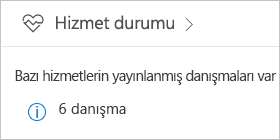
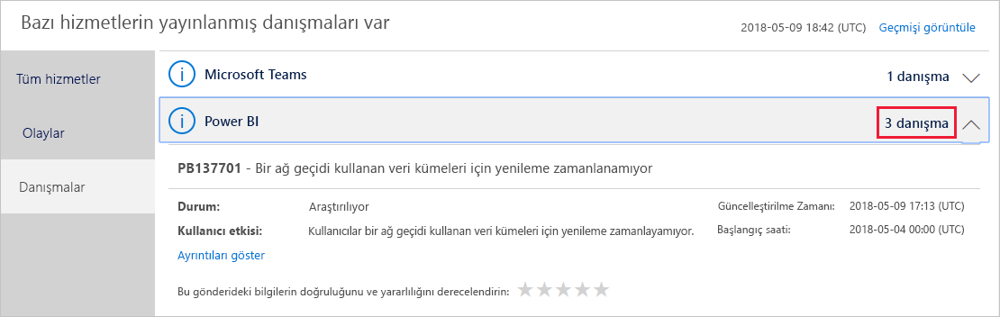
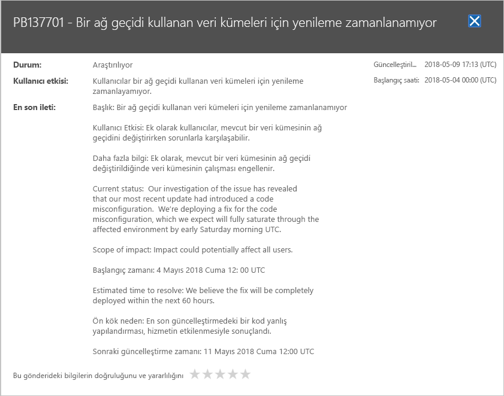

# Office 365'te Power BI hizmet durumunu izleme

Office 365 yönetim merkezi, hizmet durumuna ilişkin mevcut ve geçmiş bilgiler dahil olmak üzere Power BI yöneticilerine yönelik önemli araçlar sağlar. Bu bilgilere erişmek için aşağıdaki rollerden birinde olmanız gerekir: Power BI Hizmet Yöneticisi veya Office 365 Genel Yöneticisi. Rolleri hakkında daha fazla bilgi için bkz. [Power BI ile ilgili yönetici rolleri](service-admin-administering-power-bi-in-your-organization.md#administrator-roles-related-to-power-bi).

1. [Office 365 yönetim merkezinde](https://portal.office.com/adminportal) oturum açın.

2. **Hizmet durumu** kutucuğunu seçin.

    

3. Geçerli listeden **N öneri** veya **N olay** öğesini seçin ve sonuçları gözden geçirin. Aşağıdaki grafikte üç etkin öneri görebilirsiniz.

    

4. Daha fazla bilgi için bir öğenin **Ayrıntıları göster** seçeneğini belirleyin. Aşağıdaki grafikte, son durum güncelleştirmeleri dahil olmak üzere ek ayrıntıları görebilirsiniz.

    

    Daha fazla bilgi görmek için aşağı kaydırın, işiniz bittiğinde ise bölmeyi kapatın.

5. Tüm hizmetlerdeki geçmiş bilgileri görmek için, ana listenin sağ üst köşesinde bulunan **Geçmişi görüntüle**’yi seçin. Ardından **Son 7 gün** veya **Son 30 gün**’ü seçin. Geçerli hizmet durumuna geri dönmek için **Geçerli durumu görüntüle**’yi seçin.