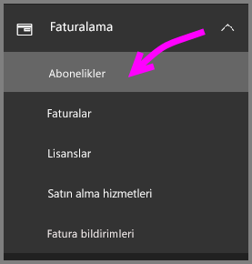
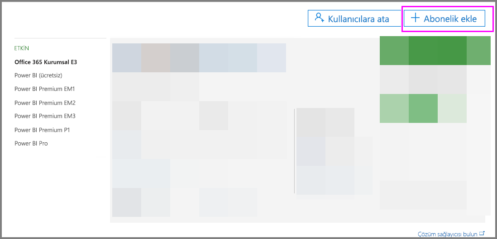
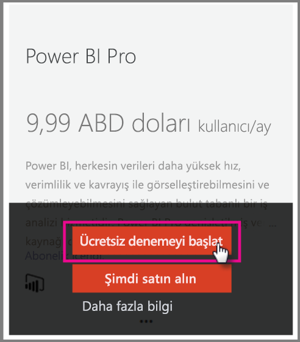
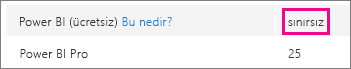
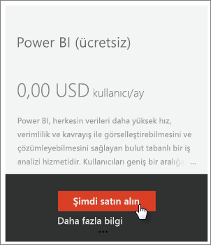
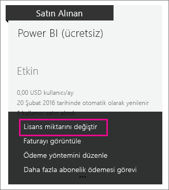
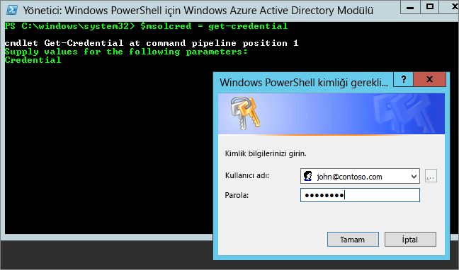

# <a name="power-bi-licensing-in-your-organization"></a>Kuruluşunuzda Power BI lisansları

Power BI hizmetinde, kullanıcıların iki tür lisans temelinde tanımlanmış özellikleri vardır:

* **Kullanıcı başına** - *ücretsiz lisans ve Power BI Pro lisansı*. Ücretsiz lisans, Power BI hizmetinin bazı özelliklerine erişim olanağı sağlar. Pro lisansı, Power BI hizmetinin içerik paylaşma ve diğer Pro kullanıcılarıyla işbirliği yapma dahil tüm içerik ve özelliklerine erişim olanağı sağlar. Uygulama çalışma alanlarına içerik yayımlama ve uygulama çalışma alanlarından içerik kullanma, panoları paylaşma ve pano ile raporlara abone olma işlemlerini yalnızca Pro kullanıcıları yapabilir. Daha fazla bilgi için bkz. [Lisans türüne göre Power BI hizmeti özellikleri](service-features-license-type.md).

* **Kapasite tabanlı** - *Power BI Premium lisansı*. Premium, Power BI’da daha tutarlı performans sağlamak için ayrılmış kapasite ve daha büyük hacimli veriler için destek sunar. Premium ayrıca bireysel kullanıcılar için içeriği görüntüleyen alıcılarda Pro lisansı gerektirmeden içeriğin Pro kullanıcıları tarafından geniş ölçekte dağıtılmasını sağlar. Daha fazla bilgi için bkz. [Power BI Premium nedir?](service-premium.md).

Bu makale, yönetim açısından kullanıcı başına lisanslamaya odaklanır.

## <a name="manage-power-bi-pro-licenses"></a>Power BI Pro lisanslarını yönetme

Yönetici olarak, Power BI Pro lisanslarını satın alabilir ve atayabilirsiniz; ayrıca, kuruluşunuz için Power BI Pro denemesine kaydolabilirsiniz. Power BI Pro denemesine bireyler de kaydolabilir.

### <a name="purchasing-power-bi-pro"></a>Power BI Pro'yu satın alma

Power BI Pro lisanslarını Microsoft Office 365 aracılığıyla veya sertifikalı Microsoft iş ortağı aracılığıyla satın alırsınız. Lisansları satın aldıktan sonra, bunları tek tek kullanıcılara atarsınız. Daha fazla bilgi için bkz. [Power BI Pro lisanslarını satın alma ve atama](service-admin-purchasing-power-bi-pro.md).

### <a name="power-bi-pro-trial-for-individuals"></a>Bireyler için Power BI Pro denemesi

Kuruluşunuzdaki bireyler Power BI Pro denemesine kaydolabilir. Daha fazla bilgi için bkz. [Power BI'a bireysel olarak kaydolma](service-self-service-signup-for-power-bi.md).

Ürün içi Power BI Pro deneme sürümü avantajından yararlanan kullanıcılar, Office 365 yönetim portalında Power BI Pro Deneme Sürümü kullanıcıları olarak değil, Power BI ücretsiz sürüm kullanıcıları olarak görünür. Ancak, Power BI'daki depolama alanını yönet sayfasında Power BI Pro Deneme Sürümü kullanıcıları olarak görünürler.

### <a name="power-bi-pro-trial-for-organizations"></a>Kuruluşlar için Power BI Pro denemesi

Power BI deneme sürümü lisansları alıp kuruluşunuzdaki kullanıcıların deneme sürümü koşullarını ayrı ayrı kabul etmesine gerek kalmadan bunları kuruluşunuzdaki birden çok kullanıcıya dağıtmak istiyorsanız, kuruluşunuz için Power BI Pro denemesine kaydolun.

Kaydolma adımlarını izlemeden önce aşağıdakileri aklınızda bulundurun:

* Kaydolmak için, Office 365’te [**Genel yönetici** veya **Faturalama yöneticisi**](https://support.office.com/article/about-office-365-admin-roles-da585eea-f576-4f55-a1e0-87090b6aaa9d?ui=en-US&rs=en-US&ad=US) rolünün üyesi olmanız gerekir.

* Kiracı başına bir kuruluş deneme sürümü sınırı vardır. Bu, Power BI Pro Deneme Sürümünün kiracınıza daha önce uygulanmış olması halinde bunu bir daha yapamayacağınız anlamına gelir. Bu konuda yardıma ihtiyacınız varsa [Office 365 Faturalama destek ekibiyle](https://support.office.microsoft.com/article/contact-support-for-business-products-admin-help-32a17ca7-6fa0-4870-8a8d-e25ba4ccfd4b?CorrelationId=552bbf37-214f-4202-80cb-b94240dcd671&ui=en-US&rs=en-US&ad=US) iletişim kurun.

1. [Office 365 yönetim merkezine](https://portal.office.com/adminportal/home#/homepage) gidin.

1. Sol gezinti bölmesinde **Faturalama**'yı, sonra da **Abonelikler**'i seçin.

   

1. Sağ taraftaki **Abonelik ekleyin** öğesini seçin.

   

1. **Diğer Planlar** bölümünde Power BI Pro seçeneğinin üç noktası (**. . .**) üzerine gelin ve **Ücretsiz denemeyi başlat**'ı seçin.

    

1. Sipariş onayı ekranında **Şimdi deneyin**’i seçin.

1. Sipariş alındı belgesinde **Devam**'ı seçin.

Artık [Office 365'te lisans atayabilirsiniz](https://support.office.com/article/assign-licenses-to-users-in-office-365-for-business-997596b5-4173-4627-b915-36abac6786dc).

## <a name="manage-power-bi-free-licenses"></a>Power BI ücretsiz lisanslarını yönetme

Kuruluşunuzdaki kullanıcılar Power BI ücretsiz lisanslarına iki farklı yolla erişim elde edebilir. Kullanıcılar Power BI'a bireysel olarak kaydolabilir veya Office 365 yönetim portalını kullanarak kullanıcılarınıza bir Power BI lisansı atayabilirsiniz.

Power BI ile ilgilenen kullanıcıların ücretsiz kaydolmasını sağlayan bireysel kayıt süreci kuruluş yöneticilerinin üzerindeki yükü azaltır.

Öte yandan, bireysel kullanıcının kaydını devre dışı bırakarak daha fazla denetim sahibi olabilirsiniz ve hizmet kullanımını denetlemek istediğinizde bu çok yararlı bir seçenektir.

### <a name="power-bi-free-for-individuals"></a>Bireyler için ücretsiz Power BI

Varsayılan olarak, kuruluşunuzdaki bireyler Power BI ücretsiz lisansına kaydolabilir. Daha fazla bilgi için bkz. [Power BI'a bireysel olarak kaydolma](service-self-service-signup-for-power-bi.md).

Bireysel kaydı engellemek için, bu makalenin devamındaki [Azure Active Directory'de bireysel kullanıcı kaydını etkinleştirme veya devre dışı bırakma](service-admin-licensing-organization.md#enable-or-disable-individual-user-sign-up-in-azure-active-directory) bölümüne bakın.

### <a name="requesting-and-assigning-free-licenses"></a>Ücretsiz lisansları isteme ve atama

Lisans isteklerini ve atamalarını merkezi olarak yönetmeyi planlıyorsanız, önce zaten sınırsız Power BI (ücretsiz) lisans bloğunuzun olup olmadığını denetleyin.

Bu lisans bloğu, kullanıcılardan biri bireysel Power BI kaydı oluşturduktan sonra kullanılabilir. İşlem sırasında bu lisans bloğu kuruluşunuza eklenir ve kaydolan kullanıcıya bir lisans atanır.

1. Office 365 yönetim merkezinde, **Faturalandırma** > **Lisanslar**'ın altında **sınırsız** seçeneğini işaretleyin.

    

1. Blok varsa, şimdi [Office 365'te lisansları atayabilirsiniz](https://support.office.com/article/assign-licenses-to-users-in-office-365-for-business-997596b5-4173-4627-b915-36abac6786dc). Blok yoksa, iki seçeneğiniz vardır:

    * Kuruluşunuzun bir üyesinin bireysel olarak kaydolmasını sağlayın. Bu, sınırsız bloğun oluşturulmasını tetikler.

    * Sabit sayıda lisans için kaydolabileceğiniz bir sonraki yordama geçin.

Sınırsız Power BI (ücretsiz) lisans bloğu kullanılamıyorsa ve bireysel kayıt yaptırmak istemiyorsanız, bu yordamı izleyin.

1. [Office 365 yönetim merkezine](https://portal.office.com/admin/default.aspx) gidin.

1. Sol gezinti bölmesinde **Faturalama** > **Abonelikler**'i seçin.

1. Sağ taraftaki **Abonelik ekleyin +** öğesini seçin.

1. **Diğer Planlar** bölümünde Power BI (ücretsiz) seçeneğinin üç noktası (**. . .**) üzerine gelin ve **Hemen satın alın**'ı seçin.

    

1. Eklemek istediğiniz lisansların sayısını girin ve **Siparişi tamamla**'yı veya **Sepete ekle**'yi seçin.

1. Siparişi tamamlama akışında gerekli bilgileri girin.

    Bu yaklaşımı kullandığınızda fatura için kredi kartı bilgilerini girmeniz veya fatura gönderilmesini seçmeniz gerekse de satın alma işlemi gerçekleşmez.

1. Şimdi [Office 365'te lisans atayabilirsiniz](https://support.office.com/article/assign-licenses-to-users-in-office-365-for-business-997596b5-4173-4627-b915-36abac6786dc).

1. Daha sonra daha fazla lisans eklemek isterseniz **Abonelik ekleyin** sayfasına gidip Power BI (ücretsiz) için **Change license quantity** (Lisans miktarını değiştir) seçeneğini belirleyin.

    

### <a name="enable-or-disable-individual-user-sign-up-in-azure-active-directory"></a>Azure Active Directory'de bireysel kullanıcı kaydını etkinleştirme veya devre dışı bırakma

Yönetici olarak, Azure Active Directory (AAD) aracılığıyla bireysel kullanıcı kayıtlarını etkinleştirebilir veya devre dışı bırakabilirsiniz. Makalenin bu bölümünde kayıtların PowerShell komutlarıyla nasıl yönetildiği gösterilir. Azure PowerShell hakkında daha fazla bilgi için bkz. [Azure PowerShell'e genel bakış](/powershell/azure/overview).

Kaydı denetleyen ADD ayarı **AllowAdHocSubscriptions**'dır. Çoğu kiracıda bu *true* olarak ayarlanmıştır ve kaydın etkinleştirildiği anlamına gelir. Power BI uygulamasını bir iş ortağı aracılığıyla aldıysanız, bu ayar devre dışı bırakıldığını gösterecek şekilde *false* olabilir. *True* olan ayarı *false* olarak değiştirirseniz, kuruluşunuzdaki yeni kullanıcıların bireysel olarak kaydolması engellenir. Ayar değişikliğinden önce Power BI'a kaydolmuş olan kullanıcılar lisanslarını korur.

1. Office 365 kimlik bilgilerinizi kullanıp Azure Active Directory'de oturum açın. Aşağıdaki PowerShell betiğinin ilk satırında sizden kimlik bilgileriniz istenir. İkinci satırda Azure Active Directory ile bağlantı kurulur.

    ```powershell
     $msolcred = get-credential
     connect-msolservice -credential $msolcred
    ```

   

1. Oturum açtıktan sonra, kiracınızın geçerli yapılandırmasını görmek için aşağıdaki komutu çalıştırın.

    ```powershell
     Get-MsolCompanyInformation | fl AllowAdHocSubscriptions
    ```
1. Aşağıdaki komutu çalıştırarak **AllowAdHocSubscriptions** ayarını etkinleştirin ($true) veya devre dışı bırakın ($false).

    ```powershell
     Set-MsolCompanySettings -AllowAdHocSubscriptions $true
    ```

> [!NOTE]
> AllowAdHocSubscriptions bayrağı, kuruluşunuzdaki çeşitli kullanıcı özelliklerini (kullanıcıların Azure Hak Yönetimi Hizmeti'ne kaydolabilmesi de dahil) denetlemek için kullanılır. Bu bayrağın değiştirilmesi bu özelliklerin tümünü etkiler.

## <a name="next-steps"></a>Sonraki adımlar

[Power BI için self servis kayıt](service-self-service-signup-for-power-bi.md)  

[Power BI Pro lisanslarını satın alma ve atama](service-admin-purchasing-power-bi-pro.md)

Başka bir sorunuz mu var? [Power BI Topluluğu'na sorun](http://community.powerbi.com/)