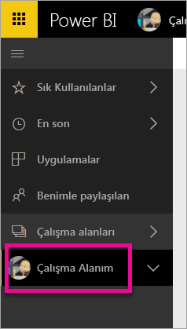
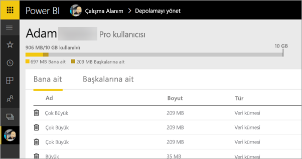
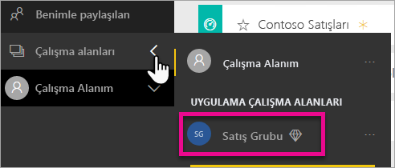
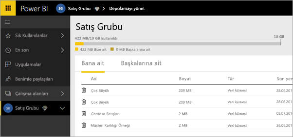
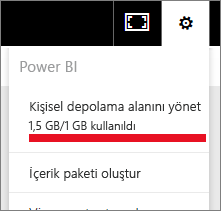
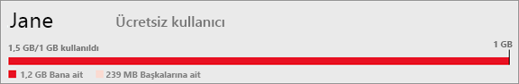
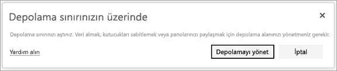

# Veri depolama alanınızı yönetme
Rapor ve veri kümesi yayımlamaya devam edebilmek için bireysel veya uygulama çalışma alanlarınızla veri depolama alanlarınızı nasıl yönetebileceğinizi öğrenin.

Kullanıcı ve uygulama çalışma alanları farklı veri kapasitelerine sahiptir

* Ücretsiz ve Pro sürüm kullanıcıları en fazla 10 GB veri depolama alanına sahip olur.
* Pro sürüm kullanıcıları her biri en fazla 10 GB veri depolama alanına sahip uygulama çalışma alanları oluşturabilir.

Kiracı düzeyinde toplam kullanım, tüm Pro sürüm kullanıcıları ve kiracıdaki tüm uygulama çalışma alanları için Pro sürüm kullanıcısı başına 10 GB'ı aşamaz.

[Power BI fiyatlandırma modelinin](https://powerbi.microsoft.com/pricing) diğer özellikleri hakkında bilgi edinin.

Veri depolama alanınızda kendi veri kümelerinizin ve Excel raporlarınızın yanı sıra sizinle paylaşılan öğeler bulunur. Veri kümeleri Power BI Desktop dosyaları ve kullandığınız Excel çalışma kitapları dahil olmak üzere karşıya yüklediğiniz veya bağlantı kurduğunuz tüm verilerdir. Aşağıdaki öğeler de veri kapasitenize dahil edilir.

* Panolara sabitlenmiş olan Excel aralıkları.
* Power BI panolarına sabitlenmiş olan Reporting Services şirket içi görselleştirmeleri.
* Karşıya yüklenen görüntüler.

Paylaştığınız panoların boyutları, sabitlenmiş öğelere göre değişir. Örneğin, iki farklı veri kümesine ait olan iki raporda bulunan öğeleri sabitlerseniz dosya boyutu iki veri kümesini de içerecektir.

<a name="manage"/>

## Kendinize ait öğeleri yönetme
Power BI hesabınızda kullandığınız depolama alanı miktarını görün ve hesabınızı yönetin.

1. Kendi depolama alanınızı yönetmek için sol gezinti bölmesinde **Çalışma Alanım** sayfasına gidin.
   
    
2. Sağ üst köşedeki dişli simgesini  ve ardından \> **Kişisel depolama alanını yönet**'i seçin.
   
    Üst taraftaki çubukta, depolama alanınızın ne kadarını kullandığınız gösterilir.
   
    
   
    Veri kümeleri ve raporlar iki sekmeye ayrılmıştır:
   
    **Bana ait:** Salesforce ve Dynamics CRM gibi hizmet veri kümeleri dahil olmak üzere Power BI hesabınıza yüklediğiniz raporlar ve veri kümeleridir.  
    **Diğerlerine ait:** Başkalarının sizinle paylaştığı raporlar ve veri kümeleridir.
3. Bir veri kümesini veya raporu silmek için çöp kutusu simgesini  seçin.

Size veya başkalarına ait bazı rapor veya panoların bir veri kümesine bağlı olabileceğini unutmayın. İlgili veri kümesini silerseniz bağlı raporlar ve panolar artık çalışmaz.

## Uygulama çalışma alanınızı yönetme
1. **Çalışma Alanı** \>'nın yanındaki oku ve ardından uygulama çalışma alanının adını seçin.
   
    
2. Sağ üst köşedeki dişli simgesini  ve ardından \> **Grup depolama alanını yönet**'i seçin.
   
    Üst taraftaki çubukta, grup depolama alanınızın ne kadarının kullanıldığı gösterilir.
   
    
   
    Veri kümeleri ve raporlar iki sekmeye ayrılmıştır:
   
    **Bize ait:** Salesforce ve Dynamics CRM gibi hizmet veri kümeleri dahil olmak üzere grubun Power BI hesabına yüklediğiniz veya diğer kullanıcılar tarafından yüklenmiş olan raporlar ve veri kümeleridir.
    **Diğerlerine ait:** Başkalarının grubunuzla paylaştığı raporlar ve veri kümeleridir.
3. Bir veri kümesini veya raporu silmek için çöp kutusu simgesini  seçin.
   
   > [!NOTE]
   > Uygulama çalışma alanında düzenleme izinlerine sahip olan tüm üyeler uygulama çalışma alanındaki veri kümelerini ve raporları silme izinlerine de sahip olur.
   > 
   > 

Size veya gruptaki diğer kullanıcılara ait bazı rapor veya panoların bir veri kümesine bağlı olabileceğini unutmayın. İlgili veri kümesini silerseniz bağlı raporlar ve panolar artık çalışmaz.

## Veri kümesi sınırları
Power BI'a aktarılan her veri kümesi için 1 GB'lık bir sınır söz konusudur. Verileri içeri aktarma yerine Excel deneyimini korumayı tercih ettiyseniz veri kümesi başına 250 MB sınırı geçerli olur.

## Sınıra ulaştığınızda ne olur?
Herhangi bir alandaki kapasite sınırına ulaştığınızda hizmet içinde uyarılar görüntülenir. 

Dişli simgesini  seçtiğinizde, veri kapasitesi sınırınızı aştığınızı belirten bir kırmızı çubuk görürsünüz.

Bu uyarı, **Kişisel depolama alanını yönet** bölümünde de belirtilir.

 

 Sınırlardan birinin aşılmasına neden olacak bir eylem gerçekleştirmeye çalıştığınızda sınırı aştığınızı belirten bir uyarı görüntülenir. Depoladığınız veri miktarını azaltmak ve sınır sorununu ortadan kaldırmak için depolama alanınızı [yönetebilirsiniz](#manage).

 

 Başka bir sorunuz mu var? [Power BI Topluluğu'na sorun](http://community.powerbi.com/)

