# Microsoft Intune ile mobil uygulamaları yapılandırma

Microsoft Intune, kuruluşların cihazları ve uygulamaları yönetmesine olanak sağlar. iOS ve Android için Power BI mobil uygulamaları Intune ile tümleştirilmiştir. Bu tümleştirme sayesinde cihazlarınızdaki uygulamayı yönetebilir ve güvenlik denetimi gerçekleştirebilirsiniz. Yapılandırma ilkeleri aracılığıyla erişim PIN'i gerektirme, verilerin uygulama tarafından işlenme şekli ve hatta uygulama kullanılmadığı sırada uygulama verilerini şifreleme gibi öğeleri denetleyebilirsiniz.

## Genel mobil cihaz yönetim yapılandırması

Bu makalede Intune'un düzgün yapılandırıldığı ve Intune'da kayıtlı cihazlarınızın bulunduğu varsayılmaktadır. Bu makale, Microsoft Intune için tam kapsamlı bir yapılandırma kılavuzu olarak hazırlanmamıştır. Intune hakkında daha fazla bilgi için bkz. [Intune nedir?](/intune/introduction-intune/).

Microsoft Intune, Office 365'te Mobil Cihaz Yönetimi (MDM) ile birlikte bulunabilir. MDM'yi kullanıyorsanız cihaz, MDM'de kayıtlı olarak görünür ancak Intune'da yönetilebilir.

> [!NOTE]
> Intune'u yapılandırdıktan sonra iOS veya Android cihazınızda Power BI mobil uygulaması için arka planda veri yenileme özelliği kapatılır. Uygulamaya girdiğinizde Power BI, web üzerindeki Power BI hizmetinden verileri yeniler.

## 1. Adım: Uygulamanın URL'sini alma

Intune'da uygulamayı oluşturmadan önce uygulamaların URL'lerini almamız gerekir. iOS cihazları için URL'leri iTunes'dan alırız. Android cihazlar için ise URL'leri Power BI mobil sayfasından alabilirsiniz.

Uygulamayı oluştururken ihtiyaç duyacağımız için URL'yi kaydedin.

### iOS URL'sini alma

iOS için uygulama URL'sini iTunes'dan almamız gerekir.

1. iTunes'u açın.

1. *Power BI* için arama yapın.

1. **iPhone Uygulamaları** ve **iPad Uygulamaları** altında **Microsoft Power BI**'ı görmeniz gerekir. Aynı URL'yi alacağınız için bunlardan herhangi birini kullanabilirsiniz.

1. **Al** açılan listesini ve **Bağlantıyı Kopyala**'yı seçin.

    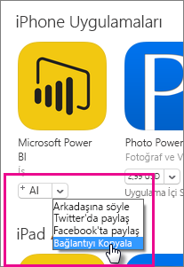

Şuna benzer olmalıdır: *https://itunes.apple.com/us/app/microsoft-power-bi/id929738808?mt=8*.

### Android URL'sini alma

[Power BI mobil sayfasını](https://powerbi.microsoft.com/mobile/) kullanarak Google Play URL'sini alabilirsiniz. **Google Play'den indirin**'i seçtiğinizde uygulama sayfasına yönlendirilirsiniz. Tarayıcınızın adres çubuğundan URL'yi kopyalayabilirsiniz. Şuna benzer olmalıdır: *https://play.google.com/store/apps/details?id=com.microsoft.powerbim*.

## 2. Adım: Mobil uygulama yönetim ilkesi oluşturma

Mobil uygulama yönetimi ilkesi sayesinde erişim PIN'i gibi öğeleri zorunlu tutabilirsiniz. Intune portalında bir ilke oluşturabilirsiniz.

İlk olarak uygulamayı veya ilkeyi oluşturmayı tercih edebilirsiniz. Eklenme sıraları önemli değildir. Dağıtım adımı için ikisinin de mevcut olması yeterlidir.

1. Intune portalında **İlke** > **Yapılandırma İlkeleri**'ni seçin.

    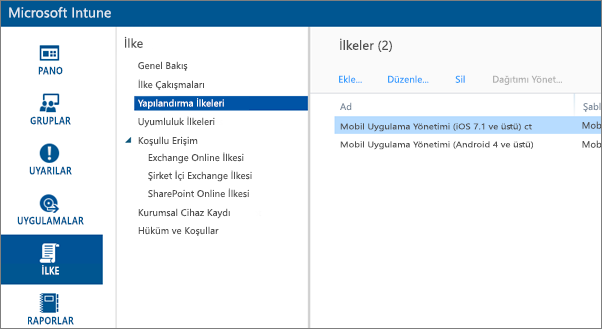

1. **Ekle...**'yi seçin.

1. **Yazılım** bölümünde Android veya iOS için Mobil Uygulama Yönetimi seçeneğini belirleyebilirsiniz. Hemen başlamak için, **Önerilen Ayarlarla İlke Oluştur**'u seçebilir veya özel bir ilke oluşturabilirsiniz.

1. Uygulamada istediğiniz kısıtlamaları yapılandırmak için ilkeyi düzenleyin.

## 3. Adım: Uygulamayı oluşturma

Uygulama, dağıtım için Intune'a kaydedilen bir başvuru veya pakettir. Bir uygulama oluşturmamız ve Google Play'den veya iTunes'dan aldığımız uygulama URL'sine başvurmamız gerekir.

İlk olarak uygulamayı veya ilkeyi oluşturmayı tercih edebilirsiniz. Eklenme sıraları önemli değildir. Dağıtım adımı için ikisinin de mevcut olması yeterlidir.

1. Intune portalına gidin ve soldaki menüden **Uygulamalar**'ı seçin.

1. **Uygulama Ekle**'yi seçin. Bu işlem, **Yazılım Ekle** uygulamasını başlatır.

### iOS için oluşturma

1. Açılan listeden **Uygulama Mağazası'ndan Yönetilen iOS Uygulaması**'nı seçin.

1. [1. Adım](#step-1-get-the-URL-for-the-application)'da aldığımız uygulama URL'sini girin ve **Sonraki** seçeneğini belirleyin.

    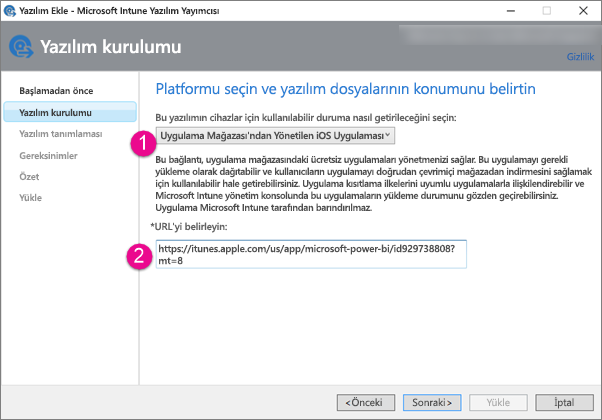

1. Bir **Yayımcı**, **Ad** ve **Açıklama** girin. İsteğe bağlı olarak bir **Simge** de belirleyebilirsiniz. **Kategori** alanı, Şirket Portalı uygulamasına yöneliktir. İşiniz bittiğinde **İleri**'yi seçin.

1. Uygulamayı **Herhangi bir** (varsayılan), **iPad** veya **iPhone** seçeneklerinden birini belirleyerek yayımlamayı tercih edebilirsiniz. Varsayılan olarak, **Herhangi bir** seçeneği belirlenmiştir ve her iki cihaz türü için de kullanılabilir. Power BI uygulamasının URL'si iPhone ve iPad için aynıdır. **Sonraki** seçeneğini belirleyin.

1. **Karşıya Yükle**'yi seçin.

1. Uygulamayı listede görmüyorsanız sayfayı yenileyin: **Genel Bakış**'a, sonra yeniden **Uygulamalar**'a gidin.

    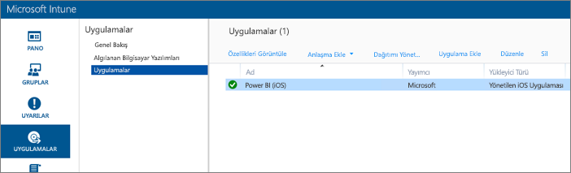

### Android için oluşturma

1. Açılan listeden **Dış Bağlantı**'yı seçin.

1. [1. Adım](#step-1-get-the-URL-for-the-application)'da aldığımız uygulama URL'sini girin ve **Sonraki** seçeneğini belirleyin.

    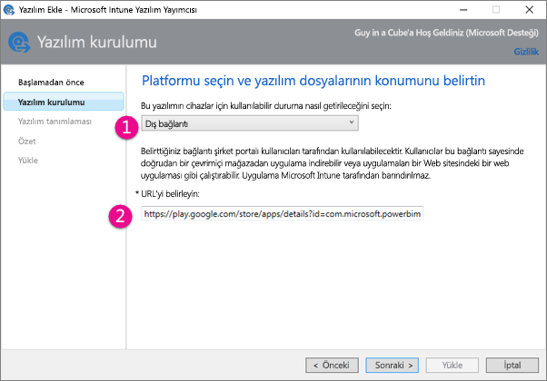

1. Bir **Yayımcı**, **Ad** ve **Açıklama** girin. İsteğe bağlı olarak bir **Simge** de belirleyebilirsiniz. **Kategori** alanı, Şirket Portalı uygulamasına yöneliktir. İşiniz bittiğinde **İleri**'yi seçin.

1. **Karşıya Yükle**'yi seçin.

1. Uygulamayı listede görmüyorsanız sayfayı yenileyin: **Genel Bakış**'a, sonra yeniden **Uygulamalar**'a gidin.

    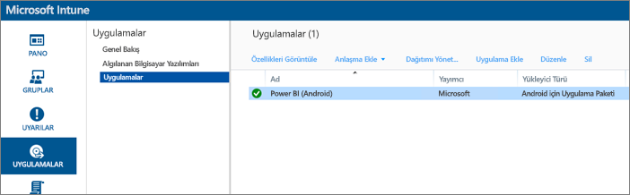

## 4. Adım: Uygulamayı dağıtma

Uygulamayı ekledikten sonra, son kullanıcılarınızın kullanabilmesi için dağıtmanız gerekir. Bu, oluşturduğunuz ilkeyi uygulamaya bağlayacağınız adımdır.

### iOS için dağıtma

1. Uygulamalar ekranında, oluşturduğunuz uygulamayı seçin. Ardından, **Dağıtımı Yönet...** bağlantısını seçin.

    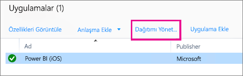

1. **Grup Seç** ekranında, bu uygulamayı dağıtmak istediğiniz grupları seçebilirsiniz. **İleri**'yi seçin.

1. **Dağıtım Eylemi** ekranında, bu uygulamayı nasıl dağıtmak istediğinizi seçebilirsiniz. **Kullanılabilir Yükleme** veya **Gerekli Yükleme** seçenekleri arasında yapılacak tercih, uygulamanın kullanıcılar tarafından isteğe bağlı olarak yüklenmesi için Şirket Portalı'nda bulunmasını sağlar. Seçiminizi yaptıktan sonra, **İleri**'yi seçin.

    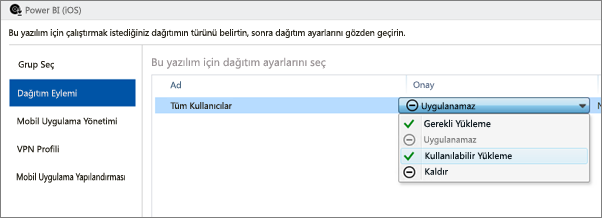

1. **Mobil Uygulama Yönetimi** ekranında, [2. Adım](#step-2-create-a-mobile-application-management-policy)'da oluşturduğumuz Mobil Uygulama Yönetimi ilkesini seçebilirsiniz. Mevcut tek iOS ilkesi olması halinde, oluşturduğunuz ilke varsayılan olarak kullanılır. **Sonraki** seçeneğini belirleyin.

    

1. Kuruluşunuza yönelik bir ilke varsa **VPN Profili** ekranında bunu seçebilirsiniz. Varsayılan olarak **Yok** seçeneği belirlenir. **İleri**'yi seçin.

1. **Mobil Uygulama Yapılandırması** ekranında, bir **Uygulama Yapılandırma İlkesi** (oluşturduysanız) seçebilirsiniz. Varsayılan olarak **Yok** seçeneği belirlenir. Bu gerekli değildir. **Son**'u seçin.

Uygulamayı dağıttıktan sonra, uygulamalar sayfasındaki Dağıtıldı bölümünde **Evet** seçeneğinin gösterilmesi gerekir.

### Android için dağıtma

1. Uygulamalar ekranında, oluşturduğunuz uygulamayı seçin. Ardından, **Dağıtımı Yönet...** bağlantısını seçin.

    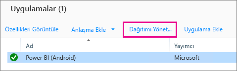
1. **Grup Seç** ekranında, bu uygulamayı dağıtmak istediğiniz grupları seçebilirsiniz. **İleri**'yi seçin.

1. **Dağıtım Eylemi** ekranında, bu uygulamayı nasıl dağıtmak istediğinizi seçebilirsiniz. **Kullanılabilir Yükleme** veya **Gerekli Yükleme** seçenekleri arasında yapılacak tercih, uygulamanın kullanıcılar tarafından isteğe bağlı olarak yüklenmesi için Şirket Portalı'nda bulunmasını sağlar. Seçiminizi yaptıktan sonra, **İleri**'yi seçin.

    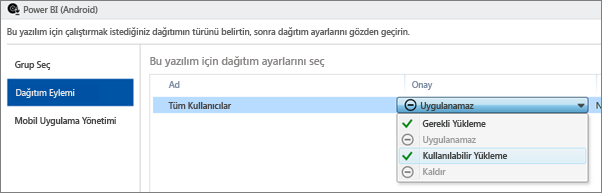

1. **Mobil Uygulama Yönetimi** ekranında, [2. Adım](#step-2-create-a-mobile-application-management-policy)'da oluşturduğumuz Mobil Uygulama Yönetimi ilkesini seçebilirsiniz. Kullanılabilir tek Android ilkesi ise oluşturduğunuz ilkeyi varsayılan olarak kullanır. **Son**'u seçin.

    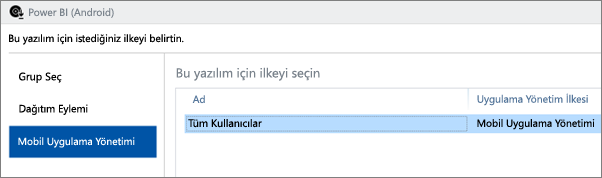

Uygulamayı dağıttıktan sonra, uygulamalar sayfasındaki Dağıtıldı bölümünde **Evet** seçeneğinin gösterilmesi gerekir.

## 5 Adım: Uygulamayı bir cihaza yükleme

Uygulamayı, *Şirket Portalı* uygulaması aracılığıyla yüklersiniz. Şirket Portalı uygulamasını henüz yüklemediyseniz iOS veya Android platformundaki uygulama mağazasını kullanarak edinebilirsiniz. Şirket Portalı'nda oturum açmak için kurumsal oturum açma bilgilerinizi kullanırsınız.

1. Şirket Portalı uygulamasını açın.

1. Listelenen uygulamalar arasında Power BI uygulamasını görmüyorsanız **Şirket Uygulamaları**'nı açın.

    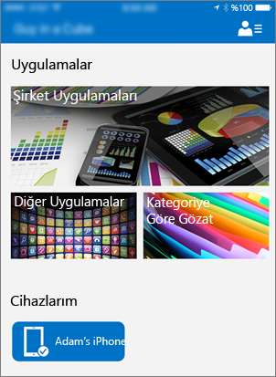

1. Dağıttığınız Power BI uygulaması seçin.

    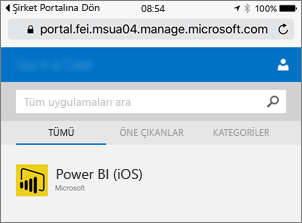

1. **Yükle**'yi seçin.

    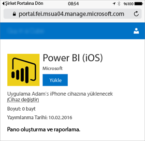

1. iOS kullanıyorsanız uygulama size iletilir. Gönderim iletişim kutusundaki **Yükle**'yi seçin.

    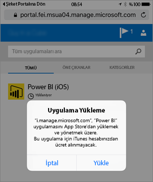

1. Uygulama yüklendikten sonra, bunun **Şirketiniz tarafından yönetilen** bir uygulama olduğunu görürsünüz. İlkede PIN kullanarak erişimi etkinleştirdiyseniz aşağıdaki ekranla karşılaşırsınız.

    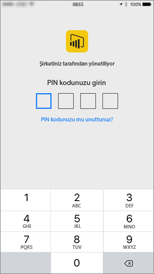

## Sonraki adımlar

[Configure and deploy mobile application management policies in the Microsoft Intune console (Microsoft Intune konsolunda mobil uygulama yönetimi ilkelerini yapılandırma ve dağıtma)](/intune/app-protection-policies/)  

[Mobil cihazlar için Power BI uygulamaları](consumer/mobile/mobile-apps-for-mobile-devices.md)  

Başka bir sorunuz mu var? [Power BI Topluluğu'na sorun](http://community.powerbi.com/)  