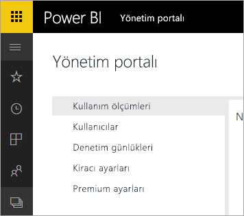

# Office 365 için Power BI kullanımdan kaldırıldı
Power BI'ın önceki bir sürümü olan Office 365 için Power BI'dan [Power BI](https://powerbi.microsoft.com)'ın güncel sürümüne geçiş yapıldı. Daha önce **Office 365 için Power BI**'ı kullanan kullanıcılar Power BI'ın güncel sürümünü kullanabilir. [Power BI hakkında daha fazla bilgi edinebilirsiniz](service-get-started.md).

## Yönetici portalı
**Office 365 için Power BI** Yönetici portalına artık erişilememektedir. Yöneticiler, kuruluşlarının Power BI aboneliğini yönetmek için yeni [Yönetici portalı](https://app.powerbi.com/admin-portal)'nı kullanabilir.

Daha fazla bilgi için bkz. [Power BI yönetici portalı](service-admin-portal.md).

## Sonraki adımlar
[Power BI ile çalışmaya başlama](service-get-started.md)

[Power BI Desktop ile çalışmaya başlama](desktop-getting-started.md)

[Kuruluşunuzda Power BI'ı yönetme](service-admin-administering-power-bi-in-your-organization.md)
