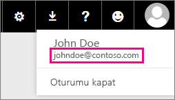

# Office 365 Dedicated müşterileri - bilinen sorunlar
Artık Office 365 Dedicated müşterileri için Power BI desteği sunulmaktadır.  O365 Dedicated müşterisiyseniz kiracınıza ait bir hesaptan oturum açabilir ve Power BI'ı kullanabilirsiniz. Şu anda bilinen iki sorun vardır.

## Gruplar
Grup bağlam menüsünde **Üyeler** veya **Takvim** seçeneğini belirlediğinizde Posta uygulamasına yönlendirilirsiniz.  **Dosyalar** ve **Konuşmalar** beklenen şekilde çalışır.

## iPhone Uygulaması - Özel etki alanıyla oturum açtığınızda hata oluşur
iPhone uygulamasında özel etki alanına sahip bir kullanıcı adıyla oturum açtığınızda hatayla karşılaşabilirsiniz.

*Oturum Açma hatası*  
*Beklenmeyen bir iç hata oluştu. Lütfen tekrar deneyin.*

Bu sorunu geçici olarak çözmek için; özel etki alanı yerin,e Power BI hizmetindeki kullanıcı simgesine tıkladığınızda açılan e-posta adresiyle oturum açın.

Başka bir sorunuz mu var? [Power BI Topluluğu'na başvurun](https://community.powerbi.com/)

