# Power BI'ı yönetim portalında yönetme

Yönetici portalı kuruluşunuz için bir Power BI *kiracısını* yönetmenize olanak sağlar. Portal; kullanım ölçümleri, Microsoft 365 yönetim merkezine erişim ve ayarlar gibi öğeleri içerir.

Tam yönetici portalı, Office 365’te Genel Yönetici olan veya kendilerine Power BI hizmeti yöneticisi rolü atanmış tüm kullanıcılar için erişilebilir durumdadır. Bu rollerden birinde değilseniz portalda yalnızca **Kapasite ayarlarını** görürsünüz. Power BI hizmet yöneticisi rolü ile ilgili daha fazla bilgi için bkz. [Power BI yönetici rolünü anlama](service-admin-role.md).

## Yönetici portalına ulaşma

Power BI yönetici portalına erişebilmeniz için hesabınızın, Office 365 veya Azure Active Directory’de (Azure AD) **Genel Yönetici** olarak işaretlenmiş olması veya hesabınıza Power BI hizmet yöneticisi rolünün atanmış olması gerekir. Power BI hizmet yöneticisi rolü ile ilgili daha fazla bilgi için bkz. [Power BI yönetici rolünü anlama](service-admin-role.md). Power BI yönetici portalına ulaşmak için aşağıdakileri yapın.

1. Power BI hizmetinin sağ üst tarafındaki ayarlar dişli simgesini seçin.

1. **Yönetici portalı**’nı seçin.

    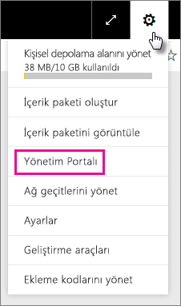

Portalda dokuz sekme vardır. Bu makalenin kalan bölümünde bu sekmelerden her biriyle ilgili bilgiler sağlanır.

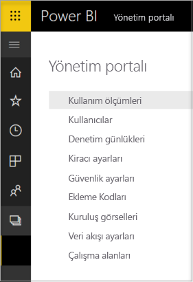

* [Ölçümleri kullanma](#usage-metrics)
* [Kullanıcılar](#users)
* [Denetim günlükleri](#audit-logs)
* [Kiracı ayarları](#tenant-settings)
* [Kapasite ayarları](#capacity-settings)
* [Ekleme kodları](#embed-codes)
* [Kuruluş görselleri](#organizational-visuals)
* [Veri akışı depolama (önizleme)](#dataflowStorage)
* [Çalışma alanları](#workspaces)
* [Özel marka](#custom-branding)

## Ölçümleri kullanma

**Kullanım ölçümleri** kuruluşunuz için Power BI kullanımını izlemenizi sağlar. Ayrıca kuruluşunuz için Power BI'da en etkin olan kullanıcıları ve grupları görme olanağı da sunar. 

> [!NOTE]
> Panoya ilk kez eriştiğinizde veya panoyu görüntülemeniz üzerinden uzun bir süre geçtikten sonra panoyu tekrar ziyaret ettiğinizde, biz panoyu yüklerken büyük olasılıkla bir yükleme ekranıyla karşılaşırsınız.

Pano yüklendikten sonra iki kutucuk bölümü görürsünüz. İlk bölüm, farklı kullanıcılar hakkındaki kullanım verilerini, ikinci bölüm ise kuruluşunuzdaki gruplara yönelik benzer bilgileri içerir.

Aşağıda, her kutucukta görebileceklerinize ilişkin bir döküm verilmiştir:

* Kullanıcı çalışma alanındaki tüm panoların, raporların ve veri kümelerinin ayrı sayımı.
  
    

* Erişebilen kullanıcıların sayısına göre en fazla kullanılan pano. Örneğin, 3 kullanıcıyla paylaştığınız bir pano varsa ve bu panoyu iki farklı kullanıcının bağlı olduğu bir içerik paketine de eklediyseniz, panonun sayımı 6 (1 + 3 + 2) şeklinde olur.
  
    

* Kullanıcıların bağlı olduğu en popüler içerikler. Bu, kullanıcıların Veri Al işlemiyle ulaşabileceği herhangi bir şey (SaaS içerik paketleri, Kurumsal içerik paketleri, dosyalar veya veritabanları) olabilir.
  
    

* En fazla panoya sahip (hem kendi oluşturdukları hem de kendileriyle paylaşılan panolar) kullanıcılarınızın bir görünümü.
  
    

* En fazla rapora sahip kullanıcılarınızın bir görünümü.
  
    

İkinci bölüm aynı türde bilgileri grup temelinde gösterir. Bu, kuruluşunuzdaki en etkin grupları ve bu grupların kullandığı içerik türünü öğrenmenize olanak tanır.

Bu bilgilerle kişilerin kuruluşunuzdaki Power BI’ı nasıl kullandığına ilişkin gerçek içgörüler elde edebilir ve kuruluşunuzda oldukça etkin olan bu kullanıcıları ve grupları tanıyabilirsiniz.

## Kullanım ölçümlerini denetleme

Kullanım ölçümleri raporları, Power BI veya Office 365 yöneticileri tarafından etkinleştirilip devre dışı bırakılabilecek bir özelliktir. Yöneticiler, hangi kullanıcıların kullanım ölçümlerine erişebileceği konusunda ayrıntılı bir denetime sahiptir. Bunlar kuruluştaki tüm kullanıcılar için varsayılan olarak **Açık**'tır.

Yöneticiler içerik oluşturucuların kullanım ölçümlerinde kullanıcı başına verileri görüp göremeyeceğini de belirleyebilir. 

Raporlar hakkındaki ayrıntılar için bkz. [Power BI panoları ve raporları için kullanım ölçümlerini izleme](service-usage-metrics.md).

### İçerik oluşturucuları için kullanım ölçümleri

1. Yönetim portalında **Kiracı ayarları** > **İçerik oluşturucuları için kullanım ölçümleri**'ni seçin.

    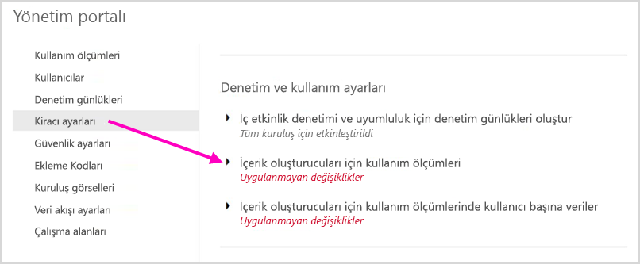

1. Kullanım ölçümlerini etkinleştirin (veya devre dışı bırakın) > **Uygula**'yı seçin.

    

### Kullanım ölçümlerinde kullanıcı başına veriler

Varsayılan olarak, kullanım ölçümleri için kullanıcı başına veriler etkinleştirilir ve içerik tüketicisinin hesap bilgileri ölçüm raporuna eklenir. Kullanıcılardan bazıları veya tümü için bu bilgilerin eklenmesini istemezsiniz, belirtilen güvenlik grupları veya kuruluşun tamamı için özelliği devre dışı bırakın. Bu durumda hesap bilgileri raporda *Adsız* olarak gösterilir.

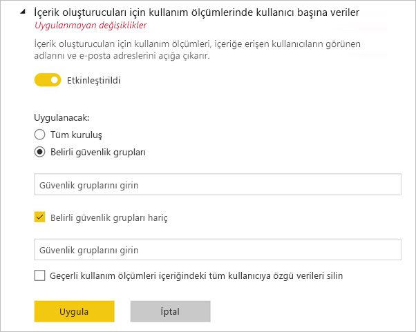

### Tüm mevcut kullanım ölçümleri içeriğini silme

Yöneticiler kuruluşun tamamı için kullanım ölçümlerini devre dışı bırakırken aşağıdaki seçeneklerden birini veya her ikisini seçebilir:

- **Tüm mevcut kullanım ölçümleri içeriğini silin** seçeneği kullanım ölçümleri raporları ve veri kümeleri kullanılarak oluşturulmuş tüm mevcut raporları ve pano kutucuklarını silmek için kullanılır. Bu seçenek, kullanmakta olanlar dahil olmak üzere kuruluştaki tüm kullanıcılar için kullanım ölçümlerine yönelik erişimi kaldırır. 
- **Geçerli kullanım ölçümleri içeriğindeki tüm kullanıcıya özgü verileri silin** seçeneği kuruluşta bunları kullanıyor olabilecek tüm kullanıcılar için kullanıcı başına verilere erişimi kaldırır. 

Mevcut kullanım ve kullanıcı başına ölçümleri içeriğini silme işlemi geri alınamadığından dikkatli hareket etmeniz önerilir.

## Kullanıcılar

Power BI kullanıcılarını, gruplarını ve yöneticilerini Microsoft 365 yönetim merkezinde yönetirsiniz. **Kullanıcılar** sekmesi, kiracınız için yönetim merkezine bağlantı sağlar.

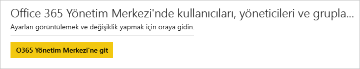

## Denetim günlükleri

Power BI denetim günlüklerini Office 365 Güvenlik ve Uyumluluk merkezinde yönetirsiniz. **Denetim günlükleri** sekmesi, kiracınız için Güvenlik ve Uyumluluk merkezine bağlantı sağlar. [Daha fazla bilgi](service-admin-auditing.md)

Denetim günlüklerini kullanmak için [**İç etkinlik denetimi ve uyumluluk için denetim günlükleri oluşturun**](#create-audit-logs-for-internal-activity-auditing-and-compliance) ayarının etkinleştirilmiş olduğundan emin olun.

## Kiracı ayarları

**Kiracı ayarları** sekmesi, kuruluşunuzun kullanımına sunulan özellikler üzerinde çok ayrıntılı bir denetime olanak tanır. Gizli verilerle ilgili endişeleriniz varsa, sunduğumuz belirli özellikler kuruluşunuz için uygun olmayabilir veya belirli bir özelliğin yalnızca belirli bir grubun kullanımına sunulmasını isteyebilirsiniz.

Aşağıdaki resimde **Kiracı ayarları** sekmesinin birkaç ayarı gösterilir.

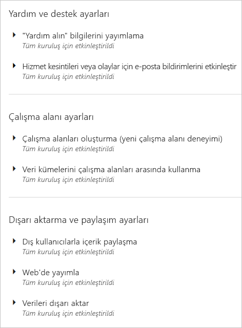

> [!NOTE]
> Ayar değişikliğinin kiracınızdaki herkes için geçerlilik kazanması 10 dakika kadar sürebilir.

Ayarlar üç duruma sahip olabilir:

* **Tüm kuruluş için devre dışı bırakıldı**: Kuruluşunuzda kimse bu özelliği kullanamaz.

    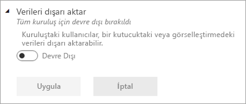

* **Tüm kuruluş için etkinleştirildi**: Kuruluşunuzdaki herkes bu özelliği kullanabilir.

    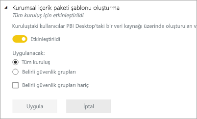

* **Kuruluşun bir alt kümesi için etkinleştirildi**: Kuruluşunuzdaki kullanıcıların veya grupların belirli bir alt kümesi bu özelliği kullanabilir.

    Özelliği, belirli bir kullanıcı grubunu hariç tutarak tüm kuruluşunuz için etkinleştirebilirsiniz.

    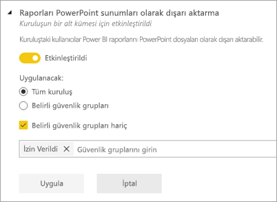

    Ayrıca özelliği yalnızca belirli bir kullanıcı grubu için etkinleştirip başka bir kullanıcı grubu için devre dışı bırakabilirsiniz. Bu yaklaşımın kullanılması, izin verilen grupta olsalar bile belirli kullanıcıların özelliğe erişmemesini sağlar.

    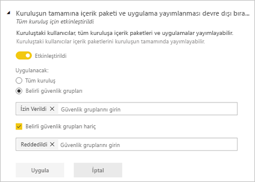

Aşağıdaki bölümlerde kiracı ayarlarının farklı türleri için genel bakışa yer verilmiştir.

## Yardım ve destek ayarları

### “Yardım alın” bilgilerini yayımlama

Kuruluştaki kullanıcılar, Power BI yardım menüsünden iç yardıma ve destek kaynaklarına gidebilir. Özellikle, bu parametreler Öğrenme, Topluluk ve Yardım alın menü öğelerinin davranışını değiştirir.

Ayrıca lisans istekleri için URL'yi belirterek **Hesabı yükselt** düğmesinin hedef URL'sini özelleştirirsiniz. Power BI Pro lisansı olmayan kullanıcılar bu düğmeyi hem **Power BI Pro'ya Yükselt** iletişim kutusunda hem de **Kişisel depolama alanını yönet** sayfasında görür. Üstelik Power BI artık bu iletişim kutusunda veya depolama sayfasında **Pro'yu ücretsiz deneyin** düğmesini sağlamaz. Bu sayede lisans yönetim çözümü aracılığıyla Power BI kuruluşunuzda tanımlanan süreçlerde kullanıcılarınıza güvenli bir şekilde yol gösterebilir.

### Hizmet kesintileri veya olaylara yönelik e-posta bildirimlerini etkinleştir

Bu kiracı bir hizmet kesintisinden veya olaydan etkilenirse posta etkin güvenlik grupları e-posta bildirimleri alır. [Hizmet kesintisi bildirimleri](service-interruption-notifications.md) hakkında daha fazla bilgi edinin.

## Çalışma alanı ayarları

Yönetici portalının **Kiracı ayarları** bölümünde çalışma alanlarını denetlemeye yönelik iki bölüm vardır:

- Yeni çalışma alanı deneyimi oluşturma.
- Veri kümelerini çalışma alanları arasında kullanma.

### Yeni çalışma alanları oluşturma

Çalışma alanları kullanıcıların panolar, raporlar ve diğer içerikler üzerinde işbirliği yapabileceği alanlardır. Yöneticiler, kuruluştaki hangi kullanıcıların çalışma alanı oluşturabileceğini belirtmek için **Çalışma alanı oluştur (yeni çalışma alanı deneyimi)** ayarını kullanır. Yöneticiler kuruluştaki kişilerin tümüne yeni çalışma alanı deneyimi oluşturma izni verebilir veya hiçbirine vermeyebilir. Ayrıca çalışma alanı oluşturmayı belirli güvenlik gruplarının üyeleriyle de sınırlayabilir. [Çalışma alanları](service-new-workspaces.md) hakkında daha fazla bilgi edinin.

:::image type="content" source="media/service-admin-portal/power-bi-admin-workspace-settings.png" alt-text="Yeni çalışma alanı deneyimi oluşturma":::

Office 365 Gruplarını temel alan klasik çalışma alanlarında yönetim yine Office 365 yönetim portalında ve Azure Active Directory'de gerçekleşir.

> [!NOTE]
> **Çalışma alanları oluşturma (yeni çalışma alanı deneyimi)** ayarının varsayılan değeri yalnızca Office 365 Grupları oluşturabilen kullanıcılara yeni Power BI çalışma alanları oluşturma izni verilmesidir. Power BI yönetim portalında uygun kullanıcıların bu öğeleri oluşturabilmesini sağlayacak bir değer ayarlamaya dikkat edin.

**Çalışma alanlarının listesi**

Yönetici portalında, kiracınızda bulunan çalışma alanları hakkında başka bir ayarlar bölümü bulunur. Bu bölümde, çalışma alanları listesini filtreleyebilir, sıralayabilir ve her çalışma alanının ayrıntılarını görüntüleyebilirsiniz. Ayrıntılar için bu makalenin [Çalışma alanları](#workspaces) bölümüne bakın.

**İçerik paketlerini ve uygulamaları yayımlama**

Yönetici portalında, hangi kullanıcıların kuruluş uygulamalarını dağıtmak için izinleri olduğunu da denetlersiniz. Ayrıntılar için bu makalenin [Tüm kuruluşa içerik paketleri ve uygulamalar yayımlama](#publish-content-packs-and-apps-to-the-entire-organization) bölümüne bakın.

### Veri kümelerini çalışma alanları arasında kullanma

Yöneticiler, kuruluştaki hangi kullanıcıların veri kümelerini farklı çalışma alanlarında kullanabileceğini denetleyebilir. Bu ayar etkinleştirildiğinde de kullanıcılar, belirli bir veri kümesi için gerekli Oluşturma iznine ihtiyaç duyar.

:::image type="content" source="media/service-admin-portal/power-bi-admin-datasets-workspaces.png" alt-text="Veri kümelerini çalışma alanları arasında kullanma":::

Daha fazla bilgi için bkz. [Çalışma alanları arasında veri kümelerine giriş](service-datasets-across-workspaces.md).

## Dışarı aktarma ve paylaşım ayarları

### Dış kullanıcılarla içerik paylaşma

Kuruluştaki kullanıcılar, kuruluş dışındaki kullanıcılarla panoları, raporları ve uygulamaları paylaşabilir. [Dış paylaşım](service-share-dashboards.md#share-a-dashboard-or-report-outside-your-organization) hakkında daha fazla bilgi edinin.

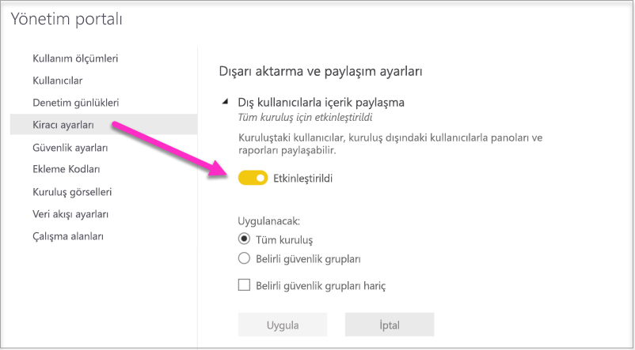

Aşağıdaki resimde bir dış kullanıcıyla paylaştığınızda görünen ileti gösterilir.

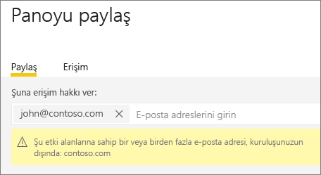  

> [!IMPORTANT]
> Bu seçenek, Power BI’daki kullanıcıların Power BI aracılığıyla dış kullanıcıları Azure Active Directory B2B (Azure AD B2B) konuk kullanıcıları olmaları için davet edip edemeyeceklerini denetler. Etkinleştirildiğinde, Azure AD’de Konuk Davet Eden rolüne sahip olan kullanıcılar rapor, pano ve Power BI uygulamaları paylaşırken dış e-posta adresleri ekleyebilir. Dış alıcı, kuruluşunuza bir Azure AD B2B konuk kullanıcısı olarak katılmaya davet edilir. Daha da önemlisi, bu ayar devre dışı bırakılırken kuruluşunuzda zaten Azure AD B2B konuk kullanıcıları olan dış kullanıcılar Power BI’daki kişi seçicisi kullanıcı arabiriminde görünmeye devam eder ve bu kişilere öğe, çalışma alanı ve uygulama erişimi verilebilir.

### Web'de yayımla

**Web’de yayımla** ayarı bir Power BI kiracısının yöneticisi olarak, raporları web’de yayımlamak için ekleme kodu oluşturabilecek kullanıcıları seçmenizi sağlar. Bu işlev, raporu ve verilerini web’deki herkesin kullanımına sunar. [Web’de yayımlama](service-publish-to-web.md) hakkında daha fazla bilgi edinin.

> [!NOTE]
> Yeni web’de yayımlama ekleme kodları oluşturma işlemine yalnızca Power BI yöneticileri izin verebilir. Kuruluşların mevcut ekleme kodları olabilir. Yayımlanmış raporları gözden geçirmek için yönetici portalının [Ekleme kodları](service-admin-portal.md#embed-codes) bölümüne göz atın.

Aşağıdaki resimde, **Web’de yayımla** ayarı etkinleştirildiğinde raporun **Diğer seçenekler (...)** menüsü gösterilir.

Yönetici portalındaki **Web’de yayımla** ayarı, kullanıcıların ekleme kodları oluşturabileceği seçenekler sunar.

Yöneticiler **Web’de yayımlama** ayarını **Etkin**, **Ekleme kodlarının nasıl çalışacağını seçme** ayarını ise **Yalnızca mevcut ekleme kodlarına izin ver** olarak belirleyebilir. Bu durumda kullanıcılar ekleme kodları oluşturabilir, ancak izin vermesi için Power BI yöneticisine ulaşmaları gerekir.

Kullanıcılar **Web’de yayımla** ayarına göre kullanıcı arabiriminde farklı seçeneklerle karşılaşır.

|Özellik |Tüm kuruluş için etkindir |Tüm kuruluş için devre dışıdır |Belirli güvenlik grupları   |
|---------|---------|---------|---------|
|Raporun **Diğer seçenekler (...)** menüsündeki **Web'de yayımla** seçeneği|Tüm kullanıcılar için etkindir|Herkes için görünmez|Yalnızca yetkili kullanıcılar veya gruplar için görünür.|
|**Ayarlar** bölümündeki **Ekleme kodlarını yönet** seçeneği|Tüm kullanıcılar için etkindir|Tüm kullanıcılar için etkindir|Tüm kullanıcılar için etkindir  * **Sil** seçeneği yalnızca yetkili kullanıcılar veya gruplar için görünür. * **Kod al** seçeneği tüm kullanıcılar için etkindir.|
|Yönetici portalındaki **Ekleme kodları** seçeneği|Durum olarak şunlardan biri görüntülenir: * Etkin * Desteklenmiyor * Engellendi|Durum **Devre dışı** görünür|Durum olarak şunlardan biri görüntülenir: * Etkin * Desteklenmiyor * Engellendi  Bir kullanıcı, kiracı ayarına göre yetkilendirilmemişse durum, **İhlal edildi** olarak görüntülenir.|
|Mevcut yayımlanmış raporlar|Tümü etkindir|Tümü devre dışıdır|Raporlar tüm kullanıcılar için görünür olmaya devam eder.|

### Verileri dışarı aktarma

Kuruluştaki kullanıcılar, bir kutucuktaki veya görselleştirmedeki verileri dışarı aktarabilir. Bu, Excel’de Çözümle, .csv dosyasına aktar, veri kümesi indirmeleri (.pbix) ve Power BI Hizmeti Live Connect özelliklerini denetler. [Kutucuktaki veya görseldeki verileri dışarı aktarma](visuals/power-bi-visualization-export-data.md) hakkında daha fazla bilgi edinin.

>[!NOTE]
> Excel’e Aktar ayarı sunulmadan önce verilerin Excel dosyalarına aktarılmasını da bu ayar denetliyordu. Ayrıntılar için [Excel’e Aktar seçeneğinin altında yer alan nota](#export-to-excel) bakın.

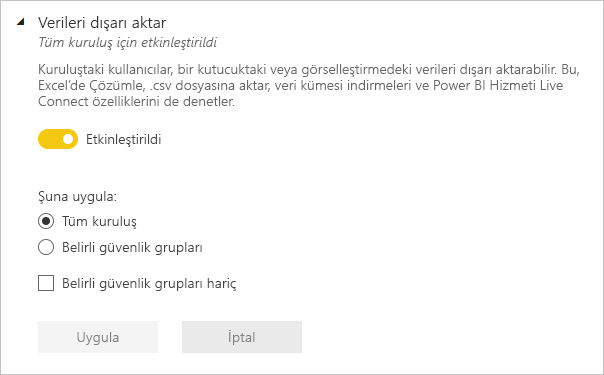

Aşağıdaki resimde kutucuktaki verileri dışarı aktarma seçeneği gösterilir.

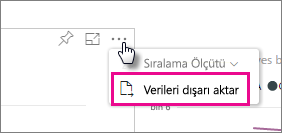

> [!NOTE]
> **Verileri dışarı aktar** seçeneğinin devre dışı bırakılması, kullanıcıların [Excel'de Çözümle](service-analyze-in-excel.md) özelliğini ve Power BI hizmeti canlı bağlantısını kullanmasını da önler.

### Excel'e aktar

Kuruluştaki kullanıcılar, görselleştirmedeki verileri bir Excel dosyasına aktarabilir.

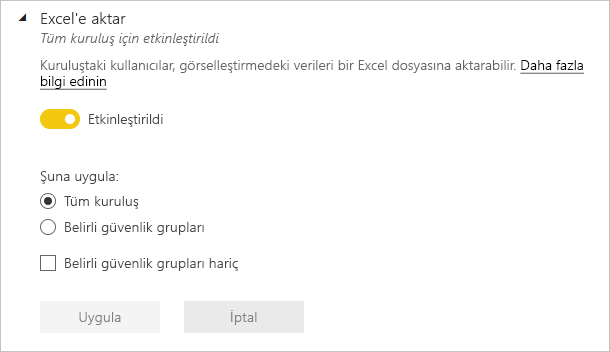

>[!IMPORTANT]
> Excel’e Aktar ayarı sunulmadan önce verilerin Excel dosyalarına aktarılmasını da bu ayar denetliyordu. Bu nedenle, kiracı yöneticileri Excel’e Aktar ayarı sunulmadan önce oluşturulan kiracılarda Excel’e Aktar ayarına ilk kez baktığında, bunun *Uygulanmamış değişikler* içerdiğini görür. Yeni ayarın etkili olması için bu değişiklikleri uygulamaları gerekir. Aksi takdirde, Verileri dışarı aktar ayarı Excel dosyasına aktarma özelliğini denetlemeye devam eder.

### Raporları PowerPoint sunuları veya PDF belgeleri olarak dışarı aktarma

Kuruluştaki kullanıcılar, Power BI raporlarını PowerPoint dosyaları veya PDF belgeleri olarak dışarı aktarabilir. [Daha fazla bilgi](consumer/end-user-powerpoint.md)

Aşağıdaki resimde **Raporları PowerPoint sunuları veya PDF belgeleri olarak dışarı aktar** ayarı etkinleştirildiğinde raporun **Dosya** menüsü gösterilir.

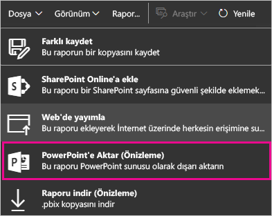

### Panoları ve raporları paylaşma

Kuruluştaki kullanıcılar panoları ve raporları yazdırabilir. [Daha fazla bilgi](consumer/end-user-print.md)

Aşağıdaki görüntüde panoya yazdırma seçeneği gösterilmiştir.

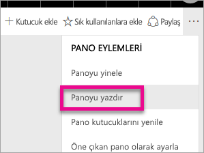

Aşağıdaki görüntüde **Panoları ve raporları yazdırın** ayarı etkinleştirildiğinde raporun **Dosya** menüsü gösterilmiştir.

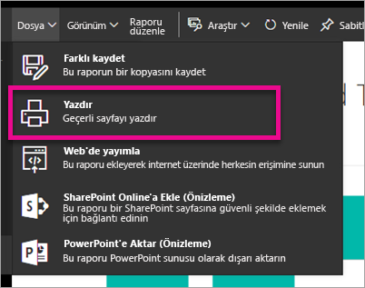

### Harici konuk kullanıcıların kuruluş içeriklerini düzenlemelerine ve yönetmelerine izin ver

Azure AD B2B konuk kullanıcıları kuruluş içeriklerini düzenleyebilir ve yönetebilir. [Daha fazla bilgi](service-admin-azure-ad-b2b.md)

Aşağıdaki resimde Harici konuk kullanıcıların kuruluş içeriklerini düzenlemelerine ve yönetmelerine izin verme seçeneği gösterilir.

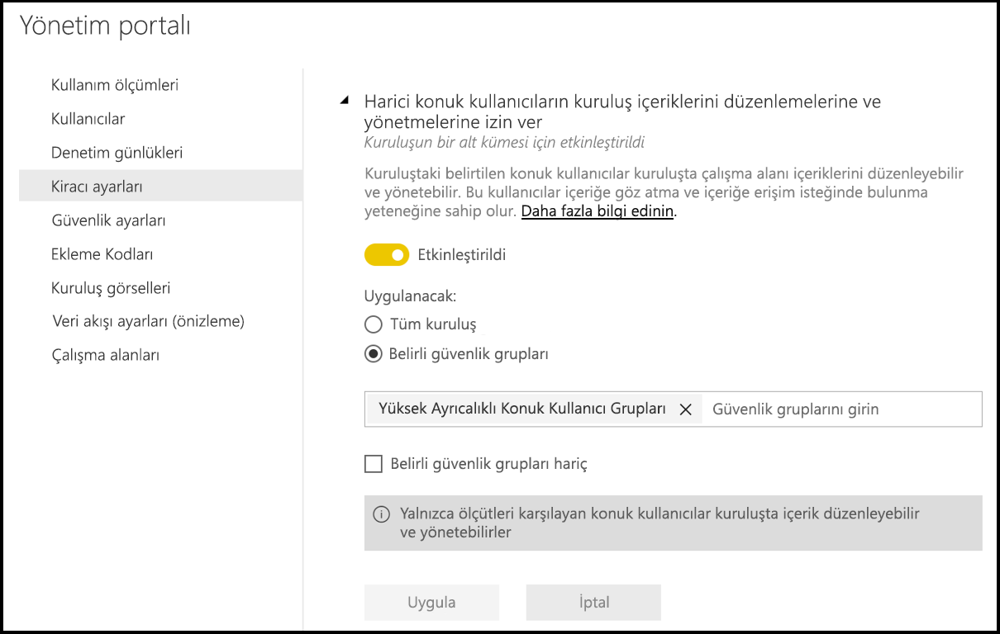

Yönetici portalında, hangi kullanıcıların kuruluşa dış kullanıcıları davet etme izni olduğunu da denetlersiniz. Ayrıntılar için bu makaledeki [Dış kullanıcılarla içerik paylaşma](#export-and-sharing-settings) bölümüne bakın.

### E-posta Abonelikleri
Kuruluştaki kullanıcılar e-posta abonelikleri oluşturabilir. [Abonelikler](service-report-subscribe.md) hakkında daha fazla bilgi edinin.

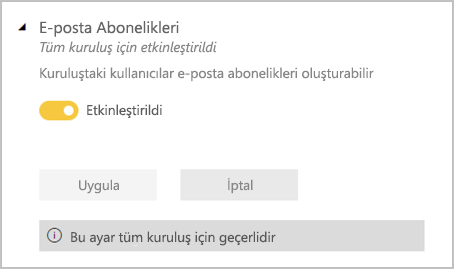

### Öne çıkan içerik

Kuruluşunuzdaki rapor yazarlarının bazılarının veya tümünün içeriklerini Power BI Giriş Sayfasının Öne Çıkanlar bölümünde öne çıkarmasına izin verin. Yeni kullanıcılar, Power BI Giriş sayfasının üst kısmında öne çıkan içerikleri görür. Öne çıkan içerik, kullanıcılar **Sık kullanılanlar**, **sık ziyaret edilenler** ve **Son Kullanılanlar** ekledikçe Giriş sayfasının aşağısına taşınır. 

Önce küçük bir dizi destekleyenle başlanmasını öneririz. Tüm kuruluşun Giriş Sayfasında içeriği öne çıkarmasına izin verilmesi, tüm tanıtılan içeriğin takip edilmesini zorlaştırabilir. 

Öne çıkan içeriği etkinleştirdikten sonra, Yönetici portalından da yönetebilirsiniz. Etki alanınızda öne çıkan içeriği denetleme hakkında bilgi edinmek için bu makalede [Öne çıkan içeriği yönetme](#manage-featured-content) bölümüne bakın.

## İçerik paketi ve uygulama ayarları

### Kuruluşun tamamına içerik paketi ve uygulama yayımlanması devre dışı bırakıldı

Yöneticiler bu ayarı kuruluştaki hangi kullanıcıların belirli gruplar yerine kuruluşun tamamına içerik paketleri ve uygulamalar yayımlayabileceğini belirlemek için kullanır. [Uygulama yayımlama](service-create-distribute-apps.md) hakkında daha fazla bilgi edinin.

Aşağıdaki görüntüde içerik paketi oluşturma sırasında **Tüm kuruluşum** seçeneği gösterilmiştir.

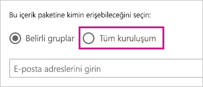

### Şablon uygulamalar kurumsal içerik paketleri oluşturma

Kuruluştaki kullanıcılar Power BI Desktop’taki bir veri kaynağı üzerinde oluşturulan veri kümelerini kullanan şablon uygulamaları ve kurumsal içerik paketleri oluşturabilir. [Şablon uygulamaları](template-content-pack-authoring.md) hakkında daha fazla bilgi edinin.

### Son kullanıcılara uygulama gönderme

Rapor oluşturucular, kullanıcıların [AppSource](https://appsource.microsoft.com)’tan yüklemesine gerek kalmadan uygulamaları son kullanıcılarla doğrudan paylaşabilir. [Son kullanıcılar için uygulamaları otomatik olarak yükleme](service-create-distribute-apps.md#automatically-install-apps-for-end-users) hakkında daha fazla bilgi edinin.

## Tümleştirme ayarları

### Şirket içi veri kümeleriyle Excel'de Çözümle özelliğini kullanma

Kuruluştaki kullanıcılar Excel'i kullanarak şirket içi Power BI veri kümelerini görüntüleyebilir ve bunlarla etkileşime geçebilir. [Daha fazla bilgi](service-analyze-in-excel.md)

> [!NOTE]
> **Verileri dışarı aktar** seçeneğinin devre dışı bırakılması, kullanıcıların **Excel'de Çözümle** özelliğini kullanmasını da engeller.

### ArcGIS Maps for Power BI kullanma

Kuruluştaki kullanıcılar, Esri tarafından sağlanan ArcGIS Maps for Power BI görselleştirmesini kullanabilir. [Daha fazla bilgi](visuals/power-bi-visualization-arcgis.md)

### Power BI için genel aramayı kullanma (Önizleme)

Kuruluşunuzdaki kullanıcılar, Azure Search kullanan dış arama özelliklerinden yararlanabilir.

## Power BI görselleri ayarları

### Power BI görselleri ekleme ve kullanma

Kuruluştaki kullanıcılar, Power BI görselleriyle etkileşime geçebilir ve bunları paylaşabilir. [Daha fazla bilgi](developer/visuals/power-bi-custom-visuals.md)

> [!NOTE]
> Bu ayar kuruluş geneline uygulanabilir veya belirli gruplarla sınırlandırılabilir.

Power BI Desktop (19 Mart’tan itibaren), kuruluşta dağıtılan bilgisayarlarda Power BI görsellerinin kullanımını devre dışı bırakmak için **Grup İlkesi** kullanılmasını destekler.

<table>
<tr><th>Öznitelik</th><th>Değer</th>
</tr>
<td>key</td>
    <td>Software\Policies\Microsoft\Power BI Desktop\</td>
<tr>
<td>valueName</td>
<td>EnableCustomVisuals</td>
</tr>
</table>

1 (ondalık) değeri Power BI’da Power BI görselleri kullanımını etkinleştirir (Bu varsayılan değerdir).

0 (ondalık) değeri, Power BI’da Power BI görsellerinin kullanımını devre dışı bırakır.

### Yalnızca sertifikalı görsellere izin ver

Kuruluş içindeki, “Power BI görselleri ekle ve kullan” ayarıyla Power BI görselleri ekleme ve kullanma izni verilmiş kullanıcılar yalnızca [sertifikalı Power BI görsellerini](https://go.microsoft.com/fwlink/?linkid=2002010) kullanabilir (sertifikalı olmayan görseller engellenir ve kullanıldıklarında bir hata iletisi görüntülenir). 

Power BI Desktop (19 Mart’tan itibaren), kuruluşta dağıtılan bilgisayarlarda sertifikasız Power BI görsellerinin kullanımını devre dışı bırakmak için **Grup İlkesi** kullanılmasını destekler.

<table>
<tr><th>Öznitelik</th><th>Değer</th>
</tr>
<td>key</td>
    <td>Software\Policies\Microsoft\Power BI Desktop\</td>
<tr>
<td>valueName</td>
<td>EnableUncertifiedVisuals</td>
</tr>
</table>

1 (ondalık) değeri Power BI’da sertifikasız Power BI görseli kullanımını etkinleştirir (Bu varsayılan değerdir).

0 (ondalık) değeri Power BI’da sertifikasız Power BI görseli kullanımını devre dışı bırakır (Bu seçenek yalnızca [sertifikalı Power BI görsellerinin](https://go.microsoft.com/fwlink/?linkid=2002010) kullanımını etkinleştirir).

## R görseli ayarları

### R görselleriyle etkileşim kur ve bunları paylaş

Kuruluştaki kullanıcılar R betikleri ile oluşturulan görsellerle etkileşime geçebilir ve bunları paylaşabilir. [Daha fazla bilgi](visuals/service-r-visuals.md)

> [!NOTE]
> Bu ayar kuruluş genelinde geçerli olur ve belirli gruplarla sınırlanamaz.

## Denetim ve kullanım ayarları

### İç etkinlik denetimi ve uyumluluk için denetim günlükleri oluştur

Kuruluştaki kullanıcılar, Power BI'da kuruluştaki diğer kullanıcılar tarafından gerçekleştirilen eylemleri izlemek için denetim özelliğini kullanabilir. [Daha fazla bilgi](service-admin-auditing.md)

Denetim günlüğü girişlerinin kaydedilmesi için bu ayarın etkinleştirilmesi gerekir. Denetimin etkinleştirilmesi ile denetim verilerinin görüntülenebilmesi arasında 48 saate kadar gecikme olabilir. Verileri hemen göremiyorsanız denetim günlüklerini daha sonra denetleyin. Denetim günlüklerini görüntüleme izni alma ile günlüklere erişebilme arasında da benzer bir gecikme olabilir.

> [!NOTE]
> Bu ayar kuruluş genelinde geçerli olur ve belirli gruplarla sınırlanamaz.

### İçerik oluşturucuları için kullanım ölçümleri

Kuruluştaki kullanıcılar oluşturdukları pano ve raporlar için kullanım ölçümlerini görebilir. [Daha fazla bilgi](service-usage-metrics.md)

### İçerik oluşturucuları için kullanım ölçümlerinde kullanıcı başına veriler

İçerik oluşturucuları için kullanım ölçümleri, içeriğe erişen kullanıcıların görünen adlarını ve e-posta adreslerini açığa çıkarır. [Daha fazla bilgi](service-usage-metrics.md)

Varsayılan olarak, kullanım ölçümleri için kullanıcı başına veriler etkinleştirilir ve içerik oluşturucunun hesap bilgileri ölçüm raporuna eklenir. Kullanıcılardan tümü için bu bilgilerin toplanmasını istemezsiniz, belirtilen güvenlik grupları veya kuruluşun tamamı için özelliği devre dışı bırakabilirsiniz. Bu durumda dışlanan kullanıcıların hesap bilgileri raporda *Adsız* olarak gösterilir.

## Pano ayarları

### Panolar için veri sınıflandırması

Kuruluştaki kullanıcılar, pano güvenlik düzeyleri belirten sınıflandırmalarla panoları etiketleyebilir. [Daha fazla bilgi](service-data-classification.md)

> [!NOTE]
> Bu ayar kuruluş genelinde geçerli olur ve belirli gruplarla sınırlanamaz.

## Geliştirici ayarları

### Uygulamalara içerik ekleme

Kuruluştaki kullanıcılar Hizmet Olarak Yazılım (SaaS) uygulamalarına Power BI panoları ve raporları ekleyebilir. Bu ayarın devre dışı bırakılması; kullanıcıların, uygulamalarına Power BI içeriği eklemek için REST API'lerini kullanabilmesini önler. [Daha fazla bilgi](developer/embedded/embedding.md)

### Hizmet sorumlularının Power BI API'leri kullanmasına izin ver

Azure Active Directory’ye (Azure AD) kayıtlı web uygulamaları, oturum açmış bir kullanıcı olmadan Power BI API’lerine erişmek için atanmış bir hizmet sorumlusu kullanır. Bir uygulamanın hizmet sorumlusu kimlik doğrulamasını kullanmasına izin vermek için hizmet sorumlusunun izin verilen bir güvenlik grubuna eklenmesi gerekir. [Daha fazla bilgi](developer/embedded/embed-service-principal.md)

> [!NOTE]
> Hizmet sorumluları tüm Power BI kiracı ayarları için izinleri kendi güvenlik grubundan devralır. İzinleri kısıtlamak için hizmet sorumlularına ayrılmış bir güvenlik grubu oluşturun ve bu grubu ilgili, etkin Power BI ayarlarının 'Belirli güvenlik grupları hariç' listesine ekleyin.

## Veri akışı ayarları

### Veri akışları oluşturma ve kullanma

Kuruluştaki kullanıcılar veri akışları oluşturabilir ve kullanabilir. Veri akışlarına yönelik bir genel bakış için bkz. [Power BI’da self servis veri hazırlığı](service-dataflows-overview.md). Premium kapasitede veri akışlarını etkinleştirmek için bkz. [İş yüklerini yapılandırma](service-admin-premium-workloads.md).

> [!NOTE]
> Bu ayar kuruluş genelinde geçerli olur ve belirli gruplarla sınırlanamaz.

## Şablon uygulaması ayarları

Bu ayarlar şablon uygulamalarının şablon uygulaması yayımlama veya yükleme yeteneğini denetler.

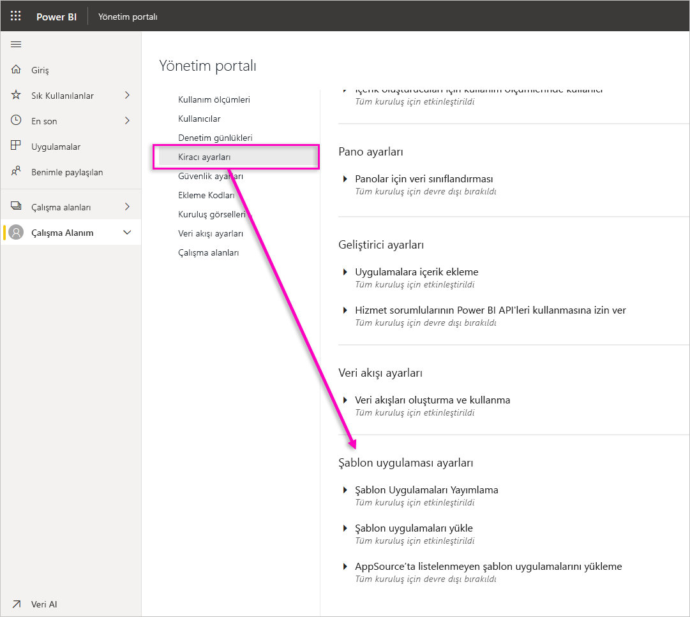

### Şablon Uygulamaları Yayımlama

Kuruluştaki kullanıcılar, şablon uygulama çalışma alanları oluşturabilir. Hangi kullanıcıların [AppSource](https://appsource.microsoft.com)’u veya başka bir dağıtım yöntemini kullanarak şablon uygulamaları yayımlayabileceğini veya bu uygulamaları kuruluşunuzun dışındaki istemcilere dağıtabileceğini denetleyin.

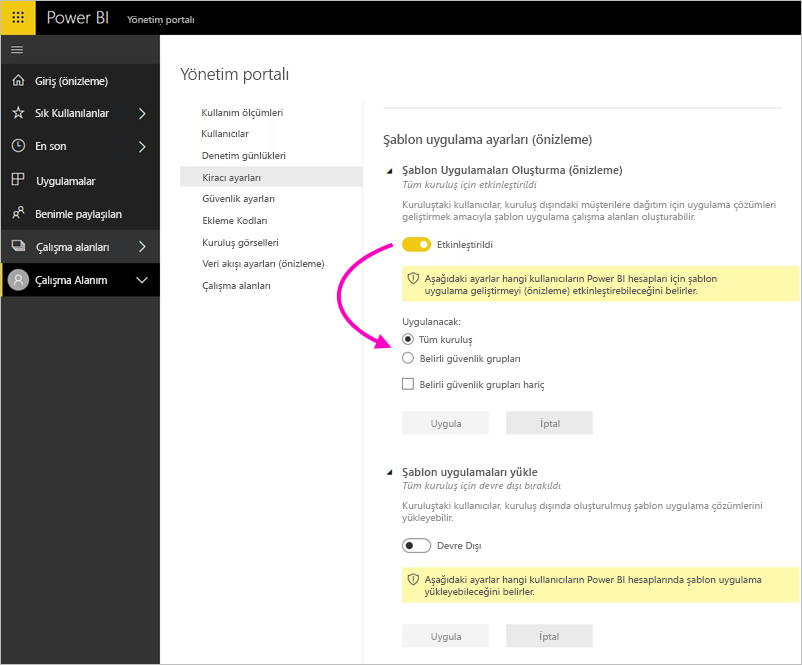

### AppSource’ta listelenen şablon uygulamalarını yükleme

Kuruluştaki kullanıcılar **yalnızca**[AppSource](https://appsource.microsoft.com)’tan şablon uygulamalarını indirebilir ve yükleyebilir. Hangi kullanıcıların veya güvenlik gruplarının AppSource’tan şablon uygulamaları yükleyebileceğini denetleyin.

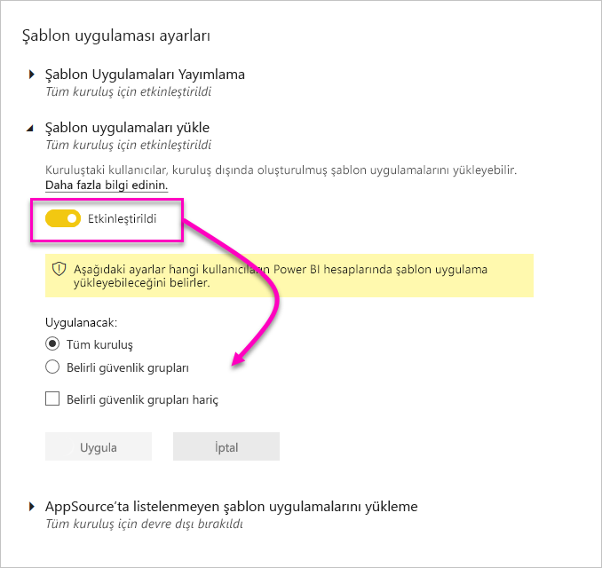

### AppSource’ta listelenmeyen şablon uygulamalarını yükleme

Kuruluştaki hangi kullanıcıların **[AppSource](https://appsource.microsoft.com)’ta listelenmeyen** şablon uygulamalarını indirebileceğini ve yükleyebileceğini denetleyin.

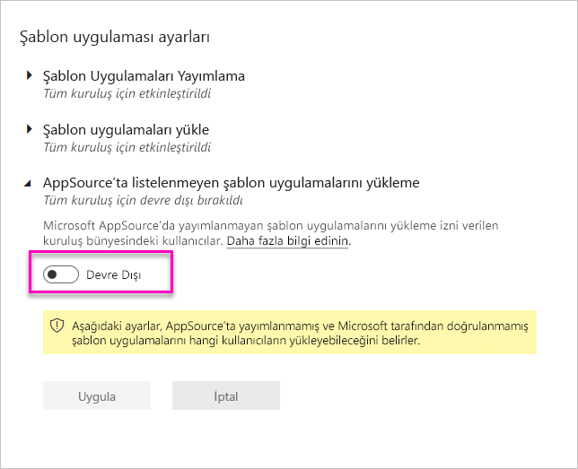

## Kapasite ayarları

### Power BI Premium

**Power BI Premium** sekmesi, kuruluşunuz için satın alınan Power BI Premium kapasitelerini (EM veya P SKU) yönetmenize olanak tanır. Kuruluşunuzdaki tüm kullanıcılar **Power BI Premium** sekmesini görebilir ancak yalnızca *Kapasite yöneticisi* olarak atanan veya atama izinlerine sahip kullanıcılar sekme içeriğini görebilir. Bir kullanıcı, izinlerden herhangi birine sahip olmaması durumunda aşağıdaki ileti görüntülenir.

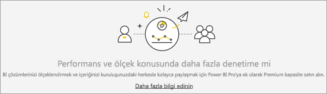

### Power BI Embedded

**Power BI Embedded** sekmesi, müşteriniz için satın aldığınız Power BI Embedded (A SKU) kapasitelerini görüntülemenizi sağlar. A SKU’ları yalnızca Azure’dan satın alabileceğiniz için [Azure’da ekli kapasiteleri yönetmek için](developer/embedded/azure-pbie-create-capacity.md)**Azure portalı** kullanırsınız.

Power BI Embedded (A SKU) ayarlarını yönetme hakkında daha fazla bilgi için bkz. [Power BI Embedded nedir?](developer/embedded/azure-pbie-what-is-power-bi-embedded.md)

## Ekleme kodları

Bir yönetici olarak, raporları genel kullanıma açmak amacıyla kiracınız için oluşturulan ekleme kodlarını görüntüleyebilirsiniz. Ayrıca kodları iptal edebilir veya silebilirsiniz. [Daha fazla bilgi](service-publish-to-web.md)

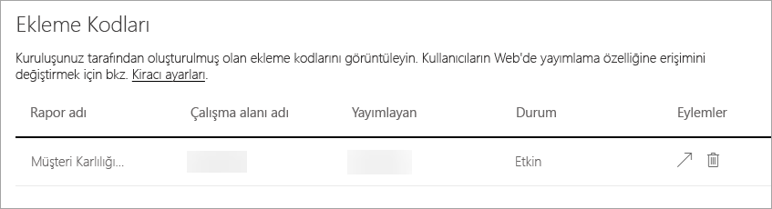

 ## <a name="organizational-visuals">Kuruluş görselleri</a> 

**Kuruluş görselleri** sekmesi, kuruluşunuzda Power BI görselleri dağıtmanızı ve bunları yönetmenizi sağlar. Kuruluş görsellerini kullanarak kuruluşunuzda kolayca özel görseller dağıtabilirsiniz. Rapor yazarları Power BI Desktop'ta bu görselleri bulabilir ve raporlarına aktarabilir. [Daha fazla bilgi](developer/visuals/power-bi-custom-visuals-organization.md)

> [!WARNING]
> Özel görseller güvenlik veya gizlilik riski taşıyan kodlar içerebileceğinden, özel görseli kuruluş deponuza dağıtmadan önce görselin yazarına ve kaynağına güvendiğinizden emin olun.

Aşağıdaki görüntüde, bir kuruluş deposunda dağıtılmış olan tüm Power BI görselleri gösterilmiştir.

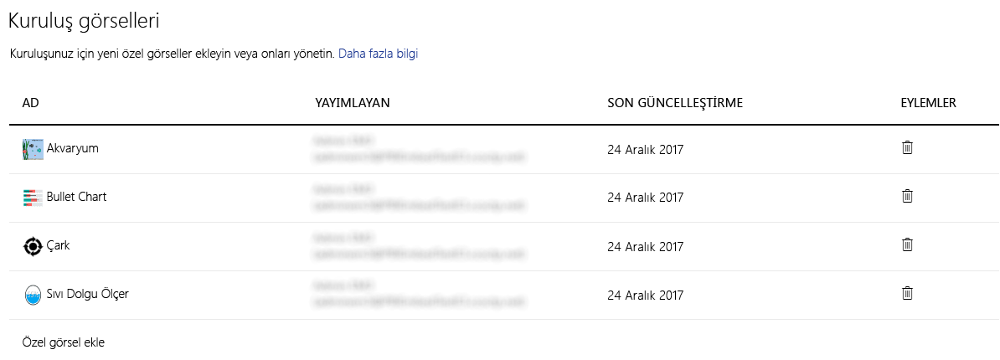

### Yeni özel görsel ekleme

Listeye yeni bir özel görsel eklemek için aşağıdaki adımları izleyin. 

1. Sağ taraftaki bölmede **Özel görsel ekle**'yi seçin.

    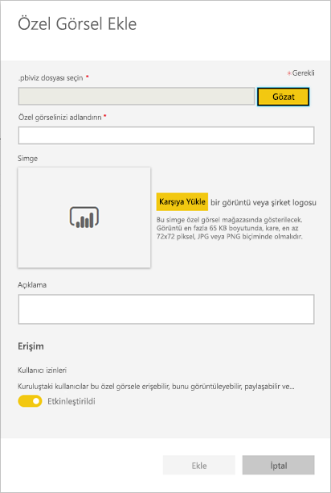

1. **Özel görsel ekle** formunu doldurun:

    * **Bir .pbiviz dosyası seçin** (gerekli): Karşıya yüklemek üzere bir özel görsel dosyasını seçin. Yalnızca sürümü tutulan API Power BI görselleri desteklenir (bunun ne anlama geldiğini buradan öğrenebilirsiniz).

    Bir özel görseli karşıya yüklemeden önce görselin kuruluşunuzun standartlarına uygun olduğundan emin olmak için görseli güvenlik ve gizlilik bakımından gözden geçirmeniz gerekir.

    * **Özel görselinizi adlandırın** (gerekli): Power BI Desktop kullanıcılarının görselin ne işe yaradığını anlayabilmesi için görsele kısa bir başlık verin

    * **Simge**: Power BI Desktop kullanıcı arabiriminde gösterilen simge dosyası.

    * **Açıklama**: Kullanıcıya daha fazla bağlam bilgisi ve eğitim sağlanması için görselin kısa bir açıklaması

1. Karşıya yükleme isteğini başlatmak için **Ekle**'yi seçin. İşlem başarılı olursa yeni öğeyi listede görürsünüz. Başarısız olursa, uygun bir hata iletisi alabilirsiniz

### Özel bir görseli listeden silme

Bir görseli kalıcı olarak silmek için depoda görsele ait çöp kutusu simgesini seçin.

> [!IMPORTANT]
> Silme işlemi geri alınamaz. Görsel silindikten hemen sonra mevcut raporlarda gösterilmemeye başlar. Aynı görseli yeniden yükleseniz dahi silinmiş olanın yerini almaz. Ancak kullanıcılar yeni görseli yeniden içeri aktararak raporlarındaki örneği yenisiyle değiştirebilir.

### Özel bir görseli listeden devre dışı bırakma

Kuruluş deposundaki bir görseli devre dışı bırakmak için dişli simgesini seçin. **Erişim** bölümünde özel görseli devre dışı bırakın.

Devre dışı bıraktığınız görseller var olan raporlarda işlenmez ve aşağıdaki hata iletisi görüntülenir.

*Bu özel görsel artık kullanılamıyor. Ayrıntılar için lütfen yöneticinizle iletişime geçin.*

Ancak yer işaretlerine eklenmiş olan görseller çalışmaya devam eder.

Güncelleştirmeler veya yönetici tarafından gerçekleştirilen değişikliklerden sonra Power BI Desktop kullanıcılarının güncelleştirmeleri görmek için uygulamayı yeniden başlatması veya Power BI hizmeti için tarayıcıyı yenilemesi gerekir.

### Karşıya görsel yükleme

Kuruluş deposundaki bir görseli güncelleştirmek için dişli simgesini seçin. Görselin yeni sürümüne göz atın ve karşıya yükleyin.

Görsel Kimliğinin değişmediğinden emin olun. Yeni dosya, kuruluşunuz genelinde tüm raporların önceki dosyasının yerini alır. Ancak görselin yeni sürümü, görselin önceki sürümünün kullanımını veya veri yapısını bozabilirse, önceki sürümü değiştirmeyin. Bunun yerine, görselin yeni sürümü için yeni bir liste oluşturmanız gerekir. Örneğin, yeni listelenen görselin başlığına yeni bir sürüm numarası (X.X sürümü) ekleyin. Böylece bunun güncelleştirilmiş sürüm numarasına sahip aynı görsel olduğu açıkça görülmektedir; bu nedenle mevcut raporların işlevi bozulmaz. Görsel Kimliğinin değişmediğinden emin olun. Daha sonra kullanıcılar, Power BI Desktop’tan kuruluş deposuna bir sonraki girişlerinde yeni sürümü içeri aktarabilir ve bunu yaptıklarında rapordaki mevcut sürümün değiştirilmesini isteyip istemedikleri sorulur.

Daha fazla bilgi edinmek için [Power BI kuruluş görselleri hakkında sık sorulan sorular](developer/visuals/power-bi-custom-visuals-faq.md#organizational-power-bi-visuals) bağlantısını ziyaret edin

## <a name="dataflowStorage">Veri akışı depolama (önizleme)</a>

Varsayılan olarak, Power BI ile kullanılan veriler, Power BI tarafından sağlanan iç depolama alanında depolanır. Veri akışları ve Azure Data Lake Storage 2. Nesil (ADLS 2. Nesil) tümleştirmesi ile, kuruluşunuzun Azure Data Lake Storage 2. Nesil hesabında veri akışlarınızı depolayabilirsiniz. Daha fazla bilgi için bkz. [Veri akışları ve Azure Data Lake tümleştirmesi (Önizleme)](service-dataflows-azure-data-lake-integration.md)

## Çalışma Alanları

Bir yönetici olarak, kiracınızda bulunan çalışma alanlarını görebilirsiniz. Çalışma alanları listesini filtreleyebilir, sıralayabilir ve her çalışma alanının ayrıntılarını görüntüleyebilirsiniz. Tablo sütunları, çalışma alanları için [Power BI yönetimi Rest API](/rest/api/power-bi/admin) tarafından döndürülen özelliklere karşılık gelir. Kişisel çalışma alanları **PersonalGroup** türünde, klasik çalışma alanları **Group** türünde ve yeni çalışma alanları deneyimi **Workspace** türündedir. Daha fazla bilgi için bkz. [Yeni çalışma alanlarında çalışmayı düzenleme](service-new-workspaces.md).

Yöneticiler ayrıca yönetici portalını veya PowerShell Cmdlet'lerini kullanarak çalışma alanlarını yönetebilir ve kurtarabilirler. 

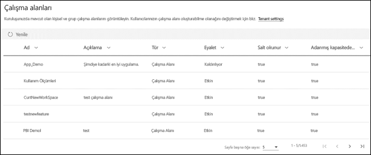

**Çalışma Alanları** sekmesinde her çalışma alanı için *durumu* görürsünüz. Aşağıdaki tabloda bu durumların anlamları hakkında daha ayrıntılı bilgiler verilmektedir.

|Durum  |Açıklama  |
|---------|---------|
| Etkin | Normal bir çalışma alanı. Kullanımı veya içindekiler hakkında bir şey ifade etmez, yalnızca çalışma alanının "normal" olduğu anlamına gelir. |
| Yalnız bırakılmış | Yönetici kullanıcısı olmayan çalışma alanı. |
| Silindi | Silinen çalışma alanı. 90 güne kadar, istenirse çalışma alanını geri yüklemek için yeterli miktarda meta veri saklarız. |
| Kaldırılıyor | Silinme aşamasında olup henüz silinmemiş çalışma alanı. Kullanıcılar kendi çalışma alanlarını silebilir, öğeleri Kaldırılıyor ve en sonunda Silindi durumuna alabilir. |

## Özel marka

Yönetici olarak, tüm kuruluşunuz için Power BI görünümünü özelleştirebilirsiniz. Şu anda üç ana seçenek vardır:

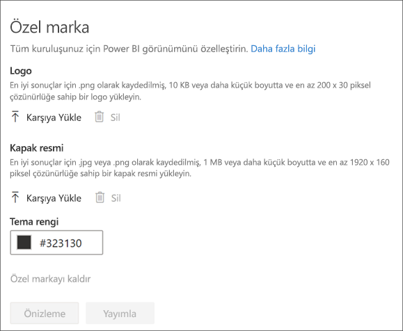

* **Logo Yükle**: En iyi sonuçlar için .png olarak kaydedilmiş, 10 KB veya daha küçük boyutta ve en az 200 x 30 piksel çözünürlüğe sahip bir logo yükleyin.

* **Kapak resmi yükle**: En iyi sonuçlar için .jpg veya .png olarak kaydedilmiş, 1 MB veya daha küçük boyutta ve en az 1920 x 160 piksel çözünürlüğe sahip bir kapak resmi yükleyin.

* **Tema rengi seç**: Bir onaltılık numara, RGB, değere göre veya verilen paletten temanızı seçebilirsiniz.

Daha fazla bilgi için bkz. [Kuruluşunuz için özel marka oluşturma](https://aka.ms/orgBranding).

## Öne çıkan içeriği yönetme

Kiracı yöneticisi olarak, kuruluşunuz genelinde Power BI Giriş Sayfasında Öne Çıkanlar bölüme yükseltilen tüm raporları, panoları ve uygulamaları yönetebilirsiniz.

- Yönetici portalında **Öne çıkan içerik** seçeneğini belirleyin.

Burada, içeriği kimin ne zaman öne çıkardığına ve içeriğin tüm ilgili meta verilerine yönelik bir genel bakış görürsünüz. Bir şey şüpheli görünürse veya Öne Çıkanlar bölümünü temizlemek isterseniz, öne çıkan içeriği gerektiğinde silebilirsiniz.

Öne çıkan içeriği etkinleştirme hakkında daha fazla bilgi için bu makaledeki [Öne çıkan içerik](#featured-content) bölümüne bakın.

## Sonraki adımlar

[Kuruluşunuzda Power BI'ı yönetme](service-admin-administering-power-bi-in-your-organization.md)  
[Power BI yönetici rolünü anlama](service-admin-role.md)  
[Kuruluşunuzda Power BI'ı denetleme](service-admin-auditing.md)  

Başka sorunuz mu var? [Power BI Topluluğu'na sorun](https://community.powerbi.com/)
