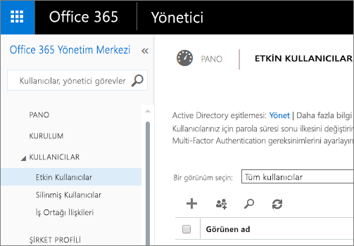
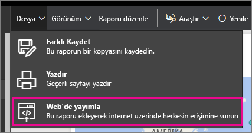
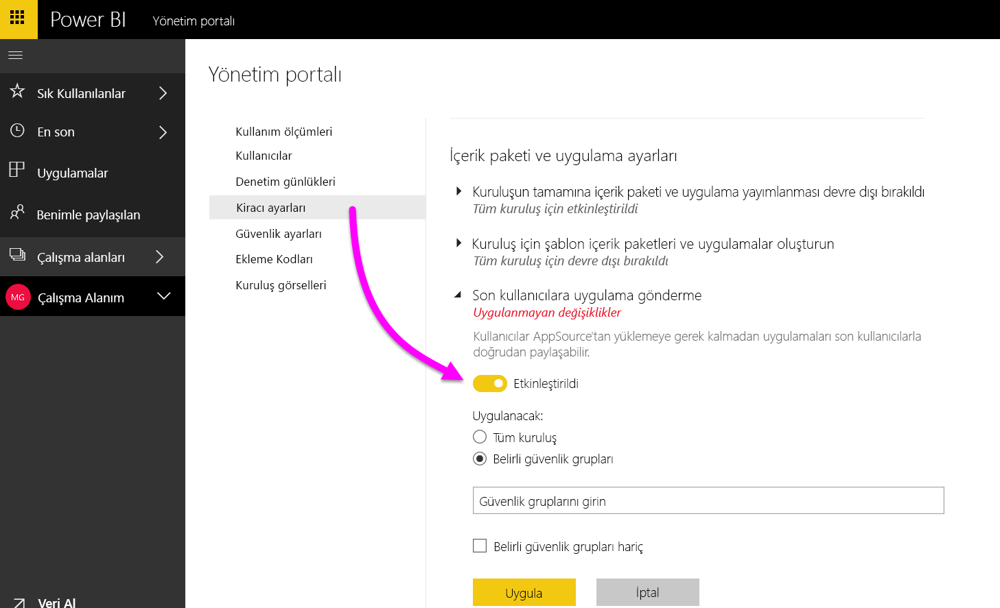

# Power BI yönetici portalı

Yönetici portalı, kuruluşunuzda Power BI kiracı yönetimine olanak sağlar. Kullanım ölçümleri, Office 365 yönetim merkezine erişim ve ayarlar gibi öğeleri içerir.

Şirketiniz için Power BI kiracı yönetimi, Power BI yönetici portalı üzerinden gerçekleştirilir. Yönetim portalı, Office 365'te Genel Yönetici olan veya kendilerine Power BI hizmet yöneticisi rolü atanmış tüm kullanıcılar için erişilebilir durumdadır. Power BI hizmet yöneticisi rolü hakkında daha fazla bilgi için bkz. [Power BI yönetici rolünü anlama](service-admin-role.md).

Tüm kullanıcılar dişli simgesinin altında **Yönetici portalını** görür. Yönetici değillerse yalnızca **Premium ayarları** bölümünü ve yönetme hakkına sahip oldukları kapasiteleri görürler.

## Yönetici portalına ulaşma

Power BI yönetici portalına erişim elde etmek için hesabınızın Office 365 veya Azure Active Directory'de **Genel Yönetici** olarak işaretlenmesi veya size Power BI hizmet yöneticisi rolünün atanması gerekir. Power BI hizmet yöneticisi rolü hakkında daha fazla bilgi için bkz. [Power BI yönetici rolünü anlama](service-admin-role.md). Power BI yönetici portalına ulaşmak için aşağıdakileri yapın.

1. Power BI hizmetinin sağ üst tarafındaki ayarlar dişli simgesini seçin.
2. **Yönetici portalı**'nı seçin.

Portalda altı sekme bulunur. Bunlar aşağıda açıklanmıştır.

* [Kullanım ölçümleri](#usage-metrics)
* [Kullanıcılar](#users)
* [Denetim günlükleri](#audit-logs)
* [Kiracı ayarları](#tenant-settings)
* [Premium ayarları](#premium-settings)
* [Ekleme kodları](#embed-codes)
* [Kuruluş görselleri](#Organization-visuals)

## Kullanım ölçümleri
Yönetici portalındaki ilk sekme **Kullanım ölçümleri**'dir. Kullanım ölçümleri raporu, kuruluşunuz için Power BI'daki kullanımı izleyebilmenizi sağlar. Ayrıca kuruluşunuz için Power BI'da en etkin olan kullanıcıları ve grupları görme olanağı da sunar.

> [!NOTE]
> Panoya ilk kez eriştiğinizde veya panoyu görüntülemeniz üzerinden uzun bir süre geçtikten sonra panoyu tekrar ziyaret ettiğinizde, biz panoyu yüklerken büyük olasılıkla bir yükleme ekranıyla karşılaşırsınız.

Pano yüklendikten sonra iki kutucuk bölümü görürsünüz. İlk bölüm, farklı kullanıcılar hakkındaki kullanım verilerini, ikinci bölüm ise kuruluşunuzdaki gruplara yönelik benzer bilgileri içerir.

Aşağıda, her kutucukta neler göreceğinize ilişkin bir döküm verilmiştir:

* Kullanıcı çalışma alanındaki tüm panoların, raporların ve veri kümelerinin ayrı sayımı
  
    

* Erişebilen kullanıcıların sayısına göre en fazla kullanılan pano. Örneğin, 3 kullanıcıyla paylaştığınız bir pano varsa ve bu panoyu iki farklı kullanıcının bağlı olduğu bir içerik paketine de eklediyseniz panonun sayımı 6 (1 + 3 + 2) şeklinde olur
  
    

* Kullanıcıların bağlı olduğu en popüler içerikler. Bu, kullanıcıların Veri Al işlemiyle ulaşabileceği herhangi bir şey (SaaS içerik paketleri, Kurumsal içerik paketleri, dosyalar veya veritabanları) olabilir.
  
    

* En fazla panoya sahip (hem kendi oluşturdukları hem de kendileriyle paylaşılan panolar) kullanıcılarınızın bir görünümü.
  
    

* En fazla rapora sahip kullanıcılarınızın bir görünümü
  
    

İkinci bölüm aynı türde bilgileri grup temelinde gösterir. Bu, kuruluşunuzdaki en etkin grupları ve bu grupların kullandığı bilgi türünü öğrenmenize olanak tanır.

Bu bilgilerle kişilerin kuruluşunuzdaki Power BI'ı nasıl kullandığına ilişkin gerçek öngörüler elde edebilir ve kuruluşunuzda oldukça etkin olan bu kullanıcıları ve grupları tanıyabilirsiniz.

## Kullanıcılar

Yönetici portalındaki ikinci sekme **Kullanıcıları Yönet**'tir. Power BI için kullanıcı yönetimi Office 365 yönetim merkezinde gerçekleştirilir; bu nedenle bu bölüm, Office 365'te kullanıcıları, yöneticileri ve grupları yönetme alanına hızlıca ulaşmanıza olanak tanır.

**O365 Yönetim Merkezi'ne git** seçeneğine tıkladığınızda, doğrudan kiracınızın kullanıcılarını yönetebileceğiniz Office 365 yönetim merkezi giriş sayfasına yönlendirilirsiniz.

## Denetim günlükleri

Yönetici portalındaki üçüncü sekme **Denetim günlükleri**'dir. Günlükler Office 365 Güvenlik ve Uyumluluk Merkezi'nde yer alır. Bu bölüm, Office 365'te bu alana hızlıca erişmenizi sağlar.

Denetim günlükleri hakkında daha fazla bilgi için bkz. [Kuruluşunuzda Power BI'ı denetleme](service-admin-auditing.md)

## Kiracı ayarları

Yönetici portalındaki üçüncü sekme **Kiracı ayarları**'dır. Kiracı ayarları, kuruluşunuzda hangi özelliklerin kullanılabildiğiyle ilgili olarak size daha fazla denetim verir. Gizli verilerle ilgili endişeleriniz varsa, sunduğumuz bazı özellikler kuruluşunuz için uygun olmayabilir veya belirli bir özelliğin yalnızca belirli bir grubun kullanımına sunulmasını isteyebilirsiniz. Bu durumda, söz konusu seçeneği kiracınızda kapatabilirsiniz.

Örneğin, kullanım ölçümleri için kullanıcı başına veriler varsayılan olarak etkinleştirilir ve içerik oluşturucunun hesap bilgileri ölçüm raporuna eklenir. Kullanıcılardan bazıları veya tümü için bu bilgilerin eklenmesini istemezsiniz, belirtilen güvenlik grupları veya kuruluşun tamamı için özelliği devre dışı bırakın. Bu durumda hesap bilgileri raporda *Adsız* olarak gösterilir.

> [!NOTE]
> Ayarın kiracınızdaki herkes için geçerli olması 10 dakika kadar sürebilir.

Ayarlar, seçimlerinize bağlı olarak üç duruma sahip olabilir.

### Tüm kuruluş için devre dışı bırakıldı

Bir özelliği devre dışı bırakabilir ve kullanıcıların kullanamayacağı hale getirebilirsiniz.

### Tüm kuruluş için etkinleştirildi

Bir özelliği kuruluşun tamamı için etkinleştirebilirsiniz; bu, tüm kullanıcıların bu özelliğe erişmesine olanak tanır.

### Kuruluşun bir alt kümesi için etkinleştirildi

Bir özelliği kuruluşunuzun belirli bir kısmı için de etkinleştirebilirsiniz. Bu, birkaç farklı şekilde gerçekleşebilir. Özelliği, belirli bir kullanıcı grubunu hariç tutarak tüm kuruluşunuz için etkinleştirebilirsiniz.

Ayrıca özelliği yalnızca belirli bir kullanıcı grubu için etkinleştirip başka bir kullanıcı grubu için devre dışı bırakabilirsiniz. Bu, izin verilen grupta olsalar dahi belirli kullanıcıların özelliğe erişmemesini sağlar.

## Dışarı aktarma ve paylaşım ayarları

### Dış kullanıcılarla içerik paylaşma

Kuruluştaki kullanıcılar, kuruluş dışındaki kullanıcılarla pano paylaşabilir.

Bir dış kullanıcıyla paylaştığınızda görünecek ileti aşağıdaki gibidir.

### Web'de yayımla

Kuruluştaki kullanıcılar web'de rapor yayımlayabilir. [Daha fazla bilgi](service-publish-to-web.md)

Kullanıcılar, web'de yayımlama ayarına göre kullanıcı arabiriminde farklı seçeneklerle karşılaşır.

|Öne çıkan özelliği |Tüm kuruluş için etkindir |Tüm kuruluş için devre dışıdır |Belirli güvenlik grupları   |
|---------|---------|---------|---------|
|Rapora ilişkin **Dosya** menüsündeki **Web'de yayımla** seçeneği.|Tüm kullanıcılar için etkindir|Herkes için görünmez|Yalnızca yetkili kullanıcılar veya gruplar için görünür.|
|**Ayarlar** bölümündeki **Ekleme kodlarını yönet** seçeneği|Tüm kullanıcılar için etkindir|Tüm kullanıcılar için etkindir|Tüm kullanıcılar için etkindir  * **Sil** seçeneği yalnızca yetkili kullanıcılar veya gruplar için görünür. * **Kod al** seçeneği tüm kullanıcılar için etkindir.|
|Yönetici portalındaki **Ekleme kodları** seçeneği|Durum olarak şunlardan biri görüntülenir: * Etkin * Desteklenmiyor * Engellendi|Durum olarak **Devre dışı** görüntülenir|Durum olarak şunlardan biri görüntülenir: * Etkin * Desteklenmiyor * Engellendi  Bir kullanıcı, kiracı ayarına göre yetkilendirilmemişse durum, **İhlal edildi** olarak görüntülenir.|
|Mevcut yayımlanmış raporlar|Tümü etkindir|Tümü devre dışıdır|Raporlar tüm kullanıcılar için görünür olmaya devam eder.|

### Verileri dışarı aktar

Kuruluştaki kullanıcılar, bir kutucuktaki veya görselleştirmedeki verileri dışarı aktarabilir. [Daha fazla bilgi](power-bi-visualization-export-data.md)

> [!NOTE]
> **Verileri dışarı aktar** seçeneğinin devre dışı bırakılması, kullanıcıların **Excel'de Çözümle** özelliğini ve Power BI hizmeti canlı bağlantısını kullanmasını da önler.

### Raporları PowerPoint sunumları olarak dışarı aktarma

Kuruluştaki kullanıcılar Power BI raporlarını PowerPoint dosyaları olarak dışarı aktarabilir. [Daha fazla bilgi](service-publish-to-powerpoint.md)

### Panoları ve raporları paylaşma

Kuruluştaki kullanıcılar panoları ve raporları yazdırabilir. [Daha fazla bilgi](service-print.md)

## İçerik paketi ayarları

### İçerik paketlerini kuruluş genelinde yayımlama

Kuruluştaki kullanıcılar içerik paketlerini kuruluşun tamamında yayımlayabilir.

### Kurumsal içerik paketi şablonu oluşturma

Kuruluştaki kullanıcılar Power BI Desktop'taki bir veri kaynağı üzerinde oluşturulan veri kümelerini kullanan içerik paketi şablonları oluşturabilir.

### Son kullanıcılara uygulama gönderme

Kiracı yöneticiniz **Kiracı ayarları**’nda uygulama gönderme özelliğini etkinleştirir.

   

Ayarı **Etkin** hale getirebilir ve sonra bu özelliği kimlerin (tüm kuruluş veya belirli güvenlik grupları) alacağını belirtebilirsiniz.

> [!NOTE]
> Kiracı ayarı değişikliklerinin geçerli hale gelmesi için biraz beklemeniz gerekebileceğini unutmayın.

[Uygulama gönderme](service-create-distribute-apps.md#how-to-install-an-app-automatically-for-end-users) hakkında daha fazla bilgi edinmek için bu makaleye gidin.

## Tümleştirme ayarları

### Cortana'yı kullanarak veriler hakkında soru sorma
Kuruluştaki kullanıcılar Cortana'yı kullanarak verileri hakkında sorular sorabilir.

> [!NOTE]
> Bu ayar kuruluş genelinde geçerli olur ve belirli gruplarla sınırlanamaz.

### Şirket içi veri kümeleriyle Excel'de Çözümle özelliğini kullanma
Kuruluştaki kullanıcılar Excel'i kullanarak şirket içi Power BI veri kümelerini görüntüleyebilir ve bunlarla etkileşime geçebilir. [Daha fazla bilgi ](service-analyze-in-excel.md)

> [!NOTE]
> **Verileri dışarı aktar** seçeneğinin devre dışı bırakılması, kullanıcıların **Excel'de Çözümle** özelliğini kullanmasını da engeller.

### ArcGIS Maps for Power BI kullanma

Kuruluştaki kullanıcılar, Esri tarafından sağlanan ArcGIS Maps for Power BI kullanılabilir. [Daha fazla bilgi](power-bi-visualization-arcgis.md)

### Power BI için genel aramayı kullanma (Önizleme)

Kuruluşunuzdaki kullanıcılar, Azure Search kullanan dış arama özelliklerinden yararlanabilir. Örneğin, kullanıcılar Cortana’yı kullanarak Power BI panolarındaki ve raporlarındaki önemli bilgileri doğrudan alabilir. [Daha fazla bilgi](service-cortana-intro.md)

## Özel görsel ayarları
### Kuruluşun tamamı için özel görsel öğeleri etkinleştirme
Kuruluştaki kullanıcılar özel görsel öğelerle etkileşime geçebilir ve bunları paylaşabilir. [Daha fazla bilgi](power-bi-custom-visuals.md)

> [!NOTE]
> Bu ayar kuruluş genelinde geçerli olur ve belirli gruplarla sınırlanamaz.

## R görseli ayarları

### R görselleriyle etkileşim kur ve bunları paylaş

Kuruluştaki kullanıcılar R betikleri ile oluşturulan görsellerle etkileşime geçebilir ve bunları paylaşabilir. [Daha fazla bilgi](service-r-visuals.md)

> [!NOTE]
> Bu ayar kuruluş genelinde geçerli olur ve belirli gruplarla sınırlanamaz.

## Denetim ayarları

### İç etkinlik denetimi ve uyumluluk için denetim günlükleri oluşturma

Kuruluştaki kullanıcılar, Power BI'da kuruluştaki diğer kullanıcılar tarafından gerçekleştirilen eylemleri izlemek için denetim özelliğini kullanabilir. [Daha fazla bilgi](service-admin-auditing.md)

Denetim günlüğü girişlerinin kaydedilmesi için bu ayarın etkinleştirilmesi gerekir. Denetimin etkinleştirilmesi ile denetim verilerinin görüntülenebilmesi arasında 48 saate kadar gecikme olabilir. Verileri hemen göremiyorsanız denetim günlüklerini daha sonra denetleyin. Denetim günlüklerini görüntüleme izni alma ile günlüklere erişebilme arasında da benzer bir gecikme olabilir.

> [!NOTE]
> Bu ayar kuruluş genelinde geçerli olur ve belirli gruplarla sınırlanamaz.

## Pano ayarları

### Panolar için veri sınıflandırması

Kuruluştaki kullanıcılar, pano güvenlik düzeyleri belirten sınıflandırmalarla panoları etiketleyebilir. [Daha fazla bilgi](service-data-classification.md)

> [!NOTE]
> Bu ayar kuruluş genelinde geçerli olur ve belirli gruplarla sınırlanamaz.

## Geliştirici ayarları

### Uygulamalara içerik ekleme

Kuruluştaki kullanıcılar Hizmet Olarak Yazılım (SaaS) uygulamalarına Power BI panoları ve raporları ekleyebilir. Bu ayarın devre dışı bırakılması; kullanıcıların, uygulamalarına Power BI içeriği eklemek için REST API'lerini kullanabilmesini önler.

## Premium ayarları

Premium ayarları sekmesi, kuruluşunuz için satın alınan Power BI Premium kapasitesini yönetmenize olanak tanır. Kuruluşunuzdaki tüm kullanıcılar Premium ayarları sekmesini görür ancak yalnızca **Kapasite yöneticisi** olarak atanan veya atama izinlerine sahip kullanıcılar sekme içeriğini görebilir. Bir kullanıcı, izinlerden herhangi birine sahip olmaması durumunda aşağıdaki iletiyle karşılaşır.

Premium ayarlarını yönetme hakkında daha fazla bilgi için bkz. [Power BI Premium'u yönetme](service-admin-premium-manage.md).

## Ekleme kodları

Bir yönetici olarak, kiracınız için oluşturulan ekleme kodlarını görüntüleyebilirsiniz. Raporu görüntüleme ve ekleme kodunu silerek söz konusu kodu iptal etme eylemlerini gerçekleştirebilirsiniz.

## Kuruluş görselleri

Kuruluş görselleri sekmesi, rapor yazarlarının şirkete ait özel görselleri kolayca keşfedebilmesi ve doğrudan Power BI Desktop’tan bunları raporlarında içeri aktarabilmesi için bu görselleri kuruluşta kolayca dağıtabilmek üzere özel görselleri kuruluşunuz içinde dağıtmanıza ve yönetmenize imkan sağlar.
 
Sayfada, o an kuruluş deposunda dağıtılmış olan tüm özel görseller gösterilir.
 

### Yeni özel görsel ekleme

Listeye yeni bir özel görsel eklemek için **Özel görsel ekle**’yi seçin

> [!WARNING]
> Özel görseller güvenlik veya gizlilik riski taşıyan kodlar içerebileceğinden, özel görseli kuruluş deponuza dağıtmadan önce görselin yazarına ve kaynağına güvendiğinizden emin olun.
> 

Alanları doldurun:
 
* Bir .pbiviz dosyası seçin (gerekli): Karşıya yüklemek üzere bir özel görsel dosyasını seçin. Yalnızca sürümü tutulan API özel görselleri desteklenir (bunun ne anlama geldiğini buradan öğrenebilirsiniz).
Bir özel görseli karşıya yüklemeden önce görselin kuruluşunuzun standartlarına uygun olduğundan emin olmak için görseli güvenlik ve gizlilik bakımından gözden geçirmeniz gerekir. Özel görsel güvenliği hakkında daha fazla bilgi edinin.
 
* Özel görsellerinizi adlandırın (gerekli): Power BI Desktop kullanıcılarının görselin ne işe yaradığını anlayabilmesi için görsele kısa bir başlık verin
 
* Simge (gerekli): Power BI Desktop kullanıcı arabiriminde gösterilecek simge dosyası.
 
* Açıklama: Kullanıcıya daha fazla bağlam bilgisi ve eğitim sağlanması için görselin kısa bir açıklaması
 
Karşıya yükleme isteğini başlatmak için "Uygula"yı seçin. İşlem başarılı olursa yeni öğeyi listede görürsünüz. Başarısız olursa, uygun bir hata iletisi alırsınız
 
### Özel bir görseli listeden silme

Görseli depodan kalıcı olarak silmek için çöp kutusu simgesini seçin.
Önemli: Silme işlemi geri alınamaz. Görsel silindikten hemen sonra mevcut raporlarda gösterilmemeye başlar. Aynı görseli yeniden karşıya yükleseniz bile silinen bir önceki görselin yerini almaz ve kullanıcıların yeni görseli tekrar içeri aktararak raporlarındaki örnekle değiştirmesi gerekir.
 
### Karşıya görsel yükleme

Görselin yeni bir sürümü bulunduğundan, depodaki bir görseli (örn. hata düzeltmeleri, yeni işlevler vb.) güncelleştirmek istiyorsanız **Güncelleştir** simgesini seçin ve yeni dosyayı karşıya yükleyin. Görsel Kimliğinin değişmediğinden emin olun. Yeni dosya, kuruluşunuz genelinde tüm raporların önceki dosyasının yerini alır. Ancak görselin yeni sürümü, görselin önceki sürümünün kullanımını veya veri yapısını bozabilirse, önceki sürümü değiştirmeyin. Bunun yerine, görselin yeni sürümü için yeni bir liste oluşturmanız gerekir. Örneğin, yeni listelenen görselin başlığına yeni bir sürüm numarası (X.X sürümü) ekleyin. Böylece bunun güncelleştirilmiş sürüm numarasına sahip aynı görsel olduğu açıkça görülmektedir; bu nedenle mevcut raporların işlevi bozulmaz. Görsel Kimliğinin değişmediğinden emin olun. Daha sonra kullanıcılar, Power BI Desktop’tan kuruluş deposuna bir sonraki girişlerinde yeni sürümü içeri aktarabilir ve bunu yaptıklarında rapordaki mevcut sürümün değiştirilmesini isteyip istemedikleri sorulur.

## Sonraki adımlar

[Power BI yönetici rolünü anlama](service-admin-role.md)  
[Kuruluşunuzda Power BI'ı denetleme](service-admin-auditing.md)  
[Power BI Premium'u yönetme](service-admin-premium-manage.md)  
[Kuruluşunuzda Power BI'ı yönetme](service-admin-administering-power-bi-in-your-organization.md)  

Başka bir sorunuz mu var? [Power BI Topluluğu'na sorun](http://community.powerbi.com/)
