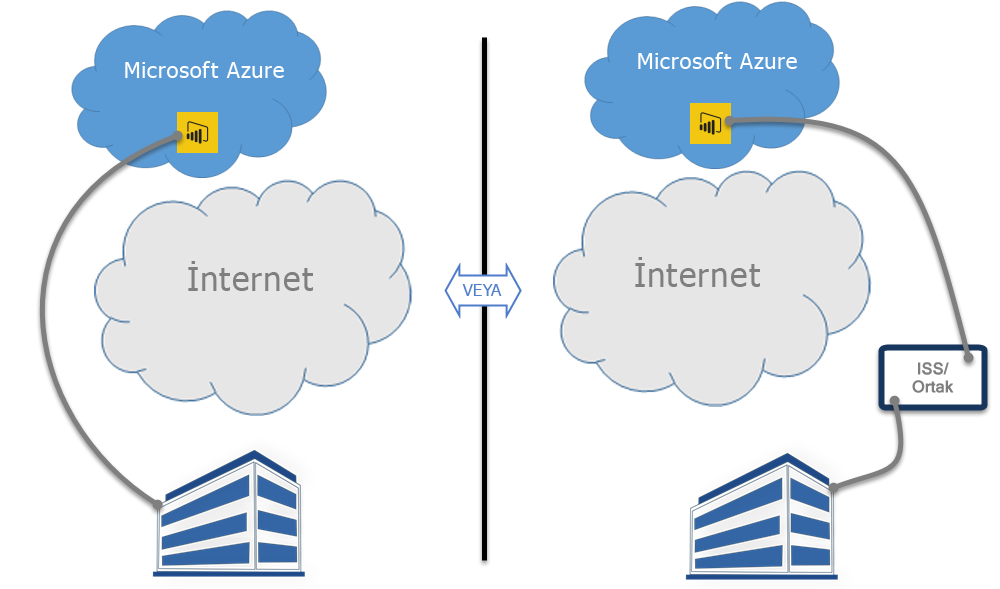

# Power BI ve ExpressRoute

**ExpressRoute**, Azure veri merkezleri (Power BI'ın bulunduğu) ile şirket içi altyapınız veya Azure veri merkezleri ile ortak konum ortamınız arasında özel bağlantılar oluşturmanıza olanak sağlayan bir Azure hizmetidir.

**Power BI** ve **ExpressRoute** ile gizli Power BI verileriniz ve bağlantılarınız için daha yüksek düzeyde güvenlik sağlamak üzere, İnternet kullanmadan (veya bir ISP ortak konum özelliği kullanarak) kuruluşunuz ile Power BI arasında özel bir ağ bağlantısı oluşturabilirsiniz.

Daha fazla bilgi için bkz. [ExpressRoute'a genel bakış](/azure/expressroute/expressroute-introduction). Power BI, Power BI'ın genel İnternet üzerinden veri aldığı veya gönderdiği bazı özel durumlar hariç olmak üzere ExpressRoute ile uyumludur. Power BI'ın kullandığı URL'lerin listesi için bkz. [Power BI URL'leri](power-bi-whitelist-urls.md).

