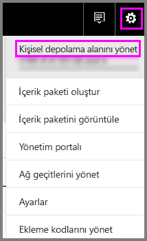
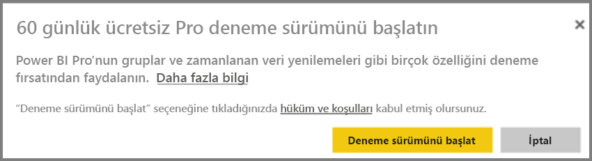
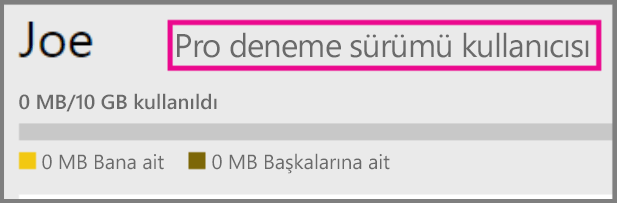
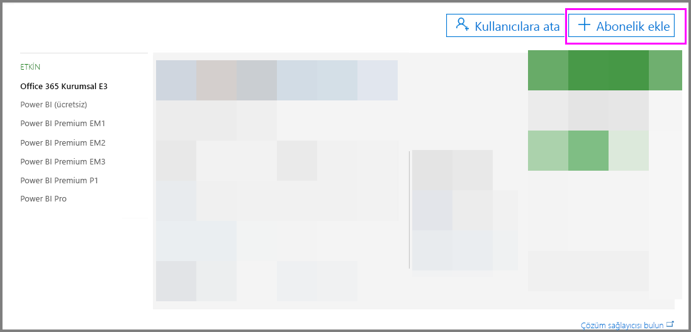
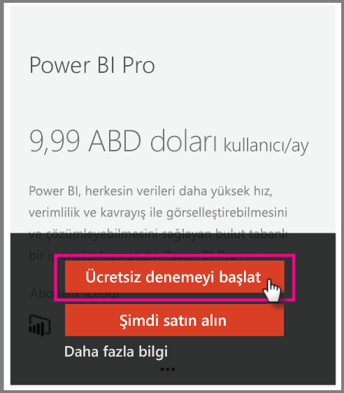

# Kuruluşunuzda Power BI Pro

Power BI Pro, daha fazla özelliği etkinleştiren ücretli bir lisanstır. Power BI Pro lisansları, veri odaklı kararlar almak için başkalarıyla paylaşımda bulunmak ve işbirliği yapmak isteyen ekiplere yöneliktir.  Paylaşılan Power BI içeriği oluşturan veya görüntüleyen her ekip üyesi, içerik Power BI Premium kullanan ayrılmış bir kapasiteyle ilişkili olmadığı sürece Pro lisansına ihtiyaç duyar.

Bu özellikler için Power BI Pro lisansı gerekir:

* **Excel veya Power BI Desktop’ta verileri analiz etme** - Power BI’da yayımlanan bir veri kümesini görüntülemek veya kullanmak için Excel ya da Power BI Desktop’ı kullanın. Daha fazla bilgi için bkz. [Excel’de analiz](service-analyze-in-excel.md).

* **Panoları paylaşma ve çalışma alanlarıyla işbirliği yapma** - Power BI çalışma alanları, panolarda, raporlarda ve veri kümelerinde iş arkadaşlarıyla işbirliği yapılmasını kolaylaştırır. Daha fazla bilgi için bkz. [Power BI uygulama çalışma alanınızda işbirliği yapma](service-collaborate-power-bi-workspace.md).

* **Paylaşılan içeriği görüntüleme** - Pro kullanıcıları, kendileriyle paylaşılan panoları ve raporları görüntüleyebilir, kendileriyle paylaşılan panolar ve raporlar ile etkileşim kurabilir ve kendileriyle paylaşılan panoları ve raporları yeniden paylaşabilir (izin verildiyse). Ancak bir Pro kullanıcısı bu panoları veya raporları düzenleyemez. Daha fazla bilgi için bkz. [Power BI panolarınızı ve raporlarınızı iş arkadaşlarıyla ve diğer kullanıcılarla paylaşma](service-share-dashboards.md).

* **İçeriği Microsoft Teams ile tümleştirme** - Microsoft (MS) Teams kanalında bir Power BI sekmesi ekleyebilirsiniz. MS Teams otomatik olarak çalışma alanındaki tüm raporları algılar. Daha fazla bilgi için bkz. [Microsoft Teams ile yaşasın Power BI ekipleri](https://powerbi.microsoft.com/en-us/blog/power-bi-teams-up-with-microsoft-teams/). 

## Bireyler için Power BI Pro 60 günlük deneme sürümü

Ücretsiz hesaba kaydolduktan sonra Pro'yu 60 gün süreyle ücretsiz denemeyi seçebilirsiniz. Deneme süresi boyunca Pro'nun tüm özelliklerine erişebilirsiniz. Power BI Pro, Power BI ücretsiz sürümünün tüm özelliklerinin yanı sıra ek paylaşım ve işbirliği özellikleri içermektedir. Daha fazla bilgi için bkz. [Power BI Fiyatlandırması](https://powerbi.microsoft.com/en-us/pricing/). Power BI Pro'nun 60 günlük ücretsiz deneme sürümü için Power BI'da oturum açın ve aşağıdaki Power BI Pro özelliklerinden birini deneyin.

* [Çalışma alanı oluşturma](consumer/end-user-create-apps.md)
* [Bir panoyu paylaşma](service-share-dashboards.md)

Bu özelliklerden herhangi birini denediğinizde, ücretsiz denemenizi başlatmanız istenir. Ayrıca, dişli simgesine gidip Kişisel depolama alanını yönet'i seçerek de ücretsiz denemenizi başlatabilirsiniz. Ardından, sağdaki Pro'yu ücretsiz dene seçeneğini belirleyin.

   
    
   

Daha sonra Deneme sürümünü başlat’ı seçebilirsiniz.

   

> [!NOTE]
> Bu ürün içi Power BI Pro deneme sürümü avantajından faydalanan kullanıcılar, Office 365 yönetim portalında Power BI Pro Deneme Sürümü kullanıcıları olarak değil, Power BI ücretsiz sürüm kullanıcıları olarak görünür. Ancak, Power BI'daki depolama alanını yönet sayfasında Power BI Pro Deneme Sürümü kullanıcıları olarak görünürler.
>

> [!NOTE]
> Bir BT Yöneticisi olarak, Power BI deneme sürümü lisansları edinip kuruluşunuzdaki kullanıcıların deneme sürümü koşullarını ayrı ayrı kabul etmesine gerek kalmadan bunları kuruluşunuzdaki birden çok kullanıcıya dağıtmak istiyorsanız Power BI Pro aboneliği deneme sürümüne kaydolabilirsiniz. Yönetici deneme sürümüne kaydolmak isterseniz Office 365 Genel veya Faturalama Yöneticisi olmanız ya da yeni bir kiracı oluşturmanız gerekir. Daha fazla bilgi için bkz. [Power BI Pro'yu satın alma](service-admin-purchasing-power-bi-pro.md).
>

Bir Pro deneme sürümü hesabına sahip olup olmadığınızı, hizmetteyken dişli simgesine gidip Kişisel depolama alanını yönet seçeneğini belirleyerek doğrulayabilirsiniz.

   

## Office 365'teki abonelik deneme sürümü

Kuruluşunuz için Power BI Pro'nun deneme sürümünü edinebilirsiniz. Aboneliği aldığınızda kullanıcılarınıza Power BI Pro lisansları atayabilirsiniz. Lisans atama hakkında daha fazla bilgi için [Office 365’te kullanıcılara lisans atama](https://support.office.com/en-us/article/assign-licenses-to-users-in-office-365-for-business-997596b5-4173-4627-b915-36abac6786dc?ui=en-US&rs=en-US&ad=US) bölümüne bakın.

> [!NOTE]
> Kiracı başına bir kuruluş deneme sürümü sınırı vardır. Bu, Power BI Pro Deneme Sürümünün kiracınıza daha önce uygulanmış olması halinde bunu bir daha yapamayacağınız anlamına gelir. Bununla ilgili yardıma ihtiyacınız varsa [Office 365 Faturalama destek ekibiyle](https://support.office.microsoft.com/en-us/article/contact-support-for-business-products-admin-help-32a17ca7-6fa0-4870-8a8d-e25ba4ccfd4b?CorrelationId=552bbf37-214f-4202-80cb-b94240dcd671&ui=en-US&rs=en-US&ad=US) iletişim kurun.
>

Office 365’te deneme aboneliği elde etmek için şu adımları izleyin:

1. [Office 365 yönetim merkezine](https://portal.office.com/adminportal/home#/homepage) gidin.
2. Sol gezinti bölmesinde Faturalama’yı seçin ve Abonelikler'e tıklayın.

   

3. Sağ taraftaki Abonelik ekleyin öğesini seçin.

   

4. Diğer Planlar bölümünde Power BI Pro üzerindeki üç nokta (…) simgesinin üzerine gelin ve Ücretsiz denemeyi başlat'ı seçin.

    

5. Siparişinizi onaylayın ekranında Şimdi deneyin'i seçin.
6. Sipariş alındı belgesinde Devam'ı seçin.

## Power BI Pro'yu satın alma

Microsoft Office 365 aracılığıyla veya sertifikalı Microsoft iş ortağı aracılığıyla Power BI Pro satın alabilirsiniz. Power BI Pro'yu satın alma hakkında daha fazla bilgi için bkz. [Power BI Pro’yu satın alma](service-admin-purchasing-power-bi-pro.md).

## Sonraki adımlar
[Power BI için self servis kayıt](service-admin-signing-up-for-power-bi-with-a-new-office-365-trial.md)
 
[Kuruluşunuz için Power BI (ücretsiz)](service-admin-service-free-in-your-organization.md)
 
[Power BI Pro'yu satın alma](service-admin-purchasing-power-bi-pro.md)
 
[Uzatılmış Pro Deneme Sürümünü etkinleştirme](service-extended-pro-trial.md)
 
[Power BI Pro lisansları atama](service-admin-assigning-power-bi-pro-licenses.md)
 
[Power BI Premium nedir?](service-admin-premium-manage.md)
 
[Power BI Premium'u satın alma](service-admin-premium-purchase.md)
 
[Power BI Premium teknik incelemesi](https://aka.ms/pbipremiumwhitepaper)

Başka bir sorunuz mu var? [Power BI Topluluğu'na sorun](https://community.powerbi.com/)