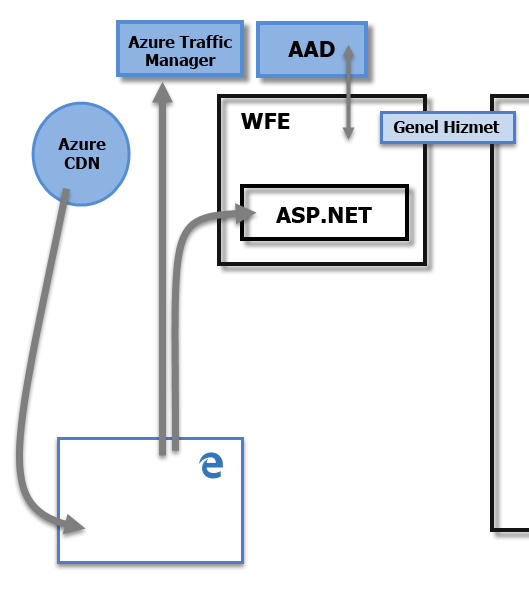
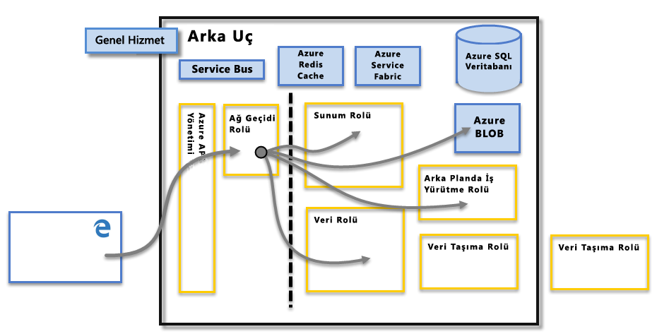

# Power BI Güvenliği

Power BI güvenlik özelliklerine ilişkin ayrıntılı bir açıklama için lütfen [Power BI Güvenliği teknik incelemesini okuyun](whitepaper-powerbi-security.md).

Power BI hizmetinin temelini, Microsoft'un bulut bilgi işlem altyapısı ve platformu olan **Azure** oluşturmaktadır. Power BI hizmet mimarisi iki kümeye dayanır: Web Ön Uç (**WFE**) kümesi ve **Arka Uç** kümesi. WFE kümesi, Power BI hizmetine yönelik ilk bağlantıyı ve kimlik doğrulamasını yönetir. Kimlik doğrulaması yapıldıktan sonraki tüm kullanıcı etkileşimlerini Arka Uç üstlenir. Power BI, kullanıcı kimliklerini depolamak ve yönetmek için Azure Active Directory (AAD) hizmetini, verileri ve meta verileri depolamak ve yönetmek içinse Azure BLOB ve Azure SQL Veritabanı hizmetlerini kullanır.

## Power BI Mimarisi

Her Power BI dağıtımı iki kümeden oluşur: Bir Web Ön Uç (**WFE**) kümesi ve bir **Arka Uç** kümesi.

**WFE** kümesi Power BI için ilk bağlantı ve kimlik doğrulaması işlemlerini yönetir. Bu küme, AAD hizmetini kullanarak istemcilerin kimliklerini doğrular ve Power BI hizmetiyle kurulacak sonraki istemci bağlantıları için belirteçler sağlar. Ayrıca Power BI, hem kimlik doğrulaması hem de statik içeriğin ve dosyaların indirilmesi için bağlantı kurmaya çalışan istemcinin DNS kaydına göre kullanıcı trafiğini en yakın veri merkezine yönlendirmek amacıyla **Azure Traffic Manager** (ATM) hizmetini kullanır. Power BI, statik içeriği ve dosyaları coğrafi yerel ayara göre kullanıcılara verimli bir şekilde dağıtmak için **Azure Content Delivery Network** (CDN) hizmetini kullanır.

**Arka Uç** kümesi, kimlik doğrulamasından geçen istemcilerin, Power BI hizmetiyle nasıl etkileşim kuracağını belirler. **Arka Uç** kümesi; görselleştirmeleri, kullanıcı panolarını, veri kümelerini, raporları, veri depolama alanlarını, veri bağlantılarını, veri yenileme özelliklerini ve Power BI hizmetiyle etkileşim kurarken kullanılan diğer öğeleri yönetir. **Ağ Geçidi Rolü** kullanıcı istekleriyle Power BI hizmeti arasında bir ağ geçidi işlevi görür. Kullanıcılar **Ağ Geçidi Rolü** haricindeki bir rolle doğrudan etkileşim kurmaz. **Ağ Geçidi Rolü**, **Azure API Management** tarafından yönetilir.

> [!IMPORTANT]
> Yalnızca **Azure API Management** (APIM) ve **Ağ Geçidi** (GW) rollerinin İnternet üzerinden herkesin erişimine açık olduğu unutulmamalıdır. Bu hizmetler kimlik doğrulaması, yetkilendirme, DDoS koruması, Azaltma, Yük Dengeleme, Yönlendirme gibi özellikler sunar.

## Veri Depolama Alanı Güvenliği

Power BI hizmetinin veri depolamak ve yönetmek için kullandığı iki ana depo vardır. Kullanıcılar tarafından karşıya yüklenen veriler genelde **Azure BLOB** depolama alanına gönderilirken sisteme ait meta veriler ve tüm yapıtlar **Azure SQL Veritabanı**'nda depolanır.

Yukarıdaki **Arka Uç** kümesi resminde yer alan kesik çizgi, kullanıcılar tarafından erişilebilen iki bileşen (kesik çizginin sol tarafı) ile yalnızca sistem tarafından erişilebilen roller arasındaki ayrımı göstermektedir. Kimliği doğrulanmış bir kullanıcı Power BI hizmetine bağlandığında bağlantı ve istemci istekleri **Ağ Geçidi Rolü** tarafından kabul edilip yönetilir (sonrasında **Azure API Management** tarafından işlenmek üzere) ve bu rol, Power BI hizmetinin geri kalan kısmında kullanıcının adına etkileşimde bulunur. Örneğin, bir istemci bir panoyu görüntülemek istediğinde **Ağ Geçidi Rolü** bu isteği kabul eder ve tarayıcının panoyu oluşturması için gerekli olan verileri almak için **Sunum Rolü**'ne ayrı bir istek gönderir.

## Kullanıcı Kimlik Doğrulaması

Power BI, oturum açan kullanıcıların kimliğini doğrulamak için Azure Active Directory ([AAD](http://azure.microsoft.com/services/active-directory/)) hizmetini; kullanıcının, kimlik doğrulaması gerektiren kaynaklara erişmeye çalışması halinde ise Power BI oturum açma kimlik bilgilerini kullanır. Power BI hizmetinde, Power BI hesabını oluşturmak için kullandığı e-posta adresiyle oturum açan kullanıcılar için Power BI, ilgili e-posta adresini *etkin kullanıcı adı* olarak kullanır ve kullanıcı verilere bağlanmaya çalıştığında kaynaklara bu bilgiyi iletir. Ardından *etkin kullanıcı adı* bir *Kullanıcı Asıl Adı* ([UPN](https://msdn.microsoft.com/library/windows/desktop/aa380525\(v=vs.85\).aspx)) ile eşlenerek ilişkili Windows etki alanı hesabı çözümlenir ve kimlik doğrulaması bu hesaba uygulanır.

Power BI oturumu açmak için iş e-postalarını kullanan kuruluşlarda (<em>david@contoso.com</em> gibi) *etkin kullanıcı adı* doğrudan UPN ile eşlenir. Power BI oturumu açmak için iş e-postalarını kullanmayan kuruluşlarda (<em>david@contoso.onmicrosoft.com</em> gibi) AAD ve şirket içi kimlik bilgileri arasında eşleme yapılabilmesi için [dizin eşitleme](https://technet.microsoft.com/library/jj573653.aspx) hizmetinin düzgün çalışması gerekir.

Power BI için platform güvenliği aynı zamanda çok kiracılı ortam güvenliğini, ağ güvenliğini ve AAD tabanlı ek güvenlik önlemleri ekleme olanağını da kapsar.

## Veri ve Hizmet Güvenliği

Daha fazla bilgi için lütfen [Microsoft Güven Merkezi](https://www.microsoft.com/trustcenter)'ni ziyaret edin.

Bu makalenin yukarıdaki bölümlerinde açıklandığı üzere kullanıcının Power BI oturum açma bilgileri, şirket içi Active Directory sunucuları tarafından kullanılarak kimlik bilgilerine ilişkin bir UPN ile eşlenir. Ancak, kullanıcıların, paylaştıkları verilerin sorumluluğunu alması gerektiğini **unutmayın**. Bir kullanıcının kendi kimlik bilgilerini kullanarak bağlandığı veri kaynağındaki verileri kullanan bir raporu (veya panoyu ya da veri kümesini) paylaşması halinde, ilgili öğenin paylaşıldığı kullanıcıların kimliği, özgün veri kaynağı için doğrulanmaz ve bu kullanıcılara, rapora yönelik erişim izni verilir.

Bu durum, **şirket içi veri ağ geçidi** kullanılarak **SQL Server Analysis Services** ile kurulan bağlantılar için geçerli değildir. Panolar Power BI hizmetinde önbelleğe alınır ancak bağlantılı raporlara veya veri kümelerine erişim için rapora (veya veri kümesine) erişmek isteyen kullanıcıya yönelik olarak kimlik doğrulaması başlatılır ve yalnızca kullanıcının ilgili verilere erişmek için yeterli kimlik bilgilerine sahip olması durumunda erişim izni verilir. Daha fazla bilgi için bkz. [Şirket içi veri ağ geçidine yakından bakış](service-gateway-onprem-indepth.md).

## TLS sürümü kullanımını zorlama

Ağ ve BT yöneticileri, ağ üzerinden gerçekleştirilen güvenli iletişimler için geçerli TLS (Aktarım Katmanı Güvenliği) kullanımını zorunlu kılabilir. Windows, [TLS Schannel SSP makalesinde açıklandığı gibi](https://docs.microsoft.com/windows/desktop/SecAuthN/protocols-in-tls-ssl--schannel-ssp-) Microsoft Schannel Provider üzerinden TLS sürümlerini destekler.

Bu zorlama kayıt defteri anahtarlarının ayarlanmasıyla sağlanabilir. Zorlama adımları [AD FS SSL Protokollerini Yönetme makalesinde](https://docs.microsoft.com/windows-server/identity/ad-fs/operations/manage-ssl-protocols-in-ad-fs) anlatılmıştır. 

**Power BI Desktop**, bu makalelerde anlatılan kayıt defteri anahtarı ayarlarını dikkate alır ve bu kayıt defteri ayarları mevcut olduğunda yalnızca izin verilen TLS sürümü kullanılarak oluşturulan bağlantılara izin verilir.

Bu kayıt defteri anahtarlarını oluşturma hakkında daha fazla bilgi için [TLS Kayıt Defteri Ayarları](https://docs.microsoft.com/windows-server/security/tls/tls-registry-settings) makalesini inceleyin.
