# Power BI Premium ve Power BI Embedded'da kapasiteleri yönetme
İçeriğiniz için ayrılmış kaynaklar sağlayan Power BI Premium ve Power BI Embedded kapasitelerini nasıl yönetebileceğinizi öğrenin.

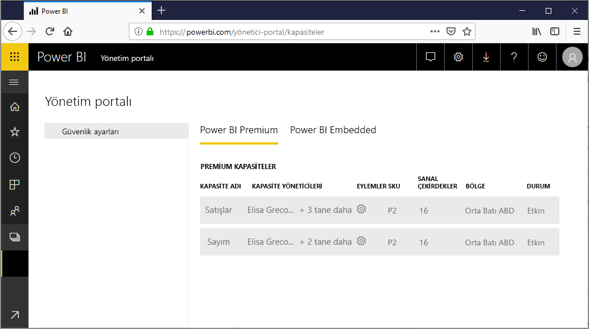

Kapasite, Power BI Premium ve Power BI Embedded tekliflerinin merkezindedir.

## Kapasite nedir?
Kapasite, yalnızca sizin kullanmanız için ayrılmış kaynak kümesidir. Kapasiteye sahip olmak kuruluşunuzdaki kullanıcılar için lisans satın almak zorunda kalmadan onlara pano, rapor ve veri kümesi yayımlamanıza olanak sağlar. Ayrıca kapasitede barındırılan içerikler için güvenilir ve tutarlı performansı garanti eder.

Kapasite son kullanıcılarınız için tamamen şeffaftır. Power BI'ı veya uygulamanızı her zamanki gibi kullanmaya devam ederler. İçeriğin bir kısmının (veya tamamının) ayrılmış kapasitenizde barındırıldığını fark etmelerine neden olacak bir değişiklikle karşılaşmazlar. Kullanıcılarınız için her şey tam olarak eskisi gibi çalışır.

[!INCLUDE [powerbi-premium-illustration](./includes/powerbi-premium-illustration.md)]

Daha fazla bilgi için bkz. [Power BI Premium nedir?](service-premium.md).

## Kapasite satın alma
Ayrılmış kapasiteden yararlanmak için Office 365 yönetim merkezinde Power BI Premium aboneliği satın almanız veya Microsoft Azure portalında Power BI Embedded kaynağı oluşturmanız gerekir. Daha fazla bilgi için aşağıdaki başlıklara bakın:

* **Power BI Premium:** [Power BI Premium'u satın alma](service-admin-premium-purchase.md)
* **Power BI Embedded:** Yakında sunulacak.

Power BI Premium SKU satın aldığınızda, kiracınız çalışan kapasitelerde kullanmak için uygun sayıda sanal çekirdek edinir. Örneğin, Power BI Premium P3 SKU satın almak kiracıya 32 sanal çekirdek sağlar.

## Kapasite yöneticileri
> [!NOTE]
> Power BI Embedded kapasitesine ilişkin kapasite yöneticileri Microsoft Azure portalında tanımlanır.
> 
> 

Bir kapasiteye kapasite yöneticisi olarak atandığınızda kapasite üzerinde tam kontrole ve kapasitenin yönetim özelliklerine sahip olursunuz. Power BI yönetici portalından daha fazla kapasite yöneticisi (yalnızca Power BI Premium) ekleyebilir veya kullanıcılara kapasite atama izinleri verebilirsiniz. Bir kapasiteye çalışma alanlarını toplu olarak atayabilir ve kapasitedeki kullanım ölçümlerini görüntüleyebilirsiniz.

Her kapasitenin kendisine ait yöneticileri vardır. Bir kapasiteye kapasite yöneticisi tanımlamak bu yöneticilere kuruluşunuzdaki tüm kapasitelere erişim yetkisi vermez. Kapasite yöneticileri; kullanım ölçümleri, denetim günlükleri veya kiracı ayarları gibi tüm Power BI yönetici alanlarına varsayılan olarak erişim sahibi olmaz. Ayrıca kapasite yöneticileri, yeni kapasite ayarlama veya mevcut kapasitelerin SKU'sunu değiştirme iznine de sahip değildir. Yalnızca Genel yöneticiler veya Power BI hizmet yöneticileri bu öğelere erişebilir.

Tüm Office 365 Genel yöneticileri ve Power BI yöneticileri otomatik olarak hem Power BI Premium hem de Power BI Embedded kapasitesinin kapasite yöneticileridir.

## Kapasite yönetme
Office 365'te kapasite düğümleri satın aldıktan sonra yeni bir kapasite ayarlamanız gerekir. Bu işlem [Power BI yönetici portalı](service-admin-portal.md) aracılığıyla gerçekleştirilir. Yönetici portalında **Kapasite ayarları** adlı bir bölüm bulunur. Bu, kuruluşunuz için Power BI Premium kapasitelerini yöneteceğiniz yerdir.

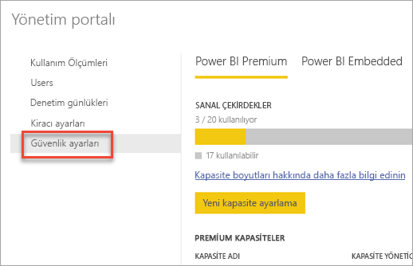

**Kapasite ayarları**'nı seçtiğinizde, varsayılan olarak Power BI Premium'un seçili olduğu kapasite yönetimi ekranına yönlendirilirsiniz.

### Yeni kapasite ayarlama (Power BI Premium)
Sanal çekirdek sayısı, kapasite oluşturmak için kullanılan miktarın yanı sıra sonraki kapasite oluşturma işlemleri için kullanılabilecek miktarı da gösterir. Kuruluşunuz için kullanılabilir sanal çekirdek miktarı, satın aldığınız Premium SKU'lara bağlıdır. Örneğin, bir P3 ve bir P2 satın alındığında 48 çekirdek kullanılabilirken, P3 satın alındığında 32, P2 satın alındığında ise 16 çekirdek sunulur.

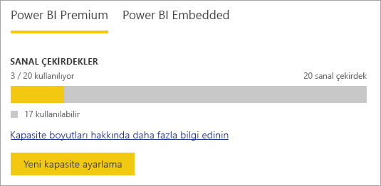

Kullanılabilir sanal çekirdekleriniz varsa aşağıdakileri yaparak yeni kapasitenizi ayarlayın.

1. **Yeni kapasite ayarlama** seçeneğini belirleyin.
2. Kapasitenize bir **ad** verin.
3. Bu kapasitenin kapasite yöneticisini tanımlayın.
   
    Kapasite yöneticilerinin Power BI yöneticisi veya Office 365 Genel yöneticisi olması gerekmez. Daha fazla bilgi için bkz. [Power BI Premium kapasite yöneticileri](#capacity-admins)
4. Kapasite boyutunuzu seçin. Mevcut seçenekler, sahip olduğunuz kullanılabilir sanal çekirdek sayısına bağlıdır. Kullanabildiğiniz sayıdan daha fazlasını gerektiren bir seçeneği belirleyemezsiniz.
   
    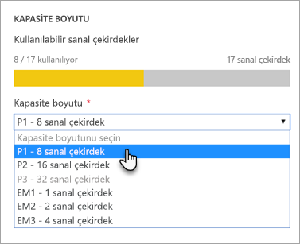
5. **Ayarla** seçeneğini belirleyin.

Kapasite yöneticilerinin yanı sıra Power BI yöneticileri ve Office 365 Genel Yöneticileri, yönetici portalında listelenen kapasiteyi görür.

### Güvenlik ayarları
Premium kapasite yönetimi ekranında, eylemler bölümündeki **dişli simgesini (ayarlar)** seçebilirsiniz. Bu, bir kapasiteyi yeniden adlandırmanıza veya silmenize olanak sağlar. Ayrıca hizmet yöneticilerinin kim olduğunu, SKU'yu/kapasite boyutunu ve kapasitenin bulunduğu bölgeyi de gösterir.

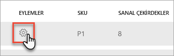

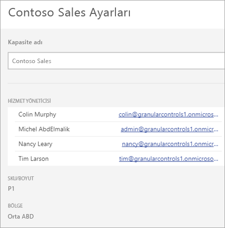

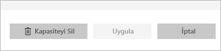

> [!NOTE]
> Power BI Embedded kapasite ayarları Microsoft Azure portalında yönetilir.
> 
> 

### Kapasite boyutunu değiştirme (Power BI Premium)
Power BI yöneticileri ve Office 365 Genel yöneticileri Power BI Premium kapasite boyutunu **Kapasite boyutunu değiştirme** seçeneğini belirleyerek değiştirir. Power BI yöneticisi veya Office 365 Genel yöneticisi olmayan kapasite yöneticileri bu seçeneğe sahip olmaz.

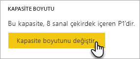

**Kapasite boyutunu değiştirme** ekranı, kullanılabilir kaynaklarınız varsa kapasite boyutunuzu yükseltmenize veya eski sürümü yüklemenize olanak tanır. Gereken sayıda sanal çekirdeğe sahip oldukları sürece yöneticiler düğüm oluşturabilir, düğümleri yeniden boyutlandırabilir ve silebilir. 

P SKU'lar EM SKU'lara düşürülebilir. Devre dışı bırakılan seçeneklerin üzerine geldiğinizde bir açıklamayla karşılaşırsınız.

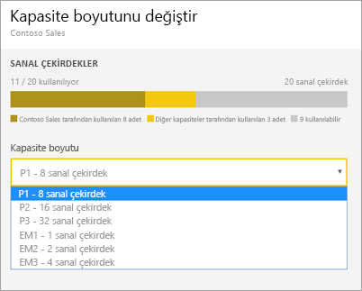

### Kapasite atama
Bir kapasite adını seçerek söz konusu kapasiteyi yönetebilirsiniz. Bu işlem sizi kapasite yönetimi ekranına yönlendirir.

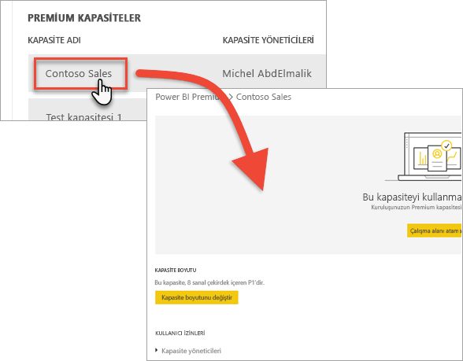

Kapasiteye hiçbir çalışma alanı atanmadıysa **Çalışma alanları atama** olanağı sunan bir ileti görürsünüz.

#### Kullanıcı izinleri
Power BI Premium kapasiteleri için ek **Kapasite yöneticileri** atayabilirsiniz. Ayrıca **kapasite atama izinlerine** sahip olacak kullanıcılar da atayabilirsiniz. Atama izinleri bulunan kullanıcılar, söz konusu çalışma alanının yöneticisi olmaları halinde kapasiteye uygulama çalışma alanı atayabilir. Bu kapasiteye kişisel Çalışma Alanlarını (*Çalışma Alanım*) da atayabilirler. Atama izinlerine sahip kullanıcılar yönetici portalına erişemez.

> [!NOTE]
> Power BI Embedded kapasitesi için kapasite yöneticileri Microsoft Azure portalında atanır.
> 
> 

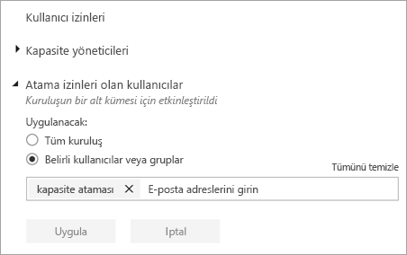

## Kullanım ölçümleri (Power BI Premium)
Her kapasiteye yönelik olarak, CPU, bellek ve DirectQuery kullanım ölçümlerini kullanabilirsiniz. Her KPI **Good** (İyi (yeşil)), **Marginal** (Marjinal (sarı)) ve **Critical** (Kritik (kırmızı)) olmak üzere üç göstergeye sahiptir. Kullanıcılarınızın, Premium içeriğini kullanırken iyi bir performans deneyimine sahip olmasını sağlamak üzere bu ölçümlerin izlenmesini öneririz.

**Power BI Embedded kapasite kullanımı Azure portalında izlenir.**

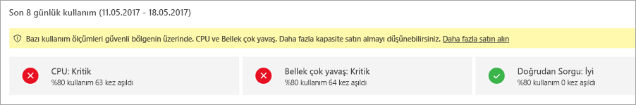

| Ölçüm | Açıklama |
| --- | --- |
| CPU |Çekirdeklerinizin CPU kullanımı. |
| Bellek |Arka uç çekirdeklerinizin bellek baskısını gösterir. Bu, özellikle birden çok modelin kullanılmasından kaynaklanan bellek baskısı nedeniyle modellerin bellekten ne sıklıkta çıkarıldığına ilişkin bir ölçümdür. |
| DQ/s |* Saniye başına toplam DirectQuery ve canlı bağlantı sorgusu sayısını sınırlarız. * Sınırlar şu şekildedir: P1 için 30/s, P2 için 60/s ve P3 için 120/s. * DirectQuery ve canlı bağlantı sorgusu sayısı yukarıdaki kısıtlamaya yönelik olarak birlikte hesaplanır. Örneğin, saniyede 15 DirectQuery bağlantısı ve 15 canlı bağlantıya sahipseniz kısıtlama noktanıza varmış olursunuz. * Bu, şirket içi ve bulut bağlantıları için aynı ölçüde geçerlidir. |

Bu ölçümlerin marjinal/kiritik olması halinde kullanıcılarınız, özellikle de yükün en yüksek olduğu zamanlarda rapor ve yenileme performansında düşüş gözlemleyebilir.

Ölçümler, geride bırakılan hafta boyunca gerçekleşen kullanımı yansıtır ve kapasitenin aşırı yüklü olması nedeniyle kullanıcılarınız için en iyi performansın sunulamadığı durumları göstermek için tasarlanmıştır.

Her *%80'in üzerinde kullanım* oluşumu, olası bir performans düşüşü durumu olarak değerlendirilmelidir. Çok fazla durum olması, kullanıcıların önemli performans sorunları yaşadığına yönelik sağlam bir göstergedir.

## Bir kapasiteye çalışma alanı atama
Bir kapasiteye çalışma alanı atayabilmenin birkaç yolu vardır.

### Yönetici portalındaki kapasite yönetimi
Kapasite yöneticilerinin yanı sıra Power BI yöneticileri ve Office 365 genel yöneticileri, yönetici portalının premium kapasite yönetimi bölümünde toplu olarak çalışma alanları atayabilir. Bir kapasiteyi yönetirken, çalışma alanları atamanızı sağlayan **Çalışma Alanları** bölümünü görürsünüz.

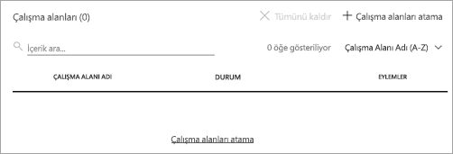

1. **Çalışma alanları atama** seçeneğini belirleyin. Bu seçenek birden fazla yerde bulunur ve hepsi aynı görevi gerçekleştirir.
2. **Tüm kuruluşun çalışma alanları** veya **Kullanıcılara göre belirli çalışma alanları** seçeneğini belirleyin.
   
   | Seçim | Açıklama |
   | --- | --- |
   | **Tüm kuruluşun çalışma alanları** |Tüm kuruluşun çalışma alanlarını Premium kapasiteye atamak kuruluşunuzdaki tüm Uygulama Çalışma Alanları'nı ve Çalışma Alanım adlı kişisel alanları bu Premium kapasiteye atar. Ayrıca mevcut ve gelecekteki tüm kullanıcılar bu kapasiteye çalışma alanlarını ayrı ayrı yeniden atama iznine sahip olur. |
   | **Kullanıcılara göre belirli çalışma alanları** |Çalışma alanlarını kullanıcıya veya gruba göre atadığınızda, söz konusu kullanıcıların sahip olduğu tüm çalışma alanları, kullanıcının kişisel çalışma alanı da dahil olmak üzere, Premium kapasiteye atanır. Söz konusu kullanıcılar çalışma alanı atama izinlerini otomatik olarak alır. Buna, farklı bir kapasiteye atanmış olan çalışma alanları da dahildir. |
3. **Uygula** seçeneğini belirleyin.

Bu seçenek, bir kapasiteye belirli çalışma alanları atamanıza olanak sağlamaz.

### Uygulama çalışma alanı ayarları
Söz konusu çalışma alanının ayarlarından Premium kapasiteye uygulama çalışma alanı da atayabilirsiniz. Bir premium kapasiteye uygulama çalışma alanı atamak için şunları yapın.

Bir çalışma alanını kapasiteye taşımak için söz konusu çalışma alanının yönetici izinlerinin yanı sıra bu kapasiteye ilişkin kapasite atama izinlerine de sahip olmanız gerekir. Çalışma alanı yöneticilerinin bir çalışma alanını Premium kapasiteden istedikleri zaman kaldırabileceğini unutmayın.

1. **Üç nokta (...)** simgesini ve **Çalışma alanını düzenle**'yi seçerek uygulama çalışma alanını düzenleyin.
   
    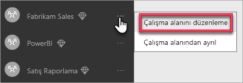
2. **Çalışma alanını düzenle** alanında **Gelişmiş** seçeneğini genişletin.
3. Herhangi bir kapasite için size kapasite atama izinleri verildiyse bu çalışma alanında **Premium**'u etkinleştirme seçeneğine sahip olursunuz.
4. Bu Uygulama çalışma alanını atamak istediğiniz kapasiteyi seçin.
   
    
5. **Kaydet**'i seçin.

Kaydedildikten sonra çalışma alanı ve tüm içerikleri, son kullanıcılar için herhangi bir deneyim kesintisi olmaksızın Premium kapasiteye taşınır.

## Premium, kullanıcılara nasıl görünür?
Çoğunlukla kullanıcıların Premium kapasitede olduklarını bilmelerine bile gerek yoktur. Panoları ve raporları normal şekilde çalışmaya devam eder. Görsel bir ipucu olarak, Premium kapasitedeki çalışma alanlarının yanında bir baklava simgesi görürsünüz. 

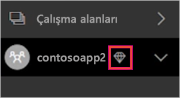

## Power BI Rapor Sunucusu ürün anahtarı)
Power BI yönetici portalının **Kapasite ayarları** sekmesinde Power BI Rapor Sunucusu ürün anahtarınıza erişebilirsiniz. Bu yalnızca Genel Yöneticiler veya Power BI hizmeti yönetici rolüne atanan kullanıcılar için ve Power BI Premium SKU satın aldıysanız kullanılabilir.

**Power BI Rapor Sunucusu anahtarı**'nı seçtiğinizde ürün anahtarınızı içeren bir iletişim kutusu görüntülenir. Ürün anahtarınızı kopyalayıp yükleme esnasında kullanabilirsiniz.

Daha fazla bilgi için bkz. [Power BI Rapor Sunucusu'nu yükleme](report-server/install-report-server.md).

## Sonraki adımlar
Çalışma alanını Premium kapasiteye atarken, yayımlanmış uygulamaları Ücretsiz hesap kullanıcıları ile paylaşın. Daha fazla bilgi için bkz. [Power BI'da uygulama oluşturma ve dağıtma](service-create-distribute-apps.md).

Başka bir sorunuz mu var? [Power BI Topluluğu'na sorun](http://community.powerbi.com/)

