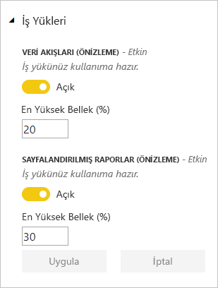
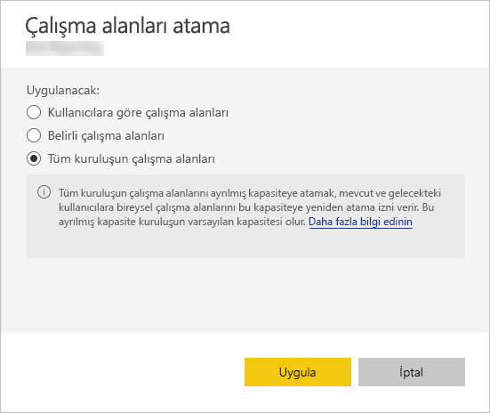

# Power BI Premium ve Power BI Embedded'da kapasiteleri yönetme

İçeriğiniz için ayrılmış kaynaklar sağlayan Power BI Premium ve Power BI Embedded kapasitelerini nasıl yönetebileceğinizi öğrenin.

## Kapasite nedir?

*Kapasite*, Power BI Premium ve Power BI Embedded tekliflerinin merkezindedir. Yalnızca kuruluşunuzun kullanımı için ayrılmış kaynak kümesidir. Ayrılmış kapasiteye sahip olmak kuruluşunuzdaki kullanıcılar için kullanıcı başına lisans satın almak zorunda kalmadan onlara pano, rapor ve veri kümesi yayımlamanıza olanak sağlar. Ayrıca kapasitede barındırılan içerikler için güvenilir ve tutarlı performans sağlar. Daha fazla bilgi için bkz. [Power BI Premium nedir?](service-premium.md).

### Kapasite yöneticileri

*Kapasite yöneticisi* olarak bir kapasiteye atandığınızda kapasite üzerinde tam kontrole ve kapasitenin yönetim özelliklerine sahip olursunuz. Power BI yönetici portalından daha fazla kapasite yöneticisi ekleyebilir veya kullanıcılara kapasite atama izinleri verebilirsiniz. Bir kapasiteye çalışma alanlarını toplu olarak atayabilir ve kapasitedeki kullanım ölçümlerini görüntüleyebilirsiniz.

> [!NOTE]
> Power BI Embedded için kapasite yöneticileri Microsoft Azure portalda tanımlanır.

Her kapasitenin kendisine ait yöneticileri vardır. Bir kapasiteye kapasite yöneticisi atamak bu yöneticilere kuruluşunuzdaki tüm kapasitelere erişim yetkisi vermez. Kapasite yöneticileri; kullanım ölçümleri, denetim günlükleri veya kiracı ayarları gibi tüm Power BI yönetici alanlarına varsayılan olarak erişim sahibi olmaz. Ayrıca kapasite yöneticileri, yeni kapasite ayarlama veya mevcut kapasitelerin SKU'sunu değiştirme iznine de sahip değildir. Yalnızca Office 365 Genel Yöneticileri veya Power BI hizmet yöneticileri bu öğelere erişebilir.

Tüm Office 365 Genel Yöneticileri ve Power BI hizmeti yöneticileri otomatik olarak hem Power BI Premium hem de Power BI Embedded kapasitesinin kapasite yöneticileridir.

## Kapasite satın alma

Ayrılmış kapasiteden yararlanmak için Office 365 yönetim merkezinde Power BI Premium satın almanız veya Microsoft Azure portalda Power BI Embedded kaynağı oluşturmanız gerekir. Daha fazla bilgi için aşağıdaki makaleleri inceleyin:

* **Power BI Premium:** [Power BI Premium'u satın alma](service-admin-premium-purchase.md)

* **Power BI Embedded:** [Azure portalında Power BI Embedded kapasitesi oluşturma](https://docs.microsoft.com/azure/power-bi-embedded/create-capacity)

Power BI Premium veya Embedded SKU'ları satın aldığınızda, kiracınız çalışan kapasitelerde kullanmak için uygun sayıda sanal çekirdek edinir. Örneğin, Power BI Premium P3 SKU satın almak kiracıya 32 sanal çekirdek sağlar. SKU'lar hakkında daha fazla bilgi için bkz. [Premium kapasite düğümleri](service-premium.md#premium-capacity-nodes).

## Premium, kullanıcılara nasıl görünür?

Çoğunlukla kullanıcıların Premium kapasitede olduklarını bilmelerine gerek yoktur. Panoları ve raporları normal şekilde çalışmaya devam eder. Görsel bir ipucu olarak, Premium kapasitedeki çalışma alanlarının yanında bir baklava simgesi bulunur.

## İş yüklerini yapılandırma

Varsayılan olarak, Power BI Premium ve Power BI Embedded kapasiteleri yalnızca bulutta Power BI sorguları çalıştırmayla ilişkili iş yüklerini destekler. Şimdi iki ek iş yükü için önizleme desteği sunuyoruz: **Sayfalandırılmış raporlar** ve **Veri akışları**. Daha fazla bilgi için bkz. [Premium kapasitedeki iş yükleri](service-premium.md#workloads-in-premium-capacity).

Power BI yönetici portalında iş yüklerini etkinleştirmek için aşağıdaki adımları izleyin.

1. **Kapasite ayarları** altında bir kapasite seçin.

1. **DİĞER SEÇENEKLER** altında **İş Yükleri**’ni genişletin.

1. Bir veya daha fazla iş yükünü etkinleştirin ve **En Büyük Bellek** için bir değer belirleyin.

    

1. **Apply** (Uygula) seçeneğini belirleyin.

## Kapasite kullanımı izleme

Power BI, kapasite kullanımını izlemek için bir uygulama sunmaktadır. Daha fazla bilgi için bkz. [Kuruluşunuzdaki Power BI Premium kapasitelerini izleme](service-admin-premium-monitor-capacity.md).

## Kapasiteyi yönetme

Office 365'te kapasite düğümü satın aldıktan sonra kapasite ayarlarını Power BI yönetici portalından yaparsınız. Power BI Premium kapasitelerini portalın **Kapasite ayarları** bölümünden yönetirsiniz.

Bir kapasite adını seçerek söz konusu kapasiteyi yönetirsiniz. Bu işlem sizi kapasite yönetimi ekranına yönlendirir.

Kapasiteye hiçbir çalışma alanı atanmadıysa [kapasiteye çalışma alanı atama](#assign-a-workspace-to-a-capacity) hakkında bir ileti görürsünüz.

### Yeni kapasite ayarlama (Power BI Premium)

Yönetici portalında kullandığınız ve kullanılabilir durumdaki *sanal çekirdek* sayısı gösterilir. Toplam sanal çekirdek sayısı, satın aldığınız Premium SKU'lara göre değişir. Örneğin, bir P3 ve bir P2 satın alındığında 48 çekirdek kullanılabilirken, P3 satın alındığında 32, P2 satın alındığında ise 16 çekirdek sunulur.

Kullanılabilir sanal çekirdekleriniz varsa aşağıdaki adımları izleyerek yeni kapasitenizi ayarlayabilirsiniz.

1. **Yeni kapasite ayarlama** seçeneğini belirleyin.

1. Kapasitenize bir ad verin.

1. Bu kapasitenin yöneticisini tanımlayın.

1. Kapasite boyutunuzu seçin. Mevcut seçenekler, sahip olduğunuz kullanılabilir sanal çekirdek sayısına bağlıdır. Kullanabildiğiniz sayıdan daha fazlasını gerektiren bir seçeneği belirleyemezsiniz.

    

1. **Ayarla** seçeneğini belirleyin.

    

Kapasite yöneticilerinin yanı sıra Power BI yöneticileri ve Office 365 Genel Yöneticileri, yönetici portalında listelenen kapasiteyi görür.

### Güvenlik ayarları

1. Premium kapasite yönetimi ekranında, **Eylemler** bölümündeki **dişli simgesini** seçerek ayarları gözden geçirip güncelleştirebilirsiniz. 

    

1. Hizmet yöneticilerinin kim olduğunu, SKU'yu/kapasite boyutunu ve kapasitenin bulunduğu bölgeyi görebilirsiniz.

    

1. İsterseniz bir kapasiteyi yeniden adlandırabilir veya silebilirsiniz.

    

> [!NOTE]
> Power BI Embedded kapasite ayarları Microsoft Azure portalda yönetilir.

### Kapasite boyutunu değiştir

Power BI yöneticileri ve Office 365 Genel Yöneticileri, Power BI Premium kapasitelerini değiştirebilir. Power BI yöneticisi veya Office 365 Genel Yöneticisi olmayan kapasite yöneticileri bu seçeneğe sahip olmaz.

1. **Kapasite boyutunu değiştir**'i seçin.

    

1. **Kapasite boyutunu değiştir** ekranında kapasitenizi yükseltebilir veya alt sürüme düşürebilirsiniz.

    

    Gereken sayıda sanal çekirdeğe sahip oldukları sürece yöneticiler düğüm oluşturabilir, düğümleri yeniden boyutlandırabilir ve silebilir.

    P SKU'lar EM SKU'lara düşürülemez. Devre dışı bırakılan seçeneklerin üzerine geldiğinizde bir açıklamayla karşılaşırsınız.

### Kullanıcı izinlerini yönetme

Ek kapasite yöneticileri ve *kapasite atama* iznine sahip kullanıcılar atayabilirsiniz. Atama izinleri bulunan kullanıcılar, söz konusu çalışma alanının yöneticisi olmaları halinde kapasiteye uygulama çalışma alanı atayabilir. Bu kapasiteye kişisel Çalışma Alanlarını (*Çalışma Alanım*) da atayabilirler. Atama izinlerine sahip kullanıcılar yönetici portalına erişemez.

> [!NOTE]
> Power BI Embedded için kapasite yöneticileri Microsoft Azure portalda tanımlanır.

**Kullanıcı izinleri** bölümünde **Atama izinleri olan kullanıcılar** bölümünü genişletin ve uygun kullanıcıları veya grupları ekleyin.

## Bir kapasiteye çalışma alanı atama

Kapasiteye çalışma alanı atamak için yönetici portalını ve uygulama çalışma alanlarını kullanabilirsiniz.

### Yönetici portalından atama

Kapasite yöneticilerinin yanı sıra Power BI yöneticileri ve Office 365 Genel Yöneticileri, yönetici portalının premium kapasite yönetimi bölümünde toplu olarak çalışma alanları atayabilir. Bir kapasiteyi yönetirken, çalışma alanları atamanızı sağlayan **Çalışma Alanları** bölümünü görürsünüz.

1. **Çalışma alanları atama** seçeneğini belirleyin. Bu seçenek birden fazla konumda mevcuttur.

1. **Uygula:** alanında bir seçenek belirleyin.

    

   | Seçim | Açıklama |
   | --- | --- |
   | **Kullanıcılara göre çalışma alanları** | Çalışma alanlarını kullanıcıya veya gruba göre atadığınızda, söz konusu kullanıcıların sahip olduğu tüm çalışma alanları, kullanıcının kişisel çalışma alanı da dahil olmak üzere, Premium kapasiteye atanır. Söz konusu kullanıcılar çalışma alanı atama izinlerini otomatik olarak alır. Buna, farklı bir kapasiteye atanmış olan çalışma alanları da dahildir. |
   | **Belirli çalışma alanları** | Seçili kapasiteye atamak istediğiniz belirli çalışma alanının adını girin. |
   | **Tüm kuruluşun çalışma alanları** | Tüm kuruluşun çalışma alanlarını Premium kapasiteye atamak kuruluşunuzdaki tüm uygulama çalışma alanlarını ve Çalışma Alanım adlı kişisel alanları bu Premium kapasiteye atar. Ayrıca mevcut ve gelecekteki tüm kullanıcılar bu kapasiteye çalışma alanlarını ayrı ayrı yeniden atama iznine sahip olur. |
   | | |

1. **Apply** (Uygula) seçeneğini belirleyin.

### Uygulama çalışma alanı ayarlarından atama

Söz konusu çalışma alanının ayarlarından Premium kapasiteye uygulama çalışma alanı da atayabilirsiniz. Bir çalışma alanını kapasiteye taşımak için söz konusu çalışma alanının yönetici izinlerinin yanı sıra bu kapasiteye ilişkin kapasite atama izinlerine de sahip olmanız gerekir. Çalışma alanı yöneticilerinin bir çalışma alanını Premium kapasiteden istedikleri zaman kaldırabileceğini unutmayın.

1. Üç nokta **(. . .)** simgesini ve **Çalışma alanını düzenle**'yi seçerek uygulama çalışma alanını düzenleyin.

    

1. **Çalışma alanını düzenle** alanında **Gelişmiş** seçeneğini genişletin.

1. Bu uygulama çalışma alanını atamak istediğiniz kapasiteyi seçin.

    

1. **Kaydet**'i seçin.

Kaydedildikten sonra çalışma alanı ve tüm içerikleri, son kullanıcılar için herhangi bir deneyim kesintisi olmaksızın Premium kapasiteye taşınır.

## Power BI Rapor Sunucusu ürün anahtarı

Power BI yönetici portalının **Kapasite ayarları** sekmesinde Power BI Rapor Sunucusu ürün anahtarınıza erişebilirsiniz. Bu yalnızca Genel Yöneticiler veya Power BI hizmeti yönetici rolüne atanan kullanıcılar için ve Power BI Premium SKU satın aldıysanız kullanılabilir.

**Power BI Rapor Sunucusu anahtarı**'nı seçtiğinizde ürün anahtarınızı içeren bir iletişim kutusu görüntülenir. Ürün anahtarınızı kopyalayıp yükleme esnasında kullanabilirsiniz.

Daha fazla bilgi için bkz. [Power BI Rapor Sunucusu'nu yükleme](report-server/install-report-server.md).

## Sonraki adımlar

Yayımlanan uygulamaları kullanıcılarla paylaşma. Daha fazla bilgi için bkz. [Power BI'da uygulama oluşturma ve dağıtma](service-create-distribute-apps.md).

Başka bir sorunuz mu var? [Power BI Topluluğu'na sorun](http://community.powerbi.com/)
