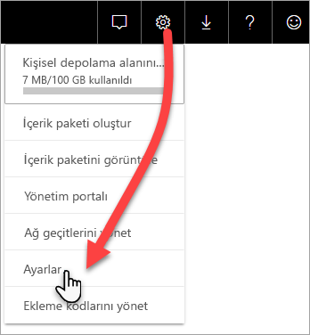
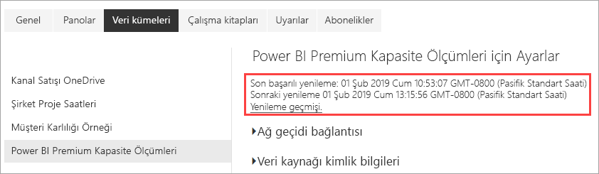

# Uygulama ile Premium kapasiteleri izleme

Premium kapasite kaynaklarını en iyi şekilde kullanma konusunda bilinçli kararlar alabilmek için kapasitelerinizi izlemek temel önem taşır. Kapasiteleri Yönetim portalında veya **Power BI Premium Kapasite Ölçümleri** uygulamasıyla izleyebilirsiniz. Bu makalede Premium Kapasite Ölçümleri uygulamasının kullanımı açıklanır. Uygulama kapasitenizin performansıyla ilgili en ayrıntılı bilgileri sağlar. Son yedi günün ortalama kullanım ölçümlerine üst düzey bir genel bakış için Yönetim portalını kullanabilirsiniz. Portalı izleme hakkında daha fazla bilgi edinmek için bkz. [Yönetim portalında Premium kapasiteleri izleme](service-admin-premium-monitor-portal.md).

Uygulama yeni özellikler ve işlevsellikle düzenli olarak güncelleştirilir. En son sürümü çalıştırdığınızdan emin olun.
**Uygulamanın en son sürümü 1.10.1.1'dir (5 Şubat 2019)**.   
Uygulamanın önceki bir sürümünü zaten yüklediyseniz, en iyisi bunu uygulamalarınızdan silmek ve sonra CTRL+F5 tuşlarına basarak yenilemektir. 

## Uygulamayı yükleme

Doğrudan [Premium Kapasite Ölçümleri uygulamasına](https://app.powerbi.com/groups/me/getapps/services/capacitymetrics) gidebilir veya Power BI'daki diğer uygulamalar gibi yükleyebilirsiniz.

1. Power BI'da **Uygulamalar**'a tıklayın.   
    

2. Sağ taraftaki **Uygulama edinin**'e tıklayın.
3. **Uygulamalar** kategorisinde **Power BI Premium Capacity Metrics uygulamasını** arayın.
4. Uygulamayı yüklemek için abone olun.

Sabırlı olun. Ölçümleri yüklemek ve yenilemek birkaç dakika sürer. Uygulama boş ölçümler gösteriyorsa, F5 tuşuna basarak tarayıcınızı yenileyin.

## Uygulama yenileme geçmişini alma

Premium Kapasite Ölçümleri uygulamanızın en son ne zaman yenilendiğine bakmak için, **Ayarlar** > **Veri Kümeleri** > **Power BI Premium Kapasite Ölçümleri** > **Yenileme Geçmişi**'ne tıklayın. 

Son yenileme gösterilir; zamanlanmış ve isteğe bağlı yenilemeleri görmek için **Yenileme geçmişi**'ne tıklayın.

## Uygulamayla bir kapasiteyi izleme

Artık uygulamayı yüklediğinize göre kuruluşunuzdaki kapasitelerin ölçümlerini görebilirsiniz. Şimdi kullanılabilir durumdaki bazı önemli ölçümlere göz atalım.

### Ölçümler panosu

Uygulamayı ilk açtığınızda yönetici haklarına sahip olduğunuz tüm kapasitelerin özetini kapsayan bir pano gösterilir.

Panoda aşağıdaki ölçümler bulunur:

| **Rapor bölümü** | **Metrics** (Ölçümler) |
| --- | --- |
| **Sistem Özeti** |  Uygulamanın sürümü   Yöneticisi olduğunuz kapasitelerin sayısı   Ölçümleri bildiren kapasitelerinizdeki çalışma alanlarının sayısı   GB cinsinden son yedi gün içindeki ortalama bellek tüketimi   GB cinsinden son yedi gün içindeki maksimum bellek tüketimi   Maksimum bellek tüketiminin gerçekleştiği yerel saat   Son yedi gün içinde CPU kullanımının eşik değerlerin %80'ini aşma sayısı (üç dakikalık demetlere ayrılmıştır)   Son yedi gün içinde CPU kullanımının %80'i en çok aştığı zaman (bir saatlik demetlere ayrılmıştır)   CPU kullanımının bir saat içinde %80'i aştığı yerel saat |
| **Veri Kümesi Özeti** |  Kapasitelerinizdeki tüm çalışma alanlarında yer alan veri kümelerinin toplam sayısı   Son yedi gün içinde Doğrudan sorgu/Canlı bağlantı kullanımının eşik değerlerin %80'ini aşma sayısı (üç dakikalık demetlere ayrılmıştır)   Son yedi gün içinde Doğrudan sorgu/Canlı bağlantı kullanımının %80'i en çok aştığı zaman (bir saatlik demetlere ayrılmıştır)   Doğrudan sorgu/Canlı bağlantı kullanımının bir saat içinde %80'i en çok aştığı yerel saat   Son yedi gün içinde gerçekleştirilen toplam yenileme sayısı   Yenileme için ortalama bekleme süresi: planlanan zamanla yenilemenin başlatılması arasındaki ortalama gecikme süresi (dakika cinsinden)   Ortalama yenileme süresi: yenilemenin tamamlanması için geçen süre (dakika cinsinden)   Son yedi gün içinde çalıştırılan toplam sorgu sayısı   Sorgu için ortalama bekleme süresi: bir sorgunun yürütülmeden önce sistem kaynaklarında beklediği süre (milisaniye cinsinden)   Ortalama sorgu süresi: sorgunun tamamlanması için geçen süre (milisaniye cinsinden)   Bellek baskısı nedeniyle çıkarılan toplam model sayısı   Veri kümelerinin ortalama boyutu    Belleğe yüklenen veri kümelerinin ortalama sayısı |
| **Veri Akışı Özeti** |  Kapasitelerinizdeki tüm çalışma alanlarında yer alan veri akışlarının toplam sayısı   Son yedi gün içinde gerçekleştirilen toplam yenileme sayısı   Yenileme için ortalama bekleme süresi: planlanan zamanla yenilemenin başlatılması arasındaki ortalama gecikme süresi (dakika cinsinden)   Ortalama yenileme süresi: yenilemenin tamamlanması için geçen süre (dakika cinsinden) |
| **Sayfalandırılmış Rapor Özeti** |  Kapasitelerinizdeki tüm çalışma alanlarında yer alan sayfalandırılmış raporların toplam sayısı   Tüm raporların kullanıcılarınız tarafından toplamda kaç kez görüntülendiğini gösteren sayı   Tüm raporlardaki veri satırlarının toplam sayısı   Tüm raporların veri alma, işlemden geçirme ve işleme gibi tüm aşamaları için geçen toplam süre (milisaniye cinsinden) |
|  |  |

### Ölçümler raporu

Temel alınan rapora dönmek için panoya tıklayın. Raporun alt kısmında beş sekme vardır:

* [**Veri kümeleri**](#datasets): Kapasitelerinizdeki Power BI veri kümelerinin durumu hakkında ayrıntılı ölçümler.

* [**Sayfalandırılmış Raporlar**](#paginated-reports): Kapasitelerinizdeki sayfalandırılmış raporların durumu hakkında ayrıntılı ölçümler.

* [**Veri Akışları**](#dataflows): Kapasitelerinizdeki veri akışlarının ayrıntılı yenileme ölçümleri.

* [**Kaynak Tüketimi**](#resource-consumption): Bellek ve CPU’nun yüksek kullanımı gibi genel kapasite ölçümleri.

* [**Kimlikler ve Bilgiler**](#ids-and-info): Kapasiteler, çalışma alanları ve iş yüklerinin adları, kimlikleri ve sahipleri.

Her sekmede ölçümleri kapasiteye veya tarih aralığına göre filtreleyebilirsiniz. Hiçbir filtre seçilmezse, rapor varsayılan olarak ölçümleri bildiren tüm kapasiteler için son haftanın ölçümlerini gösterir. 

#### Veri kümeleri

Farklı alanlara gitmek için **Veri Kümeleri** sekmesinin en üstündeki düğmeleri kullanın: **Yenilemeler**, **Sorgu Süreleri**, **Sorgu Bekleme Süreleri** ve **Veri Kümeleri**.

##### Yenilemeler alanı

**Yenilemeler** alanı aşağıdaki ölçümleri içerir.

| **Rapor bölümü** | **Metrics** (Ölçümler) |
| --- | --- |
| **Yenileme güvenilirliği** |  Toplam Sayı: Her veri kümesi için toplam yenileme sayısı   Güvenilirlik: Her veri kümesi için tamamlanan yenilemelerin yüzdesi   Ortalama Bekleme Süresi: Zamanlanan saat ve veri kümesinin yenileme başlangıcı arasındaki ortalama gecikme süresi (dakika cinsinden)   En Uzun Bekleme Süresi: Veri kümesi için en uzun bekleme süresi (dakika cinsinden)    Ortalama Süre: Veri kümesi yenilemesinin ortalama süresi (dakika cinsinden)   En Uzun Süre: Veri kümesinin en uzun çalışan yenilemesinin süresi (dakika cinsinden) |
| **Ortalama Yenileme Süresine Göre En İyi 5 Veri Kümesi** |  Dakika cinsinden en uzun ortalama yenileme süresine sahip beş veri kümesi |
| **Ortalama Bekleme Süresine Göre En İyi 5 Veri Kümesi** |  Dakika cinsinden en uzun ortalama yenileme bekleme süresine sahip beş veri kümesi |
| **Saatlik Ortalama Yenileme Bekleme Süreleri** |  Bir saatlik demetlere ayrılmış ve yerel saatle bildirilen ortalama yenileme bekleme süresi. Yüksek yenileme bekleme süresi getiren birden çok ani artış, kapasiteye sık erişildiğini gösterir. |
| **Saatlik Yenileme Sayısı ve Bellek Tüketimi** |  Bir saatlik demetlere ayrılan ve yerel saatle raporlanan başarılar, başarısızlıklar ve bellek tüketimi |
|  |  |

##### Sorgu Süreleri alanı

**Sorgu Süreleri** alanı aşağıdaki ölçümleri içerir.

| **Rapor bölümü** | **Metrics** (Ölçümler) |
| --- | --- |
| **Sorgu Süreleri** |  Bu bölümdeki veriler, çalışma alanı ve son yedi gün içindeki saatlik demetlere göre ayrılmıştır   Toplam: Veri kümesi için çalıştırılan sorguların toplam sayısı   Ortalama: Veri kümesi için ortalama sorgu süresi (milisaniye cinsinden)   Maksimum: Veri kümesinde en uzun süre çalışan sorgunun süresi (milisaniye cinsinden)|
| **Sorgu Süresi Dağılımı** |  Sorgu süresi histogramında sorgu süreleri şu kategorilere göre ayrılmış şekilde (milisaniye cinsinden) gösterilir: <= 30 ms, 30-100 ms, 100-300 ms, 300 ms-1 sn, 1 sn-3 sn, 3 sn-10 sn, 10 sn-30 sn ve > 30 saniyelik aralıklar. Uzun sorgu ve bekleme süreleri, kapasitede az yer kaldığının göstergesidir. Tek bir veri kümesinin sorunlara yol açtığı ve daha fazla araştırma gerektiği anlamına da gelebilir. |
| **Ortalama Süreye Göre En İyi 5 Veri Kümesi** |  Milisaniye cinsinden en uzun ortalama sorgu süresine sahip beş veri kümesi |
| **Doğrudan Sorgu / Canlı Bağlantılar (> %80 Kullanım)** |  Doğrudan sorgunun veya canlı bağlantının %80 CPU kullanımını kaç kez aştığı (yerel saatte bir saatlik aralıklara bölünmüş olarak) |
| **Saatlik Sorgu Süresi Dağılımları** |  Sorgu sayıları ve ortalama süre (milisaniye) ile GB olarak bellek tüketimi arasındaki karşılaştırma (yerel saatte bir saatlik aralıklara bölünmüş olarak) |
|  |  |

##### Sorgu Beklemeleri alanı

**Sorgu Beklemeleri** alanı aşağıdaki ölçümleri içerir.

| **Rapor bölümü** | **Metrics** (Ölçümler) |
| --- | --- |
| **Sorgu Bekleme Süreleri** |  Bu bölümdeki veriler, çalışma alanı ve son yedi gün içindeki saatlik demetlere göre ayrılmıştır   Toplam: Veri kümesi için çalıştırılan sorguların toplam sayısı   Bekleme sayısı: Veri kümesinde yürütülmeye başlamadan önce sistem kaynaklarında bekletilen sorguların sayısı    Ortalama: Veri kümesi için ortalama sorgu bekleme süresi (milisaniye cinsinden)   Maksimum: Veri kümesinde en uzun süre bekleyen sorgunun süresi (milisaniye cinsinden)|
| **Bekleme Süresi Dağılımı** |  Sorgu süresi histogramında sorgu süreleri şu kategorilere göre ayrılmış şekilde (milisaniye cinsinden) gösterilir: <= 50 ms , 50-100 ms , 100-200 ms , 200-400 ms 400 ms-1 sn, 1 sn-5 sn ve > 5 saniyelik aralıklar |
| **Ortalama Bekleme Süresine Göre En İyi 5 Veri Kümesi** |  Sorgunun yürütülmesi için ortalama bekleme süresi (milisaniye cinsinden) en uzun olan beş veri kümesi |
| **Saatlik Sorgu Bekleme Süresi Sayıları ve Süreleri** |  Sorgu bekleme sayıları ve ortalama bekleme süresi (milisaniye) ile GB olarak bellek tüketimi arasındaki karşılaştırma (yerel saatte bir saatlik aralıklara bölünmüş olarak) |
|  |  |

##### Veri kümeleri alanı

**Veri kümeleri** alanı aşağıdaki ölçümleri içerir.

| **Rapor bölümü** | **Metrics** (Ölçümler) |
| --- | --- |
| **Veri Kümesi Çıkarma Sayıları** |  Toplam: Her kapasite için veri kümesi *çıkarmalarının* toplam sayısı. Kapasite, bellek baskısıyla karşı karşıya kaldığında düğüm bir veya daha fazla veri kümesini bellekten çıkarır. Devre dışı olan veri kümeleri (sorgu/yenileme işlemi yürütülmeyen) önce çıkarılır. Çıkarma sırası, 'en önce kullanılan' (LRU) ölçütüne göre belirlenir.|
| **Saatlik Veri Kümesi Çıkarmaları ve Bellek Tüketimi** |  Bir saatlik demetlere ayrılan ve yerel saatle raporlanan veri kümesi çıkarmaları ile GB cinsinden bellek tüketimi karşılaştırması |
| **Saatlik Yüklenen Veri Kümesi Sayısı** |  Bir saatlik demetlere ayrılan ve yerel saat cinsinden raporlanan, belleğe yüklenen veri kümesi sayısı ile GB cinsinden bellek tüketimi karşılaştırması |
| **Tüketilen Bellek Yüzdeleri** |  Toplam belleğin yüzdesi olarak bellekteki etkin veri kümelerinin toplamı. Etkin ile Tümü arasındaki delta çıkarılabilen veri kümelerini tanımlar. Önceki yedi gün için saatlik olarak gösterilir. |
| **Veri Boyutları**  |  En büyük boyut: Gösterilen zaman aralığında en büyük veri kümesinin MB cinsinden boyutu |
|  |  |

#### Sayfalandırılmış raporlar

**Sayfalandırılmış raporlar** sekmesinde, kapasitelerinizdeki sayfalandırılmış raporların durumu hakkında ayrıntılı ölçümler gösterilir.

| **Rapor bölümü** | **Metrics** (Ölçümler) |
| --- | --- |
| **Genel kullanım** |  Toplam Görüntüleme Sayısı: Raporun bir kullanıcı tarafından toplam görüntülenme sayısı   Satır Sayısı: Rapordaki veri satırlarının sayısı   Alma (ortalama): Raporun verilerini almak için gereken ortalama süre (milisaniye cinsinden). Uzun süreler yavaş çalışan sorgulara veya başka veri kaynağı sorunlarına işaret ediyor olabilir.    İşlem yapma (ortalama): Raporun verileri üzerinde işlem yapmak için gereken ortalama süre (milisaniye cinsinden)  İşleme (ortalama): Raporu tarayıcıda işlemek için gereken ortalama süre (milisaniye cinsinden)   Toplam süre: Raporun tüm aşamaları için gereken süre (milisaniye cinsinden)|
| **Ortalama Veri Alma Süresine Göre İlk 5 Rapor** |  Milisaniye cinsinden ortalama veri alma süresi en uzun olan beş rapor |
| **Ortalama Rapor İşlem Yapma Süresine Göre İlk 5 Rapor** |  Milisaniye cinsinden ortalama raporda işlem yapma süresi en uzun olan beş rapor |
| **Saatlik Süreler** |  Bir saatlik demetlere ayrılmış olarak ve yerel saatle bildirilen veri alma süresiyle işlem yapma ve işleme sürelerinin karşılaştırması |
| **Saatlik Sonuçlar** |  Bir saatlik demetlere ayrılan ve yerel saatle raporlanan başarılar, başarısızlıklar ve bellek tüketimi |
|  |  |

#### Veri akışları

**Veri Akışları** sekmesinde, kapasitelerinizdeki veri akışlarının ayrıntılı yenileme ölçümleri gösterilir.

| **Rapor bölümü** | **Metrics** (Ölçümler) |
| --- | --- |
| **Yenile** |  Toplam: Her veri akışı için toplam yenileme sayısı   Güvenilirlik: Her veri akışı için tamamlanan yenilemelerin yüzdesi   Ortalama Bekleme Süresi: Zamanlanan saat ve veri akışının yenileme başlangıcı arasındaki ortalama gecikme süresi (dakika cinsinden)   En Uzun Bekleme Süresi: Veri akışının en uzun bekleme süresi (dakika cinsinden)    Ortalama Süre: Veri akışı yenilemesinin ortalama süresi (dakika cinsinden)   En Uzun Süre: Veri akışında en uzun zamandır çalışan yenilemenin süresi (dakika cinsinden) |
| **Ortalama Yenileme Süresine Göre En İyi 5 Veri Akışı** |  Dakika cinsinden ortalama yenileme süresi en uzun olan beş veri akışı |
| **Ortalama Bekleme Süresine Göre En iyi 5 Veri Akışı** |  Dakika cinsinden ortalama yenileme bekleme süresi en uzun olan beş veri akışı |
| **Saatlik Ortalama Yenileme Bekleme Süreleri** |  Bir saatlik demetlere ayrılmış ve yerel saatle bildirilen ortalama yenileme bekleme süresi. Yüksek yenileme bekleme süresi getiren birden çok ani artış, kapasiteye sık erişildiğini gösterir. |
| **Saatlik Yenileme Sayısı ve Bellek Tüketimi** |  Bir saatlik demetlere ayrılan ve yerel saatle raporlanan başarılar, başarısızlıklar ve bellek tüketimi |
|  |  |

#### Kaynak Tüketimi

**Kaynak Tüketimi** sekmesi tüm kapasite ve iş yüklerindeki CPU ve bellek tüketimini gösterir.

| **Rapor bölümü** | **Metrics** (Ölçümler) |
| --- | --- |
| **CPU tüketimi** |  Toplam CPU kapasitesinin yüzdesi olarak iş yüküne göre tüketim. Önceki yedi gün için saatlik olarak gösterilir. |
| **Bellek tüketimi** |  İş yükü sınırlarıyla (noktalı çizgi) çakışan iş yüküne (düz çizgiler) göre GB cinsinden bellek tüketimi. Önceki yedi gün için saatlik olarak gösterilir. |
|  |  |

#### Kimlikler ve Bilgiler

**Kimlikler ve Bilgiler** sekmesinde kapasitelerin, çalışma alanlarının ve iş yüklerinin adları, kimlikleri ve sahipleri yer alır.

## Power BI Embedded kapasitesini izleme

Power BI Premium Kapasite Ölçümleri uygulamasını kullanarak Power BI Embedded içindeki *A SKU* kapasitelerini izleyebilirsiniz. Yöneticisi olduğunuz kapasiteler raporda gösterilir. Ancak Power BI'a A SKU'larınız üzerinde belirli izinleri vermediğiniz sürece raporun yenilenmesi başarısız olur:

1. Azure portalda kapasitenizi açın.

1. **Erişim denetimi (IAM)** öğesine tıklayın ve “Power BI Premium” uygulamasını okuyucu rolüne ekleyin. Uygulamayı adıyla bulamazsanız istemci kimliğini kullanın: cb4dc29f-0bf4-402a-8b30-7511498ed654.

    

> [!NOTE]
> Power BI Embedded kapasitesi kullanımını uygulamadan veya Azure portaldan izleyebilirsiniz ancak bu işlemi Power BI yönetici portalından gerçekleştiremezsiniz.

## Sonraki adımlar

> [!div class="nextstepaction"]
> [Power BI Premium kapasite kaynak yönetimi ve en iyi duruma getirme](service-premium-understand-how-it-works.md)
