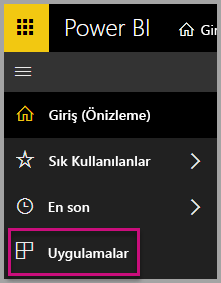
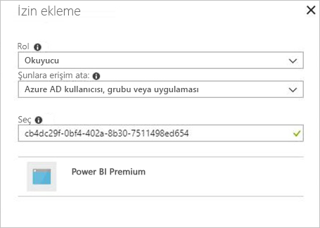
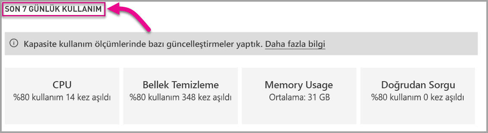

# Power BI Premium ve Power BI Embedded kapasitelerini izleme

Bu makalede, Power BI Premium kapasitelerinizin ölçümlerini izlemeyle ilgili genel bakış bilgilerine yer verilmiştir. Kapasite kullanımını izleyerek kapasitelerinizi yönetme konusunda bilgiye dayalı bir yaklaşım sergileyebilirsiniz.

Kapasiteyi izlemek için Power BI Premium Capacity Metrics uygulamasını veya yönetici portalını kullanabilirsiniz. Daha fazla ayrıntı sunduğu için uygulamayı kullanmanızı öneririz ancak bu makalede iki seçeneğe de bakacağız.

<iframe width="560" height="315" src="https://www.youtube.com/embed/UgsjMbhi_Bk?rel=0&amp;showinfo=0" frameborder="0" allowfullscreen></iframe>

## Premium Capacity Metrics uygulamasını yükleme

Doğrudan [Premium Capacity Metrics uygulamasına](https://app.powerbi.com/groups/me/getapps/services/capacitymetrics) gidebilir veya Power BI'daki diğer uygulamalar gibi yükleyebilirsiniz.

1. Power BI'da **Uygulamalar**'a tıklayın.

    

2. Sağ taraftaki **Uygulama edinin**'e tıklayın.

3. **Uygulamalar** kategorisinde **Power BI Premium Capacity Metrics uygulamasını** arayın.

4. Uygulamayı yüklemek için abone olun.

Uygulamayı yükledikten sonra kuruluşunuzdaki kapasitelere ait ölçümleri görebilirsiniz. Şimdi kullanılabilir durumdaki bazı önemli ölçümlere göz atalım.

## Ölçümler uygulamasını kullanma

Uygulamayı ilk açtığınızda yönetici haklarına sahip olduğunuz tüm kapasitelerin özetini kapsayan bir pano gösterilir.

Raporda üç sekme vardır ve bunlar aşağıdaki bölümlerde daha ayrıntılı olarak açıklanmaktadır.

* **Tüm sayfalara uygulanan filtreler**: rapordaki diğer sayfaları belirli bir kapasiteye filtrelemenize olanak tanır.
* **Veri kümeleri**: kapasitelerinizdeki veri kümelerinin durumu hakkında ayrıntılı ölçümler sağlar.
* **Sistem**: bellek ve CPU yüksek kullanımı gibi genel kapasite ölçümlerini sağlar. 

### Tüm sayfalara uygulanan filtreler

**Tüm sayfalara uygulanmış olan filtreler** sekmesinden kapasite, veri kümesi ve son yedi gün içindeki bir tarih aralığını seçebilirsiniz. Filtreler daha sonra rapordaki tüm ilgili sayfalara ve kutucuklara uygulanır. Hiçbir filtre seçilmezse, rapor varsayılan olarak sahip olduğunuz tüm kapasiteler için son haftanın ölçümlerini gösterir.

### Veri Kümeleri sekmesi

**Veri kümeleri** sekmesi uygulamadaki toplu ölçümleri sağlar. Farklı alanlara gitmek için sekmenin üstündeki düğmeleri kullanın: **Özet**, **Yenilemeler**, **Sorgu Süreleri**, **Sorgu Beklemeleri** ve **Veri Kümeleri**.

#### Özet bölgesi

**Özet** alanında varlıklara, sistem kaynaklarına ve veri kümesi iş yüklerine göre kapasitelerinizin bir görünümü gösterilir.

| | **Metrics** (Ölçümler) |
| --- | --- |
| **Entities** (Varlıklar) | * Sahip olduğunuz kapasite sayısı  * Kapasitenizdeki benzersiz veri kümesi sayısı  * Kapasitenizdeki benzersiz çalışma alanı sayısı |
| **System** (Sistem) | * GB cinsinden son yedi gün içindeki ortalama bellek kullanımı  * GB cinsinden son yedi gün içindeki en yüksek bellek tüketimi ve gerçekleştiği yerel saat  * Son yedi gün içinde CPU kullanımının eşik değerlerin %80'ini aşma sayısı, üç dakikalık parçalara ayrılmıştır  * Son yedi gün içinde CPU kullanımının %80'ini en çok aştığı zaman, bir saatlik parçalara ayrılmıştır ve yerel saatte gösterilir  * Son yedi gün içinde Doğrudan sorgu/Canlı bağlantı kullanımının eşik değerlerin %80'ini aşma sayısı, üç dakikalık parçalara ayrılmıştır  * Son yedi gün içinde Doğrudan sorgu/Canlı bağlantı kullanımının %80'ini en çok aştığı zaman, bir saatlik parçalara ayrılmıştır ve yerel saatte gösterilir |
| **Veri Kümesi İş Yükleri** | * Son yedi gün içinde gerçekleştirilen toplam yenileme sayısı  * Son yedi gün içinde gerçekleştirilen toplam başarılı yenileme sayısı  * Son yedi gün içinde gerçekleştirilen toplam başarısız yenileme sayısı  * Yetersiz bellek nedeniyle başarısız olan toplam yenileme sayısı  * Dakika cinsinden ortalama yenileme süresi, işlemin tamamlanması için geçen süre  * Dakika cinsinden ortalama yenileme bekleme süresi, planlanan zamanla işlemin başlatılması arasındaki ortalama gecikme  * Son yedi gün içinde çalıştırılan toplam sorgu sayısı  * Son yedi gün içinde gerçekleştirilen toplam başarılı sorgu sayısı  * Son yedi gün içinde gerçekleştirilen toplam başarısız sorgu sayısı  * Dakika cinsinden ortalama sorgu süresi, işlemin tamamlanması için geçen süre  * Bellek baskısı nedeniyle çıkarılan toplam model sayısı |
|  |  |

#### Yenilemeler alanı

**Yenilemeler** alanında son yedi gün içindeki toplam yenileme sayısı, başarılı ölçümler, ortalama/maksimum yenileme bekleme süresi ve ortalama/maksimum yenileme süresi veri kümelerine ayrılmış şekilde gösterilir. En alttaki iki grafikte yenilemelerle GB cinsinden bellek tüketiminin karşılaştırması gösterilir. Ortalama bekleme süreleri bir saatlik parçalara ayrılır ve yerel saate göre belirtilir. Üstteki çubukta veri kümesinin yenilenmesinin tamamlanması için geçen ortalama süre (yenileme süresi) ve ortalama yenileme bekleme süresine göre ilk beş veri kümesi listelenir. Birden çok yüksek yenileme bekleme süresi artışı kapasiteye sık erişildiğini gösterir.

#### Sorgu Süreleri alanı

**Sorgu Süreleri** alanında toplam sorgu çalıştırma sayısına ek olarak milisaniye cinsinden ortalama/maksimum süre bilgileri listelenir. Bu veriler veri kümeleri, çalışma alanı ve son yedi gün içindeki saatlik demetlere göre ayrılmıştır. Alt grafiklerde sorgu sayıları ve ortalama süre (milisaniye) ile GB olarak bellek tüketimi arasındaki karşılaştırma, yerel saatte bir saatlik aralıklara bölünmüş halde gösterilir.

Sağ üstteki grafikte sorgu süresi dağıtım histogramı görüntülenir. Histogramda bildirilen sorgu süreleri milisaniye cinsinden ve şu kategorilere göre ayrılmış şekilde gösterilir: <= 30 ms, 30-100 ms, 100-300 ms, 300 ms-1 sn, 1 sn-3 sn, 3 sn-10 sn, 10 sn-30 sn ve > 30 saniyelik aralıklar.

Sağ alttaki grafikte, sorguların tamamlanması için geçen ortalama sorgu süresine göre ilk beş veri kümesi listelenir.

Uzun sorgu ve bekleme süreleri, kapasitede az yer kaldığının göstergesidir. Tek bir veri kümesinin sorunlara yol açtığı ve daha fazla araştırma gerektiği anlamına da gelebilir.

#### Sorgu Beklemeleri alanı

**Sorgu Beklemeleri** alanında toplam çalışan sorgu sayısı, Canlı sorgu/Doğrudan sorgu için toplam sorgu bekleme sayısı ve milisaniye cinsinden ortalama/maksimum bekleme süresi listelenir. Bu veriler veri kümeleri, çalışma alanı ve son yedi gün içindeki saatlik demetlere göre ayrılmıştır. Alt grafiklerde sorgu bekleme sayıları ve ortalama bekleme süresi (milisaniye) ile GB olarak bellek tüketimi arasındaki karşılaştırma, yerel saatte bir saatlik aralıklara bölünmüş halde gösterilir.

Sağ üstteki grafikte sorgu bekleme süresi dağıtım histogramı görüntülenir. Histogramda bildirilen sorgu süreleri milisaniye cinsinden ve şu kategorilere göre ayrılmış şekilde gösterilir: <= 50 ms , 50-100 ms , 100-200 ms , 200-400 ms 400 ms-1 sn, 1 sn-5 sn ve > 5 saniyelik aralıklar.

Sağ alttaki grafikte, sorguların başlatılması için geçen ortalama bekleme süresine göre ilk beş veri kümesi listelenir.

#### Veri kümeleri alanı

**Veri kümeleri** alanında saatlere göre bellek baskısı nedeniyle çıkarılan tam veri kümeleri gösterilir.

### System (Sistem) sekmesi

**Sistem** sekmesinde, yüksek CPU kullanım süreleri (%80 kullanımın aşıldığı durumların sayısını), yüksek doğrudan sorgu/canlı bağlantı kullanımı ve bellek tüketimi gösterilir.

## Power BI Embedded kapasitesini izleme

Power BI Premium Capacity Metrics uygulamasını kullanarak Power BI Embedded içindeki *A SKU* kapasitelerini de izleyebilirsiniz. Yöneticisi olduğunuz kapasiteler raporda gösterilir. Ancak Power BI'a A SKU'larınız üzerinde belirli izinleri vermediğiniz sürece raporun yenilenmesi başarısız olur:

1. Azure portalda kapasitenizi açın.
1. **Erişim denetimi (IAM)** öğesine tıklayın ve “Power BI Premium” uygulamasını okuyucu rolüne ekleyin. Uygulamayı adıyla bulamazsanız istemci kimliğini kullanın: cb4dc29f-0bf4-402a-8b30-7511498ed654.

    

> [!NOTE]
> Power BI Embedded kapasitesi kullanımını uygulamadan veya Azure portaldan izleyebilirsiniz ancak bu işlemi Power BI yönetici portalından gerçekleştiremezsiniz.

## Yönetici portalında temel izleme

Yönetici portalının **Kapasite ayarları** bölümünde kapasitenize tarafından kullanılan kaynakların son yedi gün içindeki yükünü gösteren dört gösterge bulunur. Bu dört kutucuk saat ortalamasını baz alır ve son yedi günde ilgili ölçümün %80'in üzerinde olduğu saat sayısını gösterir. Bu ölçüm, son kullanıcı deneyimindeki olası düşüşleri ifade eder.

| **Ölçüm** | **Açıklama** |
| --- | --- |
| CPU |CPU’nun %80 kullanımı aşma sayısı. |
| Bellek Temizleme |Arka uç çekirdeklerinizdeki bellek baskısını gösterir. Bu, özellikle birden çok veri kümesinin kullanılmasından kaynaklanan bellek baskısı nedeniyle veri kümelerinin bellekten ne sıklıkta çıkarıldığına ilişkin bir ölçümdür. |
| Memory Usage |Gigabayt (GB) olarak temsil edilen ortalama bellek kullanımı. |
| DQ/s | Direct Query ve Canlı Bağlantı sayısının, sınırın %80’ini aşma sayısı.   * Saniye başına toplam DirectQuery ve canlı bağlantı sorgusu sayısını sınırlarız. * Sınırlar şu şekildedir: P1 için 30/s, P2 için 60/s ve P3 için 120/s. * Direct Query ve canlı bağlantı sorguları sayısı yukarıdaki kısıtlamaya yönelik olarak birlikte hesaplanır. Örneğin, saniyede 15 DirectQuery bağlantısı ve 15 canlı bağlantıya sahipseniz kısıtlama noktanıza varmış olursunuz * Bu, şirket içi ve bulut bağlantıları için aynı ölçüde geçerlidir. |
|  |  |

Ölçümler, geçen hafta içindeki kullanımı yansıtır.  Ölçümlerin daha ayrıntılı bir görünümünü görmek istiyorsanız, özet kutucuklarının herhangi birine tıklayarak bunu yapabilirsiniz.  Böylece, premium kapasitenize yönelik her bir ölçüm için ayrıntılı grafiklere gidersiniz. Aşağıdaki grafikte CPU ölçümünün ayrıntıları gösterilmektedir.

Bu grafikler, geçen hafta için saatlik olarak özetlenir ve premium kapasitenizde performansla ilgili belirli olaylar olduğunda sorunu ayrıştırmanıza yardımcı olabilir.

Herhangi bir ölçüme yönelik temel verileri bir csv dosyasına da dışarı aktarabilirsiniz.  Bu dışarı aktarma, geçen haftanın her günü için üçer dakikalık aralıklarla size ayrıntılı bilgi sunar.

## Sonraki adımlar

Power BI Premium kapasitelerini izlemeyi anladığınıza göre kapasiteleri iyileştirme konusunda daha fazla bilgi edinebilirsiniz.

> [!div class="nextstepaction"]
> [Power BI Premium kapasite kaynak yönetimi ve en iyi duruma getirme](service-premium-understand-how-it-works.md)
