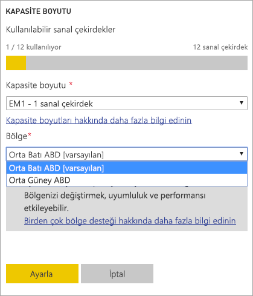
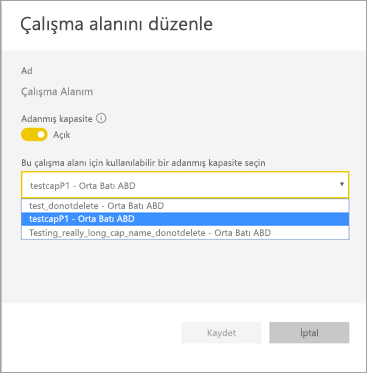
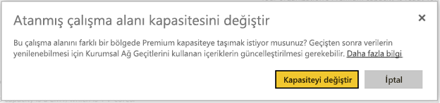
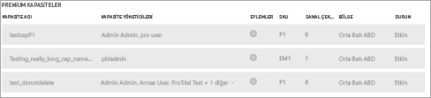

# Power BI Premium'da Multi-Geo desteği (Önizleme)
Multi-Geo, çok uluslu müşterilerin bölgesel, sektöre özel veya kurumsal veri yerleşimi gereksinimlerini karşılamasına yardımcı olan bir Power BI Premium özelliğidir. Bir Power BI Premium müşterisi olarak, içeriği Power BI kiracısının ana bölgesi dışındaki bölgelerde yer alan veri merkezlerine dağıtabilirsiniz. İçeriği aşağıdaki coğrafyalardan herhangi birine dağıtmayı seçebilirsiniz:

- Amerika Birleşik Devletleri 
- Kanada 
- Birleşik Krallık 
- Brezilya 
- Avrupa 
- Japonya 
- Hindistan 
- Asya Pasifik 
- Avustralya 

Bir coğrafi bölge (coğrafya) birden çok bölge içerebilir. Örneğin, Birleşik Devletler bir coğrafi bölgedir ve Orta Batı ABD ile Orta Güney ABD de Birleşik Devletler'deki bölgelerdir. 

Multi-Geo Power BI Almanya, 21Vianet tarafından sağlanan Power BI Çin veya ABD hükümeti için Power BI'da sağlanmaz.

## Multi-Geo'yu kullanma

Yeni kapasiteler için, açılan listeden varsayılan bölgenin dışında bir bölge seçerek Multi-Geo'yu etkinleştirin.  Kullanılabilir her kapasite, şu anda bulunduğu bölgeyi (**Orta Batı ABD**) gösterir.

  
Siz kapasiteyi oluşturduktan sonra kapasite o bölgede kalır ve oluşturulan tüm çalışma alanlarının içeriği o bölgede depolanır. Çalışma alanı ayarları ekranındaki açılan liste aracılığıyla çalışma alanlarını bir bölgeden diğerine geçirebilirsiniz.

Değişikliği onaylamanız için bu iletiyi görürsünüz. 

Şu anda bir geçiş sırasında ağ geçidi kimlik bilgilerini sıfırlamanız gerekmez.  Bunlar Premium kapasite bölgesinde depolandıktan sonra, geçiş sonunda bunları sıfırlamanız gerekecektir.
   
Geçiş sırasında, yeni veri kümelerini yayımlama veya zamanlanmış veri yenileme gibi bazı işlemler başarısız olabilir.  

Multi-Geo etkinleştirildiğinde aşağıdaki öğeler Premium bölgesinde depolanır:
 
- İçeri aktarma ve DirectQuery veri kümeleri için modeller (.ABF dosyaları)
- Sorgu önbelleği
- R görüntüleri

Bu öğeler kiracı için ana bölgede kalır:

- Gönderme veri kümeleri
- Excel çalışma kitapları
- Pano/rapor meta verileri: örneğin, kutucuk adları ve kutucuk sorguları
- Ağ geçidi sorguları veya zamanlanmış yenileme işleri için hizmet veri yolları
- İzinler
- Veri kümesi kimlik bilgileri
 
## Kapasite Bölgelerini Görüntüleme

Yönetici Portalı'nda, Power BI kiracınızın tüm kapasitelerini ve bunların şu anda bulundukları bölgeleri görüntüleyebilirsiniz.

 

## Mevcut içeriğin bölgesini değiştirme

Mevcut içeriğin bölgesini değiştirmeniz gerekiyorsa, iki seçeneğiniz vardır.

- İkinci bir kapasite oluşturun ve çalışma alanlarını taşıyın. Kiracının yedek sanal çekirdekleri olduğu sürece ücretsiz kullanıcılar herhangi bir kapalı kalma deneyimi yaşamaz.
- İkinci bir kapasite oluşturma seçeneğiniz yoksa, içeriği geçici olarak Premium'dan paylaşılan kapasiteye geri taşıyabilirsiniz. Fazladan sanal çekirdeğe ihtiyacınız olmaz ama ücretsiz kullanıcılar belirli bir kapalı kalma deneyimi yaşar.

## İçeriği Multi-Geo'nun dışına taşıma  

Çalışma alanlarını Multi-Geo kapasitesinin dışına almak için iki yoldan birini kullanabilirsiniz:

- Çalışma alanının bulunduğu yerdeki geçerli kapasiteyi silin.  Bu işlem çalışma alanını ana bölgedeki paylaşılan kapasiteye geri taşır.
- Tek tek çalışma alanlarını geriye, ana kiracıda yer alan Premium kapasiteye geçirin.

## Sınırlamalar ve önemli noktalar

Veri aktarımını başlatmadan önce bölgeler arasında başlattığınız her taşıma işleminin tüm kurumsal ve resmi uyumluluk gereksinimlerini karşıladığını onaylayın.

Uzak bölgede depolanan ve önbelleğe alınan bir sorgu, o bölgede bekletilir. Öte yandan, taşınan diğer veriler birden çok coğrafya arasında ileri ve geri gidebilir. 

Verileri Multi-Geo ortamında bir bölgeden diğerine taşındığında, kaynak veriler bu verilerin taşındığı kaynak bölgede en çok 30 gün kalabilir. Bu süre boyunca son kullanıcıların bunlara erişimi olmaz. Veriler 30 gün boyunca bu bölgeden kaldırılır ve yok edilir.

Multi-Geo genel olarak daha iyi bir performans sonucu vermez. Raporları ve panoları yükleme işlemi yine de meta veriler için ana bölgeye istekler göndermeyi içerir.

## Sonraki adımlar

[Power BI Premium nedir?](service-premium.md)

Başka bir sorunuz mu var? [Power BI Topluluğu'na sorun](http://community.powerbi.com/)
