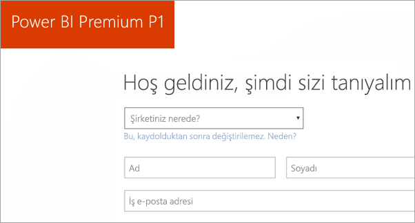
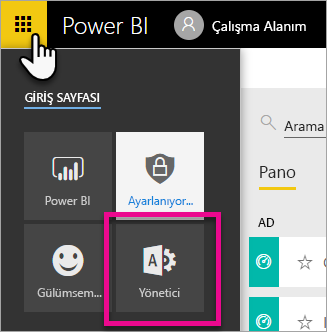
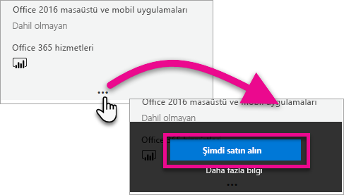
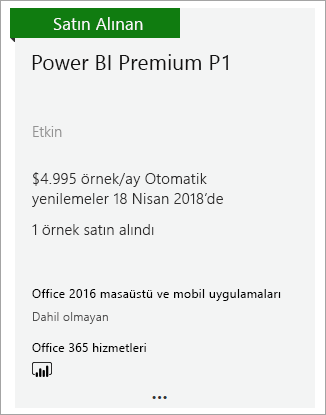
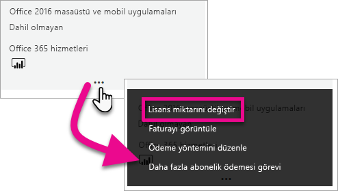
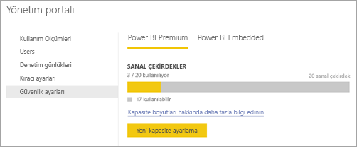
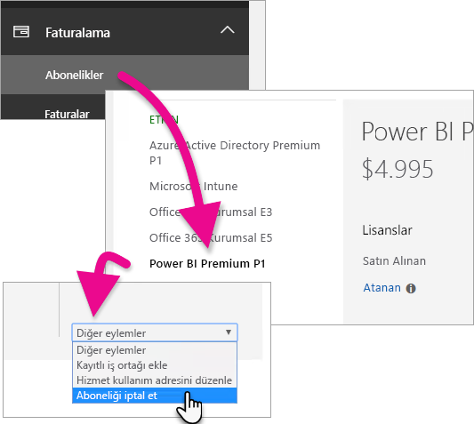
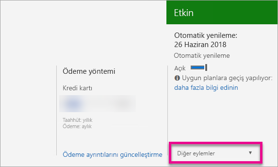

# Power BI Premium'u satın alma
Kuruluşunuz için Power BI Premium kapasitesini nasıl satın alabileceğinizi öğrenin.

<iframe width="640" height="360" src="https://www.youtube.com/embed/NkvYs5Qp4iA?rel=0&amp;showinfo=0" frameborder="0" allowfullscreen></iframe>

Power BI Premium kapasitesi düğümünü Office 365 Yönetim merkezinden satın alabilirsiniz. Kuruluşunuzda farklı Premium kapasite SKU'larını (P1-P3) bir arada kullanabilirsiniz. Farklı SKU'lar farklı kaynak özellikleri sunar.

Power BI Premium hakkında daha fazla bilgi için bkz. [Power BI Premium nedir?](service-premium.md). Güncel Power BI fiyatlarını görmek için [Power BI fiyatlandırma sayfasına](https://powerbi.microsoft.com/pricing/) bakın. Power BI Premium maliyetlerinizi hesaplamak için [Power BI Premium hesaplayıcısını](https://powerbi.microsoft.com/calculator/) da kullanabilirsiniz.

> [!IMPORTANT]
> Power BI Premium sürümünü satın alsanız da içerik yazarlarının Power BI Pro lisansına sahip olması gerekir.
> 
> 

## Power BI Premium P1 ile yeni kiracı oluşturma
Mevcut kiracınız yoksa ve yeni bir kiracı oluşturmak istiyorsanız aynı anda Power BI Premium sürümünü de satın alabilirsiniz. Aşağıdaki bağlantı Office 365 ile birlikte kullanmak üzere yeni bir kiracı oluşturma işlemi sırasında size yardımcı olacak ve Power BI Premium sürümünü satın almanızı sağlayacaktır. Kiracı oluşturulduktan sonra bir kullanıcı için Power BI Pro lisansı satın almanız gerekir. Kiracınızı oluşturduğunuzda otomatik olarak kiracının Genel Yöneticisi olursunuz.

Bu satın alma işlemini gerçekleştirmek için bkz. [Power BI Premium P1 teklifi](https://signup.microsoft.com/Signup?OfferId=b3ec5615-cc11-48de-967d-8d79f7cb0af1).

## Mevcut kuruluşlar için bir Power BI Premium kapasitesi satın alma
Bir kuruluşunuz varsa abonelik ve lisans satın almak için Genel Yönetici veya Faturalama Yöneticisi olmanız gerekir. Daha fazla bilgi için bkz. [Office 365 yönetici rolleri hakkında](https://support.office.com/article/About-Office-365-admin-roles-da585eea-f576-4f55-a1e0-87090b6aaa9d).

Premium kapasite satın almak için aşağıdaki işlemleri yapmanız gerekir.

1. Power BI hizmetinden **Office 365 uygulama seçici** > **Yönetici**'yi seçin. Alternatif olarak Office 365 Yönetim merkezini de ziyaret edebilirsiniz. Bu sayfaya ulaşmak için https://portal.office.com adresine gidip **Yönetici**'yi seçin.
   
    
2. **Faturalama** > **Hizmet satın alın**'ı seçin.
3. **Diğer planlar** bölümünde Power BI Premium fırsatlarını bulun. Bu fırsatlar P1-P3 arası, EM3 ve P1 (aylık) şeklinde olacaktır.
4. **Üç nokta (...)** simgesinin üzerine gelip **Hemen satın alın**'ı seçin.
   
    
5. Satın alma işlemini tamamlamak için adımları uygulayın.

İlgili öğelerin satın alma sayfalarına doğrudan gitmek için aşağıdaki bağlantıları da kullanabilirsiniz. Bu SKU'lar hakkında daha fazla bilgi için bkz. [Power BI Premium nedir?](service-premium.md#premiumskus).

Power BI Premium SKU'su almak için kiracınızda ***Genel Yönetici veya Faturalama Yöneticisi*** olmanız gerekir. Yönetici değilseniz aşağıdaki bağlantıları seçtiğinizde hatayla karşılaşırsanız.

| Doğrudan satın alma bağlantıları |
| --- |
| [EM3 (aylık) SKU](https://portal.office.com/commerce/completeorder.aspx?OfferId=4004702D-749C-4F74-BF47-3048F1833780&adminportal=1) |
| [P1 SKU](https://portal.office.com/commerce/completeorder.aspx?OfferId=b3ec5615-cc11-48de-967d-8d79f7cb0af1&adminportal=1) |
| [P1 (aylık) SKU](https://portal.office.com/commerce/completeorder.aspx?OfferId=E4C8EDD3-74A1-4D42-A738-C647972FBE81&adminportal=1) |
| [P2 SKU](https://portal.office.com/commerce/completeorder.aspx?OfferId=062F2AA7-B4BC-4B0E-980F-2072102D8605&adminportal=1) |
| [P3 SKU](https://portal.office.com/commerce/completeorder.aspx?OfferId=40c7d673-375c-42a1-84ca-f993a524fed0&adminportal=1) |

Satın alma işlemini tamamladıktan sonra Hizmetleri satın alın ekranında satın alınan ve etkinleştirilen öğeler gösterilir.

Bu kapasiteyi artık Power BI yönetim merkezinden yönetebilirsiniz. Daha fazla bilgi için bkz. [Power BI Premium'u yönetme](service-admin-premium-manage.md).

## Ek kapasite satın alma
Yöneticiyseniz Power BI yönetici portalının **Premium ayarları** bölümünde **Daha fazla satın alın** düğmesini göreceksiniz. Bu düğmeyi seçtiğinizde Office 365 portalı açılır. Office 365 Yönetim merkezini açtıktan sonra aşağıdaki işlemleri gerçekleştirebilirsiniz.

1. **Faturalama** > **Hizmet satın alın**'ı seçin.
2. Daha fazlasını satın almak istediğiniz Power BI Premium öğesini **Diğer planlar**'ın altında bulun.
3. **Üç nokta (...)** simgesinin üzerine gelip **Change license quantity** (Lisans miktarını değiştir) seçeneğini belirleyin.
   
    
4. Bu öğe için sahip olmak istediğiniz örnek sayısını değiştirin. İşlemi tamamladıktan sonra **Gönder**'i seçin.
   
   > [!IMPORTANT]
   > **Gönder**'i seçtiğinizde kayıtlı kredi kartından çekim yapılır.
   > 
   > 

Ardından **Hizmet satın alın** sayfasında sahip olduğunuz örnek sayısı gösterilir. Power BI yönetici portalının **Kapasite ayarları** bölümünde, kullanılabilir sanal çekirdek sayısı, yeni satın alınan kapasiteyi gösterir.

Bu kapasiteyi artık Power BI yönetim merkezinden yönetebilirsiniz. Daha fazla bilgi için bkz. [Power BI Premium'u yönetme](service-admin-premium-manage.md).

## Aboneliğinizi iptal etme
Aboneliğinizi Office 365 yönetim merkezinden iptal edebilirsiniz. Premium aboneliğiniz iptal etmek için aşağıdaki işlemleri gerçekleştirin.

1. Office 365 yönetim merkezine gidin.
2. **Faturalama** > **Abonelikler**'i seçin.
3. Listeden Power BI Premium aboneliğinizi seçin.
4. **Diğer eylemler** açılır menüsünden **Aboneliği iptal et**'i seçin.
   
    
5. **Aboneliği iptal et** sayfasında [erken sonlandırma ücreti](https://support.office.com/article/early-termination-fees-6487d4de-401a-466f-8bc3-c0beb5cc40d3) ödemeniz gerekip gerekmediği belirtilir. Bu sayfada aboneliğe ait verilerin silineceği zamanı da görebilirsiniz.
6. Bilgileri okuyun ve devam etmek istiyorsanız **Aboneliği iptal et**'i seçin.

## Sonraki adımlar
[Power BI fiyatlandırma sayfası](https://powerbi.microsoft.com/pricing/)  
[Power BI Premium hesaplayıcısı](https://powerbi.microsoft.com/calculator/)  
[Power BI Premium nedir?](service-premium.md)  
[Power BI Premium'u yönetme](service-admin-premium-manage.md)  
[Power BI Premium hakkında SSS](service-premium-faq.md)  
[Power BI Premium sürüm notları](service-premium-release-notes.md)  
[Microsoft Power BI Premium teknik incelemesi](https://aka.ms/pbipremiumwhitepaper)  
[Planning a Power BI Enterprise Deployment (Power BI Kuruluş Dağıtımı Planlama) teknik incelemesi](https://aka.ms/pbienterprisedeploy)  
[Power BI yönetici portalı](service-admin-portal.md)  
[Kuruluşunuzda Power BI'ı yönetme](service-admin-administering-power-bi-in-your-organization.md)  

Başka bir sorunuz mu var? [Power BI Topluluğu'na sorun](http://community.powerbi.com/)

