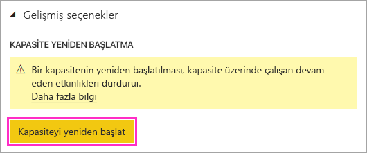
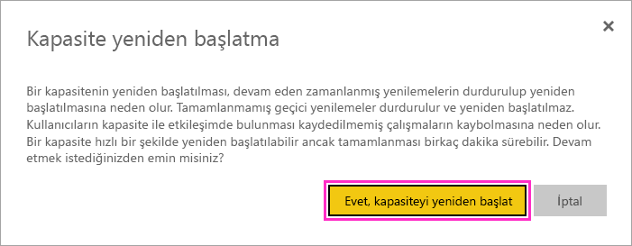

# Power BI Premium kapasitesini yeniden başlatma

Power BI yöneticisi olarak Premium kapasiteyi yeniden başlatmanız gerekebilir. Bu makalede kapasiteyi yeniden başlatma işlemi açıklanır, ayrıca yeniden başlatma ve performans hakkındaki çeşitli sorular yanıtlanır.

## Power BI bu seçeneği neden sağlıyor?

Power BI kullanıcılara muazzam miktarlardaki veriler üzerinde karmaşık analizler yapma olanağı sunuyor. Ne yazık ki kullanıcılar Power BI hizmetini işlerle, yazdıkları aşırı karmaşık sorgularla, oluşturdukları döngüsel başvurularla ve benzer işlemlerle aşırı yükleyerek performans sorunlarına neden olabiliyor.

Power BI paylaşılan kapasitesi dosya boyutlarına, yenileme zamanlamalarına ve hizmetin diğer yönlerine sınırlar uygulayarak bu tür durumlara karşı bir düzeyde koruma sağlıyor. Buna karşılık Power BI Premium kapasitesinde bu sınırların çoğu yükseltiliyor. Sonuç olarak, hatalı bir DAX ifadesi veya çok karmaşık bir model içeren tek bir rapor önemli performans sorunlarına yol açabiliyor. Rapor işlenirken, kapasitede sağlanan kaynakların tümünü tüketebiliyor. 

Power BI, Premium kapasite kullanıcılarını bu tür sorunlara karşı koruma yöntemini sürekli geliştiriyor. Ayrıca kapasitelerin ne zaman ve neden aşırı yüklendiğini analiz eden araçlar sağlayarak yöneticileri güçlendiriyoruz. Daha fazla bilgi için [kısa eğitim oturumumuza](https://www.youtube.com/watch?v=UgsjMbhi_Bk&feature=youtu.be) ve [uzun eğitim oturumumuza](https://www.microsoft.com/businessapplicationssummit/video/BAS2018-2174) bakın. Aynı zamanda, önemli sorunlar çıktığında bunları hafifletebilmeniz de gerekiyor. Bu sorunları hafifletmenin en hızlı yolu, kapasiteyi yeniden başlatmaktır.

## Yeniden başlatma işlemi güvenli mi? Verileri kaybedecek miyim?

Kapasitenizdeki tüm kaydedilmiş veriler, tanımlar, raporlar ve panolar yeniden başlatma sonrasında olduğu gibi korunur. Bir kapasiteyi yeniden başlattığınızda, çoğu durumda devam eden zamanlanmış ve geçici yenilemeler, yenileme altyapısı tarafından geçici olarak durdurulur. Daha sonra Power BI’da yerleşik olan yenileme yeniden deneme mantığı nedeniyle yeniden başlatılır. Kapasite kullanılabilir hale geldiğinde hizmet, etkilenen yenilemeleri yeniden deneme girişiminde bulunur. Yeniden başlatma işlemi sırasında, kullanıcı arabiriminde yenilemelerin durumu değişmeyebilir. 

Yeniden başlatma işlemi sırasında, kapasiteyle etkileşimde bulunan kullanıcılar, kaydedilmemiş çalışmalarını kaybeder. Yeniden başlatma tamamlandıktan sonra kullanıcıların tarayıcılarını yenilemesi gerekir.

## Kapasiteye nasıl yeniden başlatabilirim?

Kapasiteyi yeniden başlatmak için aşağıdaki adımları izleyin.

1. Power BI yönetici portalının **Kapasite Ayarları** sekmesinde kapasitenize gidin. 

1. Kapasite URL’nize **CapacityRestart** *özellik bayrağını* ekleyin: `https://app.powerbi.com/admin-portal/capacities/<YourCapacityId>?capacityRestartButton=true`.

1. **Gelişmiş Ayarlar** > **KAPASİTE YENİDEN BAŞLATMA**'nın altında **Kapasiteyi yeniden başlat**'ı seçin.

    

1. **Kapasite yeniden başlatma** iletişim kutusunda **Evet, kapasiteyi yeniden başlat**'ı seçin.

    

## Gelecekte sorun çıkmasını nasıl önleyebilirim?

Sorunları önlemenin en iyi yolu kullanıcıları verimli veri modelleme konusunda eğitmektir. Daha fazla bilgi için [eğitim oturumumuza](https://www.microsoft.com/businessapplicationssummit/video/BAS2018-2170) bakın.

Ayrıca, altında yatan sorunlara işaret eden eğilimleri saptamak için düzenli aralıklarla [kapasitelerinizi izlemenizi](service-admin-premium-monitor-capacity.md) öneririz. Kapasitelerinizi daha verimli izleyebilmeniz ve yönetebilmeniz için izleme uygulamasının ve diğer araçların düzenli sürümlerini sağlamayı planlıyoruz.

## Sonraki adımlar

[Power BI Premium nedir?](service-premium-what-is.md)

Başka bir sorunuz mu var? [Power BI Topluluğu'na sorun](https://community.powerbi.com/)
