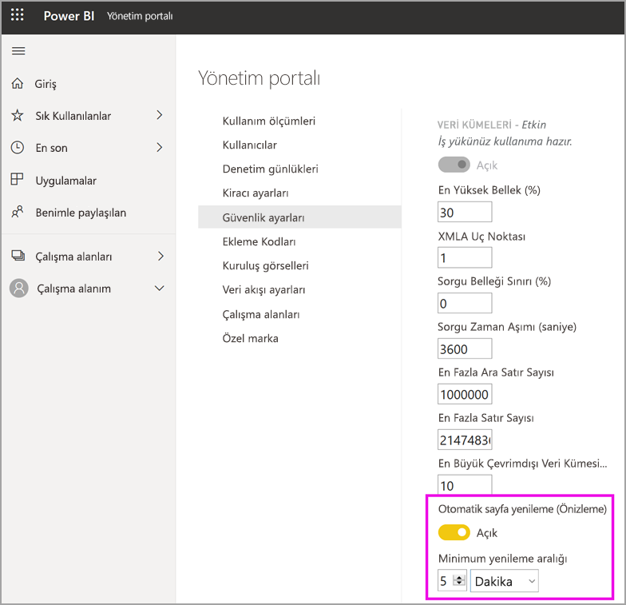

# Premium kapasitedeki iş yüklerini yapılandırma

Bu makalede, Power BI Premium kapasiteleri için iş yüklerini etkinleştirme ve yapılandırma açıklanmaktadır. Varsayılan olarak, kapasiteler yalnızca çalışan Power BI sorgularıyla ilişkili iş yüklerini destekler. **[AI (Bilişsel Hizmetler)](service-cognitive-services.md)** , **[Veri akışları](service-dataflows-overview.md#dataflow-capabilities-on-power-bi-premium)** ve **[Sayfalandırılmış raporlar](paginated-reports-save-to-power-bi-service.md)** için de ek iş yüklerini etkinleştirebilir ve yapılandırabilirsiniz.

## Varsayılan bellek ayarları

Sorgu iş yükleri, Premium kapasite SKU’nuza göre belirlenen kaynaklar için iyileştirilmiştir ve bunlarla sınırlıdır. Premium kapasiteler ayrıca kapasitenizin kaynaklarını kullanabilen ek iş yüklerini de destekler. Bu iş yükleri için varsayılan bellek değerleri, SKU’nuz için kullanılabilir kapasite düğümlerini temel alır. En yüksek bellek ayarları kümülatif değildir. Belirtilen en yüksek değere kadar bellek, AI ve veri akışları için dinamik olarak ayrılır ancak sayfalandırılmış raporlar için statik olarak ayrılır.

### Hizmet olarak yazılım (SaaS) senaryoları için Microsoft Office SKU'ları

|                     | EM2                      | EM3                       | P1                      | P2                       | P3                       |
|---------------------|--------------------------|--------------------------|-------------------------|--------------------------|--------------------------|
| AI | YOK | YOK | %20 varsayılan; %20 en küçük | %20 varsayılan; %10 en küçük | %20 varsayılan; %5 en küçük |
| Veri akışları | YOK |%20 varsayılan; %12 en küçük  | %20 varsayılan; %5 en küçük  | %20 varsayılan; %3 en küçük | %20 varsayılan; %2 en küçük  |
| Sayfalandırılmış raporlar | YOK |YOK | %20 varsayılan; %10 en küçük | %20 varsayılan; %5 en küçük | %20 varsayılan; %2,5 en küçük |
| | | | | | |

### Hizmet olarak platform (PaaS) senaryoları için Microsoft Azure SKU'ları

|                  | A1                       | A2                       | A3                      | A4                       | A5                      | A6                        |
|-------------------|--------------------------|--------------------------|-------------------------|--------------------------|-------------------------|---------------------------|
| AI | YOK                      | %20 varsayılan; %100 en küçük                     | %20 varsayılan; %50 en küçük                     | %20 varsayılan; %20 en küçük | %20 varsayılan; %10 en küçük | %20 varsayılan; %5 en küçük |
| Veri akışları         | %40 varsayılan; %40 en küçük | %24 varsayılan; %24 en küçük | %20 varsayılan; %12 en küçük | %20 varsayılan; %5 en küçük  | %20 varsayılan; %3 en küçük | %20 varsayılan; %2 en küçük   |
| Sayfalandırılmış raporlar | YOK                      | YOK                      | YOK                     | %20 varsayılan; %10 en küçük | %20 varsayılan; %5 en küçük | %20 varsayılan; %2,5 en küçük |
| | | | | | |

## İş yükü ayarları

### AI (Önizleme)

AI iş yükü Power BI'da bilişsel hizmetleri ve Otomatik Makine Öğrenmesi'ni kullanabilmenizi sağlar. İş yükü davranışını denetlemek için aşağıdaki ayarları kullanın.

| Ayar Adı | Açıklama |
|---------------------------------|----------------------------------------|
| **En Yüksek Bellek (%)** | Kapasitede AI işlemlerinin kullanabileceği en yüksek kullanılabilir bellek yüzdesi. |
| **Power BI Desktop’tan kullanıma izin ver** | Bu ayar gelecekte kullanım için ayrılmıştır ve tüm kiracılarda görüntülenmez. |
| **Makine öğrenmesi modelleri oluşturmaya izin ver** | İş analistlerinin doğrudan Power BI'da makine öğrenmesi modellerini eğitmesine, doğrulamasına ve çağırmasına izin verilip verilmeyeceğini belirtir. Daha fazla bilgi için bkz. [Power BI’da Otomatik Makine Öğrenmesi (Önizleme)](service-machine-learning-automated.md). |
| **AI istekleri için paralelliği etkinleştir** | AI isteklerinin paralel çalıştırılıp çalıştırılamayacağını belirtir. |
|  |  |

### Veri kümeleri

Veri kümeleri iş yükü varsayılan olarak etkindir ve devre dışı bırakılamaz. İş yükü davranışını denetlemek için aşağıdaki ayarları kullanın. Ayarlardan bazıları için tablonun altında ek kullanım bilgileri verilir.

| Ayar Adı | Açıklama |
|---------------------------------|----------------------------------------|
| **En Yüksek Bellek (%)** | Kapasitede veri kümelerinin kullanabileceği en yüksek kullanılabilir bellek yüzdesi. |
| **XMLA Uç Noktası** | İstemci uygulamalarından gelen bağlantıların çalışma alanı ve uygulama düzeylerinde ayarlanan güvenlik grubu üyeliğini kabul edeceğini belirtir. Daha fazla bilgi için bkz. [İstemci uygulaması ve araçlarıyla veri kümelerine bağlanma](service-premium-connect-tools.md). |
| **En Fazla Ara Satır Sayısı** | DirectQuery tarafından döndürülen ara satır sayısı üst sınırı. Varsayılan değer 1000000'dur ve izin verilen değerler 100000 ile 2147483647 arasındadır. |
| **En Büyük Çevrimdışı Veri Kümesi Boyutu (GB)** | Bellekteki çevrimdışı veri kümesinin boyut üst sınırı. Bu, diskteki sıkıştırılmış boyuttur. Varsayılan değer SKU tarafından ayarlanır ve izin verilen değerler 0,1 ile 10 GB arasındadır. |
| **En Büyük Sonuç Satır Kümesi Sayısı** | DAX sorgusunda döndürülen satır sayısı üst sınırı. Varsayılan değer -1'dir (sınır yok) ve izin verilen değerler 100000 ile 2147483647 arasındadır. |
| **Sorgu Belleği Sınırı (%)** | Sorguda veya DAX ölçüsünde geçici sonuçlar için kullanılabilecek en yüksek kullanılabilir bellek yüzdesi. |
| **Sorgu Zaman Aşımı (saniye)** | Sorgu zaman aşımına uğramadan önce geçebilecek en uzun süre. Varsayılan değer 3600 saniyedir (1 saat). 0 değeri sorguların zaman aşımına uğramayacağını belirtir. |
| **Otomatik sayfa yenileme (önizleme)** | Premium çalışma alanlarının otomatik sayfa yenileme özellikli raporları olmasına izin vermek için açma/kapatma düğmesi. |
| **Minimum yenileme aralığı** | Otomatik sayfa yenileme açıksa, sayfa yenileme aralığı için izin verilen minimum aralık. Varsayılan değer beş dakika ve izin verilen minimum değer de bir saniyedir. |
|  |  |  |

#### En Büyük Ara Satır Kümesi Sayısı

Yoğun kaynak kullanılan veya kötü tasarlanmış raporların etkisini denetim altına almak için bu ayarı kullanın. DirectQuery veri kümesindeki bir sorgu kaynak veritabanından çok büyük bir sonuç getirirse, bellek kullanımında ve işlem yükünde ani bir artışa neden olabilir. Bu durum diğer kullanıcıların ve raporların yetersiz kaynak durumuyla karşılaşmasına yol açabilir. Bu ayarla kapasite yöneticisi tek bir sorgunun veri kaynağından kaç satır getirebileceğini belirleyebilir.

Alternatif olarak, kapasite varsayılan bir milyon satırdan daha fazlasını destekleyebiliyorsa daha fazla satır getirmek için bu ayarı artırın.

Bu ayarın yalnızca DirectQuery sorgularını etkilediğine, [En Büyük Sonuç Satır Kümesi Sayısı](#max-result-row-set-count)'nın ise DAX sorgularını etkilediğine dikkat edin.

#### En Büyük Çevrimdışı Veri Kümesi Boyutu

Rapor oluşturucularının kapasiteyi olumsuz etkileyebilecek büyük veri kümeleri yayımlamasını önlemek için bu ayarı kullanın. Veri kümesi belleğe yüklenene kadar Power BI'ın gerçek bellek içi boyutu belirleyemeyeceğini unutmayın. Çevrimdışı boyutu daha küçük olan bir veri kümesinin bellekte çevrimdışı boyutu daha büyük olandan daha fazla yer kaplaması mümkündür.

Bu ayarda belirttiğiniz boyuttan daha büyük bir veri kümeniz varsa, kullanıcı erişmeye çalıştığında veri kümesi yüklenemeyecektir.

#### En Büyük Sonuç Satır Kümesi Sayısı

Yoğun kaynak kullanılan veya kötü tasarlanmış raporların etkisini denetim altına almak için bu ayarı kullanın. DAX sorgusunda bu sınıra ulaşılırsa rapor kullanıcısı aşağıdaki hatayı görür. Hata ayrıntılarını kopyalayıp yöneticiye başvurması gerekir.

Bu ayarın yalnızca DAX sorgularını etkilediğine, [En Büyük Ara Satır Kümesi Sayısı](#max-intermediate-row-set-count)'nın ise DirectQuery sorgularını etkilediğine dikkat edin.

#### Sorgu Belleği Sınırı

Yoğun kaynak kullanılan veya kötü tasarlanmış raporların etkisini denetim altına almak için bu ayarı kullanın. Bazı sorgular ve hesaplamalar kapasitede çok fazla bellek kullanan ara sonuçlar verebilir. Bu durum diğer sorguların çok yavaş yürütülmesine, diğer veri kümelerinin kapasiteden çıkarılmasına ve kapasitenin diğer kullanıcılarının yetersiz bellek hataları almasına yol açabilir.

Bu ayar veri yenileme ve rapor işleme için geçerlidir. Sorgu yenileme devre dışı bırakılmadıysa, veri yenileme hem veri kaynağındaki verileri yeniler hem de sorguyu yeniler. Sorgu yenileme devre dışı bırakılmadıysa bu bellek sınırı söz konusu sorgular için de geçerlidir. Veri yenileme başarılı olsa bile, başarısız olan tüm sorgular zamanlanan yenileme durumunun başarısız olarak bildirilmesine neden olur.

#### Sorgu Zaman Aşımı

Uzun süre çalışan ve kullanıcılar için raporların yavaş yüklenmesine neden olabilen sorguları daha iyi denetim altına almak için bu ayarı kullanın. Bu ayar veri yenileme ve rapor işleme için geçerlidir. Sorgu yenileme devre dışı bırakılmadıysa, veri yenileme hem veri kaynağındaki verileri yeniler hem de sorguyu yeniler. Sorgu yenileme devre dışı bırakılmadıysa bu zaman aşımı sınırı söz konusu sorgular için de geçerlidir.

Bu ayar tek bir sorgu için geçerlidir; veri kümesinin veya raporun güncelleştirilmesiyle ilişkili tüm sorguları çalıştırmak için gereken süreye uygulanmaz. Aşağıdaki örneği inceleyin:

- **Sorgu Zaman Aşımı** ayarı 1200 (20 dakika).
- Yürütülecek beş sorgu var ve her biri 15 dakika çalışıyor.

Tüm sorguların birleşik süresi 75 dakika ama bu ayar sınırına ulaşılmadı çünkü tek tek sorguların her birinin çalışması 20 dakikadan kısa sürdü.

Power BI raporlarının, kapasitede her sorgu için daha küçük bir zaman aşımı süresiyle bu varsayılan süreyi geçersiz kıldığına dikkat edin. Her sorgu için zaman aşımı normalde yaklaşık üç dakikadır.

#### Otomatik sayfa yenileme (önizleme)

Etkinleştirildiğinde otomatik sayfa yenileme, Premium kapasitenizdeki kullanıcıların, DirectQuery kaynakları için tanımlı bir aralıkta raporlarındaki sayfaları yenilemesine olanak sağlar. Kapasite yöneticisi olarak şunları yapabilirsiniz:

1.  Otomatik sayfa yenilemeyi açma ve kapatma
2.  Minimum yenileme aralığı tanımlama

Aşağıdaki görüntüde, otomatik yenileme aralığı ayarının konumu gösterilmektedir:

Otomatik sayfa yenileme tarafından oluşturulan sorgular doğrudan veri kaynağına gider, bu nedenle kuruluşunuzda otomatik sayfa yenilemeye izin verirken bu kaynaklarda güvenilirliği ve yükü göz önünde bulundurmanız önemlidir. 

### Veri akışları

Veri akışları iş yükü verileri almak, dönüştürmek, tümleştirmek ve zenginleştirmek için veri akışları self servis veri hazırlığını kullanmanıza olanak tanır. İş yükü davranışını denetlemek için aşağıdaki ayarları kullanın.

| Ayar Adı | Açıklama |
|---------------------------------|----------------------------------------|
| **En Yüksek Bellek (%)** | Kapasitede veri akışlarının kullanabileceği en yüksek kullanılabilir bellek yüzdesi. |
| **Gelişmiş Veri Akışları Bilgi İşlem Altyapısı (Önizleme)** | Büyük ölçekli veri hacimleriyle çalışırken hesaplanan varlıkların 20 kata kadar daha hızlı hesaplanması için bu seçeneği etkinleştirin. **Yeni altyapıyı etkinleştirmek için kapasiteyi yeniden başlatmanız gerekir.** Daha fazla bilgi için bkz. [Gelişmiş veri akışları işlem altyapısı](#enhanced-dataflows-compute-engine). |
| **Kapsayıcı Boyutu** | Veri akışlarının, veri akışındaki her varlık için kullanabileceği kapsayıcı boyutu üst sınırı. Varsayılan değer 700 MB'tır. Daha fazla bilgi için bkz. [Kapsayıcı boyutu](#container-size). |
|  |  |

#### Gelişmiş veri akışları işlem altyapısı

Yeni işlem altyapısından yararlanmak için veri alımını ayrı veri akışlarını bölün ve farklı veri akışlarındaki hesaplanan varlıklara dönüştürme mantığı ekleyin. Bu yaklaşımın önerilmesinin nedeni işlem altyapısının mevcut veri akışına başvuran veri akışları üzerinde çalışmasıdır. Veri alımı iş akışları üzerinde çalışmaz. Bu yönergenin izlenmesi en iyi performans için yeni işlem altyapısının birleştirmeler gibi dönüştürme adımlarını işlemesini güvence altına alır.

#### Kapsayıcı boyutu

Veri akışı yenilenirken, veri akışı iş yükü veri akışındaki her varlık için bir kapsayıcı üretir. Her kapsayıcı, **Kapsayıcı Boyutu ayarında belirtilen miktara kadar bellek alabilir. Tüm SKU'larda varsayılan değer 700 MB'tır. Aşağıdaki durumlarda bu ayarı değiştirmek isteyebilirsiniz:

- Veri akışlarının yenilenmesi fazla uzun sürüyor veya veri akışı yenilemesi zaman aşımından dolayı başarısız oluyor.
- Veri akışı varlıkları hesaplama adımları, örneğin birleştirme içeriyor.  

Veri akışı iş yükü performansını analiz etmek için [Power BI Premium Kapasite Ölçümleri](service-admin-premium-monitor-capacity.md) uygulamasını kullanmanız önerilir.

Bazı durumlarda kapsayıcı boyutunu artırmak performansı geliştirmeyebilir. Örneğin, veri akışı önemli hesaplamalar yapmadan verileri yalnızca kaynaktan alıyorsa, kapsayıcı boyutu değiştirmek büyük olasılıkla işe yaramayacaktır. Kapsayıcı boyutunun artırılması, Veri Akışı iş yükünün varlık yenileme işlemlerine daha fazla bellek ayırmasına olanak tanıyorsa yararlı olur. Daha fazla bellek ayrılması, yoğun işlem içeren varlıkların yenilenmesi için gereken süreyi kısaltabilir.

Kapsayıcı Boyutu değeri, Veri Akışları iş yükü için en yüksek bellek miktarını aşamaz. Örneğin P1 kapasitenin 25 GB belleği vardır. Veri Akışı iş yükünün En Yüksek Bellek (%) değeri %20 olarak ayarlandıysa Kapsayıcı Boyutu (MB) 5000'i aşamaz. Her durumda, daha yüksek bir değer ayarlamış olsanız bile Kapsayıcı Boyutu En Yüksek Bellek miktarını aşamaz.

### Sayfalandırılmış raporlar

Sayfalandırılmış raporlar iş yükü Power BI hizmetinde standart SQL Server Reporting Services biçimi temelinde sayfalandırılmış raporları çalıştırmanıza olanak tanır. İş yükü davranışını denetlemek için aşağıdaki ayarı kullanın.

| Ayar Adı | Açıklama |
|---------------------------------|----------------------------------------|
| **En Yüksek Bellek (%)** | Kapasitede sayfalandırılmış raporların kullanabileceği en yüksek kullanılabilir bellek yüzdesi. |
|  |  |

Sayfalandırılmış raporlar, bir raporu işlerken özel kodun çalıştırılmasına olanak tanır. Örneğin metin rengini içeriğe göre dinamik olarak değiştirme olabilir ve bu işlem ek bellek kullanabilir. Power BI Premium sayfalandırılmış raporları kapasite içinde kapsanan bir alanda çalıştırır. İş yükünün etkin *olup olmadığına* bakılmaksızın, belirtilen En Yüksek Bellek kullanılır. En Yüksek Bellek ayarının varsayılan değeri değiştiriliyorsa, bu değeri diğer iş yüklerini olumsuz etkilemeyecek kadar düşük ayarlamaya dikkat edin.

Bazı durumlarda sayfalandırılmış raporlar iş yükü kullanılamaz hale gelebilir. Böyle bir durumda iş yükü Yönetici portalında bir hata durumu gösterir ve kullanıcılar rapor işleme için zaman aşımı değerlerini görürler. Bu sorunu gidermek için iş yükünü devre dışı bırakın ve sonra yeniden etkinleştirin.

## İş yüklerini yapılandırma

İş yüklerini yalnızca kullanılacakları zaman etkinleştirerek kapasitenizin kullanılabilir kaynaklarını en üst düzeye çıkarın. Bellek ayarını ve diğer ayarları, ancak belirlenmiş varsayılan ayarlarınızın kapasite kaynak gereksinimlerinizi karşılamadığı durumlarda değiştirin.

### Power BI yönetici portalında iş yüklerini yapılandırmak için

1. **Kapasite ayarları** > **PREMIUM KAPASİTELER** içinde, bir kapasite seçin.

1. **DİĞER SEÇENEKLER** altında **İş Yükleri**’ni genişletin.

1. Bir veya daha fazla iş yükünü etkinleştirin ve **En Büyük Bellek** için ve diğer ayarlar için değer belirleyin.

1. **Apply** (Uygula) seçeneğini belirleyin.

### REST API

İş yükleri, [Kapasiteler](https://docs.microsoft.com/rest/api/power-bi/capacities) REST API’leri kullanılarak etkinleştirilebilir ve bir iş yüküne atanabilir.

## İş yüklerini izleme

[Power BI Premium Kapasite Ölçümleri uygulaması](service-admin-premium-monitor-capacity.md), kapasitelerinizde etkinleştirilmiş iş yüklerini izlemek için veri kümesi, veri akışları ve sayfalandırılmış rapor ölçümleri sağlar. 

## Sonraki adımlar

[Power BI Premium kapasitelerini en iyi duruma getirme](service-premium-capacity-optimize.md)     
[Veri akışları ile Power BI’da self servis veri hazırlığı](service-dataflows-overview.md)   
[Power BI Premium’da sayfalandırılmış raporlar nelerdir?](paginated-reports-report-builder-power-bi.md)   
[Power BI Desktop’ta otomatik sayfa yenileme (önizleme)](desktop-automatic-page-refresh.md)

Başka bir sorunuz mu var? [Power BI Topluluğu'na sorun](https://community.powerbi.com/)