# Power BI Pro lisanslarını satın alma ve atama

Power BI Pro, Power BI hizmetinin içerik paylaşma ve diğer Pro kullanıcılarıyla işbirliği yapma dahil tüm içerik ve özelliklerine erişim izni veren bireysel bir lisanstır. Uygulama çalışma alanlarına içerik yayımlama ve uygulama çalışma alanlarından içerik kullanma, panoları paylaşma ve pano ile raporlara abone olma işlemlerini yalnızca Pro kullanıcıları yapabilir. Daha fazla bilgi için bkz. [Lisans türüne göre Power BI özellikleri](service-features-license-type.md).

Bu makalede önce Office 365'te Power BI Pro lisansları satın alma işlemi açıklanır. Makale ardından bu lisansları bireysel kullanıcılara atamak için kullanabileceğiniz iki seçeneği açıklar: Office 365 ve Azure (yalnızca birini seçin).

## Önkoşullar

Office 365’te [**Genel yönetici** veya **Faturalama yöneticisi**](https://support.office.com/article/about-office-365-admin-roles-da585eea-f576-4f55-a1e0-87090b6aaa9d?ui=en-US&rs=en-US&ad=US) rolünün üyesi olmanız gerekir.

Azure’da lisans atamak için, Power BI'ın Active Directory aramalarında kullandığı Azure aboneliğinin sahibi olmanız gerekir.

## Office 365’te lisans satın alma

Power BI Pro lisansları satın almak için şu adımları izleyin:

1. [Office 365 yönetim merkezini](https://portal.office.com/adminportal/home#/homepage) açın.

2. Sol gezinti bölmesinde **Faturalama** > **Abonelikler**'i seçin.

    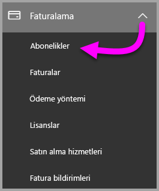

3. **Abonelikler** sayfasının sağ üst köşesindeki **Abonelik ekle** öğesini seçin.

    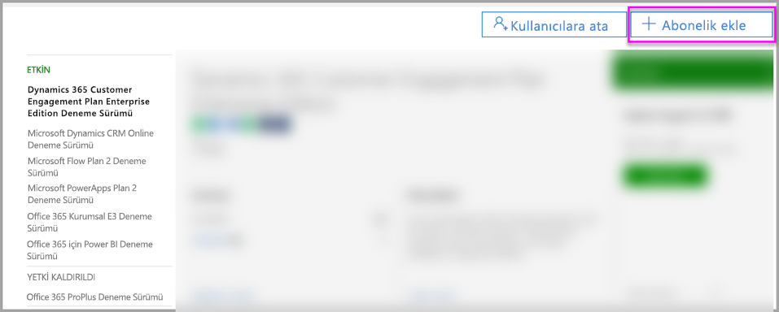

4. İstediğiniz abonelik teklifini bulun:

    **Kurumsal Paket** bölümünde **Office 365 Kurumsal E5**’i seçin.

    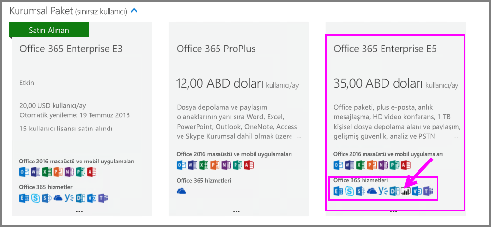

    **Diğer Planlar** bölümünde **Power BI Pro**’yu seçin.

    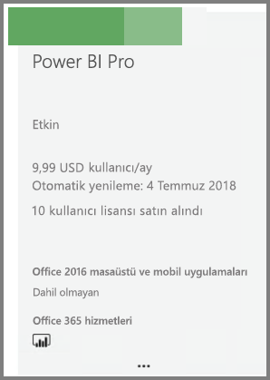

5. İstediğiniz abonelik için üç noktanın (**. . .**) üzerine imleci getirin ve **Şimdi satın al**’ı seçin.

    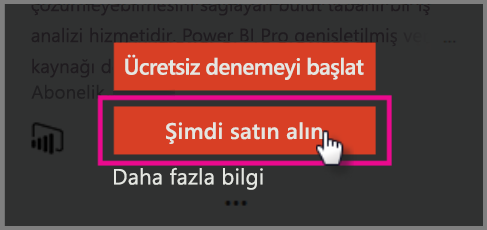

6. Faturalama tercihinize göre **Aylık ödeme** veya **Tam yıllık ödeme** seçeneğini belirleyin.

7. **Kaç tane kullanıcı istiyorsunuz?** bölümüne istediğiniz lisans sayısını girin ve işlemi tamamlamak için **Şimdi kullanıma al**’ı seçin.

8. Satın alınan aboneliğin şimdi **Abonelikler** sayfasında listelendiğini doğrulayın.

   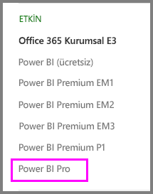

9. İlk satın alma sonrasında daha fazla lisans eklemek için **Abonelikler** sayfasından **Power BI Pro**’yu ve sonra **Lisans Ekle/Kaldır**’ı seçin.

## Office 365'te lisans atama

Bireysel kullanıcı hesaplarına Power BI Pro lisansları atamak için şu adımları izleyin:

1. [Office 365 yönetim merkezini](https://portal.office.com/adminportal/home#/homepage) açın.

2. Sol gezinti bölmesinde **Kullanıcılar**’ı genişletin ve sonra **Etkin kullanıcılar**’ı seçin.

    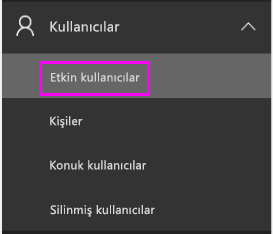

3. Bir kullanıcı seçin, ardından **Ürün lisansları** altında **Düzenle**’yi seçin.

    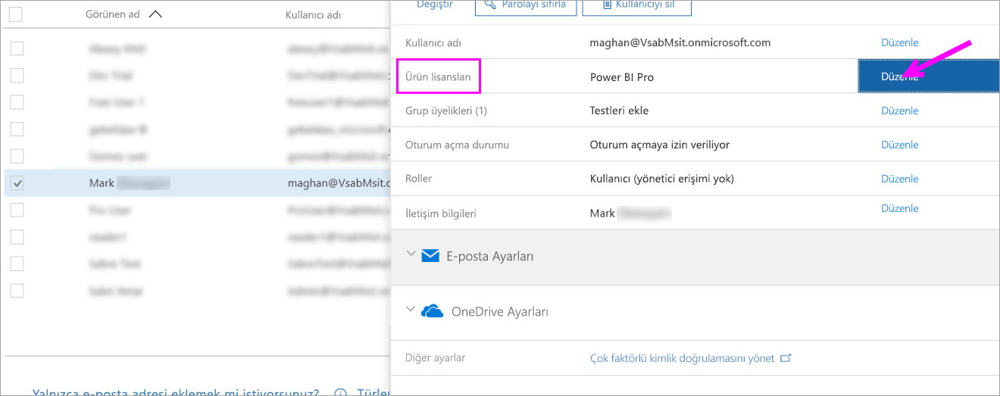

4. **Power BI Pro** altında ayarı **Açık** duruma getirin, ardından **Kaydet**’i seçin.

    

5. Seçilen hesabın **Durum** bölümünde Power BI Pro lisansının başarıyla atandığını doğrulayın.

    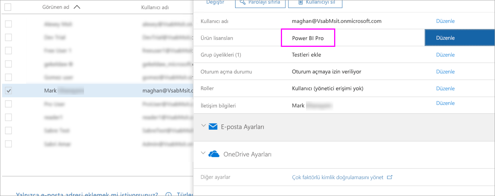

## Azure’da lisans atama

Bireysel kullanıcı hesaplarına Power BI Pro lisansları atamak için şu adımları izleyin:

1. [Azure portalını](https://ms.portal.azure.com/#@microsoft.onmicrosoft.com/dashboard/private/39bc3cf7-31a4-43f6-954c-f2d69ca2f0) açın.

2. Sol gezinti çubuğunda **Azure Active Directory**'yi seçin.

    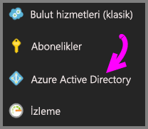

3. **Azure Active Directory** altında **Lisanslar**’ı seçin.

    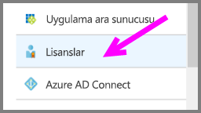

4. **Lisanslar** altında **Tüm ürünler**’i, ardından **Power BI Pro**’yu seçerek lisanslı kullanıcıların listesini görüntüleyin.

    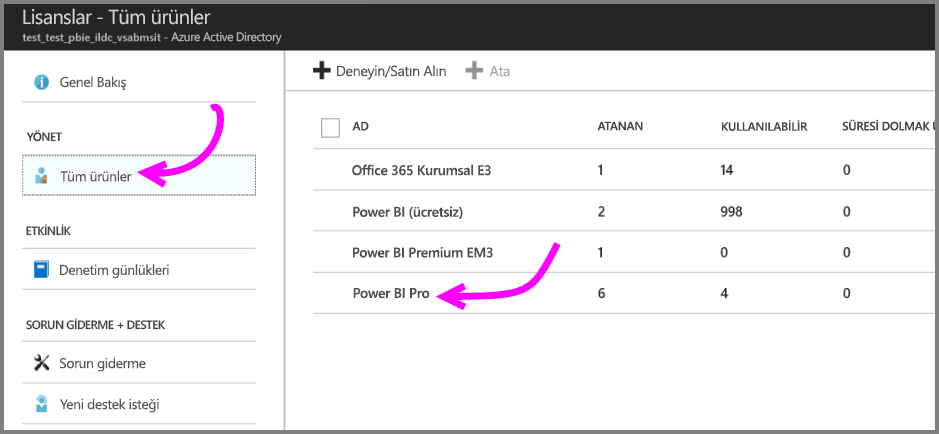

5. Ek bir kullanıcı hesabına Power BI Pro lisansı eklemek için **Ata**’yı seçin.

    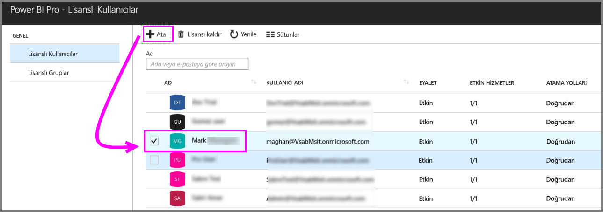

## Sonraki adımlar

Lisansları atadıktan sonra Power BI Pro hakkında daha fazla bilgi edinebilirsiniz.

[Kuruluşunuzda Power BI lisansları](service-admin-licensing-organization.md)

[Oturum açmış Power BI kullanıcılarını bulma](service-admin-access-usage.md)

Başka bir sorunuz mu var? [Power BI Topluluğu'na sorun](https://community.powerbi.com/)
