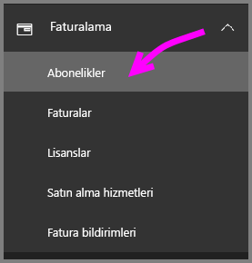
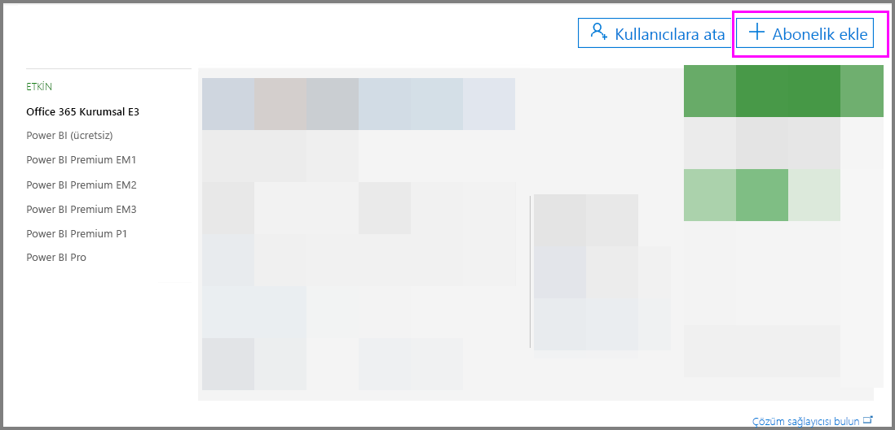
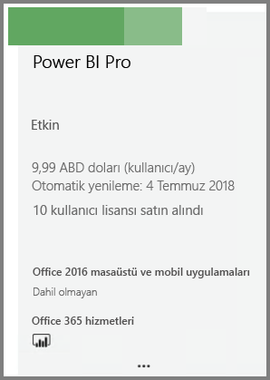
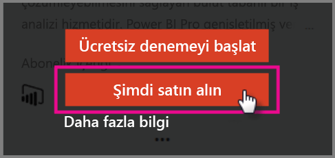

# Power BI Pro'yu satın alma

Power BI Pro ile raporlar yayımlayabilir, panolar paylaşabilir, çalışma alanlarında iş arkadaşlarıyla işbirliği yapabilir ve ilişkili diğer etkinliklerle ilgilenebilirsiniz. Power BI Pro’nun kuruluşunuza nasıl avantaj sağlayabileceği hakkında daha fazla bilgi için [Kuruluşunuzda Power BI Pro](service-admin-power-bi-pro-in-your-organization.md) bölümüne bakın.

## Office 365 Yönetim Merkezi Aracılığıyla Power BI Pro’yu Satın Alma

Office BT Yöneticileri, Power BI Pro’yu Office 365 Kurumsal E5 aboneliğinin parçası olarak veya ayrı bir Power BI Pro aboneliği olarak satın alabilir. Daha sonra uygun kullanıcılara Power BI Pro lisansları atayabilirsiniz. Lisans atama hakkında daha fazla bilgi için [Office 365’te kullanıcılara lisans atama](https://support.office.com/en-us/article/assign-licenses-to-users-in-office-365-for-business-997596b5-4173-4627-b915-36abac6786dc?ui=en-US&rs=en-US&ad=US) bölümüne bakın.

Office BT Yöneticisiyseniz Power BI Pro'yu satın almak için şu adımları izleyin:

1. [Office 365 yönetim merkezine](https://portal.office.com/adminportal/home#/homepage) gidin.
2. Sol gezinti bölmesinde Faturalama’yı seçin ve Abonelikler'e tıklayın.

    

3. Abonelikler sayfasının sağ üst köşesindeki Abonelik ekleyin seçeneğine tıklayın.

    

4. İstediğiniz abonelik teklifini bulun:

    Kurumsal Paket bölümünde Office 365 Kurumsal E5’i seçin

    

    Diğer Planlar bölümünde Power BI Pro’yu seçin

    

5. İstediğiniz abonelik için üç nokta (...) öğesinin üzerine imleci getirin ve Şimdi satın al’ı seçin.

    

6. Faturalama tercihinize göre Aylık ödeme veya Tam yıllık ödeme seçeneğini belirleyin.
7. Kaç tane kullanıcı istiyorsunuz? bölümüne istediğiniz lisans sayısını girin ve Şimdi kullanıma al veya Sepete ekle seçeneğine tıklayıp işlemi tamamlayın.
8. Satın alınan aboneliğin şimdi Abonelikler sayfasında listelendiğini doğrulayın.

   

> [!NOTE]
> İlk satın alımdan sonra daha fazla lisans ekleyebilirsiniz. Abonelikler sayfasından Power BI Pro aboneliğini seçin ve sonra Lisans ekle/kaldır seçeneğine tıklayın.
>

## Fiyatlandırma

En son fiyatlandırma bilgileri için bkz. [Power BI Fiyatlandırması](https://powerbi.microsoft.com/en-us/pricing/).

> [!NOTE]
> Pro lisansları atanmış olan kullanıcılar, abonelik sona erdikten sonra 30 gün boyunca tam erişime sahip olacaktır. Bu durumda aboneliğinizin yönetici portalında "süresi dolmuş" olarak gösterildiğini görürsünüz.
>

## Sonraki adımlar
[Power BI için self servis kayıt](service-admin-signing-up-for-power-bi-with-a-new-office-365-trial.md)
 
[Kuruluşunuz için Power BI (ücretsiz)](service-admin-service-free-in-your-organization.md)
 
[Kuruluşunuzda Power BI Pro](service-admin-power-bi-pro-in-your-organization.md)
 
[Uzatılmış Pro Deneme Sürümünü etkinleştirme](service-extended-pro-trial.md)
 
[Power BI Pro lisansları atama](service-admin-assigning-power-bi-pro-licenses.md)
 
[Power BI Premium nedir?](service-admin-premium-manage.md)
 
[Power BI Premium'u satın alma](service-admin-premium-purchase.md)
 
[Power BI Premium teknik incelemesi](https://aka.ms/pbipremiumwhitepaper)

Başka bir sorunuz mu var? [Power BI Topluluğu'na sorun](https://community.powerbi.com/)
