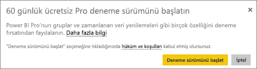
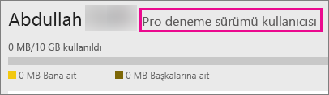

# Power BI Pro'yu satın alma
Power BI Pro; raporlar yayımlayan, panolar paylaşan, çalışma alanlarında iş arkadaşlarıyla işbirliği yapan ve aşağıdakiler gibi diğer ilişkili etkinlikler ile ilgilenen kullanıcılara yöneliktir:

* Excel veya Power BI Desktop'taki verileri çözümleme
* Excel Web App ile paylaşma desteği
* Panoları paylaşma ve uygulama iş alanları ile işbirliği yapma
* Paylaşılan içeriği görüntüleme
* İçeriği Microsoft Teams ile tümleştirme

BT Yöneticileri, kuruluşlarında Power BI Pro'yu kullanmaya yönelik birkaç seçeneğe sahiptir. Power BI Pro'yu Office 365 yönetim merkezinden ya da Microsoft temsilciniz veya iş ortağınız aracılığıyla satın alabilirsiniz. Bu makalede, Power BI Pro sürümü için kullanılabilir iki deneme sürümü seçeneği ve Power BI Pro'nun bir kuruluş tarafından nasıl satın alınabileceği konusu ele alınacaktır.

Power BI Pro'yu Premium teklifine uyarlama ve Power BI Premium hakkında daha fazla bilgi için bkz. [Power BI Premium nedir?](service-premium.md)

## Fiyatlandırma
Power BI Pro'ya ilişkin son fiyatlandırma bilgileri ve dahil olan özellikleri listeleyen bir tablo için bkz. [Power BI Fiyatlandırması](https://powerbi.microsoft.com/pricing/).

## Kişilere yönelik hizmet içi Power BI Pro 60 günlük deneme sürümü
Ücretsiz hesaba kaydolduktan sonra Pro'yu 60 gün süreyle ücretsiz deneme opsiyonunu seçebilirsiniz. Deneme süresi boyunca Pro'nun tüm özelliklerine erişebilirsiniz. Power BI Pro, Power BI ücretsiz sürümünün tüm özelliklerinin yanı sıra ek paylaşım ve işbirliği özellikleri içermektedir. Daha fazla bilgi için bkz. [Power BI Fiyatlandırması](https://powerbi.microsoft.com/pricing). Power BI Pro'nun 60 günlük ücretsiz deneme sürümü için Power BI'da oturum açın ve şu Power BI Pro özelliklerinden birini deneyin:

* [Uygulama çalışma alanı oluşturma](service-create-distribute-apps.md)
* [Bir panoyu paylaşma](service-share-dashboards.md)

Bu özelliklerden herhangi birini denediğinizde, ücretsiz denemenizi başlatmanız istenir. Ayrıca, dişli simgesine gidip **Kişisel depolama alanını yönet**'i seçerek de ücretsiz denemenizi başlatabilirsiniz. Ardından, sağdaki **Pro'yu ücretsiz dene** seçeneğini belirleyin.

Daha sonra **Deneme sürümünü başlat**'ı seçin.

> [!NOTE]
> Bu ürün içi Power BI Pro deneme sürümü avantajından faydalanan kullanıcılar, Office 365 yönetim portalında Power BI Pro Deneme Sürümü kullanıcıları olarak değil, Power BI ücretsiz sürüm kullanıcıları olarak görünür. Ancak, Power BI'daki **depolama alanını yönet** bölümünde Power BI Pro Deneme Sürümü kullanıcıları olarak görünürler.

> [!NOTE]
> Bir BT Yöneticisi olarak, Power BI deneme sürümü lisansları edinip kuruluşunuzdaki kullanıcıların deneme sürümü koşullarını ayrı ayrı kabul etmesine gerek kalmadan bunları kuruluşunuzdaki birden çok kullanıcıya dağıtmak istiyorsanız [Power BI Pro aboneliği deneme sürümüne](https://portal.office.com/Signup/MainSignup15.aspx?OfferId=d59682f3-3e3b-4686-9c00-7c7c1c736085&dl=POWER_BI_PRO) kaydolabilirsiniz. Yönetici deneme sürümüne kaydolmak isterseniz Office 365 Genel veya Faturalama Yöneticisi olmanız ya da yeni bir kiracı oluşturmanız gerekir. Daha fazla bilgi için bkz. [Power BI Pro'yu satın alma](service-admin-purchasing-power-bi-pro.md).

> [!NOTE]
> Power BI Premium kullanılabilirliği ve 1 Haziran 2017 tarihli Ücretsiz Power BI teklifine ilişkin değişikliklerle, Uzatılmış Pro Deneme Sürümü için uygun bir aday haline gelebilirsiniz. Daha fazla bilgi için bkz. [Uzatılmış Pro Deneme Sürümünü etkinleştirme](service-extended-pro-trial.md).

### Bunu hizmette nasıl görürsünüz?
Bir Pro deneme sürümü hesabına sahip olup olmadığınızı, hizmetteyken **dişli** simgesine gidip **Kişisel depolama alanını yönet** seçeneğini belirleyerek doğrulayabilirsiniz.

## Office 365'teki abonelik deneme sürümü
Kuruluşunuz için Power BI Pro'nun deneme sürümünü edinebilirsiniz. Aboneliği aldığınızda kullanıcılarınıza Power BI Pro lisansları atayabilirsiniz. Lisans atama hakkında daha fazla bilgi için bkz. [Office 365'te kullanıcılara lisans atama](https://support.office.com/article/Assign-or-unassign-licenses-for-Office-365-for-business-997596b5-4173-4627-b915-36abac6786dc).

> [!NOTE]
> Kiracı başına bir kuruluş deneme sürümü sınırı vardır. Bu, Power BI Pro Deneme Sürümünün kiracınıza daha önce uygulanmış olması halinde bunu bir daha yapamayacağınız anlamına gelir. Bununla ilgili yardıma ihtiyacınız varsa [Office 365 Faturalama destek ekibiyle](https://support.office.microsoft.com/article/Contact-Office-365-for-business-support-Admin-Help-32a17ca7-6fa0-4870-8a8d-e25ba4ccfd4b?CorrelationId=552bbf37-214f-4202-80cb-b94240dcd671&ui=en-US&rs=en-US&ad=US#BKMK_call_support) iletişim kurun.
> 

1. [Office 365 yönetim merkezine](https://portal.office.com/admin/default.aspx) gidin.
2. Sol gezinti bölmesinde, Faturalama > Abonelikler'i seçin.
3. Sağ taraftaki Abonelik ekle + öğesini seçin.
4. Diğer Planlar bölümünde Power BI Pro üzerindeki üç nokta (…) simgesinin üzerine gelin ve Ücretsiz denemeyi başlat'ı seçin.
   
    
5. Siparişinizi onaylayın ekranında Şimdi deneyin'i seçin.
6. Sipariş alındı belgesinde Devam'ı seçin.

**Faturalama** > **Abonelikler** bölümünde, 25 kullanılabilir lisans ile listelenmiş **Power BI Pro Deneme Sürümü**'nü görürsünüz. Bu, bir aylık bir deneme sürümüdür.

### Bunu hizmette nasıl görürsünüz?
Bir Pro hesabına sahip olduğunuzu, hizmetteyken **dişli** simgesine gidip **Kişisel depolama alanını yönet** seçeneğini belirleyerek doğrulayabilirsiniz. Bunun bir deneme sürümü kullanıcısı olduğuna dair herhangi bir gösterge yoktur.

## Office 365'te abonelik satın alma
Kuruluşunuz için Power BI Pro'yu, Office 365 yönetim merkezi aracılığıyla satın alabilirsiniz. Aboneliği aldığınızda kullanıcılarınıza Power BI Pro lisansları atayabilirsiniz. Lisans atama hakkında daha fazla bilgi için bkz. [Office 365'te kullanıcılara lisans atama](https://support.office.com/article/Assign-or-unassign-licenses-for-Office-365-for-business-997596b5-4173-4627-b915-36abac6786dc).

1. [Office 365 yönetim merkezine](https://portal.office.com/admin/default.aspx) gidin.
2. Sol gezinti bölmesinde, Faturalama > Abonelikler'i seçin.
3. Sağ taraftaki Abonelik ekle + öğesini seçin.
4. Diğer Planlar bölümünde Power BI Pro üzerindeki üç nokta (…) simgesinin üzerine gelin ve Hemen satın al'ı seçin.
   
    
5. Eklemek istediğiniz lisansların sayısını girin ve Siparişi tamamla'yı veya Sepete ekle'yi seçin.
   
   > [!NOTE]
   > İsterseniz daha sonra ekleme yapabilirsiniz.
   > 
   > 
6. Siparişi tamamlama akışında gerekli bilgileri girin.

> [!NOTE]
> Power BI Pro Deneme Sürümünüz zaten varsa doğrudan istediğiniz lisans sayısını girmenizi isteyen, siparişi tamamlama ekranına yönlendirilirsiniz.
> 
> 

**Faturalama** > **Abonelikler** bölümünde **Power BI Pro**'nun yer aldığını görürsünüz. Daha sonra daha fazla lisans eklemek isterseniz **Abonelik ekle** sayfasına gidip **Lisans miktarını değiştir**'i seçin.

### Bunu hizmette nasıl görürsünüz?
Bir Pro hesabına sahip olduğunuzu, hizmetteyken **dişli** simgesine gidip **Kişisel depolama alanını yönet** seçeneğini belirleyerek doğrulayabilirsiniz.

## Yetkisiz kullanım süresi
Power BI Pro lisansının süresi dolduktan sonra 30 günlük yetkisiz kullanım süresi vardır. 

Power BI Pro, Office 365 ile aynı abonelik yaşam döngüsüne sahiptir. Daha fazla bilgi için bkz. [Office 365 işletme aboneliğim sona erdiğinde verilerime ve erişim seçeneklerime ne olur?](https://support.office.com/en-us/article/What-happens-to-my-data-and-access-when-my-Office-365-for-business-subscription-ends-4436582f-211a-45ec-b72e-33647f97d8a3)

## Sonraki adımlar
[Power BI için self servis kayıt](service-self-service-signup-for-power-bi.md)  
[Kuruluşunuz için Power BI (ücretsiz)](service-admin-service-free-in-your-organization.md)  
[Uzatılmış Pro Deneme Sürümünü etkinleştirme](service-extended-pro-trial.md)  
[Power BI Premium nedir?](service-premium.md)  
[Power BI Premium'u satın alma](service-admin-premium-purchase.md)  
[Power BI Premium teknik incelemesi](https://aka.ms/pbipremiumwhitepaper)  

Başka bir sorunuz mu var? [Power BI Topluluğu'na sorun](http://community.powerbi.com/)

