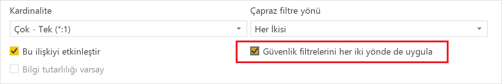
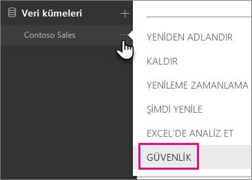
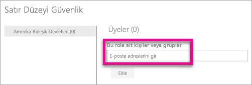
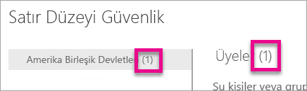
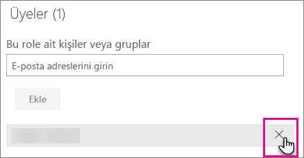
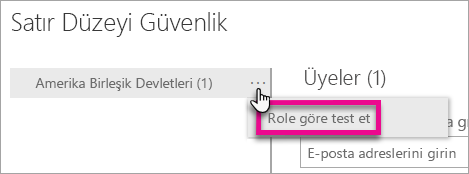
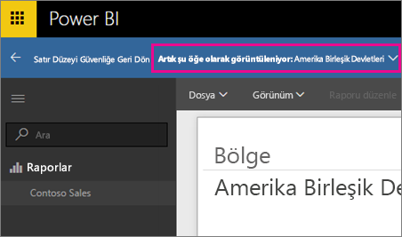
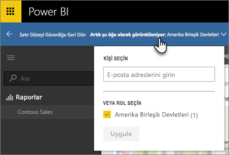
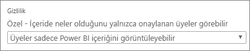

# Power BI ile satır düzeyi güvenlik (RLS)

Power BI ile satır düzeyi güvenlik (RLS), belirli kullanıcıların veri erişimini kısıtlamak için kullanılabilir. Filtreler, veri erişimini satır düzeyinde sınırlar ve rollerin içinde filtre tanımlayabilirsiniz. Power BI hizmetinde bir çalışma alanının üyelerinin o çalışma alanındaki veri kümelerine erişebildiğini unutmayın. RLS bu veri erişimini kısıtlamaz.

Power BI Desktop ile Power BI'a aktarılan veri modelleri için RLS'yi yapılandırabilirsiniz. Ayrıca DirectQuery'yi kullanan SQL Server gibi veri kümelerinde de RLS'yi yapılandırabilirsiniz. Önceden RLS'yi yalnızca Power BI dışındaki şirket içi Analysis Services modellerinde uygulayabiliyordunuz. Analysis Services canlı bağlantıları için Satır düzeyi güvenliği şirket içi model üzerinde yapılandırırsınız. Güvenlik seçeneği, canlı bağlantı veri kümeleri için gösterilmez.

[!INCLUDE [include-short-name](./includes/rls-desktop-define-roles.md)]

Varsayılan olarak, ilişkilerin tek yönlü veya çift yönlü olarak ayarlanmış olması fark etmeksizin satır düzeyi güvenlik filtrelemesi için tek yönlü filtreler kullanılır. İlişkiyi seçip **Güvenlik filtrelerini her iki yönde de uygula** onay kutusunu işaretleyerek, satır düzeyi güvenlik için çift yönlü çapraz filtrelemeyi elle etkinleştirebilirsiniz. Sunucu düzeyinde dinamik satır düzeyi güvenlik de uyguladıysanız (satır düzeyi güvenlik kullanıcı adına ve oturum açma kimliğine göre yapıldığında) bu kutuyu da işaretlemeniz gerekir.

Daha fazla bilgi için [Power BI Desktop'ta DirectQuery'yi kullanarak çift yönlü çapraz filtreleme](desktop-bidirectional-filtering.md) makalesine ve [Securing the Tabular BI Semantic Model (Tablolu BI Anlam Modelinin Güvenliğini Sağlama)](http://download.microsoft.com/download/D/2/0/D20E1C5F-72EA-4505-9F26-FEF9550EFD44/Securing%20the%20Tabular%20BI%20Semantic%20Model.docx) başlıklı teknik makaleye bakın.

[!INCLUDE [include-short-name](./includes/rls-desktop-view-as-roles.md)]

## Modelinizde güvenliği yönetme

Veri modelinizde güvenliği yönetmek için aşağıdakileri gerçekleştirmeniz gerekir.

1. Bir veri kümesine ilişkin **üç nokta (…)** simgesini seçin.
2. **Güvenlik** seçeneğini belirleyin.
   
   

Bu, Power BI Desktop'ta oluşturduğunuz bir role üye eklemeniz için sizi RLS sayfasına yönlendirir. Yalnızca veri kümesinin sahipleri Güvenlik seçeneğini görür. Veri kümesi bir Grupta yer alıyorsa yalnızca grup Yöneticileri güvenlik seçeneğini görür. 

Power BI Desktop'ta yalnızca rol oluşturabilir veya rolleri değiştirebilirsiniz.

## Üyelerle çalışma

### Üye ekleme

Eklemek istediğiniz kullanıcının, güvenlik grubunun veya dağıtım listesinin e-posta adresini ya da adını yazarak role üye ekleyebilirsiniz. Power BI'da oluşturulan Grupları ekleyemezsiniz. [Kuruluşunuzun dışından](whitepaper-azure-b2b-power-bi.md#data-security-for-external-partners) üyeler ekleyebilirsiniz.

Rol adının veya Üyeler'in yanında parantez içinde gösterilen sayıya bakarak role kaç üyenin dahil olduğunu da görebilirsiniz.

### Üyeleri kaldırma

Üye adlarının yanındaki X işaretlerini seçerek üyeleri kaldırabilirsiniz. 

## Power BI hizmetinde rolü doğrulama

Tanımladığınız rolü test ederek rolün doğru şekilde çalışıp çalışmadığını doğrulayabilirsiniz. 

1. Rolün yanındaki **Diğer seçenekler** (...) düğmesini seçin.
2. **Verileri role göre test et** seçeneğini belirleyin

Ardından, bu rol için kullanılabilen raporları görürsünüz. Panolar bu görünümde sunulmaz. Yukarıdaki mavi çubuk, hangi rolün filtrelendiğini gösterir.

**Şu anda şu kişi olarak görüntülüyorsunuz** seçeneğini belirleyerek diğer rolleri veya rol birleşimlerini test edebilirsiniz.

Verileri belirli bir kullanıcı olarak görüntülemeyi tercih edebilir veya kullanılabilir rollerin bir birleşimini seçerek çalışıp çalışmadıklarını doğrulayabilirsiniz. 

Normal görüntülemeye geri dönmek için **Satır Düzeyi Güvenliğe Geri Dön** seçeneğini belirleyin.

[!INCLUDE [include-short-name](./includes/rls-usernames.md)]

## Power BI'da çalışma alanlarıyla RLS'yi kullanma

Power BI Desktop raporunuzu Power BI hizmetindeki bir çalışma alanında yayımlarsanız roller salt okunur üyeler için geçerli olur. Çalışma alanı ayarlarında üyelerin Power BI içeriğini yalnızca görüntüleyebileceklerini belirtmeniz gerekir.

> [!WARNING]
> Çalışma alanını yapılandırırken üyelerin, düzenleme izinlerine sahip olacağını belirtirseniz RLS rolleri söz konusu üyeler için geçerli olmaz. Bu durumda, kullanıcılar tüm verileri görebilir.

[!INCLUDE [include-short-name](./includes/rls-limitations.md)]

[!INCLUDE [include-short-name](./includes/rls-faq.md)]

## Sonraki adımlar
[Row-level security (RLS) with Power BI Desktop (Power BI Desktop ile satır düzeyi güvenlik (RLS))](desktop-rls.md)  

Başka bir sorunuz mu var? [Power BI Topluluğu'na sorun](http://community.powerbi.com/)
