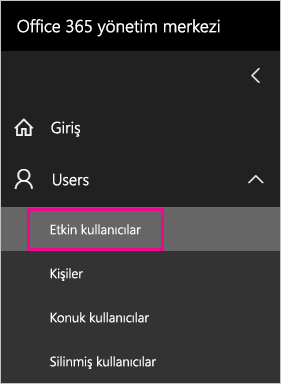
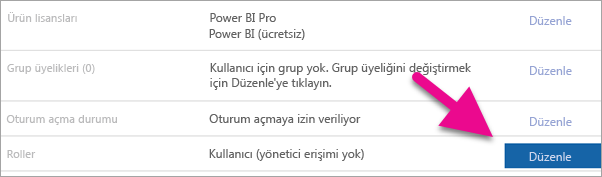
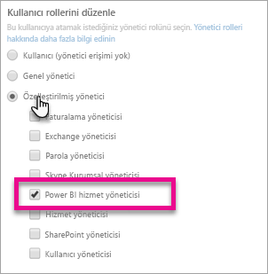
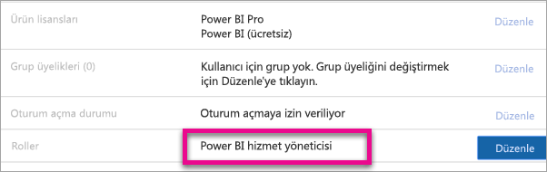

# <a name="understanding-the-power-bi-service-administrator-role"></a>Power BI hizmet yöneticisi rolünü anlama

Kuruluşunuzda Power BI hizmet yöneticisi rolünü nasıl kullanabileceğinizi öğrenin. Bu roldeki kullanıcılar, Power BI kiracısı ve yönetim özellikleri (lisanslama hariç) üzerinde tam denetime sahiptir.

<iframe width="640" height="360" src="https://www.youtube.com/embed/PQRbdJgEm3k?showinfo=0" frameborder="0" allowfullscreen></iframe>

Power BI hizmet yöneticisi rolü, Power BI Yönetici portalına erişmesi gereken kullanıcılara, Office 365 yönetici erişimi verilmeden atanabilir.

Office 365 kullanıcı yöneticileri, Office 365 Yönetim merkezinden veya bir PowerShell betiği kullanarak Power BI hizmet yöneticisi rolüne kullanıcı atayabilir. Rol atandığında kullanıcı [Power BI yönetici portalına](service-admin-portal.md) erişebilir. Burada, kiracı genelinde kullanım ölçümlerine erişebilir ve Power BI özelliklerinin kiracı genelindeki kullanımını kontrol edebilirler.

## <a name="limitations-and-considerations"></a>Sınırlamalar ve önemli noktalar

Power BI hizmet yöneticisi rolü aşağıdaki özellikleri sunmaz:

* Office 365 yönetim merkezinde kullanıcıları ve lisansları değiştirme olanağı,

* Denetim günlüklerine erişim. Daha fazla bilgi için bkz. [Kuruluşunuzda denetim özelliğini kullanma](service-admin-auditing.md).

## <a name="assign-users-to-the-admin-role-in-office-365"></a>Kullanıcıları Office 365'te yönetici rolüne atama

Kullanıcıları Office 365 yönetim merkezinden Power BI yöneticisi rolüne atamak için aşağıdaki adımları izleyin.

1. Office 365 Yönetim merkezinde **Kullanıcılar** > **Etkin Kullanıcılar**'ı seçin.

    

1. Rolü atamak istediğiniz kullanıcıyı seçin.

1. **Roller** bölümünde **Düzenle**'yi seçin.

    

1. **Özelleştirilmiş yönetici** > **Power BI hizmet yöneticisi**'ni seçin.

    

1. **Kaydet**'i ve ardından **Kapat**'ı seçin.

Söz konusu kullanıcının rolünün **Power BI hizmet yöneticisi** olarak değiştiğini görürsünüz.



## <a name="assign-users-to-the-admin-role-with-powershell"></a>Kullanıcıları PowerShell ile yönetici rolüne atama

Kullanıcıları rollere atamak için PowerShell'den de faydalanabilirsiniz. Kullanıcılar Azure Active Directory (Azure AD) hizmetinde yönetilir. Azure AD PowerShell modülüne sahip değilseniz [en son sürümü indirin ve yükleyin](https://www.powershellgallery.com/packages/AzureAD/).

1. Öncelikle **Power BI Hizmet Yöneticisi** rolünün **ObjectId** değerini almanız gerekir. **ObjectId** bilgisini almak için [Get-AzureADDirectoryRole](/powershell/module/azuread/get-azureaddirectoryrole) komutunu çalıştırabilirsiniz

    ```
    PS C:\Windows\system32> Get-AzureADDirectoryRole

    ObjectId                             DisplayName                        Description
    --------                             -----------                        -----------
    00f79122-c45d-436d-8d4a-2c0c6ca246bf Power BI Service Administrator     Full access in the Power BI Service.
    250d1222-4bc0-4b4b-8466-5d5765d14af9 Helpdesk Administrator             Helpdesk Administrator has access to perform..
    3ddec257-efdc-423d-9d24-b7cf29e0c86b Directory Synchronization Accounts Directory Synchronization Accounts
    50daa576-896c-4bf3-a84e-1d9d1875c7a7 Company Administrator              Company Administrator role has full access t..
    6a452384-6eb9-4793-8782-f4e7313b4dfd Device Administrators              Device Administrators
    9900b7db-35d9-4e56-a8e3-c5026cac3a11 AdHoc License Administrator        Allows access manage AdHoc license.
    a3631cce-16ce-47a3-bbe1-79b9774a0570 Directory Readers                  Allows access to various read only tasks in ..
    f727e2f3-0829-41a7-8c5c-5af83c37f57b Email Verified User Creator        Allows creation of new email verified users.
    ```

    Bu örnekte rolün **ObjectId** değeri: 00f79122-c45d-436d-8d4a-2c0c6ca246bf.

1. Ardından kullanıcının **ObjectId** değerini alın. [Get-AzureADUser](/powershell/module/azuread/get-azureaduser) komutunu çalıştırarak bu değere ulaşabilirsiniz.

    ```
    PS C:\Windows\system32> Get-AzureADUser -SearchString 'tim@contoso.com'

    ObjectId                             DisplayName UserPrincipalName      UserType
    --------                             ----------- -----------------      --------
    6a2bfca2-98ba-413a-be61-6e4bbb8b8a4c Tim         tim@contoso.com        Member
    ```

1. Üyeyi role eklemek için [Add-AzureADDirectoryRoleMember](/powershell/module/azuread/add-azureaddirectoryrolemember) komutunu çalıştırın.

    | Parametre | Açıklama |
    | --- | --- |
    | ObjectId |Role ilişkin ObjectId. |
    | RefObjectId |Üyelere ilişkin ObjectId. |

    ```powershell
    Add-AzureADDirectoryRoleMember -ObjectId 00f79122-c45d-436d-8d4a-2c0c6ca246bf -RefObjectId 6a2bfca2-98ba-413a-be61-6e4bbb8b8a4c
    ```

## <a name="next-steps"></a>Sonraki adımlar

[Kuruluşunuzda Power BI'ı yönetme](service-admin-administering-power-bi-in-your-organization.md)  
[Power BI yönetici portalı](service-admin-portal.md)  

Başka bir sorunuz mu var? [Power BI Topluluğu'na sorun](http://community.powerbi.com/)