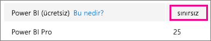
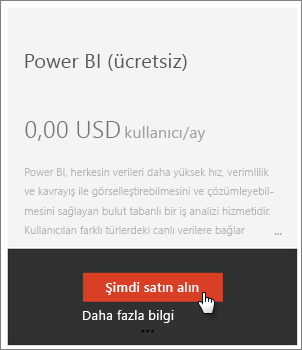
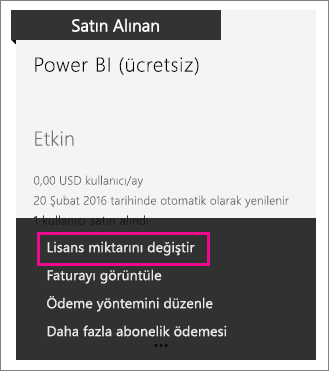

# Kuruluşunuz için Power BI (ücretsiz)
Bu makalede Power BI (ücretsiz) teklifini kuruluşunuzda nasıl kullanacağınız anlatılmaktadır. Kuruluş, kiracınız olduğu ve bu kiracı içindeki kullanıcıları ve hizmetleri yönetebildiğiniz anlamına gelir. Yönetici olarak lisans atamasını denetleyebilir veya kullanıcıların bireysel olarak kaydolmasına izin verebilirsiniz. Power BI (ücretsiz) lisansına ve bireysel kaydolma işlemlerini nasıl yönetebileceğinize göz atacağız.

## Bireysel kayıt ve lisans ataması
Kuruluşunuzdaki kullanıcılar Power BI'a iki farklı yolla erişim elde edebilir. Kullanıcılar Power BI'a bireysel olarak kaydolabilir veya Office 365 yönetim portalını kullanarak kullanıcılarınıza bir Power BI lisansı atayabilirsiniz.

Power BI ile ilgilenen kullanıcıların ücretsiz kaydolmasını sağlayan bireysel kayıt süreci kuruluş yöneticilerinin üzerindeki yükü azaltır.

Daha fazla denetim sahibi olmak için bireysel kaydolma özelliğini engelleyip Power BI lisanslarını Office 365 yönetim merkezinden kendiniz atayabilirsiniz. Bu sayede kuruluşunuzda hizmete erişebilecek kullanıcıları tek tek belirleyebilirsiniz. Bu seçenek, denetim nedeniyle kullanıcıların faydalanabileceği hizmetler üzerinde tam denetim sahibi olmanız gerektiğinde de yardımcı olacaktır.

## Sınırsız lisans bloğu alma
Office 365 yönetim merkezinin **Faturalama** > **Lisanslar** bölümünde sınırsız lisansa sahip Power BI (ücretsiz) hizmeti mevcut olabilir veya olmayabilir.

Bu lisans bloğu, kullanıcılardan biri bireysel Power BI kaydı oluşturduğunda gösterilir. İşlem sırasında bu lisans bloğu kuruluşunuza eklenir ve kaydolan kullanıcıya bir lisans atanır.

Bireysel kullanıcı kaydını engelliyorsanız ve kimse kaydolmadıysa bu lisans bloğu görünmez. Bireysel kullanıcı kaydına izin verip kullanıcılardan birinin kaydolmasını sağlayabilir veya bir sonraki adımda bahsedeceğimiz Office 365'te abonelik ekleme akışı aracılığıyla ücretsiz lisans edinebilirsiniz.

Power BI (ücretsiz) lisans bloğu kullanılabilir duruma geldikten sonra bu lisansları kullanıcılarınıza atayabilirsiniz. Lisans atama hakkında daha fazla bilgi için bkz. [Office 365'te kullanıcılara lisans atama](https://support.office.com/article/Assign-or-unassign-licenses-for-Office-365-for-business-997596b5-4173-4627-b915-36abac6786dc).

## Office 365'te abonelik ekleyerek ücretsiz lisans edinme
1. [Office 365 yönetim merkezine](https://portal.office.com/admin/default.aspx) gidin.
2. Sol gezinti bölmesinde **Faturalama** > **Abonelikler**'i seçin.
3. Sağ taraftaki **+ Abonelik ekleyin** öğesini seçin.
4. Diğer Planlar bölümünde Power BI (ücretsiz) üzerindeki **üç nokta (…)** simgesinin üzerine gelin ve **Hemen satın alın**'ı seçin.
   
    
5. Eklemek istediğiniz lisansların sayısını girin ve **Siparişi tamamla**'yı veya **Sepete ekle**'yi seçin.
   
   > [!NOTE]
   > İsterseniz daha sonra ekleme yapabilirsiniz.
   > 
   > 
6. Siparişi tamamlama akışında gerekli bilgileri girin.

Bu yaklaşımı kullandığınızda fatura için kredi kartı bilgilerini girmeniz veya fatura gönderilmesini seçmeniz gerekse de satın alma işlemi gerçekleşmez.

Daha sonra daha fazla lisans eklemek isterseniz **Abonelik ekleyin** sayfasına gidip Power BI (ücretsiz) için **Change license quantity** (Lisans miktarını değiştir) seçeneğini belirleyin.

Şimdi bu lisansları kullanıcılarınıza atayabilirsiniz. Lisans atama hakkında daha fazla bilgi için bkz. [Office 365'te kullanıcılara lisans atama](https://support.office.com/article/Assign-or-unassign-licenses-for-Office-365-for-business-997596b5-4173-4627-b915-36abac6786dc).

## Azure Active Directory'de bireysel kullanıcı kaydını etkinleştirme veya devre dışı bırakma
Yönetici olarak Azure Active Directory (AAD) hizmetinden bireysel kullanıcı kaydını etkinleştirebilir veya devre dışı bırakabilirsiniz. AAD PowerShell komutlarını kullanmayı biliyorsanız geçici abonelikleri kendiniz etkinleştirebilir veya devre dışı bırakabilirsiniz. [Daha fazla bilgi](https://technet.microsoft.com/library/jj151815.aspx)

Denetim **AllowAdHocSubscriptions** AAD ayarı tarafından gerçekleştirilir. Çoğu kiracıda bu ayar true olarak ayarlanmış, diğer bir deyişle etkinleştirilmiştir. Power BI uygulamasını bir iş ortağı aracılığıyla satın aldıysanız varsayılan olarak false, diğer bir deyişle devre dışı olabilir.

1. Öncelikle Office 365 kimlik bilgilerinizi kullanarak Azure Active Directory'de oturum açmanız gerekir. İlk satırda kimlik bilgileriniz istenir. İkinci satırda Azure Active Directory ile bağlantı kurulur.
   
     $msolcred = get-credential   connect-msolservice -credential $msolcred
   
   
2. Oturum açtıktan sonra aşağıdaki komutu kullanarak kiracınızın geçerli yapılandırmasını görebilirsiniz.
   
     Get-MsolCompanyInformation | fl AllowAdHocSubscriptions
3. Bu komutu kullanarak AllowAdHocSubscriptions ayarını etkinleştirebilir ($true) veya devre dışı bırakabilirsiniz ($false).
   
     Set-MsolCompanySettings -AllowAdHocSubscriptions $true

> [!NOTE]
> Bu komut, kuruluşunuzdaki yeni kullanıcıların Power BI'a kaydolmasını engeller. Kuruluşunuzda yeni kayıt gerçekleştirme özelliği devre dışı bırakılmadan önce Power BI'a kaydolmuş olan kullanıcıların lisansları korunur.
> 
> 

## Sonraki adımlar
[Power BI için self servis kayıt](service-self-service-signup-for-power-bi.md)  
[Power BI Pro'yu satın alma](service-admin-purchasing-power-bi-pro.md)  
[Sign up for Power BI (free) with a custom Azure Active Directory tenant (Özel bir Azure Active Directory kiracısıyla Power BI'a (ücretsiz) kaydolma)](developer/create-an-azure-active-directory-tenant.md)  
[Power BI Premium nedir?](service-premium.md)  
[Power BI Premium teknik incelemesi](https://aka.ms/pbipremiumwhitepaper)  

Başka bir sorunuz mu var? [Power BI Topluluğu'na sorun](http://community.powerbi.com/)

