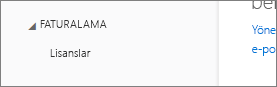

# Power BI, Office 365 iş ortağı aboneliğine eklenemiyor
Office 365 şirketlere, Office 365'i kendi çözümleriyle paketlenmiş ve tümleştirilmiş biçimde yeniden satma olanağı sunar ve son kullanıcılara satın alma, fatura ve destek için tek bir irtibat noktası sağlar.

Office 365 aboneliğinizin yanında Power BI'ı da edinmek istiyorsanız iş ortağınızla iletişime geçmenizi öneririz. İş ortağınız Power BI'ı sunmuyorsa farklı seçenekleri göz önünde bulundurabilirsiniz.

1. Hizmeti farklı bir kanaldan veya doğrudan Microsoft'tan ya da başka bir iş ortağından satın alabilirsiniz. Bu seçenek, iş ortaklarıyla olan ilişkilerine bağlı olarak tüm müşterilere sunulmayabilir. Bunu **Office 365 Yönetim Portalı** > **Fatura** > **Abonelikler** sayfasına giderek kontrol edebilirsiniz. **Abonelikler**'i görüyorsanız hizmeti doğrudan Microsoft'tan edinebilir veya Power BI'ı sunan bir iş ortağıyla da iletişime geçebilirsiniz.
   
    
2. **Fatura** bölümünde **Abonelikler**'i görmüyorsanız hizmeti doğrudan Microsoft'tan veya başka bir iş ortağından satın alamazsınız. 
   
   

Power BI'ı doğrudan satın alamamanız halinde, ne tür bir Power BI aboneliği edinmek istediğinize de bağlı olarak bazı seçenekleriniz mevcuttur.

[Power BI (ücretsiz)](#power-bi-free)

[Power BI Pro ve Premium](#power-bi-pro)

## Power BI (ücretsiz)
Ücretsiz Power BI teklifinden memnunsanız ücretsiz hizmete kaydolabilirsiniz. Özel abonelikler olarak da bilinen bireysel kaydolma işlemleri varsayılan olarak devre dışıdır. Power BI'a kaydolmayı denediğinizde BT departmanınızın Microsoft Power BI'a kaydolmayı devre dışı bıraktığını belirten bir ileti ile karşılaşırsınız.

    Your IT department has turned off signup for Microsoft Power BI.

Özel abonelikleri etkinleştirmek için, iş ortağınızla iletişime geçip bu seçeneği kullanımınıza sunmasını isteyebilirsiniz. Kiracınızda Yöneticiyseniz ve Azure Active Directory PowerShell komutlarından nasıl yararlanacağınızı biliyorsanız özel abonelikleri kendiniz de etkinleştirebilirsiniz. [Daha fazla bilgi](https://technet.microsoft.com/library/jj151815.aspx)

1. Öncelikle Office 365 kimlik bilgilerinizi kullanarak Azure Active Directory'de oturum açmanız gerekir. İlk satırda kimlik bilgileriniz istenir. İkinci satırda Azure Active Directory ile bağlantı kurulur.
   
        $msolcred = get-credential
        connect-msolservice -credential $msolcred
   
    
2. Oturum açtıktan sonra ücretsiz kaydolma işlemlerini etkinleştirmek için aşağıdaki komutu kullanabilirsiniz.
   
        Set-MsolCompanySettings -AllowAdHocSubscriptions $true

## Power BI Pro ve Premium
Bir Power BI Pro veya Power BI Premium aboneliği satın almak istiyorsanız, sahip olduğunuz seçenekleri değerlendirmek için iş ortağınızla iletişim kurmanız gerekir.

* İş ortağınız, hizmeti kendisinden satın alabilmeniz için Power BI'ı portföyüne ekleyebilir.
* İş ortağınız sizi, Power BI'ı doğrudan Microsoft'tan veya Power BI'ı sunan başka bir iş ortağından satın alabileceğiniz bir modele geçirebilir.

Aşağıdaki videoda Office 365 dağıtımı ve Power BI'ı satın alma konusu ele alınmaktadır:

<iframe width="560" height="315" src="https://www.youtube.com/embed/C357phT94A8" frameborder="0" allowfullscreen></iframe>

## Sonraki adımlar
[Windows PowerShell'i kullanarak Azure AD'yi yönetme](https://technet.microsoft.com/library/jj151815.aspx)  
[Power BI Premium nedir?](service-premium.md)

Başka bir sorunuz mu var? [Power BI Topluluğu'na sorun](http://community.powerbi.com/)

