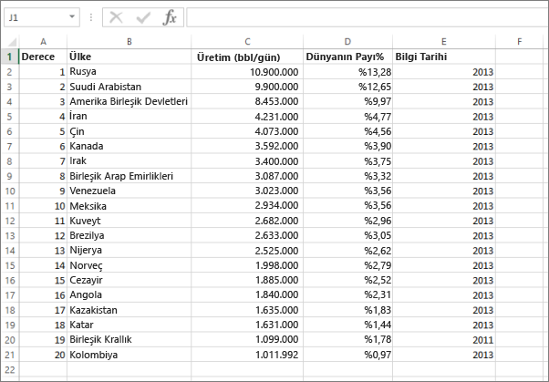
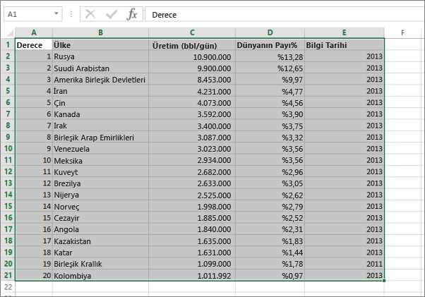
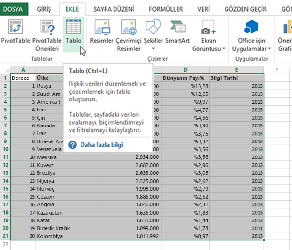
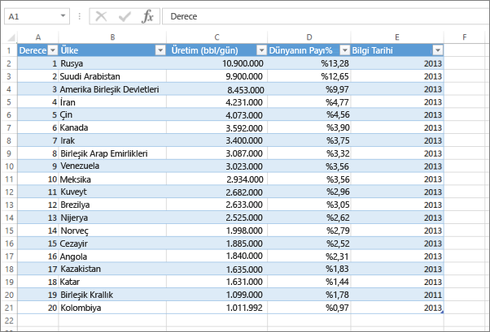
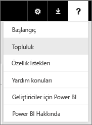

# Hata: Excel çalışma kitabınızda herhangi bir veri bulamadık

>[!NOTE]
>Bu makale Excel 2007 ve sonraki sürümleri için geçerlidir.

Power BI'a Excel çalışma kitabı aktarırken şu hatayla karşılaşabilirsiniz:

*Hata: Excel çalışma kitabınızda herhangi bir veri bulamadık. Verileriniz uygun şekilde biçimlendirilmemiş olabilir. Çalışma kitabınızı Excel'de düzenlemeniz ve ardından tekrar içeri aktarmanız gerekir.*

## Hızlı çözüm
1. Çalışma kitabınızı Excel'de düzenleyin.
2. Verilerinizin bulunduğu hücre aralığını seçin. İlk satırda sütun üstbilgilerinizin (sütun adları) bulunması gerekir.
3. **Ctrl + T** tuşlarına basarak bir tablo oluşturun.
4. Çalışma kitabınızı kaydedin.
5. Power BI'a geri dönün ve çalışma kitabınızı yeniden içeri aktarın veya Excel 2016'da çalışıyorsanız ve çalışma kitabınızı OneDrive İş'e kaydettiyseniz, Excel'de Dosya > Yayımla seçeneklerini belirleyin.

## Ayrıntılar
### Neden
Excel'de, bir dizi hücreden **tablo** oluşturabilir, böylece verilerinizi kolayca sıralayabilir, filtreleyebilir ve biçimlendirebilirsiniz.

Bir Excel çalışma kitabını içeri aktardığınızda, Power BI bu tabloları bulur ve bir veri kümesine aktarır. Tablo bulunamaması halinde ise bu hata iletisiyle karşılaşırsınız.

### Çözüm
1. Çalışma kitabınızı Excel'de açın. 
    >[!NOTE]
    >Buradaki görüntüler Excel 2013'ten alınmıştır. Farklı bir sürüm kullanıyorsanız görüntüler küçük farklılıklar gösterebilir ancak adımlar aynıdır.
    
    
2. Verilerinizin bulunduğu hücre aralığını seçin. İlk satırda sütun üstbilgilerinizin (sütun adları) bulunması gerekir:
   
    
3. **EKLE** sekmesindeki şeritte bulunan **Tablo**'ya tıklayın. (Alternatif olarak **Ctrl + T** kısayolunu da kullanabilirsiniz.)
   
    
4. Aşağıdaki iletişim kutusunu görürsünüz. **Tablom üstbilgi satırı içeriyor** onay kutusunun işaretlendiğinden emin olun ve **Tamam**'ı seçin:
   
    
5. Artık verileriniz tablo biçimindedir:
   
    
6. Çalışma kitabınızı kaydedin.
7. Power BI'a geri dönün. Sol gezinti bölmesinin alt kısmındaki Veri Al seçeneğin belirleyin.
   
    
8. **Dosyalar** kutusunda **Al**'ı seçin.
   
    
9. Excel çalışma kitabınızı yeniden içeri aktarın. Bu kez içeri aktarma işlemiyle tablonun bulunması ve işlemin başarılı olması gerekir.
   
    İçeri aktarma işlemi yine de başarısız olursa yardım menüsündeki **Topluluk **seçeneğine tıklayarak bizi haberdar edin:
   
    
