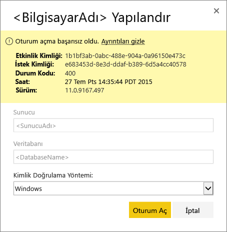
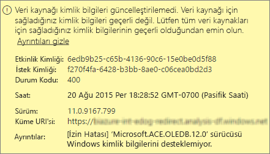
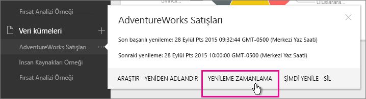
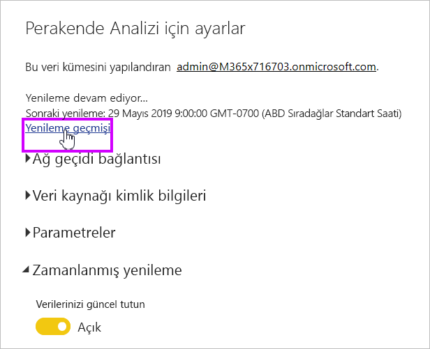
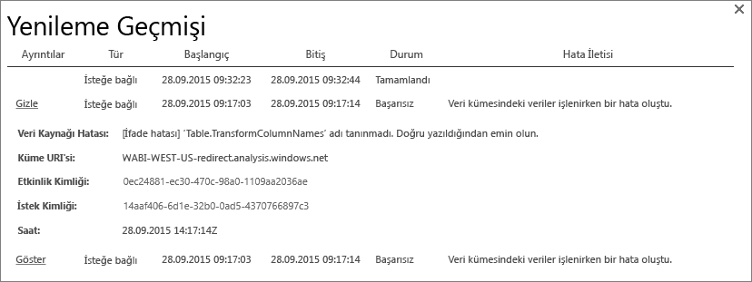
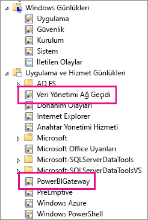
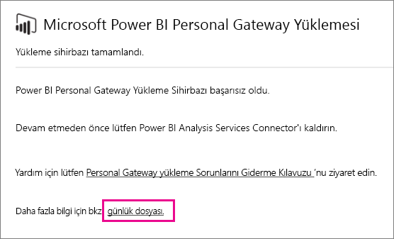
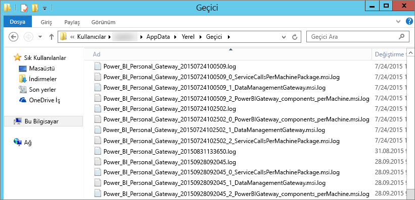

# Power BI Gateway’de sorun giderme (kişisel mod)

[!INCLUDE [gateway-rewrite](includes/gateway-rewrite.md)]

Aşağıdaki bölümlerde Power BI şirket içi veri ağ geçidi (kişisel mod) kullanılırken sıkça karşılaşılabilen sorunlar ele alınmıştır.

## Son sürüme güncelleştirme

Şirket içi veri ağ geçidi (kişisel mod) kişisel kullanıma yönelik geçerli ağ geçidi sürümüdür. Bu sürümü kullanmak için yüklemenizi güncelleştirin.

Ağ geçidi sürümü güncel olmadığında birçok sorun ortaya çıkabilir. En son sürümü kullandığınızdan emin olmak her zaman için iyi bir yöntemdir. Ağ geçidini bir ay veya daha uzun süredir güncelleştirmediyseniz ağ geçidinin en son sürümünü yüklemeyi göz önünde bulundurabilirsiniz. Ardından, sorunu yeniden oluşturup oluşturamayacağınıza bakın.

## Yükleme
**Ağ Geçidi (kişisel mod) 64 bitlik sürümlerde çalışır:** Makineniz 32 bitlik sürümü kullanıyorsa ağ geçidini (kişisel mod) yükleyemezsiniz. İşletim sisteminizin sürümü 64 bit olmalıdır. Windows’un 64 bitlik bir sürümünü yükleyin veya ağ geçidini (kişisel mod) 64 bitlik işletim sistemi kullanan bir makineye yükleyin.

**Bilgisayarda yerel yönetici olmanıza rağmen ağ geçidinin (kişisel mod) yüklemesi başarısız oluyor:** Kullanıcı, bilgisayarın yerel yönetici grubunda bulunursa yükleme başarısız olabilir. Ancak, Grup İlkesi bu kullanıcı adının bir hizmet olarak oturum açmasına izin vermez. Grup İlkesinin bir kullanıcının hizmet olarak oturum açmasına izin verdiğinden emin olun. Bu soruna ilişkin bir düzeltme üzerinde çalışıyoruz. Daha fazla bilgi için bkz. [Bir hesaba hizmet olarak oturum açma hakkı ekleme](https://technet.microsoft.com/library/cc739424.aspx).

**İşlem zaman aşımına uğradı:** Bu ileti, kişisel ağ geçidini (kişisel mod) yüklediğiniz bilgisayarın tek çekirdekli bir işlemciye sahip olduğu durumlarda sık karşılaşılan bir sorundur. Tüm uygulamaları kapatın ve gerekli olmayan işlemleri devre dışı bırakıp yüklemeyi tekrar gerçekleştirmeyi deneyin.

**Veri yönetimi ağ geçidi veya Analysis Services bağlayıcısı ağ geçidinin (kişisel mod) yüklü olduğu bilgisayara yüklenemiyor:** Yüklü Analysis Services bağlayıcınız veya bir veri yönetimi ağ geçidiniz varsa, ilk olarak bağlayıcıyı veya ağ geçidini kaldırın. Ardından, ağ geçidini (kişisel mod) yüklemeyi deneyin.

> [!NOTE]
> Yükleme sırasında bir sorunla karşılaşırsanız kurulum günlükleri, sorunu gidermenize yardımcı olacak bilgiler sağlayabilir. Daha fazla bilgi için bkz. [Kurulum günlükleri](#SetupLogs).
> 
> 

 **Proxy yapılandırması:** Ortamınız için bir ara sunucu kullanılması gerekiyorsa ağ geçidini yapılandırma (kişisel mod) ile ilgili sorunlarla karşılaşabilirsiniz. Ara sunucu bilgilerini yapılandırma hakkında daha fazla bilgi edinmek için bkz. [Şirket içi veri ağ geçidi için ara sunucu ayarlarını yapılandırma](/data-integration/gateway/service-gateway-proxy).

## Yenileme zamanlama
**Hata: Bulutta depolanan kimlik bilgileri eksik.**

Zamanlanan bir yenilemeniz varsa ve ağ geçidini (kişisel mod) kaldırıp yeniden yüklediyseniz \<veri kümesine\> yönelik ayarlarda bu hatayla karşılaşabilirsiniz. Bir ağ geçidini (kişisel mod) kaldırdığınızda, yenileme için yapılandırılan veri kümesine yönelik veri kaynağı kimlik bilgileri Power BI hizmetinden kaldırılır.

**Çözüm:** Power BI'da bir veri kümesinin yenileme ayarlarına gidin. **Veri Kaynaklarını Yönet** bölümünde, hata veren veri kaynakları için **Kimlik bilgilerini düzenle**’yi seçin. Ardından, veri kaynağında yeniden oturum açın.

**Hata: Veri kümesi için sağlanan kimlik bilgileri geçerli değil. Devam etmek için lütfen sayfayı yenileyerek veya Veri Kaynağı Ayarları iletişim kutusunda kimlik bilgilerini güncelleştirin.**

**Çözüm:** Kimlik bilgileri ile ilgili bir ileti alıyorsanız bu aşağıdaki anlamlara gelebilir:

* Veri kaynaklarında oturum açmak için kullandığınız kullanıcı adları ve parolalar güncel değil. Power BI'da ilgili veri kümesinin yenileme ayarlarına gidin. Veri kaynağı kimlik bilgilerini güncelleştirmek için **Veri Kaynaklarını Yönet** bölümündeki **Kimlik bilgilerini düzenle**'yi seçin.
* Kaynaklardan birinde kimlik doğrulaması için OAuth kullanılıyorsa tek bir sorguda yer alan, bulut kaynağı ile şirket içi kaynak arasındaki karmalar, ağ geçidinde (kişisel mod) yenilenemez. CRM Online ile yerel SQL Server örneği arasındaki bir karma bu soruna örnek olarak verilebilir. CRM Online için OAuth gerektiğinden karma başarısız olur.
  
  Bu hata bilinen bir sorundur ve araştırılmaktadır. Soruna yönelik geçici çözüm olarak bulut kaynağı ile şirket içi kaynak için ayrı bir sorgu bulundurun. Bunları birleştirmek için birleştirme veya ekleme sorgusu kullanın.

**Hata: Desteklenmeyen veri kaynağı.**

**Çözüm:** **Yenilemeyi Zamanla** ayarlarında desteklenmeyen veri kaynağı iletisi alırsanız bu aşağıdaki anlamlara gelebilir: 

* Power BI'da veri kaynağı yenileme işlemi o anda desteklenmiyordur. 
* Excel çalışma kitabı veri modelini değil yalnızca çalışma sayfası verilerini içeriyordur. Power BI şu anda yalnızca, karşıya yüklenen Excel çalışma kitabının bir veri modeli içermesi halinde yenilemeyi destekler. Verileri Excel'deki Power Query ile içeri aktarıyorsanız verileri bir veri modeline yüklemek için **Yükle** seçeneğini belirleyin. Bu seçenek verilerin bir veri modeline aktarılmasını sağlar. 

**Hata: [Veriler birleştirilemiyor] &lt;sorgu parçası&gt;/&lt;…&gt;/&lt;…&gt;, birlikte kullanılamayan gizlilik düzeylerine sahip veri kaynaklarına erişiyor. Lütfen bu veri birleşimini yeniden oluşturun.**

**Çözüm:** Bu hatanın nedeni kullandığınız veri kaynaklarının türleri ve gizlilik düzeyi sınırlamalarıdır.

**Hata: Veri kaynağı hatası: "\[Table\]"değerini Table türüne dönüştüremiyoruz.**

**Çözüm:** Bu hatanın nedeni kullandığınız veri kaynaklarının türleri ve gizlilik düzeyi sınırlamalarıdır.

**Hata: Bu satır için yeterli alan yok.**

**Çözüm:** Satırlarınızdan birinin boyutu 4 MB'tan fazlaysa bu hatayla karşılaşırsınız. Veri kaynağınızda söz konusu satırı bulup filtrelemeyi veya satırın boyutunu azaltmayı deneyin.

## Veri kaynakları
**Eksik veri sağlayıcı:** Ağ geçidi (kişisel mod) yalnızca 64 bitlik sürümlerde çalışır. Ağ geçidinin (kişisel mod) yüklendiği bilgisayarda veri sağlayıcılarının 64 bit sürümünün yüklü olması gerekir. Örneğin, veri kümesindeki veri kaynağı Microsoft Access ise ağ geçidini (kişisel mod) yüklediğiniz bilgisayara 64 bit ACE sağlayıcısını yüklemeniz gerekir. 

>[!NOTE]
>Excel'in 32 bit sürümüne sahipseniz aynı bilgisayara sürümü 64 bit olan bir ACE sağlayıcısı yükleyemezsiniz.

**Windows kimlik doğrulaması Access veritabanı için desteklenmez:** Power BI şu anda Access veritabanı için yalnızca Anonim kimlik doğrulamasını destekler.

**Hata: Bir veri kaynağı için kimlik bilgilerini girdiğinizde oluşan oturum açma hatası:** Bir veri kaynağı için Windows kimlik bilgilerini girdiğinizde böyle bir hata alırsanız: 

  

Ağ geçidinin (kişisel mod) eski bir sürümünü kullanıyor olabilirsiniz. 

**Çözüm:** Daha fazla bilgi için bkz. [Power BI Gateway'in (kişisel mod) en son sürümünü yükleme](https://powerbi.microsoft.com/gateway/).

**Hata: ACE OLEDB kullanan bir veri kaynağı için Windows kimlik doğrulamasını seçtiğinizde oluşan oturum açma hatası:** ACE OLEDB sağlayıcısı kullanan bir veri kaynağı için veri kaynağı kimlik bilgilerini girdiğinizde aşağıdaki hatayı alırsanız:

Power BI şu anda ACE OLEDB sağlayıcısı kullanan bir veri kaynağı için Windows kimlik doğrulamasını desteklememektedir.

**Çözüm:** Geçici çözüm olarak, **Anonim kimlik doğrulamasını** seçin. Eski ACE OLEDB sağlayıcısı için anonim kimlik bilgileri, Windows kimlik bilgilerine eşittir.

## Kutucuk yenileme
Pano kutucukları yenilendiğinde bu hatayı alırsanız şu bölüme bakın: [Kutucuk hatalarını giderme](refresh-troubleshooting-tile-errors.md).

## Sorun giderme araçları
### Yenileme geçmişi
**Yenileme geçmişi** ile oluşan hataları görebilir ve bir destek isteği oluşturmanız gerekiyorsa kullanışlı verileri bulabilirsiniz. Hem zamanlanmış yenilemeleri hem de isteğe bağlı yenilemeleri görüntüleyebilirsiniz. **Yenileme geçmişine** aşağıda gösterildiği gibi ulaşırsınız.

1. Power BI gezinti bölmesindeki **Veri Kümeleri** bölümünde bir veri kümesi seçin. Menüyü açın ve **Yenilemeyi Zamanla**'yı seçin.

   
1. **Ayarlar:** için **Yenileme geçmişini** seçin. 

   
   
   

### Olay günlükleri
Çeşitli olay günlükleri bilgi sağlayabilir. İlk ikisi, **Veri Yönetimi Ağ Geçidi** ile **PowerBIGateway**'dir ve bunlar, makinede yönetici olmanız durumunda sunulur. Yönetici değilseniz ve veri ağ geçidi (kişisel mod) kullanıyorsanız günlük girdilerini **Uygulama** günlüğü içinde görürsünüz.

**Veri Yönetimi Ağ Geçidi** ve **PowerBIGateway** günlükleri **Uygulama ve Hizmet Günlükleri** altındadır.

### Fiddler ile izleme
[Fiddler](https://www.telerik.com/fiddler), Telerik tarafından kullanıma sunulup HTTP trafiğini izleyen ücretsiz bir araçtır. İstemci makinesinden Power BI hizmetiyle iletişimi görebilirsiniz. Bu iletişim hataları ve diğer ilgili bilgileri gösterebilir.

### Kurulum günlükleri
Gateway (kişisel mod) yüklenemiyorsa kurulum günlüğünü görüntülemeye yönelik bir bağlantı görürsünüz. Kurulum günlüğü hatayla ilgili ayrıntıları gösterebilir. Bu günlükler aynı zamanda MSI günlükleri olarak da bilinen Windows Yüklemesi günlükleridir. Oldukça karmaşık olabilen bu günlükleri okumakta zorlanabilirsiniz. Oluşan hata genellikle altta verilir ancak hatanın nedenini belirlemek basit değildir. Farklı bir günlükteki hataların sonucu olabilir. Günlükte daha yukarılarda oluşan bir hatanın da sonucu olabilir.

Geçici klasörünüze (%temp%) gidebilir ve *Power\_BI\_* ile başlayan dosyaları arayabilirsiniz.

> [!NOTE]
> %temp% klasörüne gitmek, sizi Geçici klasörün bir alt klasöre götürebilir. *Power\_BI\_* dosyaları, Geçici klasör dizininin kökündedir. Bir veya iki düzey üstteki klasöre erişmeniz gerekebilir.
> 
> 

## Sonraki adımlar
- [Şirket içi veri ağ geçidi için ara sunucu ayarlarını yapılandırma](/data-integration/gateway/service-gateway-proxy)- [Veri yenileme](refresh-data.md)  
- [Power BI Ağ geçidi Kişisel](service-gateway-personal-mode.md)  
- [Kutucuk hatalarıyla ilgili sorunları giderme](refresh-troubleshooting-tile-errors.md)  
- [Şirket içi veri ağ geçidiyle ilgili sorunları giderme](service-gateway-onprem-tshoot.md) 
 
Başka bir sorunuz mu var? [Power BI Topluluğu](https://community.powerbi.com/)'na sorun.

