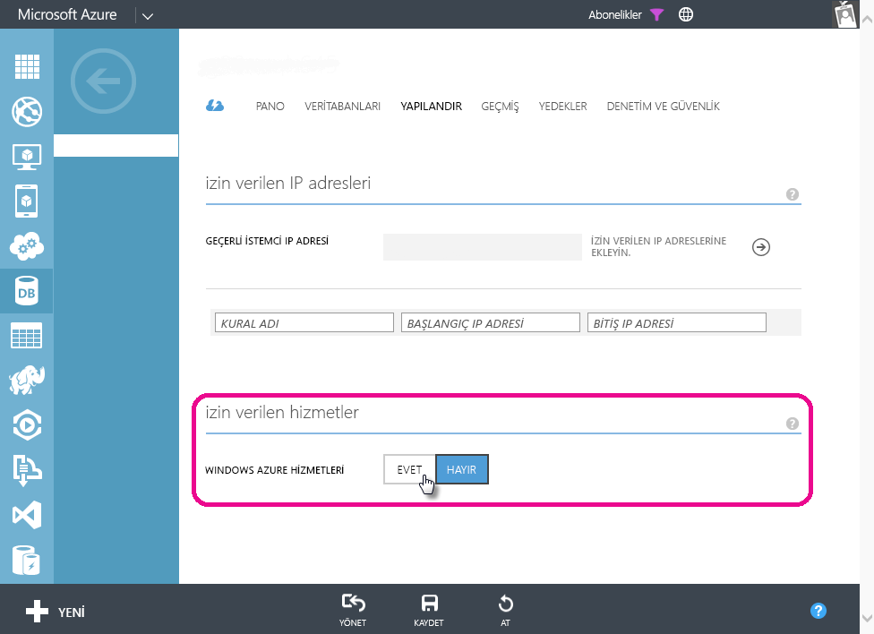

# Power BI'da Azure SQL Veritabanları için zamanlanmış yenileme ile ilgili sorunları giderme
Ayrıntılı zamanlanmış yenileme adımları için bkz. [Power BI'da verileri yenileme](refresh-data.md).

Azure SQL Veritabanı için zamanlanmış yenilemeyi ayarlama sırasında kimlik bilgilerini düzenlerken hata kodu 400 ile karşılaşıyorsanız uygun güvenlik duvarı kurallarını ayarlamak için aşağıdaki işlemleri gerçekleştirmeyi deneyin:

1. Azure yönetim portalında oturum açın
2. Yenileme yapılandırması yaptığınız Azure SQL sunucusuna gidin
3. İzin verilen hizmetler bölümünde "Windows Azure Hizmetleri"ni açın

  

Başka bir sorunuz mu var? [Power BI Topluluğu'na başvurun](http://community.powerbi.com/)

