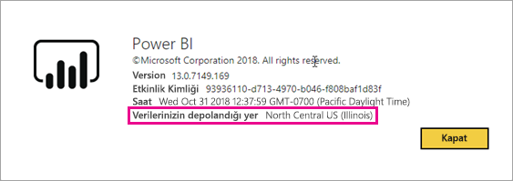
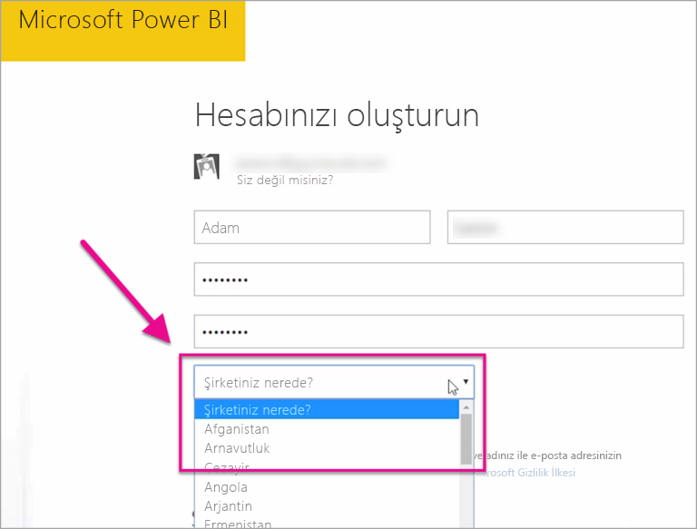

# Power BI kiracım nerede bulunur?
<iframe width="560" height="315" src="https://www.youtube.com/embed/0fOxaHJPvdM?showinfo=0" frameborder="0" allowfullscreen></iframe>

Power BI kiracınızın bulunduğu yeri ve bu konumun nasıl seçildiğini öğrenin. Hizmetle kurduğunuz etkileşimleri etkileyebileceğinden bu durumu kavramanız önemlidir.

## Power BI kiracınızın bulunduğu yeri belirleme
Kiracınızın bulunduğu bölgeyi bulmak için aşağıdaki işlemleri gerçekleştirebilirsiniz.

1. Power BI hizmetinde **?** öğesini seçin.
2. **Power BI Hakkında**'yı seçin.
3. **Verilerinizin depolandığı yer** ifadesinin yanındaki değere bakın. Bu değer, kiracınızın bulunduğu bölgedir.

## Veri bölgesi nasıl seçilir?
Veri bölgesi, kiracı ilk oluşturulduğunda seçilmiş olan ülkeye göre belirlenir. Bu bilgi paylaşıldığından bu durum hem Office 365 hem de Power BI kayıtları için geçerlidir. Yeni kiracı kaydı oluştururken bir ülke açılan listesi görürsünüz.

Verilerinizin depolandığı yer burada yaptığınız seçime göre belirlenir. Power BI, bu seçime en yakın veri bölgesini seçer.

> [!WARNING]
> Bu seçim değiştirilemez!
> 
> 

Başka bir sorunuz mu var? [Power BI Topluluğu'na başvurun](http://community.powerbi.com/)

