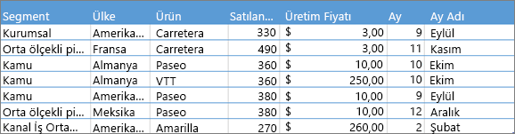
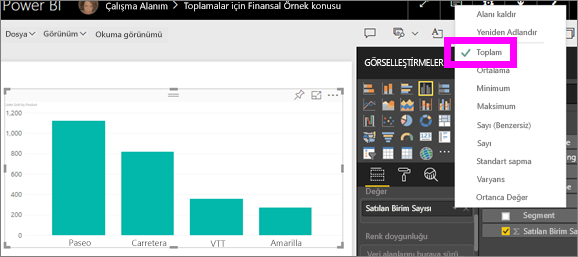
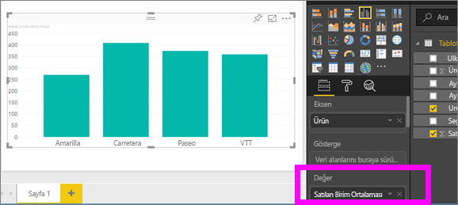
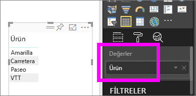
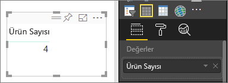
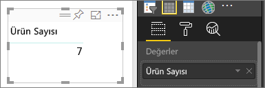
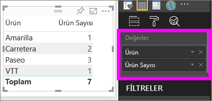

# Power BI hizmetinde toplamlarla (toplam, ortalama vb.) çalışma
## Toplam neye denir?
Bazı durumlarda verilerinizdeki değerleri matematiksel olarak birleştirmek istersiniz. Bu matematiksel işlem toplam, ortalama, maksimum, sayı vb. olabilir. Verilerinizdeki değerleri birleştirmek için gerçekleştirdiğiniz işleme *toplama* adı verilir. Bu matematik işleminin sonucu *toplam* olarak adlandırılır. 

Power BI hizmetinde ve Power BI Desktop'ta görselleştirmeler oluşturulurken verileriniz toplanabilir. Genellikle tüm ihtiyacınız olan toplama ulaşmaktır ancak belirli durumlarda değerleri farklı bir şekilde toplamanız gerekebilir.  Örneğin, toplam yerine ortalama. Bir görselleştirmede kullanılan toplama işlemini yönetmek ve değiştirmek için izlenebilecek birkaç farklı yol bulunur.

Verilerin toplanıp toplanamayacağı ve nasıl toplanabileceği veri türüne göre belirlendiğinden, ilk olarak veri *türlerini* inceleyelim.

## Veri türleri
Çoğu veri kümesinde birden fazla türde veri bulunur. En temel düzeyde veriler, sayısal veriler ve sayısal olmayan veriler olarak ayrılır. Sayısal veriler toplam, ortalama, sayı, minimum, varyans veya daha pek çok toplama işlemi kullanılarak toplanabilir. Metinsel veriler (sıklıkla *kategorik* veriler olarak anılır) bile toplanabilir. Kategorik bir alanı toplamayı denerseniz (alanı **Değerler** veya **Araç ipuçları** gibi yalnızca sayısal bir demete yerleştirerek) Power BI, her bir kategoriye ilişkin oluşumları ya da her bir kategoriye ilişkin benzersiz oluşumları sayabilir. Üstelik tarihler gibi özel veri türlerine özgü birkaç toplama seçeneği de bulunur: En erken, En geç, İlk ve Son. 

Aşağıdaki örnekte:
- **Units Sold** ve **Manufacturing Price** sayısal veriler içeren sütunlardır
-  **Segment**, **Country**, **Product**, **Month** ve **Month Name** sütunları ise kategorik veriler içerir

   

Power BI'da görselleştirme oluşturulurken, sayısal alanlar bazı kategorik alanlarla ilişkili olarak toplanır. (Varsayılan olarak *toplam* kullanılır.)  Örneğin, "Units Sold ***by Product***, "Units Sold ***by Month***" ve "Manufacturing Price ***by Segment***. Bazı sayısal alanlara **ölçü** adı verilir. Power BI rapor düzenleyicisinde ölçüleri kolayca tanıyabilirsiniz: Ölçüler, Alanlar listesinde ∑ sembolü ile gösterilir. Daha fazla bilgi için bkz. [The report editor... take a tour (Rapor düzenleyicisi için tura katılın)](service-the-report-editor-take-a-tour.md).

## Toplama işlemleri neden istediğim şekilde gerçekleştirilmiyor?
Power BI hizmetinde toplama işlemleri gerçekleştirmek karmaşık gelebilir. Bir sayısal alanın söz konusu olması durumunda Power BI toplama işleminin değiştirilmesine izin vermiyor olabilir. Yıl gibi bir alanı ele alırken bu alanı toplamak değil, yalnızca oluşumları saymak istiyor da olabilirsiniz.

Çoğunlukla, sorun alanın veri kümesinde tanımlanma biçiminden kaynaklanır. Alan metin olarak tanımlanmış olabilir ve bu, alanın toplanamamasına veya ortalamasının alınamamasına bir açıklama getirebilir. Ne yazık ki, [bir alanın kategorisi yalnızca veri kümesi sahibi tarafından değiştirilebilir](desktop-measures.md). Bu, veri kümesine yönelik sahip izinlerinizin bulunması halinde, Desktop'ta veya veri kümesinin oluşturulması için kullanılan programda (örneğin, Excel) bu sorunu çözebileceğiniz anlamına gelir. Aksi halde, yardım almak için veri kümesinin sahibine ulaşmanız gerekir.  

Sorunu belirlemenize yardımcı olmak için, bu makalenin sonunda **Önemli noktalar ve sorun giderme** adlı özel bir bölüme yer verdik.  Cevabı bu bölümde bulamamanız halinde, doğrudan Power BI ekibinden hızlı bir cevap almak için sorunuzu [Power BI Topluluğu forumunda](http://community.powerbi.com) yayınlayın.

## Bir sayısal alana yönelik toplama işlemini değiştirme
Farklı ürünler için satılan birim sayısının toplandığı bir grafiğe sahip olduğunuzu ancak bunun yerine ortalamaya ihtiyaç duyduğunuzu varsayalım. 

1. Bir kategori ve ölçünün kullanıldığı bir grafik oluşturun. Bu örnekte, Units Sold by Product grafiğini kullanmayı tercih ettik.  Varsayılan olarak Power BI, her bir ürün (Eksen kutusundaki kategori) için satılan birim sayısının (Değer kutusundaki ölçü) toplamını veren bir grafik oluşturur.

   

2. Görsel Öğeler bölmesinde, ölçüye sağ tıklayın ve ihtiyaç duyduğunuz toplama türünü seçin. Bu örnekte, Ortalama seçeneğini belirliyoruz. İhtiyaç duyduğunuz toplama seçeneğini görmüyorsanız aşağıdaki "Önemli noktalar ve sorun giderme" bölümüne bakın.  
   
   
   
   > [!NOTE]
   > Açılan menüde yer alan seçenekler şu iki unsura göre değişiklik gösterir: 1) seçilen alan ve 2) alanın veri kümesi sahibi tarafından kategoriye ayrılma şekli.
   > 
3. Görselleştirmeniz artık ortalama işlemiyle toplanmaktadır.

   

##    Verilerinizi toplamak için izleyebileceğiniz yollar

Bir alanı toplamak için kullanılabilen seçeneklerden bazıları şunlardır:

* **Özetleme**. Bu seçenek belirlendiğinde, alandaki her bir alan ayrı bir şekilde ele alınır ve özetlenmez. Toplanmaması gereken bir sayısal kimlik sütununuz olduğunda bu seçeneği kullanın.
* **Toplam**. Bu alandaki tüm değerleri toplar.
* **Ortalama**. Değerlerin aritmetik ortalamasını alır.
* **Minimum**. En küçük değeri gösterir.
* **Maksimum**. En büyük değeri gösterir.
* **Sayı (Boş Olanları Değil).** Bu alandaki boş olmayan değerleri sayar.
* **Sayı (Benzersiz).** Bu alandaki farklı değerleri sayar.
* **Standart sapma.**
* **Varyans**.
* **Ortanca**.  Ortanca (ortadaki) değeri gösterir. Bu değerin üstünde ve altında aynı sayıda öğe vardır.  İki ortancanın bulunması halinde Power BI, bu değerlerin ortalamasını alır.

Örneğin, aşağıdaki veriler kullanıldığında,

| Ülke | Miktar |
|:--- |:--- |
| Amerika Birleşik Devletleri |100 |
| Birleşik Krallık |150 |
| Kanada |100 |
| Almanya |125 |
| Fransa | |
| Japonya |125 |
| Avustralya |150 |

Şu sonuçları elde edersiniz:

* **Özetleme**: Her değer ayrı bir şekilde gösterilir
* **Toplam**: 750
* **Ortalama**: 125
* **Maksimum**:  150
* **Minimum**: 100
* **Sayı (Boş Olanları Değil):** 6
* **Sayı (Benzersiz):** 4
* **Standart sapma:** 20,4124145...
* **Varyans:** 416,666...
* **Ortanca Değer:** 125

## Bir kategori (metin) alanı kullanarak toplam oluşturma
Sayısal olmayan bir alanı da toplayabilirsiniz. Örneğin, bir ürün adı alanına sahipseniz bu alanı bir değer olarak ekleyebilir ve **Sayı**, **Ayrı sayım**, **İlk** veya **Son** olarak ayarlayabilirsiniz. 

1. Bu örnekte, **Product** alanını Değerler kutusuna sürüklemeyi tercih ettik. Değerler kutusu genellikle sayısal alanlar için kullanılır. Power BI bu alanın bir metin alanı olduğunu anlar ve toplama işlemini **Özetleme** olarak ayarlayıp tek sütunlu bir tablo sunar.
   
   
2. **Özetleme** olan varsayılan toplama işlemini **Sayı (Benzersiz)** olarak değiştirirseniz Power BI, farklı ürünleri sayar. Bu örnekte, 4 farklı ürün bulunur.
   
   
3. Toplama işlemini **Sayı** olarak değiştirmemiz durumunda ise Power BI, toplam sayıyı verir. Bu örnekte, **Product** için 7 giriş vardır. 
   
   

4. Aynı alanı (bu örnekte, **Product**) Değerler kutusuna sürükleyip varsayılan toplamayı **Özetleme** olarak bıraktığımızda Power BI, sayımın ürünlere göre dağılımını verir.

   

## Önemli Noktalar ve Sorun Giderme
S:  **Özetleme** seçeneğini neden görmüyorum?

C:  Seçtiğiniz alan büyük olasılıkla, Excel veya [Power BI Desktop](desktop-measures.md)’ta oluşturulan bir hesaplanmış ya da gelişmiş ölçüdür. Her hesaplanmış ölçünün kendi sabit kodlanmış formülü vardır. Kullanılan toplama işlemini değiştiremezsiniz.  Örneğin, toplama işlemi toplam ise yalnızca toplam olarak kalabilir. Alanlar listesinde, *hesaplanmış ölçüler* hesap makinesi sembolüyle gösterilir.

S:  Alanım **sayısal** olmasına rağmen neden yalnızca **Sayı** ve **Ayrı sayım** seçeneklerini görüyorum?

C1:  Bu, büyük olasılıkla veri sahibinin kasıtlı olarak veya yanlışlıkla, alanı bir sayı olarak *sınıflandırmamasından* kaynaklanır. Örneğin, bir veri kümesinde **yıl** alanı yer alıyorsa veri kümesi sahibi, **yıl** alanının sayılması (örneğin, 1974'te doğan kişi sayısı) daha olası bir durum olduğundan (toplanmak veya ortalaması alınmak yerine) bu alanı metin kategorisine dahil etmiş olabilir. Veri kümesinin sahibi sizseniz veri kümesini Power BI Desktop'ta açabilir ve **Modelleme** sekmesini kullanarak veri türünü değiştirebilirsiniz.  

C2: Alanda bir hesap makinesi simgesi bulunuyorsa bu, alanın *hesaplanmış ölçü* olduğunu gösterir ve her bir hesaplanmış ölçü, yalnızca veri kümesi sahibi tarafından değiştirilebilen kendi sabit kodlanmış formülüne sahiptir. Kullanılan hesaplama ortalama veya toplam gibi basit bir toplama işlemi olabilirken, "üst kategoriye katkıda bulunma yüzdesi" ya da "yılın başlangıcından itibaren değişen toplam" gibi daha karmaşık bir işlem de olabilir. Power BI, sonuçları toplamaz veya bunların ortalamasını almaz ancak bunun yerine, her bir veri noktası için yeniden hesaplama yapar (sabit kodlanmış formülü kullanarak).

C3:  Alanı yalnızca kategorik değerlere izin veren bir *demete* de yerleştirmiş olabilirsiniz.  Bu durumda, yalnızca sayı ve ayrı sayım seçeneklerine sahip olursunuz.

C4:  Bir eksen alanı kullanıyor olmanız da üçüncü bir olasılıktır. Örneğin; Power BI, bir çubuk grafik ekseninde her benzersiz değer için tek bir çubuk gösterir; alan değerlerine yönelik olarak toplama gerçekleştirmez. 

>[!NOTE]
>X ve Y eksenleri için değerlerin toplanmasını *gerektiren* dağılım grafikleri bu konuda bir istisna oluşturur.

S:  SQL Server Analysis Services (SSAS) veri kaynaklarının metin alanlarını neden toplayamıyorum?

Y:  SSAS çok boyutlu modelleriyle kurulan canlı bağlantılar ilk, son, maksimum, minimum ve toplam gibi istemci tarafı toplama işlemlerine izin vermez.

S:  Bir dağılım grafiğine sahibim ve alanımın *toplanmamasını* sağlamak istiyorum.  Nasıl yapabilirim?

Y:  Alanı, X veya Y ekseni demetlerine değil, **Ayrıntılar** demetine ekleyin.

S:  Bir görselleştirmeye sayısal alan eklediğimde, alanların çoğu için varsayılan işlem toplam işlemi olarak ayarlanırken bazıları için de sayı veya başka bir toplama işlemi olarak belirleniyor.  Varsayılan toplama işlemi neden aynı kalmıyor?

C:  Veri kümesi sahipleri, her bir alan için varsayılan özetlemeyi ayarlama seçeneğine sahiptir. Bir veri kümesi sahibiyseniz Power BI Desktop'ın **Modelleme** sekmesindeki varsayılan özetlemeyi değiştirin.

S:  Ben bir veri kümesi sahibiyim ve bir alanın hiçbir zaman toplanmamasını sağlamak istiyorum.

C:  Power BI Desktop'taki **Modelleme** sekmesinde, **Veri türü**'nü **Metin** olarak ayarlayın.

S:  Açılan menüde **Özetleme** seçeneği görünmüyor.

C:  Alanı kaldırıp tekrar eklemeyi deneyin.

Başka bir sorunuz mu var? [Power BI Topluluğu'na başvurun](http://community.powerbi.com/)

