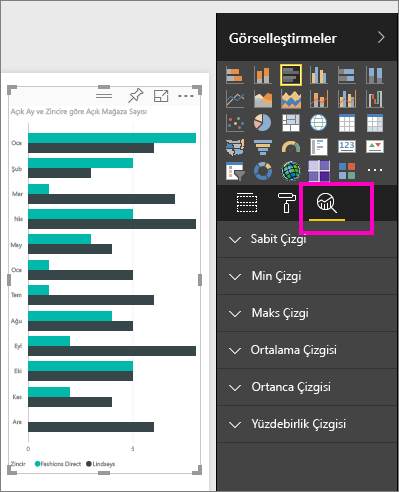
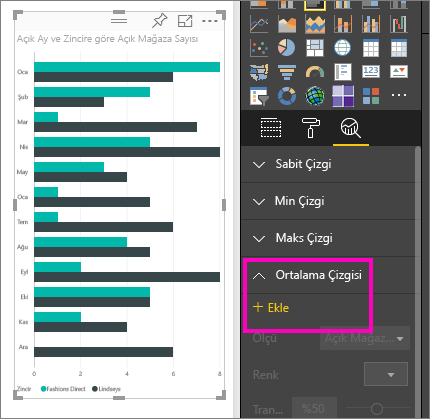
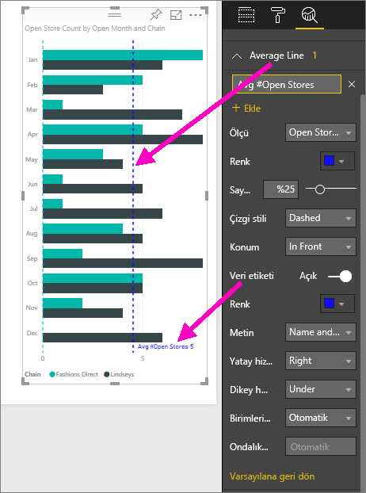
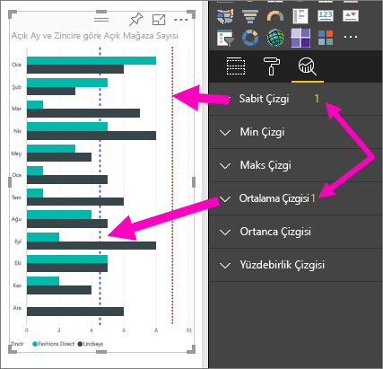
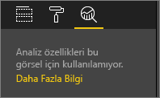

# Power BI hizmetinde görseller için dinamik başvuru çizgileri oluşturma

**Power BI hizmetindeki** **Analiz** bölmesini kullanarak görselleştirmelere dinamik *başvuru çizgileri* ekleyebilir ve önemli eğilimlere veya öngörülere odaklanılmasını sağlayabilirsiniz.

> [!NOTE]
> **Analiz** bölmesi yalnızca rapor tuvalinde bir görsel seçmeniz halinde görünür.
> 
> 

## Analiz bölmesini kullanma
**Analiz** bölmesi ile aşağıdaki türlerde dinamik başvuru çizgileri (kullanılabilen çizgiler görsel türüne göre değişiklik gösterir) oluşturabilirsiniz:

* X Ekseni sabit çizgisi
* Y Ekseni sabit çizgisi
* Min. çizgi
* Maks. çizgi
* Ortalama çizgisi
* Ortanca çizgisi
* Yüzdebirlik çizgisi

Bir görsel için kullanılabilen dinamik başvuru çizgilerini görüntülemek için şu adımları uygulayın:

1. Bir görsel oluşturun veya seçin, ardından **Görsel Öğeler** bölmesindeki **Analiz** simgesini seçin.

2. Oluşturmak istediğiniz çizgi türüne ilişkin aşağı oku belirleyerek söz konusu çizgi türünün seçeneklerini genişletin. Bu örnekte, **Ortalama Çizgisi** seçeneğini belirleyeceğiz.
   
   

3. Yeni bir çizgi oluşturmak için **+ Ekle**'yi seçin ve çizgiyi oluşturmak için kullanılacak ölçüyü belirleyin.  **Ölçü** açılır menüsü otomatik olarak seçilen görselleştirmedeki verilerle doldurulur. **Open store count** verisini kullanalım.

5. Çizginiz için renk, saydamlık, stil ve konum (görselin veri öğelerine göre) gibi çok çeşitli seçenekler belirleyebilirsiniz. Çizgiyi etiketlemek istiyorsanız başlık ekleyip **Veri etiketi** kaydırıcısını **Açık** konuma getirebilirsiniz.  Bu örnekte çizgiye *Avg # Open Stores* adını verecek ve aşağıda gösterildiği gibi birkaç başka seçeneği daha özelleştireceğiz.
   
   

1. **Analiz** bölmesindeki **Ortalama çizgisi**'nin yanında görünen sayıya dikkat edin. Bu, o anda görselinizde hangi türden kaç dinamik çizgi bulunduğunu gösterir. 9 değerinde bir mağaza sayım hedefi için **Sabit çizgi** eklersek **Analiz** bölmesinde, bu görselde uygulanmış bir **Sabit çizgi** başvuru çizgisine de sahip olduğumuz gösterilir.
   
   
   

**Analiz** bölmesiyle dinamik başvuru çizgileri oluşturarak çok çeşitli öngörülere dikkat çekebilirsiniz.

## Önemli noktalar ve sorun giderme

Seçtiğiniz görselde (bu örnekte, bir **Harita** görseli) dinamik başvuru çizgileri kullanılamıyorsa **Analiz** bölmesini seçtiğinizde aşağıdaki görüntüyle karşılaşırsınız.
   

Dinamik başvuru çizgilerinin kullanılabilirliği, birlikte çalışılan görsele göre değişiklik gösterir. Aşağıdaki liste, şu anda hangi görseller için hangi dinamik çizgilerin kullanılabildiğini göstermektedir:

Aşağıdaki görsellerle dinamik çizgiler tüm özellikleriyle birlikte kullanılabilir:

* Alan grafiği
* Çizgi grafik
* Dağılım grafiği
* Kümelenmiş Sütun grafik
* Kümelenmiş Çubuk grafik

Şu görsellerle **Analiz** bölmesinde yalnızca *sabit çizgi* kullanılabilir:

* Yığılmış Alan
* Yığılmış Çubuk
* Yığılmış Sütun
* %100 Yığılmış Çubuk
* %100 Yığılmış Sütun

Aşağıdaki görseller için *eğilim çizgisi* şu anda kullanılabilecek tek seçenektir:

* Yığılmamış Çizgi
* Kümelenmiş Sütun grafik

Son olarak, aşağıdakiler gibi Kartezyen olmayan görsellerle şu anda **Analiz** bölmesinde başvuru çizgileri kullanılamaz:

* Matris
* Pasta grafiği
* Halka
* Tablo

## Sonraki adımlar
[Power BI Desktop'taki Analiz bölmesi](desktop-analytics-pane.md)

Başka bir sorunuz mu var? [Power BI Topluluğu'na başvurun](https://community.powerbi.com/)

