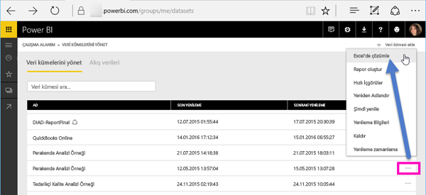
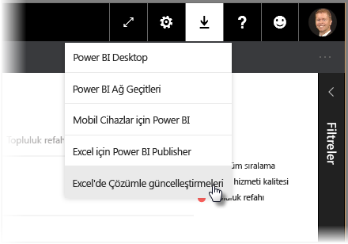
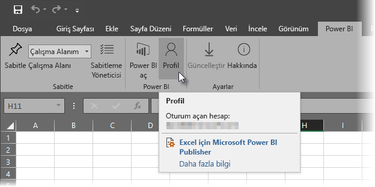
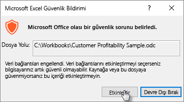
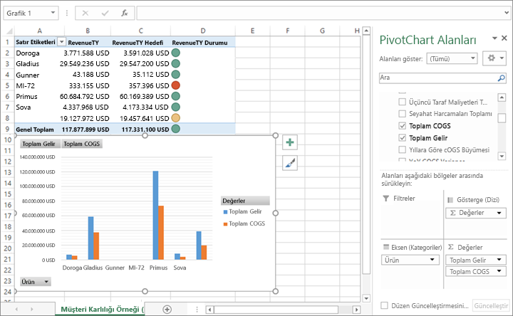

# Excel’de Analiz Et
Bazen Power BI'daki bir veri kümenizi görüntülemek ve veri kümesiyle etkileşim kurmak için Excel kullanmak isteyebilirsiniz. **Excel'de Çözümle** sayesinde tam olarak bunu yapabilirsiniz. Power BI'da bulunan veri kümesindeyken Excel'in PivotTable, grafik ve dilimleyici özelliklerine erişebilirsiniz.

## Gereksinimler
**Excel'de Çözümle**'yi kullanmak için birkaç gereksinim vardır:

* **Excel'de Çözümle**, Microsoft Excel 2010 SP1 ve sonraki sürümlerde desteklenir.

* Excel PivotTable'ları, sayısal alanların sürükle ve bırak ile toplama özelliğini desteklemez. Power BI'daki veri kümenizin *önceden tanımlanmış ölçülere sahip olması gerekir*.
* Bazı kuruluşların Grup İlkesi kuralları, Excel'e gerekli olan **Excel'de Çözümle** güncelleştirmelerinin yüklenmesini engelleyebilir. Güncelleştirmeleri yükleyemiyorsanız yöneticinizle görüşün.
* **Excel'de Çözümle** özelliği, veri kümesinin Power BI Premium’da olmasını veya kullanıcının Power BI Pro lisansına sahip olmasını gerektirir. Lisans türleri arasındaki işlevsellik farkları hakkında daha fazla bilgi edinmek için _Power BI fiyatlandırması_ konusunun [Power BI özelliklerinin karşılaştırması](https://powerbi.microsoft.com/pricing/) bölümüne bakın.
* Kullanıcılar, temel alınan veri kümesi üzerinde okuma izinleri varsa Excel’de Çözümle özelliği aracılığıyla veri kümelerine bağlanabilir.  Kullanıcı buna; veri kümesini içeren çalışma alanının üyesi olmak, veri kümesini kullanan bir raporun veya panonun kendileriyle paylaşılması veya veri kümesini içeren bir uygulamaya izin vermek gibi birkaç yöntemle sahip olabilir.
* **Excel’de Çözümle** bir Power BI hizmeti özelliğidir ve Power BI Rapor Sunucusu’nda veya Power BI Embedded’da sunulmaz. 
* **Excel’de Analiz Et** seçeneği yalnızca Microsoft Windows çalıştıran makinelerde desteklenir.

## Nasıl çalışır?
**Power BI**'daki bir veri kümesi veya raporla ilişkili üç nokta menüsünden (...) **Excel'de Çözümle**'yi seçtiğinizde Power BI, bir .ODC dosyası oluşturur ve bunu tarayıcınızdan bilgisayarınıza indirir.

Dosyayı Excel'de açtığınızda, boş bir **PivotTable** ve **Alanlar** listesiyle birlikte, Power BI veri kümesinden tablolar, alanlar ve ölçüler belirir. Excel'de tıpkı yerel bir veri kümesiyle çalışır gibi söz konusu veritabanını çözümleyebilir, PivotTable'lar ve grafikler oluşturabilirsiniz.

.ODC dosyası, Power BI'daki veri kümenize bağlanan bir MSOLAP bağlantı dizesi içeriyor. Siz verilerle çalışırken veya verileri çözümlerken Excel, söz konusu veri kümesini Power BI'da sorgular ve sonuçları Excel'e döndürür. Söz konusu veri kümesi DirectQuery kullanarak canlı bir veri kaynağına bağlanırsa Power BI, veri kaynağını sorgular ve sonuçları Excel'e döndürür.

**Excel'de Çözümle**, *Analysis Services Tablolu* veya *Çok Boyutlu* veritabanlarına bağlanan ya da Power BI Desktop dosyalarından veya Veri Çözümleme İfadeleri (DAX) kullanarak oluşturulmuş model ölçülerine sahip veri modelli Excel çalışma kitaplarından gelen veri kümeleri ve raporlar için çok kullanışlıdır.

## Excel'de Çözümle özelliğiyle çalışmaya başlama
Power BI'da bir rapor veya veri kümesinin yanındaki üç nokta menüsünü (rapor veya veri kümesi adının yanındaki ... simgesi) seçin ve açılan menüden **Excel'de Çözümle**'yi seçin.

### Excel güncelleştirmelerini yükleme
**Excel'de Çözümle**'yi ilk kez kullandığınızda Excel kitaplıklarına güncelleştirme yüklemeniz gerekir. Excel güncelleştirmelerini indirip çalıştırmanız istenir (böylece *SQL_AS_OLEDDB.msi* Windows yükleyici paketini yükleme işlemi başlar). Bu paket **SQL Server 2016 RC0 için Microsoft AS OLE DB Sağlayıcısı (Önizleme)**'yi yükler.

> [!NOTE]
> **Excel güncelleştirmelerini yükle** iletişim kutusunda **Bunu bir daha gösterme**'yi işaretlediğinizden emin olun. Bu güncelleştirmeyi bir kez yüklemeniz yeterlidir.
> 
> 

**Excel'de Çözümle** için Excel güncelleştirmelerini tekrar yüklemeniz gerekirse güncelleştirmeyi aşağıdaki görüntüdeki gibi Power BI'daki **İndir** simgesinden indirebilirsiniz.

### Power BI'da oturum açma
Tarayıcınız üzerinden Power BI'da oturum açmış olsanız da ilk kez Excel'de yeni bir .ODC dosyasını açtığınız zaman Power BI hesabınızla Power BI'da oturum açmanız istenebilir. Bu, Excel ile Power BI arasındaki bağlantının kimliğini doğrular.

### Birden çok Power BI hesabı olan kullanıcılar
Bazı kullanıcıların birden fazla Power BI hesabı olabilir. Bu kullanıcılar, bir hesaplarıyla Power BI'da oturum açmışken, Excel'de Çözümle'de kullanılan veri kümesine erişimin diğer hesaplarında olduğu durumlar yaşayabilir. Bu durumlarda, bir **Yasak** hatası ya da Excel'de Çözümle'de kullanılmakta olan bir veri kümesine erişim sağlamaya çalışırken oturum açma hatası alabilirsiniz.

Yeniden oturum açma fırsatı size sağlanacaktır. Bu fırsat sağlandığında, Excel'de Çözümle'nin erişmekte olduğu veri kümesine erişimi olan Power BI hesabınızla oturum açabilirsiniz. Excel'deki **Power BI** şerit sekmesinden **Profil**'i seçebilirsiniz. Bu sizin hangi hesapla oturum açmış olduğunuzu tanımlar ve oturumu kapatmanız (ve daha sonra başka bir hesapla oturum açmanız) için gerekli bağlantıyı sunar. Henüz yüklemediyseniz [Excel için Power BI yayıncısını indirebilirsiniz](https://www.microsoft.com/download/details.aspx?id=50729). Excel’de Power BI şeridi bu şekilde yüklenir.

### Veri bağlantılarını etkinleştirme
Power BI verilerinizi Excel'de çözümlemek için .odc dosyasının adını ve yolunu doğruladıktan sonra **Etkinleştir**'i seçmeniz istenir.

> [!NOTE]
> Power BI kiracılarının yöneticileri, *Power BI Yönetici Portalı*'nı kullanarak, Analysis Services (AS) veritabanlarında barındırılan şirket içi veri kümelerinde **Excel'de Çözümle** kullanımını devre dışı bırakabilir. Bu seçenek devre dışı bırakıldığında **Excel'de Çözümle** AS veritabanları için devre dışı olur ancak diğer veri kümeleri için kullanılabilir olmaya devam eder.
> 
> 

## İstediğiniz gibi çözümleme
Artık Excel açıldı ve boş bir PivotTable'ınız var. Power BI veri kümenizde her türlü çözümlemeyi yapmaya hazırsınız. Diğer yerel çalışma kitaplarında olduğu gibi, Excel'le Çözümle sayesinde PivotTable'lar ve grafikler oluşturabilir, başka kaynaklardan veri ekleyebilir ve benzeri birçok işlem yapabilirsiniz. Bunun yanı sıra verilerinizi bambaşka şekillerde görüntüleyebilen birbirinden farklı çalışma kitapları oluşturabilirsiniz.

> [!NOTE]
> **Excel'de Çözümle** kullanmanın, veri kümesine erişim izni olan tüm kullanıcılara bütün ayrıntı düzeylerindeki verileri açacağını bilmek önemlidir.
> 
> 

## Kaydet
Power BI veri kümesine bağlı bu çalışma kitabını başka herhangi bir çalışma kitabı gibi kaydedebilirsiniz. Ancak, Power BI'da yayımlanabilen ve içeri aktarılabilen çalışma kitapları sadece veriyi tablolarda bulunduran veya bir veri modeli olan çalışma kitapları olabileceği için çalışma kitabını Power BI'da yayımlayamazsınız veya içeri aktaramazsınız. Yeni çalışma kitabının Power BI'daki veri kümesine sadece bağlantısı olduğundan, bu çalışma kitabını Power BI'da yayımlamak veya içeri aktarmak, yerimizde saymak olur.

## Paylaş
Çalışma kitabınızı kaydettikten sonra kuruluşunuzdaki diğer Power BI kullanıcılarıyla paylaşabilirsiniz.

Çalışma kitabınızı paylaştığınız bir kullanıcı çalışma kitabınızı açtığında, PivotTable'larınızı ve verilerinizi çalışma kitabının en son kaydedilme anındaki gibi görür ve bu, verinin son biçimi olmayabilir. En son verileri almak için kullanıcıların **Veri** şeridindeki **Yenile** düğmesini kullanmaları gerekir. Çalışma kitabı Power BI'daki bir veri kümesine bağlandığı için, çalışma kitabını yenilemeye çalışan kullanıcıların Power BI'da oturum açması ve bu yöntemle ilk kez güncelleştirme yapacakları zaman gerekli Excel güncelleştirmelerini yüklemesi gerekir.

Kullanıcıların veri kümesini yenilemeleri gerektiğinden ve Excel Online'da dış bağlantıları yenileme desteklenmediğinden kullanıcıların çalışma kitabını bilgisayarlarındaki Excel masaüstü sürümüyle açması önerilir.

## Sorun giderme
Excel'de Çözümle özelliğini kullanırken beklemediğiniz bir sonuç aldığınız veya özelliğin beklediğiniz şekilde çalışmadığı durumlarla karşılaşabilirsiniz. [Bu sayfada, Excel'de Çözümle özelliği ile ilgili olarak sık karşılaşılan sorunların çözümleri açıklanmaktadır](desktop-troubleshooting-analyze-in-excel.md)

## Sonraki adımlar

Aşağıdaki makaleler de ilginizi çekebilir:

* [Power BI Desktop'ta çapraz rapor detaylandırma özelliğini kullanma](desktop-cross-report-drill-through.md)
* [Power BI Desktop’ta dilimleyicileri kullanma](visuals/power-bi-visualization-slicers.md)

