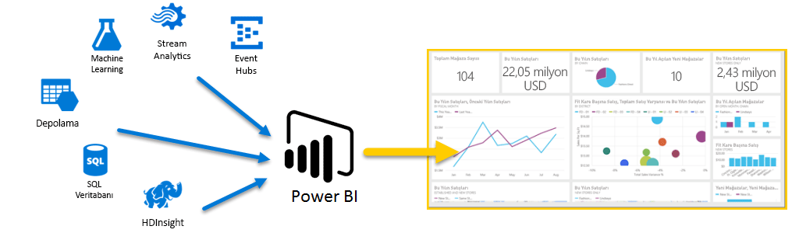
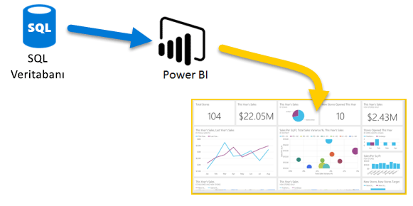
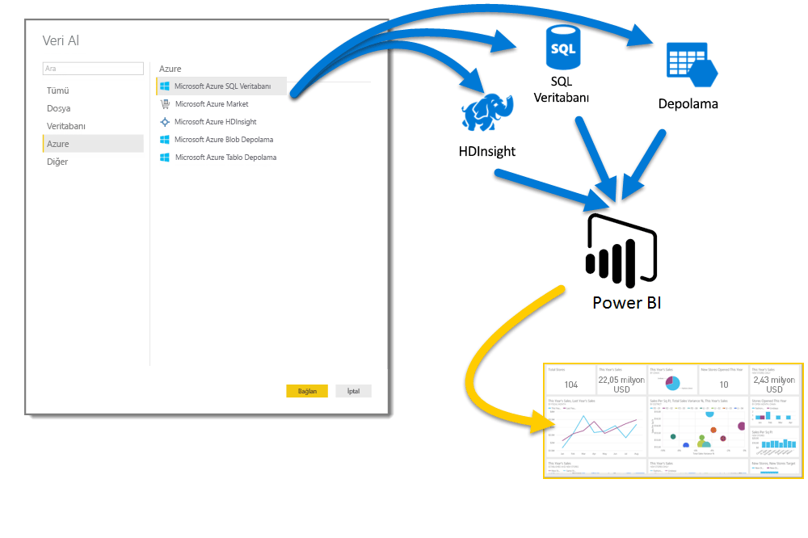

# Azure ve Power BI

**Azure** hizmetlerini ve **Power BI** uygulamasını bir arada kullanarak veri işleme çalışmalarınızı işletmenizle ilgili gerçek zamanlı öngörüler sağlayan analizlere ve raporlara dönüştürebilirsiniz. Veri işleme süreçlerinizin bulut tabanlı veya şirket içi, basit veya karmaşık, tek kaynaklı veya çok büyük ölçekli, ambar tabanlı veya gerçek zamanlı olma durumundan bağımsız olarak Azure ve Power BI’da iş zekası çalışmalarınızdan sonuç almanızı sağlayacak yerleşik bağlantı ve tümleştirme çözümleri mevcuttur.

Power BI'da çok çeşitli Azure bağlantıları sunulmaktadır. Bu hizmetleri kullanarak oluşturabileceğiniz iş zekası çözümleri, işletmeniz kadar benzersiz olur. Tek veya birden fazla Azure veri kaynağına bağlanarak verilerinizi şekillendirip düzenleyebilir, özelleştirilmiş raporlar oluşturabilirsiniz.

## Azure SQL Veritabanı ve Power BI

Bir Azure SQL Veritabanı ile bağlantı kurarak çalışmaya başlayabilir, işletmenizin ilerlemesini izlemek için kullanabileceğiniz raporlar oluşturabilirsiniz. [Power BI Desktop](desktop-getting-started.md) uygulamasını kullanarak işletmenizin ilerlemesini sağlayan eğilimleri ve ana performans göstergelerini tanımlayan raporlar oluşturabilirsiniz.

[Azure SQL Veritabanı](https://azure.microsoft.com/services/sql-database/) hakkında bilmeniz gereken birçok farklı özellik mevcuttur.

## Bulut verilerinizi dönüştürme, şekillendirme ve birleştirme

Daha karmaşık verileriniz ve çok çeşitli kaynaklarınız mı var? Hiç sorun değil. **Power BI Desktop** ve Azure hizmetlerini birlikte kullandığınızda tüm bağlantılar bir **Veri Al** iletişim kutusu uzağınızdadır. Aynı Sorgu içinde **Azure SQL Veritabanınıza**, **Azure HDInsight** veri kaynağınıza ve **Azure Blob Depolama** (veya **Azure Tablo Depolama**) alanınıza bağlanarak yalnızca ihtiyacınız olan alt kümeleri seçebilir, ardından istediğiniz geliştirmeleri gerçekleştirebilirsiniz.

Aynı veri bağlantılarını ve hatta aynı Sorguyu kullanarak farklı hedef kitleleri için farklı raporlar da oluşturabilirsiniz. Yeni bir rapor sayfası oluşturun, görselleştirmelerinizi her bir hedef kitleye göre geliştirin ve herkesin işletmeniz hakkında bilgi sahibi olmasını sağlayın.

Daha fazla bilgi için aşağıdaki kaynaklara göz atın:

* [Azure SQL Veritabanı](https://azure.microsoft.com/services/sql-database/)
* [Azure HDInsight](https://azure.microsoft.com/services/hdinsight/)
* [Azure Depolama](https://azure.microsoft.com/services/storage/) (Blob Depolama ve Tablo Depolama)

## Azure Hizmetlerini ve Power BI'ı kullanarak karmaşık (ve avantaj sağlayan) senaryolar oluşturma

Azure ve Power BI sayesinde istediğiniz ölçekte çalışma yapabilirsiniz. Çok kaynaklı veri işleme özelliklerinden faydalanın, büyük ölçekli, gerçek zamanlı sistemleri kullanın, [Akış Analizi](https://azure.microsoft.com/services/stream-analytics/) ve [Event Hubs](https://azure.microsoft.com/services/event-hubs/)'dan yararlanın ve farklı SaaS hizmetlerinizi işletmenize avantaj sağlayan iş zekası raporlarına dönüştürün.

## Power BI Embedded analizleri ile bağlam içgörüleri

İş verilerinizden faydalanmak için uygulamalara, web sitelerine, portallara ve çok daha fazlasına etkileyici ve etkileşimli veri görselleştirmeleri ekleyin. [Azure’da Power BI Embedded’ı kaynak olarak kullanarak](https://azure.microsoft.com/services/power-bi-embedded/) etkileşimli raporları ve panoları kolayca ekleyebilir, bu sayede kullanıcılarınıza farklı cihazlarda tutarlı ve yüksek güvenilirlikli deneyimler sunabilirsiniz.  Eklenen analizler sayesinde Power BI, Veri -> Bilgi -> İçgörüler -> Eylemler yolculuğunuzda size yardımcı olur.  Ayrıca analizleri [kuruluşunuzun şirket içi uygulamalarına ve portallarına](https://powerbi.microsoft.com/developers/embedded-analytics/organization/) ekleyerek Power BI ve Azure’dan daha fazla fayda elde edebilirsiniz.

[Power BI Geliştirici Portalı](https://dev.powerbi.com)'nda Power BI API'leri hakkında oldukça fazla bilgi mevcuttur.

Daha fazla bilgi için bkz. [Geliştiriciler Power BI ile neler yapabilir?](developer/what-can-you-do.md).

## Power BI verilerini uygulamanıza ekleme

İş verilerinizi bağlam içinde göstermek için uygulamalara, web sitelerine, portallara ve çok daha fazlasına etkileyici ve etkileşimli veri görselleştirmeleri ekleyin. [Azure’da Power BI Embedded’ı](https://azure.microsoft.com/services/power-bi-embedded/) kullanarak etkileşimli raporları ve panoları kolayca ekleyebilir, bu sayede kullanıcılarınıza farklı cihazlarda tutarlı ve yüksek güvenilirlikli deneyimler sunabilirsiniz.

## Azure ve Power BI ile neler yapabilirsiniz?

**Azure** ve **Power BI**'ın birlikte kullanılabileceği farklı türde birçok senaryo vardır. Olasılıklar ve fırsatlar işletmeniz kadar benzersizdir. **Azure hizmetleri** hakkında daha fazla bilgi için bu [genel bakış sayfasını](https://docs.microsoft.com/azure/machine-learning/team-data-science-process/plan-your-environment) inceleyin. Bu sayfada **Azure'ın kullanıldığı Veri Analizi Senaryolarının** yanı sıra veri kaynaklarınızı işletmenize avantaj sağlayacak iş zekasına dönüştürme yöntemlerine yer verilmiştir.