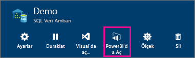
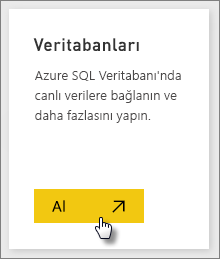
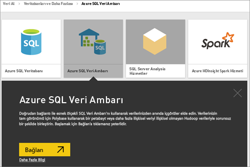
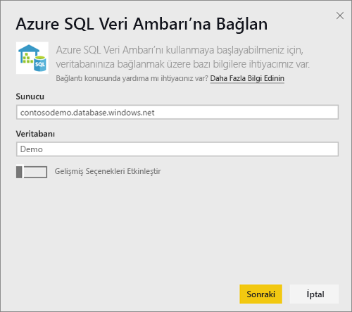
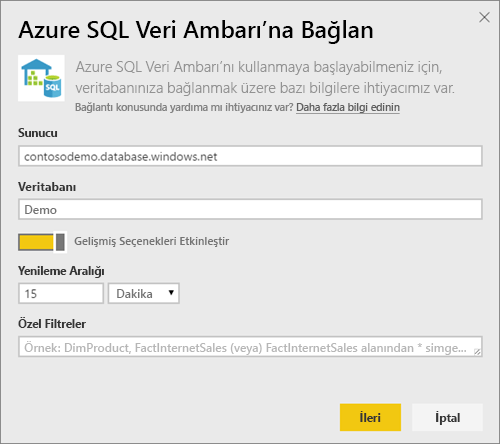
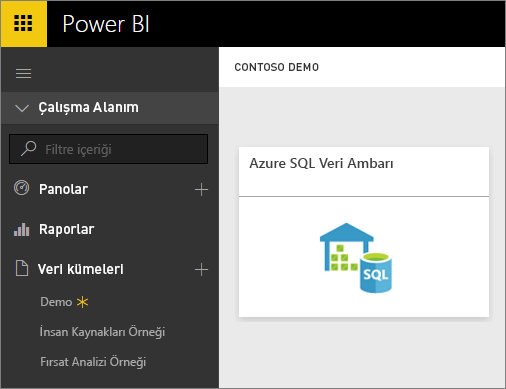
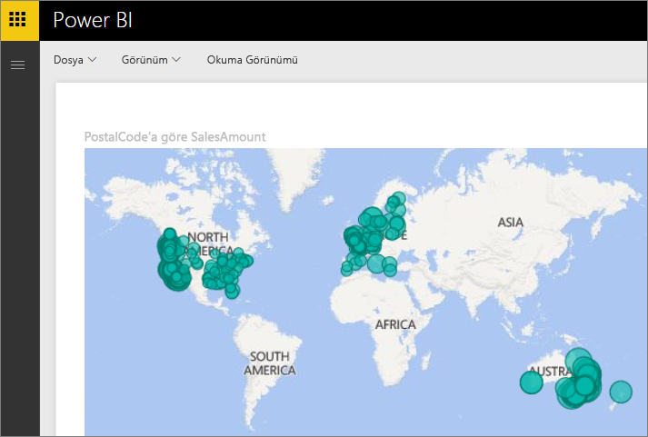
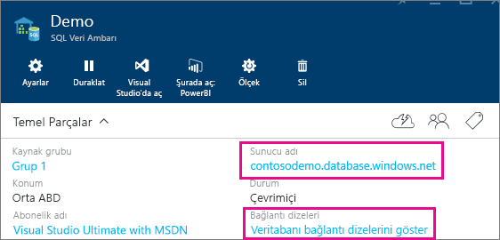

# DirectQuery ile Azure SQL Veri Ambarı

DirectQuery ile Azure SQL Veri Ambarı, Azure SQL Veri Ambarı'ndaki hazır verilerinizi ve ölçümlerinizi temel alan dinamik raporlar oluşturmanızı sağlar. DirectQuery ile, siz verileri keşfederken sorgular Azure SQL Veri Ambarı'nıza gerçek zamanlı olarak geri gönderilir. Gerçek zamanlı sorgular, SQL Veri Ambarı’nın ölçeğiyle birleştirildiğinde kullanıcıların terabaytlarca veriden birkaç dakika içinde dinamik rapor oluşturmasını sağlar. Ayrıca, **Power BI'da aç** düğmesi sayesinde kullanıcılar el ile bilgi girmek zorunda kalmadan Power BI'ı doğrudan SQL Veri Ambarı hizmetlerine bağlayabilir.

SQL Veri Ambarı bağlayıcısını kullanırken:

* Bağlanırken tam sunucu adını belirtin (ayrıntılar için aşağıya bakın)
* Sunucu güvenlik duvarı kurallarının "Azure hizmetlerine erişime izin ver" şeklinde yapılandırıldığından emin olun
* Sütun seçme veya filtre ekleme gibi her işlem, veri ambarına doğrudan sorgu gönderir
* Kutucuklar yaklaşık olarak 15 dakikada bir yenilenecek şekilde ayarlanmıştır ve yenileme işleminin zamanlanması gerekmez.  Yenileme özelliği, bağlantı kurulduktan sonra Gelişmiş ayarlar’da ayarlanabilir.
* DirectQuery veri kümeleri için Soru-Cevap özelliği kullanılamaz
* şema değişiklikleri otomatik olarak alınmaz

Bu kısıtlamalar ve notlar, biz deneyimleri iyileştirmeye devam ettikçe değişebilir. Bağlanma adımları aşağıda ayrıntılı şekilde verilmiştir.

## "Power BI'da aç" düğmesini kullanma

> [!Important]
> Azure SQL Veri Ambarı ile bağlantımızı geliştirdik.  Azure SQL Veri Ambarı veri kaynağınıza en iyi bağlanma deneyimi için Power BI Desktop kullanın.  Modelinizi ve raporunuzu oluşturduktan sonra, bunu Power BI hizmetine yayımlayabilirsiniz.  Power BI hizmetindeki Azure SQL Veri Ambarı doğrudan bağlayıcısı artık kullanım dışı bırakılmıştır.

SQL Veri Ambarı’nızla Power BI arasında veri alışverişi yapmanın en kolay yolu Azure portaldaki **Power BI’da aç** düğmesidir. Bu düğme, sorunsuz bir şekilde Power BI'da yeni panolar oluşturmaya başlamanızı sağlar.

1. Başlamak için Azure portaldaki SQL Veri Ambarı örneğinize gidin. SQL Veri Ambarı'nın şu anda yalnızca Azure portalda bulunduğunu unutmayın.

2. **Power BI'da aç** düğmesine tıklayın

    

3. Oturumunuzu doğrudan açamazsak veya Power BI hesabınız yoksa oturum açmanız gerekir.

4. SQL Veri Ambarı bağlantı sayfası açılır ve SQL Veri Ambarı bilgileriniz önceden doldurulmuş şekilde gelir. Bağlantı oluşturmak için kimlik bilgilerinizi girip Bağlan'ı seçin.

## Power BI aracılığıyla bağlanma

SQL Veri Ambarı, Power BI Veri Al sayfasında da bulunmaktadır. 

1. Sol gezinti bölmesinin alt kısmında bulunan **Veri Al**'ı seçin.  

    

2. **Veritabanları**'ndan **Al**'ı seçin.

    

3. **SQL Data Warehouse** \> **Bağlan**'ı seçin.

    

4. Bağlanmak için gerekli bilgileri girin. Aşağıdaki **Parametreler Bulma** bölümünde, bu verilerin Azure portalınızda bulunabileceği yer gösterilmektedir.

    

    

    

   > [!NOTE]
   > Kullanıcı adı, Azure SQL Veri Ambarı örneğinizde tanımlanmış bir kullanıcıdır.

5. Yıldız işaretiyle belirtilen yeni kutucuğu veya yeni oluşturulan veri kümesini seçerek veri kümesini detaylandırabilirsiniz. Bu veri kümesinin adı veritabanınızın adıyla aynı olur.

    

6. Tüm tabloları ve sütunları keşfedebilirsiniz. Bir sütunu seçtiğinizde kaynağa sorgu gönderilerek görseliniz dinamik olarak oluşturulur. Filtreler de sorgulara çevrilip veri ambarınıza geri gönderilir. Bu görseller yeni bir rapora kaydedilerek panonuza sabitlenebilir.

    

## Parametre Değerlerini Bulma

Tam sunucu adınız ve veritabanınızın adı Azure portalda bulunabilir. SQL Veri Ambarı'nın şu anda yalnızca Azure portalda bulunduğunu unutmayın.

> [!NOTE]
> Power BI kiracınız Azure SQL Veri Ambarı ile aynı bölgedeyse çıkış ücreti uygulanmaz. [Bu yönergeleri](https://docs.microsoft.com/power-bi/service-admin-where-is-my-tenant-located) kullanarak Power BI kiracınızın bulunduğu yeri belirleyebilirsiniz.

[!INCLUDE [direct-query-sso](includes/direct-query-sso.md)]

## Sonraki adımlar

* [Power BI nedir?](power-bi-overview.md)  
* [Power BI için veri alma](service-get-data.md)  
* [Azure SQL Veri Ambarı](/azure/sql-data-warehouse/sql-data-warehouse-overview-what-is/)

Başka bir sorunuz mu var? [Power BI Topluluğu'na başvurun](http://community.powerbi.com/)
