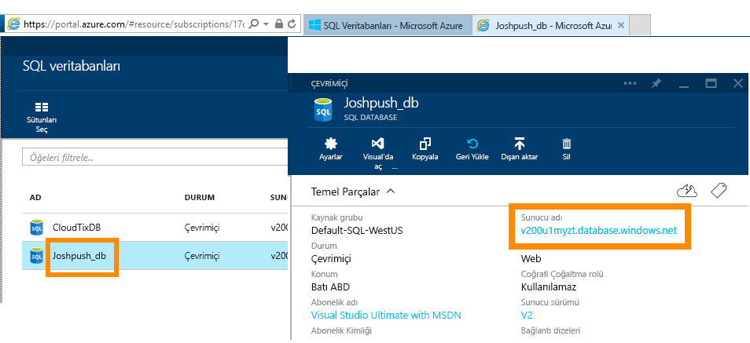
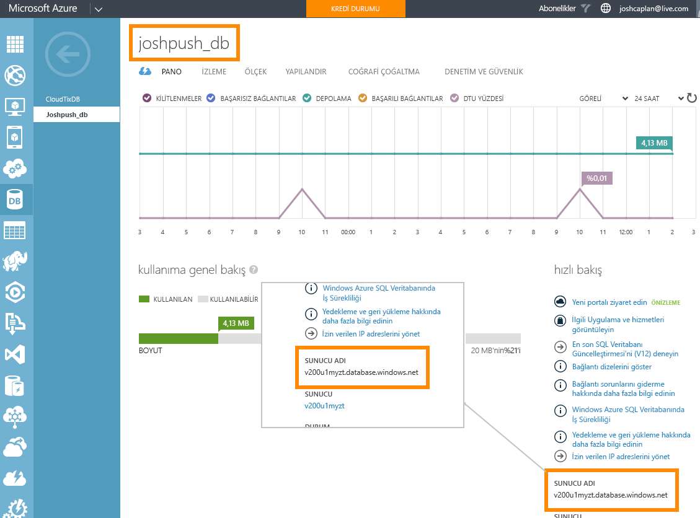

# DirectQuery ile Azure SQL Veritabanı
Azure SQL Veritabanı'na doğrudan nasıl bağlanacağınızı ve canlı verilerin kullanıldığı raporları nasıl oluşturacağınızı öğrenin. Verilerinizi Power BI yerine kaynakta tutabilirsiniz.

DirectQuery ile, siz verileri rapor görünümünde araştırırken sorgular Azure SQL Varitabanınıza geri gönderilir. Bu deneyim, bağlandıkları veritabanlarına ve varlıklara aşina kullanıcılar için önerilir.

**Notlar:**

* Bağlanırken tam sunucu adını belirtin (daha fazla ayrıntı için aşağıya bakın)
* Veritabanı güvenlik duvarı kurallarının "[Azure hizmetlerine erişime izin ver](https://msdn.microsoft.com/library/azure/ee621782.aspx)" olarak yapılandırıldığından emin olun.
* Sütun seçme veya filtre ekleme gibi her işlem veritabanına sorgu gönderir
* Kutucuklar yaklaşık her 15 dakikada bir yenilenir. (Yenileme işleminin zamanlanması gerekmez.) Bu, bağlantı kurulduktan sonra Gelişmiş ayarlar'da ayarlanabilir.
* Soru-Cevap, DirectQuery veri kümeleri için kullanılamaz
* Şema değişiklikleri otomatik olarak alınmaz

Bu kısıtlamalar ve notlar, biz deneyimleri iyileştirmeye devam ettikçe değişebilir. Bağlanma adımları aşağıda ayrıntılı şekilde verilmiştir. 

## Power BI Desktop ve DirectQuery
DirectQuery'yi kullanarak Azure SQL Veritabanı'na bağlanmak için Power BI Desktop'ı kullanmanız gerekir. Bu yaklaşım, daha fazla esneklik ve özellik sunar. Power BI Desktop kullanılarak oluşturulan raporlar daha sonra Power BI hizmetinde yayımlanabilir. Power BI Desktop'ta [DirectQuery'yi kullanarak Azure SQL Veritabanı](desktop-use-directquery.md)'na nasıl bağlanacağınızla ilgili daha fazla bilgi edinebilirsiniz. 

## Power BI aracılığıyla bağlanma
Artık Azure SQL Veritabanı'na doğrudan Power BI hizmetinden bağlanamazsınız. [Azure SQL Veritabanı bağlayıcısını](https://app.powerbi.com/getdata/bigdata/azure-sql-database-with-live-connect) seçtiğinizde, bağlantıyı Power BI Desktop'tan kurmanız istenir. Ardından Power BI Desktop raporlarınızı Power BI hizmetinizde yayımlayabilirsiniz. 

### Parametre Değerlerini Bulma
Tam sunucu adınız ve veritabanınızın adı Azure Portal'da bulunabilir.

## Sonraki adımlar
[Power BI Desktop'ta DirectQuery'yi kullanma](desktop-use-directquery.md)  
[Power BI ile çalışmaya başlama](service-get-started.md)  
[Power BI için veri alma](service-get-data.md)  
Başka bir sorunuz mu var? [Power BI Topluluğu'na başvurun](http://community.powerbi.com/)

