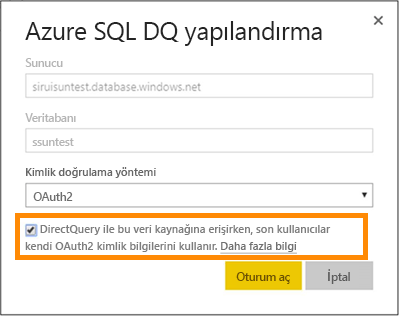

# DirectQuery ile Azure SQL Veritabanı

Azure SQL Veritabanı'na doğrudan nasıl bağlanacağınızı ve canlı verilerin kullanıldığı raporları nasıl oluşturacağınızı öğrenin. Verilerinizi Power BI yerine kaynakta tutabilirsiniz.

DirectQuery ile, siz verileri rapor görünümünde araştırırken sorgular Azure SQL Varitabanınıza geri gönderilir. Bu deneyim, bağlandıkları veritabanlarına ve varlıklara aşina kullanıcılar için önerilir.

**Notlar:**

* Bağlanırken tam sunucu adını belirtin (daha fazla ayrıntı için aşağıya bakın)
* Veritabanı güvenlik duvarı kurallarının "[Azure hizmetlerine erişime izin ver](https://msdn.microsoft.com/library/azure/ee621782.aspx)" olarak yapılandırıldığından emin olun
* Sütun seçme veya filtre ekleme gibi her işlem veritabanına sorgu gönderir
* Kutucuklar saatte bir yenilenir (yenileme işleminin zamanlanması gerekmez). Bu, bağlantı kurulduktan sonra Gelişmiş ayarlar'da ayarlanabilir.
* Soru-Cevap, DirectQuery veri kümeleri için kullanılamaz
* Şema değişiklikleri otomatik olarak alınmaz

Bu kısıtlamalar ve notlar, biz deneyimleri iyileştirmeye devam ettikçe değişebilir. Bağlanma adımları aşağıda ayrıntılı şekilde verilmiştir.

> [!Important]
> Azure SQL Database ile bağlantımızı geliştirdik.  Azure SQL Database veri kaynağınıza en iyi bağlanma deneyimi için Power BI Desktop kullanın.  Modelinizi ve raporunuzu oluşturduktan sonra, bunu Power BI hizmetine yayımlayabilirsiniz.  Power BI hizmetindeki Azure SQL Database doğrudan bağlayıcısı artık kullanım dışı bırakılmıştır.

## Power BI Desktop ve DirectQuery

DirectQuery'yi kullanarak Azure SQL Veritabanı'na bağlanmak için Power BI Desktop'ı kullanmanız gerekir. Bu yaklaşım, daha fazla esneklik ve özellik sunar. Power BI Desktop kullanılarak oluşturulan raporlar daha sonra Power BI hizmetinde yayımlanabilir. Power BI Desktop'ta [DirectQuery'yi kullanarak Azure SQL Veritabanı](desktop-use-directquery.md)'na nasıl bağlanacağınızla ilgili daha fazla bilgi edinebilirsiniz.

## Çoklu oturum açma

Azure SQL DirectQuery veri kümesini hizmette yayımladıktan sonra son kullanıcılarınız için Azure Active Directory (Azure AD) OAuth2 aracılığıyla çoklu oturum açmayı (SSO) etkinleştirebilirsiniz.

SSO özelliğini etkinleştirmek için veri kümesinin ayarlarına gidip **Veri Kaynakları** sekmesini açın ve SSO kutusunu işaretleyin.

SSO seçeneği etkin olduğunda ve kullanıcılarınız bu veri kaynağını kullanan raporlara eriştiğinde, Power BI kimlik doğrulamasından geçen Azure AD kimlik bilgilerini Azure SQL veritabanı sorgularında gönderir. Bu sayede Power BI, veri kaynağı seviyesinde yapılandırılmış olan güvenlik ayarlarını uygular.

SSO seçeneği bu veri kaynağını kullanan tüm veri kümelerinde geçerli olur. İçeri aktarma senaryoları için kullanılan kimlik doğrulama yöntemini etkilemez.

> [!Note]
> Azure Multi-Factor Authentication (MFA) desteklenmiyor. Azure SQL DirectQuery ile SSO kullanmak isteyen kullanıcıların MFA'dan muaf tutulması gerekir.

## Parametre Değerlerini Bulma

Tam sunucu adınız ve veritabanınızın adı Azure Portal'da bulunabilir.

## Sonraki adımlar

* [Power BI Desktop'ta DirectQuery'yi kullanma](desktop-use-directquery.md)  
* [Power BI nedir?](power-bi-overview.md)  
* [Power BI için veri alma](service-get-data.md)  

Başka bir sorunuz mu var? [Power BI Topluluğu'na başvurun](http://community.powerbi.com/)
